# 安全考虑

<cite>
**本文档中引用的文件**  
- [PIIDetectionHook.java](file://spring-ai-alibaba-agent-framework/src/main/java/com/alibaba/cloud/ai/graph/agent/hook/pii/PIIDetectionHook.java)
- [PIIDetector.java](file://spring-ai-alibaba-agent-framework/src/main/java/com/alibaba/cloud/ai/graph/agent/hook/pii/PIIDetector.java)
- [PIIDetectors.java](file://spring-ai-alibaba-agent-framework/src/main/java/com/alibaba/cloud/ai/graph/agent/hook/pii/PIIDetectors.java)
- [PIIType.java](file://spring-ai-alibaba-agent-framework/src/main/java/com/alibaba/cloud/ai/graph/agent/hook/pii/PIIType.java)
- [RedactionStrategy.java](file://spring-ai-alibaba-agent-framework/src/main/java/com/alibaba/cloud/ai/graph/agent/hook/pii/RedactionStrategy.java)
- [PIIMatch.java](file://spring-ai-alibaba-agent-framework/src/main/java/com/alibaba/cloud/ai/graph/agent/hook/pii/PIIMatch.java)
- [DockerCodeExecutor.java](file://spring-boot-starters/spring-ai-alibaba-starter-builtin-nodes/src/main/java/com/alibaba/cloud/ai/graph/node/code/DockerCodeExecutor.java)
- [FilesystemInterceptor.java](file://spring-ai-alibaba-agent-framework/src/main/java/com/alibaba/cloud/ai/graph/agent/extension/interceptor/FilesystemInterceptor.java)
- [HooksExample.java](file://examples/documentation/src/main/java/com/alibaba/cloud/ai/examples/documentation/framework/tutorials/HooksExample.java)
- [PIIDectionHookTest.java](file://spring-ai-alibaba-agent-framework/src/test/java/com/alibaba/cloud/ai/graph/agent/hooks/pii/PIIDectionHookTest.java)
</cite>

## 目录
1. [引言](#引言)
2. [PII检测与脱敏](#pii检测与脱敏)
3. [代码执行安全](#代码执行安全)
4. [文件系统访问控制](#文件系统访问控制)
5. [API密钥管理](#api密钥管理)
6. [结论](#结论)

## 引言

本项目通过多层次的安全机制来保护系统和数据安全。核心安全特性包括：通过PIIDetectionHook实现敏感信息的识别与脱敏，利用DockerCodeExecutor在隔离环境中执行代码，通过FilesystemInterceptor控制文件系统访问权限，以及通过环境变量管理API密钥。这些机制共同构建了一个全面的安全防护体系，确保在AI代理运行过程中不会发生敏感信息泄露、系统破坏或未授权访问。

## PII检测与脱敏

PII（个人身份信息）检测是本项目安全体系的核心组件，通过PIIDetectionHook实现对敏感信息的识别和处理。该机制能够检测多种类型的PII，并根据配置的策略进行相应的脱敏处理。

### PII类型识别

PIIDetectionHook支持识别多种常见的PII类型，这些类型在PIIType枚举中定义：

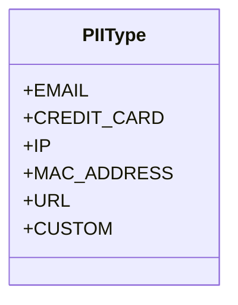

**代码片段来源**  
- [PIIType.java](file://spring-ai-alibaba-agent-framework/src/main/java/com/alibaba/cloud/ai/graph/agent/hook/pii/PIIType.java#L21-L27)

### 检测机制

PIIDetectionHook通过PIIDetector接口实现PII检测功能。系统提供了多种内置检测器，通过PIIDetectors工厂类创建：

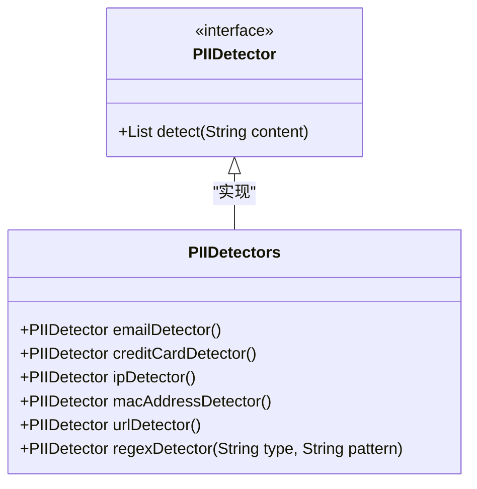

**代码片段来源**  
- [PIIDetector.java](file://spring-ai-alibaba-agent-framework/src/main/java/com/alibaba/cloud/ai/graph/agent/hook/pii/PIIDetector.java#L24-L31)
- [PIIDetectors.java](file://spring-ai-alibaba-agent-framework/src/main/java/com/alibaba/cloud/ai/graph/agent/hook/pii/PIIDetectors.java#L27-L150)

### 脱敏策略

检测到PII后，系统根据RedactionStrategy枚举中定义的策略进行处理：

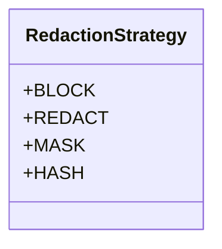

**代码片段来源**  
- [RedactionStrategy.java](file://spring-ai-alibaba-agent-framework/src/main/java/com/alibaba/cloud/ai/graph/agent/hook/pii/RedactionStrategy.java#L21-L33)

各策略的具体行为如下：
- **BLOCK**：当检测到PII时抛出异常，阻止处理流程
- **REDACT**：将PII替换为`[REDACTED_TYPE]`格式的占位符
- **MASK**：部分掩码PII（如信用卡号显示为`****-****-****-1234`）
- **HASH**：将PII替换为确定性哈希值

### 工作流程

PIIDetectionHook的工作流程如下：

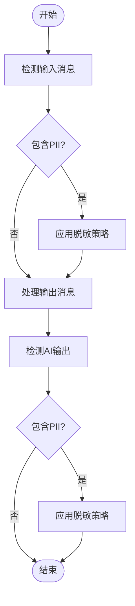

**代码片段来源**  
- [PIIDetectionHook.java](file://spring-ai-alibaba-agent-framework/src/main/java/com/alibaba/cloud/ai/graph/agent/hook/pii/PIIDetectionHook.java#L72-L152)

### 配置示例

以下是如何配置PIIDetectionHook的示例：

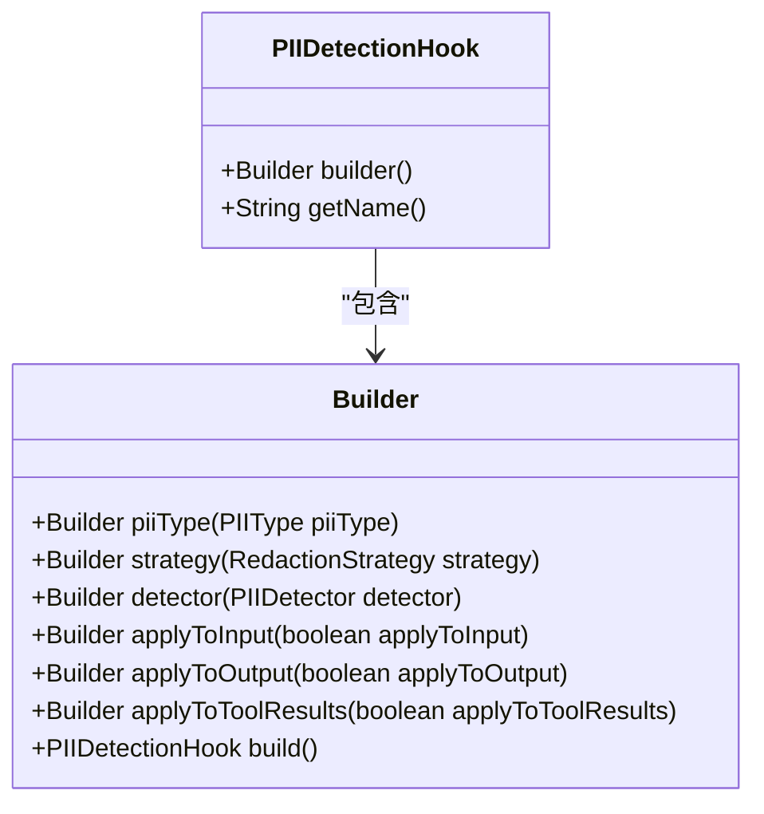

**代码片段来源**  
- [PIIDetectionHook.java](file://spring-ai-alibaba-agent-framework/src/main/java/com/alibaba/cloud/ai/graph/agent/hook/pii/PIIDetectionHook.java#L68-L377)

## 代码执行安全

为了确保代码执行的安全性，系统使用DockerCodeExecutor在隔离的容器环境中运行用户提交的代码，防止对主机系统造成破坏。

### DockerCodeExecutor架构

DockerCodeExecutor的架构设计如下：

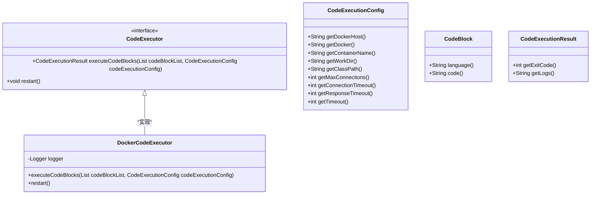

**代码片段来源**  
- [DockerCodeExecutor.java](file://spring-boot-starters/spring-ai-alibaba-starter-builtin-nodes/src/main/java/com/alibaba/cloud/ai/graph/node/code/DockerCodeExecutor.java#L55-L208)

### 执行流程

DockerCodeExecutor的代码执行流程如下：

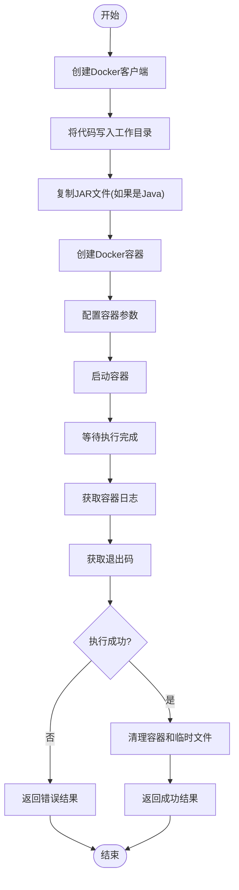

**代码片段来源**  
- [DockerCodeExecutor.java](file://spring-boot-starters/spring-ai-alibaba-starter-builtin-nodes/src/main/java/com/alibaba/cloud/ai/graph/node/code/DockerCodeExecutor.java#L60-L179)

### 安全特性

DockerCodeExecutor提供了以下安全特性：
1. **隔离执行**：所有代码在Docker容器中运行，与主机系统隔离
2. **资源限制**：可配置连接超时、响应超时和执行超时
3. **自动清理**：执行完成后自动删除容器和临时文件
4. **工作目录隔离**：代码在指定的工作目录中执行，限制文件系统访问范围

## 文件系统访问控制

FilesystemInterceptor用于控制代理对文件系统的访问权限，防止未授权的文件操作。

### 拦截器架构

FilesystemInterceptor的架构设计如下：

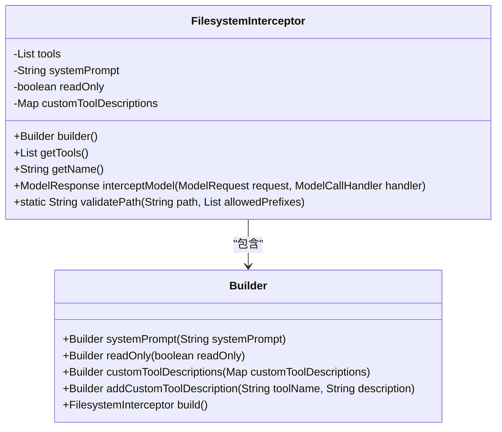

**代码片段来源**  
- [FilesystemInterceptor.java](file://spring-ai-alibaba-agent-framework/src/main/java/com/alibaba/cloud/ai/graph/agent/extension/interceptor/FilesystemInterceptor.java#L74-L280)

### 文件系统工具

FilesystemInterceptor提供了以下文件系统工具：

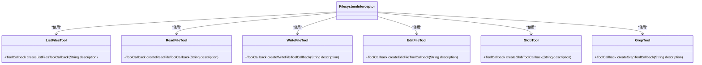

**代码片段来源**  
- [FilesystemInterceptor.java](file://spring-ai-alibaba-agent-framework/src/main/java/com/alibaba/cloud/ai/graph/agent/extension/interceptor/FilesystemInterceptor.java#L112-L133)

### 路径验证

为了防止目录遍历攻击，FilesystemInterceptor实现了严格的路径验证机制：

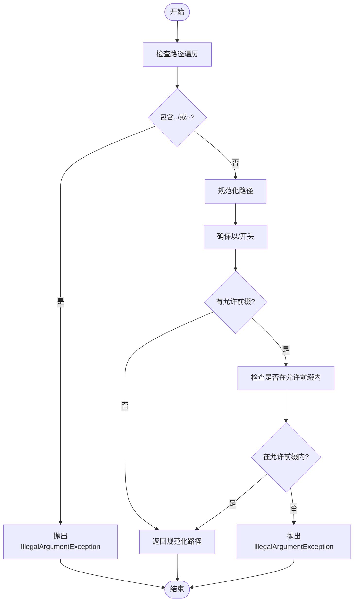

**代码片段来源**  
- [FilesystemInterceptor.java](file://spring-ai-alibaba-agent-framework/src/main/java/com/alibaba/cloud/ai/graph/agent/extension/interceptor/FilesystemInterceptor.java#L151-L181)

## API密钥管理

API密钥管理是确保服务访问安全的重要环节。系统通过环境变量来管理API密钥，避免在代码中硬编码敏感信息。

### 密钥使用模式

系统采用标准的API密钥管理实践：

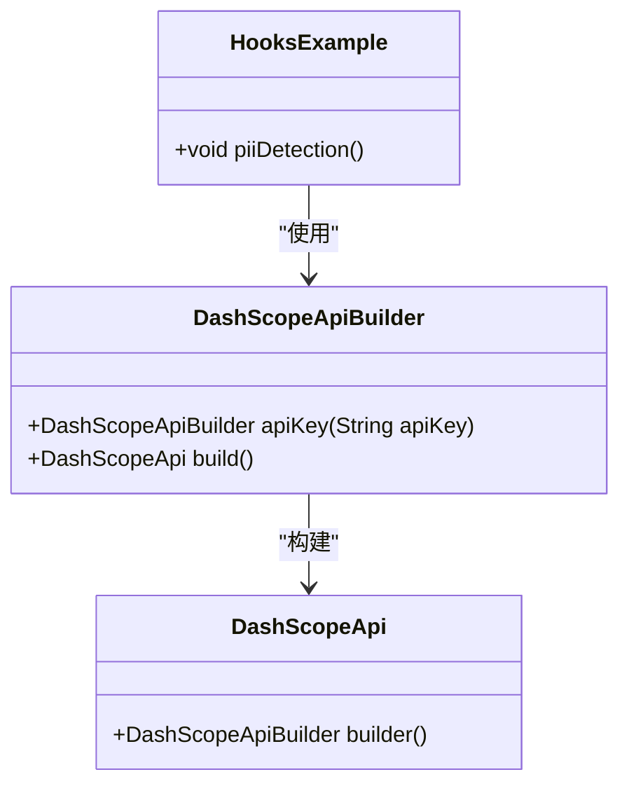

**代码片段来源**  
- [HooksExample.java](file://examples/documentation/src/main/java/com/alibaba/cloud/ai/examples/documentation/framework/tutorials/HooksExample.java#L196-L208)

### 配置示例

API密钥通过环境变量获取，确保敏感信息不会泄露：

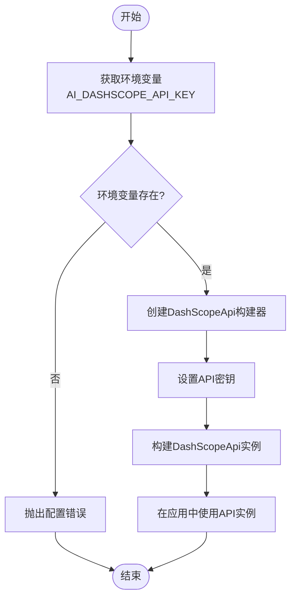

**代码片段来源**  
- [HooksExample.java](file://examples/documentation/src/main/java/com/alibaba/cloud/ai/examples/documentation/framework/tutorials/HooksExample.java#L197-L202)

## 结论

本项目通过多层次的安全机制构建了一个全面的安全防护体系。PIIDetectionHook提供了强大的敏感信息检测和脱敏能力，能够识别多种类型的PII并根据配置的策略进行处理。DockerCodeExecutor确保了代码执行的安全性，通过在隔离的Docker容器中运行代码来防止系统被破坏。FilesystemInterceptor通过路径验证和权限控制限制了代理对文件系统的访问。API密钥通过环境变量管理，避免了在代码中硬编码敏感信息。这些安全机制共同作用，确保了系统在处理用户数据和执行代码时的安全性，有效防止了敏感信息泄露和系统破坏的风险。