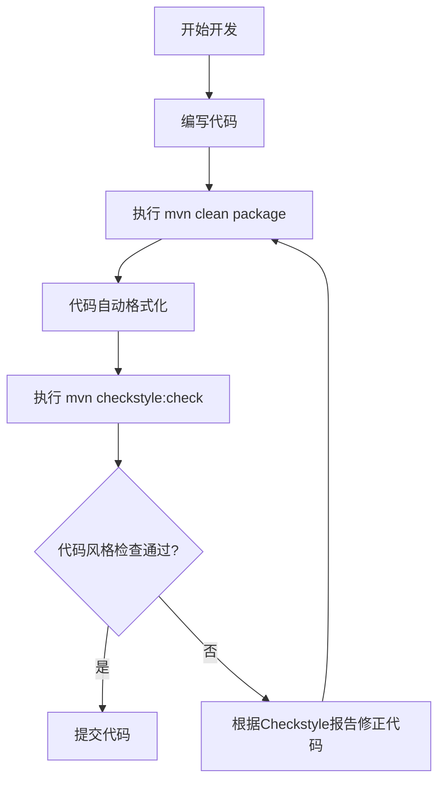
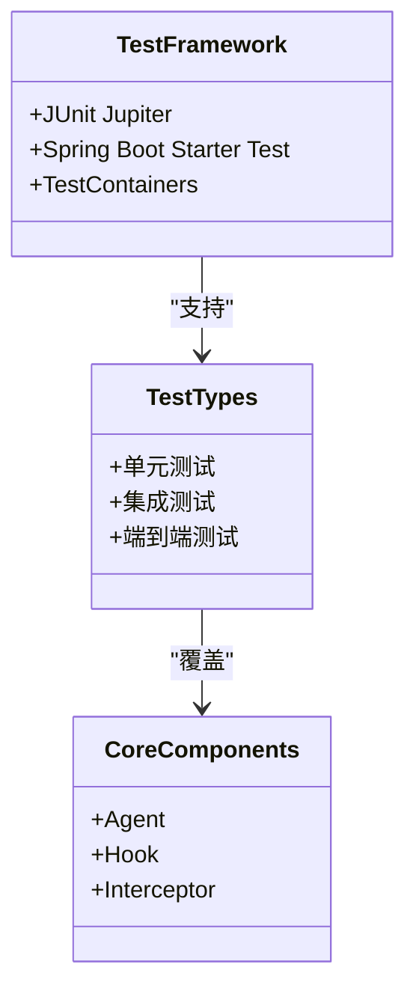
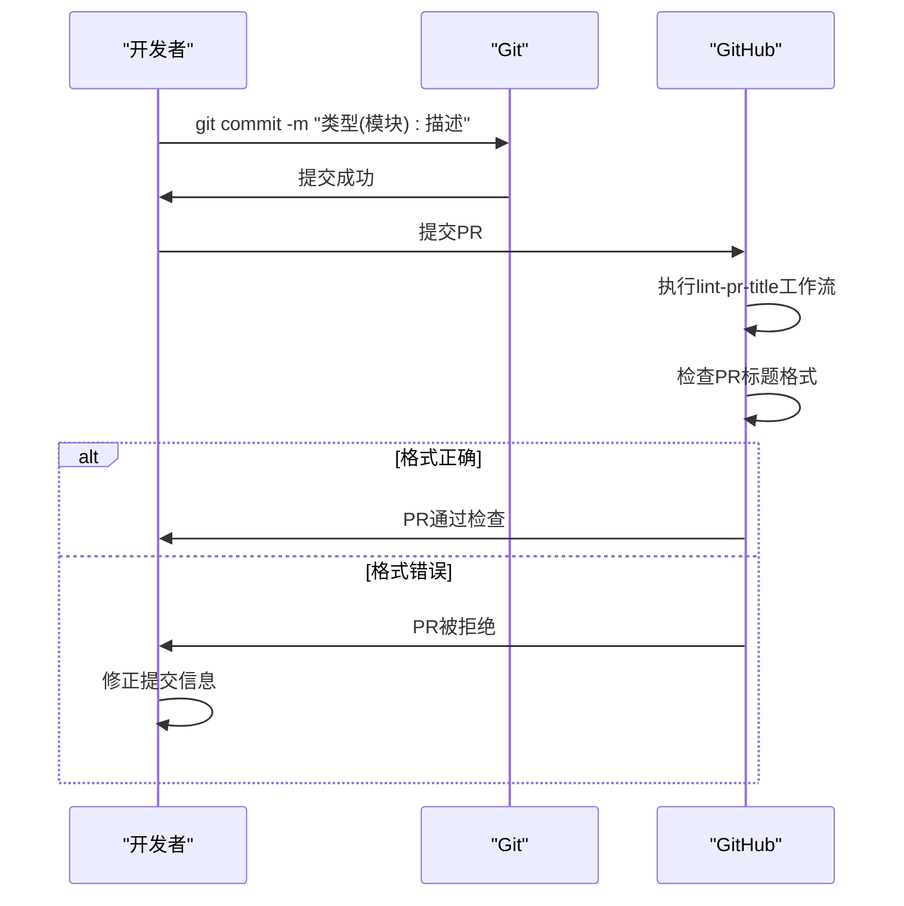

# 开发规范

<cite>
**本文档中引用的文件**   
- [CONTRIBUTING.md](file://CONTRIBUTING.md)
- [CONTRIBUTING-zh.md](file://CONTRIBUTING-zh.md)
- [Makefile](file://Makefile)
- [tools/make/common.mk](file://tools/make/common.mk)
- [tools/make/java.mk](file://tools/make/java.mk)
- [tools/make/linter.mk](file://tools/make/linter.mk)
- [tools/src/checkstyle/checkstyle.xml](file://tools/src/checkstyle/checkstyle.xml)
- [spring-ai-alibaba-agent-framework/pom.xml](file://spring-ai-alibaba-agent-framework/pom.xml)
- [spring-ai-alibaba-graph-core/pom.xml](file://spring-ai-alibaba-graph-core/pom.xml)
- [tools/linter/codespell/.codespell.ignorewords](file://tools/linter/codespell/.codespell.ignorewords)
- [tools/linter/markdownlint/markdown_lint_config.yaml](file://tools/linter/markdownlint/markdown_lint_config.yaml)
</cite>

## 目录
1. [代码风格规范](#代码风格规范)
2. [代码审查流程](#代码审查流程)
3. [测试要求](#测试要求)
4. [Git提交规范](#git提交规范)
5. [文档质量保证](#文档质量保证)
6. [API文档要求](#api文档要求)

## 代码风格规范

本项目强制执行统一的代码风格检查，确保Java代码的格式一致性。项目遵循Spring AI项目的代码标准，并通过Checkstyle配置进行强制执行。

项目使用Maven构建系统，通过`mvn checkstyle:check`命令执行代码风格检查。检查规则定义在`tools/src/checkstyle/checkstyle.xml`文件中，该配置文件基于Spring Java Format规范，包含对导入、注释、空白字符等方面的检查规则。

开发完成后，建议使用`mvn clean package`命令确保代码能够本地编译通过，该命令会自动以Spring方式格式化代码。此外，项目还提供了`mvn spotless:apply`命令来自动删除未使用的导入。

**图示来源**
- [tools/src/checkstyle/checkstyle.xml](file://tools/src/checkstyle/checkstyle.xml)
- [tools/make/java.mk](file://tools/make/java.mk)

**本节来源**
- [CONTRIBUTING.md](file://CONTRIBUTING.md#L46-L68)
- [CONTRIBUTING-zh.md](file://CONTRIBUTING-zh.md#L44-L62)
- [tools/make/java.mk](file://tools/make/java.mk#L28-L47)

## 代码审查流程

项目实施全面的代码审查流程，重点关注代码的安全性、性能和可维护性。所有代码变更都必须通过Pull Request（PR）提交，并经过至少一位维护者的审查才能合并。

在提交PR之前，开发者需要确保代码符合项目的质量标准。项目通过GitHub Actions工作流`lint-pr-title.yml`对PR标题进行格式检查，确保提交信息的规范性。

代码审查重点关注以下几个方面：
- **安全性**：检查是否存在潜在的安全漏洞，如敏感信息泄露、注入攻击等
- **性能**：评估代码的性能影响，避免不必要的资源消耗
- **可维护性**：确保代码结构清晰，易于理解和维护
- **功能正确性**：验证代码是否正确实现了预期功能

在提交PR时，需要根据`Pull request template`详细说明修改点和实现的功能，以便审查者更好地理解代码变更的上下文。

**本节来源**
- [CONTRIBUTING.md](file://CONTRIBUTING.md#L72-L89)
- [CONTRIBUTING-zh.md](file://CONTRIBUTING-zh.md#L66-L76)

## 测试要求

项目要求所有新功能必须包含单元测试和集成测试，以确保框架的稳定性。特别是对Agent、Hook和Interceptor等核心组件的测试，需要覆盖各种使用场景和边界条件。

项目使用JUnit Jupiter作为主要的测试框架，并结合Spring Boot Starter Test提供全面的测试支持。对于需要外部依赖的测试场景，项目使用TestContainers来管理数据库等外部服务。

在`spring-ai-alibaba-agent-framework`和`spring-ai-alibaba-graph-core`模块的pom.xml文件中，可以看到对JUnit、Spring Boot Test和TestContainers的依赖配置。这些测试框架为编写高质量的测试用例提供了必要的工具和基础设施。

测试执行通过`mvnd test`命令完成，该命令会运行项目中的所有测试用例。在本地开发环境中，建议在提交代码前运行完整的测试套件，确保代码变更不会破坏现有功能。

**图示来源**
- [spring-ai-alibaba-agent-framework/pom.xml](file://spring-ai-alibaba-agent-framework/pom.xml#L85-L94)
- [spring-ai-alibaba-graph-core/pom.xml](file://spring-ai-alibaba-graph-core/pom.xml#L155-L164)
- [spring-ai-alibaba-graph-core/pom.xml](file://spring-ai-alibaba-graph-core/pom.xml#L203-L213)

**本节来源**
- [spring-ai-alibaba-agent-framework/pom.xml](file://spring-ai-alibaba-agent-framework/pom.xml)
- [spring-ai-alibaba-graph-core/pom.xml](file://spring-ai-alibaba-graph-core/pom.xml)

## Git提交规范

项目遵循严格的Git提交规范，要求使用清晰的提交信息。提交信息的格式遵循约定式提交（Conventional Commits）规范，以便于自动生成变更日志和版本管理。

提交信息的格式为：`类型(模块): 描述性信息`。例如：`feat(docs): contribute-zh 更新`。这种格式化的提交信息有助于团队成员快速理解每次提交的目的和影响范围。

在提交代码前，需要基于PR规范对提交信息进行格式化和检查，确保符合规范要求。项目通过GitHub Actions工作流对PR标题进行自动化检查，防止不符合规范的提交信息被合并。

**图示来源**
- [CONTRIBUTING.md](file://CONTRIBUTING.md#L74-L80)
- [CONTRIBUTING-zh.md](file://CONTRIBUTING-zh.md#L67-L68)

**本节来源**
- [CONTRIBUTING.md](file://CONTRIBUTING.md#L70-L89)
- [CONTRIBUTING-zh.md](file://CONTRIBUTING-zh.md#L64-L76)

## 文档质量保证

项目利用codespell和markdownlint等工具保证文档的拼写和格式正确。这些工具集成在项目的本地CI流程中，确保文档质量的一致性。

项目在`tools/make/linter.mk`文件中定义了文档质量检查的Make目标，包括：
- `codespell`：检查代码和文档中的拼写错误
- `markdown-lint-check`：检查Markdown文件的格式
- `yaml-lint`：检查YAML文件的格式

codespell工具的忽略词列表定义在`tools/linter/codespell/.codespell.ignorewords`文件中，包含了项目中允许使用的特定术语和技术名词。markdownlint的配置文件`tools/linter/markdownlint/markdown_lint_config.yaml`则定义了Markdown格式检查的规则，部分规则被禁用以适应项目的文档需求。

在本地开发环境中，可以通过执行`make lint`命令运行所有文档质量检查，确保文档符合项目标准。

**本节来源**
- [tools/make/linter.mk](file://tools/make/linter.mk)
- [tools/linter/codespell/.codespell.ignorewords](file://tools/linter/codespell/.codespell.ignorewords)
- [tools/linter/markdownlint/markdown_lint_config.yaml](file://tools/linter/markdownlint/markdown_lint_config.yaml)

## API文档要求

项目要求所有公共API必须有完善的JavaDoc注释。JavaDoc注释不仅提供API的使用说明，还包含参数说明、返回值描述和异常信息，帮助开发者正确使用API。

在`spring-ai-alibaba-agent-framework`和`spring-ai-alibaba-graph-core`模块的pom.xml文件中，可以看到对maven-javadoc-plugin的配置。该插件用于生成项目的API文档，确保所有公共API都有相应的文档输出。

JavaDoc注释应遵循以下原则：
- 清晰描述API的功能和用途
- 详细说明每个参数的含义和约束
- 描述返回值的结构和可能的取值
- 列出可能抛出的异常及其触发条件
- 提供使用示例（如适用）

完善的API文档是项目可维护性和可扩展性的重要保障，有助于新开发者快速上手和理解代码库。

**本节来源**
- [spring-ai-alibaba-agent-framework/pom.xml](file://spring-ai-alibaba-agent-framework/pom.xml#L116-L128)
- [spring-ai-alibaba-graph-core/pom.xml](file://spring-ai-alibaba-graph-core/pom.xml#L265-L276)