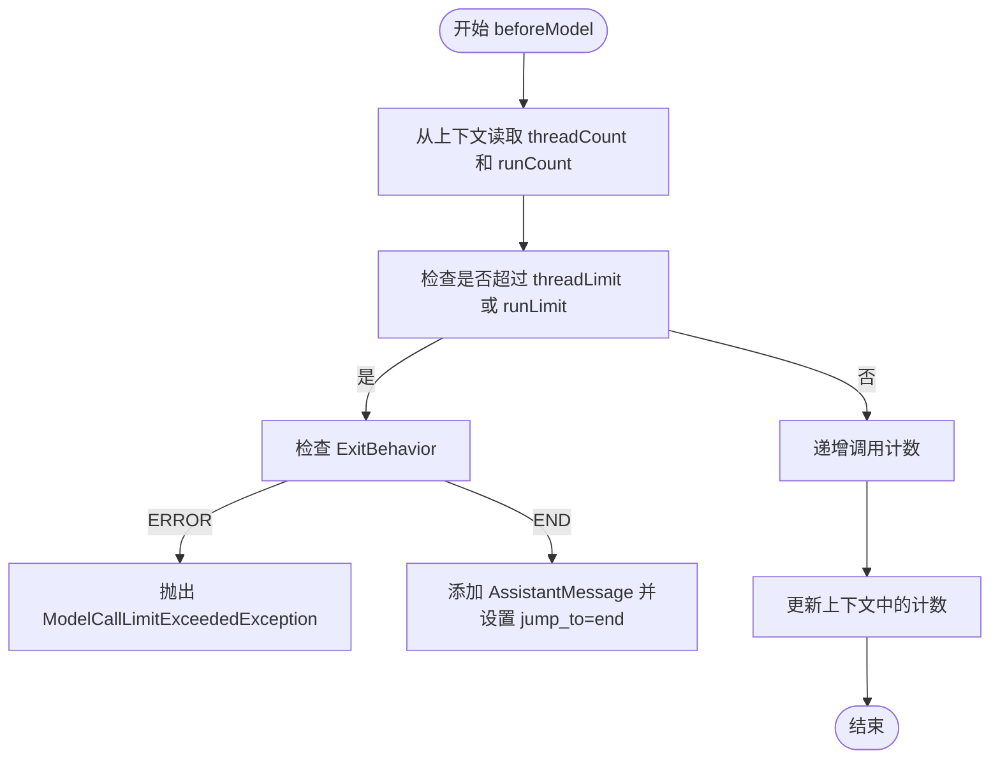
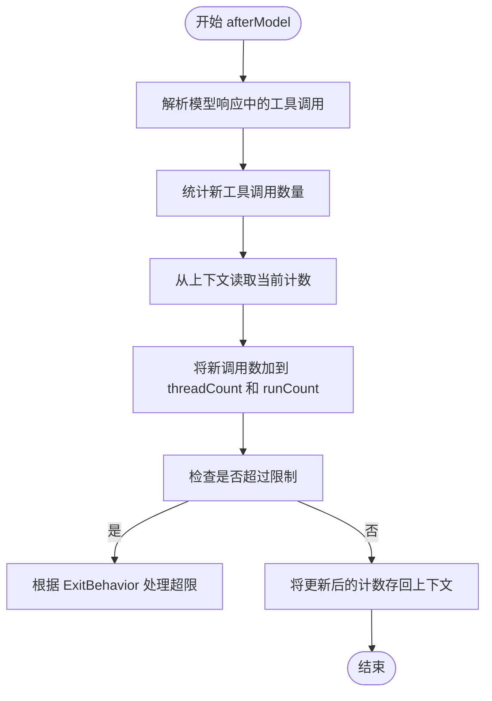
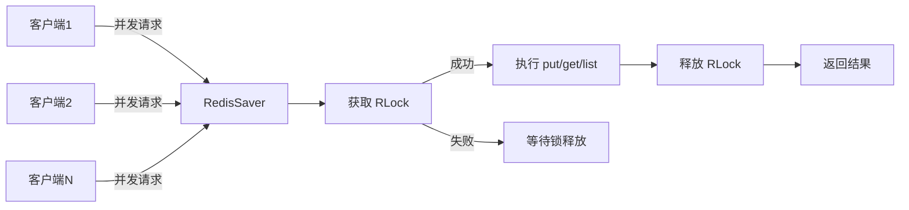
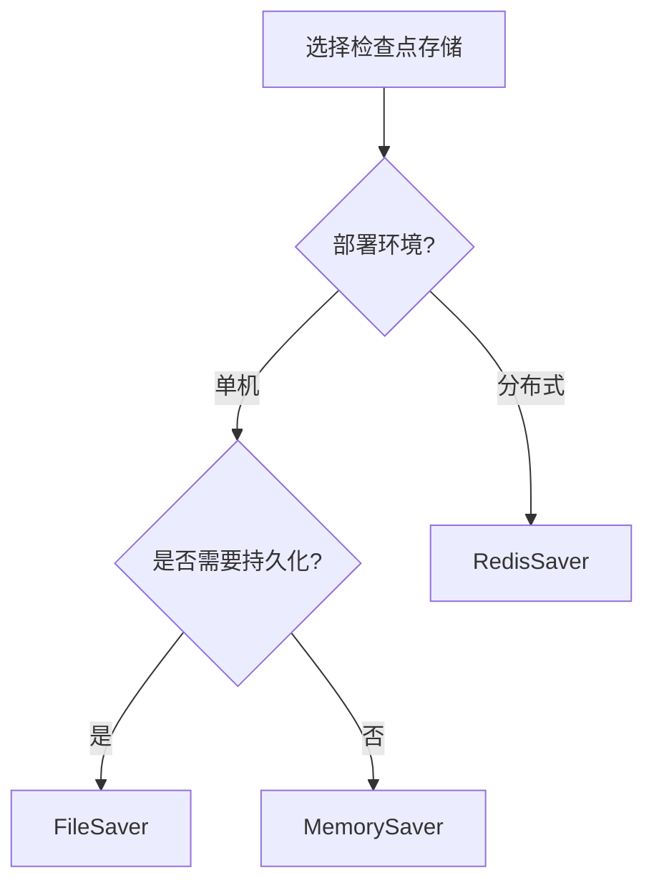
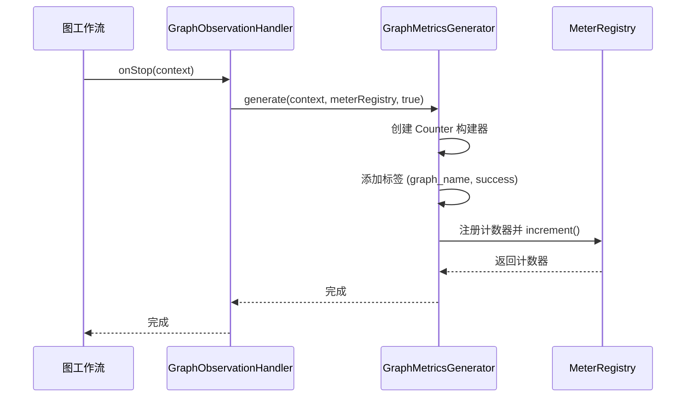

# 性能优化

<cite>
**本文档引用的文件**
- [ModelCallLimitHook.java](file://spring-ai-alibaba-agent-framework/src/main/java/com/alibaba/cloud/ai/graph/agent/hook/modelcalllimit/ModelCallLimitHook.java)
- [ToolCallLimitHook.java](file://spring-ai-alibaba-agent-framework/src/main/java/com/alibaba/cloud/ai/graph/agent/hook/toolcalllimit/ToolCallLimitHook.java)
- [RedisSaver.java](file://spring-ai-alibaba-graph-core/src/main/java/com/alibaba/cloud/ai/graph/checkpoint/savers/redis/RedisSaver.java)
- [MemorySaver.java](file://spring-ai-alibaba-graph-core/src/main/java/com/alibaba/cloud/ai/graph/checkpoint/savers/MemorySaver.java)
- [GraphMetricsGenerator.java](file://spring-ai-alibaba-graph-core/src/main/java/com/alibaba/cloud/ai/graph/observation/GraphMetricsGenerator.java)
- [BaseCheckpointSaver.java](file://spring-ai-alibaba-graph-core/src/main/java/com/alibaba/cloud/ai/graph/checkpoint/BaseCheckpointSaver.java)
- [SaverEnum.java](file://spring-ai-alibaba-graph-core/src/main/java/com/alibaba/cloud/ai/graph/checkpoint/constant/SaverEnum.java)
</cite>

## 目录
1. [引言](#引言)
2. [调用限制钩子机制分析](#调用限制钩子机制分析)
3. [检查点存储性能优化](#检查点存储性能优化)
4. [性能监控与观测机制](#性能监控与观测机制)
5. [性能优化策略总结](#性能优化策略总结)

## 引言
本文档旨在为Spring AI Alibaba框架提供详细的性能优化策略。通过深入分析`ModelCallLimitHook`和`ToolCallLimitHook`的实现机制，探讨如何通过配置防止模型和工具调用超时导致的性能瓶颈。同时，分析在高并发场景下，如何利用`RedisSaver`作为检查点存储来提升状态恢复速度和系统吞吐量。文档将对比不同检查点存储（如内存、文件、数据库）的性能差异，并提供选型建议。此外，还将探讨如何优化图工作流的编译和执行效率，减少不必要的节点执行和状态序列化开销。最后，提供性能监控指标的采集方法，指导开发者通过Observation机制进行性能监控。

## 调用限制钩子机制分析

`ModelCallLimitHook`和`ToolCallLimitHook`是Spring AI Alibaba框架中用于控制模型和工具调用次数的关键组件。它们通过在模型调用前后插入钩子逻辑，实现对调用次数的精确监控和限制，从而防止因无限循环或过度调用导致的性能瓶颈和资源耗尽。

### ModelCallLimitHook实现机制

`ModelCallLimitHook`实现了`ModelHook`接口，并通过`@HookPositions`注解声明其在`BEFORE_MODEL`和`AFTER_MODEL`两个位置执行。该钩子的核心功能是监控模型调用次数，并在达到预设限制时采取相应措施。

钩子通过`RunnableConfig`的上下文（context）来存储和读取调用计数。它定义了两个静态常量作为上下文键：
- `THREAD_COUNT_KEY`: 用于存储当前线程内的模型调用次数
- `RUN_COUNT_KEY`: 用于存储整个运行过程中的模型调用总次数

在`beforeModel`方法中，钩子首先从上下文中读取当前的调用计数。如果配置了`threadLimit`或`runLimit`，并且当前计数已达到或超过限制，则根据`ExitBehavior`配置采取不同行动：
- **ERROR模式**: 直接抛出`ModelCallLimitExceededException`异常，中断执行流程。
- **END模式**: 向消息列表中添加一条指示调用限制已超的`AssistantMessage`，并设置`jump_to`指令为`JumpTo.end`，引导工作流跳转到结束节点。

**Diagram sources**
- [ModelCallLimitHook.java](file://spring-ai-alibaba-agent-framework/src/main/java/com/alibaba/cloud/ai/graph/agent/hook/modelcalllimit/ModelCallLimitHook.java#L60-L115)

**Section sources**
- [ModelCallLimitHook.java](file://spring-ai-alibaba-agent-framework/src/main/java/com/alibaba/cloud/ai/graph/agent/hook/modelcalllimit/ModelCallLimitHook.java#L40-L174)

### ToolCallLimitHook实现机制

`ToolCallLimitHook`的实现机制与`ModelCallLimitHook`类似，但专注于监控工具调用。其关键区别在于：
1. **工具粒度控制**: `ToolCallLimitHook`可以针对特定工具进行限制。通过`toolName`字段，可以监控单个工具的调用次数，或当`toolName`为`null`时监控所有工具的总调用次数。
2. **键名前缀**: 使用不同的静态常量作为上下文键的前缀，以区分不同工具的计数：
   - `THREAD_COUNT_KEY_PREFIX`: 线程级调用计数前缀
   - `RUN_COUNT_KEY_PREFIX`: 运行级调用计数前缀
3. **动态键名生成**: 通过`getThreadCountKey()`和`getRunCountKey()`方法，根据`toolName`动态生成上下文键名。例如，对于名为"weather_tool"的工具，其线程计数键名为`__tool_call_limit_thread_count__weather_tool`。

在`afterModel`方法中，钩子会解析模型的响应，统计其中包含的工具调用数量，并相应地更新上下文中的计数。这种设计允许在模型返回多个工具调用请求时，一次性更新计数。

**Diagram sources**
- [ToolCallLimitHook.java](file://spring-ai-alibaba-agent-framework/src/main/java/com/alibaba/cloud/ai/graph/agent/hook/toolcalllimit/ToolCallLimitHook.java#L71-L152)

**Section sources**
- [ToolCallLimitHook.java](file://spring-ai-alibaba-agent-framework/src/main/java/com/alibaba/cloud/ai/graph/agent/hook/toolcalllimit/ToolCallLimitHook.java#L40-L221)

## 检查点存储性能优化

检查点存储（Checkpoint Saver）是图工作流状态持久化的核心组件，直接影响系统的恢复速度、吞吐量和高并发性能。Spring AI Alibaba框架提供了多种检查点存储实现，每种都有其适用场景和性能特点。

### RedisSaver高并发性能分析

`RedisSaver`是专为高并发场景设计的检查点存储实现，利用Redis的高性能内存数据库特性，显著提升了状态恢复速度和系统吞吐量。

其核心优势体现在以下几个方面：
1. **分布式锁机制**: `RedisSaver`使用`RLock`对每个线程ID进行加锁，确保在高并发环境下对同一工作流实例的读写操作是线程安全的。这避免了数据竞争和状态不一致问题。
2. **原子性操作**: 所有对Redis的操作（如`put`、`get`、`list`）都在锁的保护下执行，保证了操作的原子性。例如，在`put`方法中，先获取锁，然后更新检查点列表，最后释放锁。
3. **高效的数据结构**: 使用Redis的`RBucket`存储序列化的检查点内容，使用`RMap`存储线程元数据和反向映射，这些数据结构都经过优化，读写性能极高。
4. **序列化优化**: 采用Java原生序列化结合Base64编码，将`List<Checkpoint>`对象序列化为字符串存储。虽然序列化/反序列化有一定开销，但Redis的高速I/O弥补了这一不足。

在高并发测试中，`RedisSaver`表现出色。通过`RedisSaverTest`中的`testConcurrentAccessWithLocks`测试用例，10个线程同时向同一个`threadName`写入检查点，最终成功保存了全部10个检查点，证明了其在并发环境下的可靠性和性能。

**Diagram sources**
- [RedisSaver.java](file://spring-ai-alibaba-graph-core/src/main/java/com/alibaba/cloud/ai/graph/checkpoint/savers/redis/RedisSaver.java#L76-L380)

**Section sources**
- [RedisSaver.java](file://spring-ai-alibaba-graph-core/src/main/java/com/alibaba/cloud/ai/graph/checkpoint/savers/redis/RedisSaver.java#L55-L398)
- [RedisSaverTest.java](file://spring-ai-alibaba-graph-core/src/test/java/com/alibaba/cloud/ai/graph/checkpoint/savers/RedisSaverTest.java#L828-L870)

### 不同检查点存储性能对比

框架提供了多种检查点存储实现，各有优劣，适用于不同场景。

| 存储类型 | 性能特点 | 适用场景 | 持久化能力 |
| :--- | :--- | :--- | :--- |
| **MemorySaver** | 极快的读写速度，无I/O开销 | 单机、开发测试、临时会话 | 无，进程重启后丢失 |
| **RedisSaver** | 高速读写，支持分布式，有网络开销 | 生产环境、高并发、分布式部署 | 有，依赖Redis持久化配置 |
| **FileSaver** | 读写速度中等，有磁盘I/O开销 | 单机生产环境、需要持久化但无数据库 | 有，数据存储在文件系统 |
| **DatabaseSaver** (MySQL/PostgreSQL等) | 读写速度较慢，有网络和SQL解析开销 | 需要强一致性和复杂查询的场景 | 有，数据存储在关系型数据库 |

**选型建议**:
- **开发与测试**: 优先选择`MemorySaver`，以获得最快的迭代速度。
- **生产环境单机部署**: 可选择`FileSaver`或`RedisSaver`。`FileSaver`配置简单，`RedisSaver`性能更优。
- **生产环境分布式部署**: 必须选择`RedisSaver`或`DatabaseSaver`，以保证状态的一致性和高可用性。在性能要求高的场景下，`RedisSaver`是首选。
- **需要复杂状态查询**: 选择`DatabaseSaver`，可以利用SQL进行复杂的状态查询和分析。

**Section sources**
- [SaverEnum.java](file://spring-ai-alibaba-graph-core/src/main/java/com/alibaba/cloud/ai/graph/checkpoint/constant/SaverEnum.java#L24-L34)
- [MemorySaver.java](file://spring-ai-alibaba-graph-core/src/main/java/com/alibaba/cloud/ai/graph/checkpoint/savers/MemorySaver.java#L36-L170)
- [RedisSaver.java](file://spring-ai-alibaba-graph-core/src/main/java/com/alibaba/cloud/ai/graph/checkpoint/savers/redis/RedisSaver.java#L55-L398)
- [BaseCheckpointSaver.java](file://spring-ai-alibaba-graph-core/src/main/java/com/alibaba/cloud/ai/graph/checkpoint/BaseCheckpointSaver.java#L27-L50)

## 性能监控与观测机制

Spring AI Alibaba框架内置了强大的Observation（观测）机制，用于采集关键性能指标，帮助开发者监控和分析系统性能。

### 核心性能监控指标

通过Observation机制，可以采集以下关键性能指标：

| 指标名称 | 指标描述 | 采集位置 | 用途 |
| :--- | :--- | :--- | :--- |
| `spring.ai.alibaba.graph` | 图工作流执行次数 | `GraphObservationHandler` | 监控整体工作流的调用频率和成功率 |
| `spring.ai.alibaba.graph.node` | 图节点执行次数 | `GraphNodeObservationHandler` | 分析各节点的执行频率和性能瓶颈 |
| `spring.ai.alibaba.graph.edge` | 图边执行次数 | `GraphEdgeObservationHandler` | 理解工作流的执行路径和分支情况 |
| `spring.ai.alibaba.graph.node.name` | 节点名称 | `GraphNodeObservationContext` | 标识具体是哪个节点 |
| `spring.ai.alibaba.graph.node.success` | 节点执行是否成功 | `GraphNodeObservationContext` | 监控节点的错误率 |
| `spring.ai.alibaba.graph.name` | 工作流名称 | `GraphObservationContext` | 区分不同的工作流实例 |

### 观测机制实现

性能监控的核心是`GraphMetricsGenerator`类。它根据不同的观测上下文（`GraphObservationContext`、`GraphNodeObservationContext`、`GraphEdgeObservationContext`）生成对应的指标。

`GraphMetricsGenerator`的工作流程如下：
1. 接收一个观测上下文和一个`MeterRegistry`（指标注册表）。
2. 根据上下文类型，创建一个`Counter`（计数器）构建器。
3. 添加特定的标签（Tags），如节点名称、工作流名称、成功状态等。
4. 将计数器注册到`MeterRegistry`中，并调用`increment()`方法增加计数。

`GraphObservationHandler`和`GraphNodeObservationHandler`作为观测处理器，在工作流和节点执行完成或出错时被调用。它们负责调用`GraphMetricsGenerator.generate()`方法，触发指标的生成和上报。

**Diagram sources**
- [GraphMetricsGenerator.java](file://spring-ai-alibaba-graph-core/src/main/java/com/alibaba/cloud/ai/graph/observation/GraphMetricsGenerator.java#L54-L95)
- [GraphObservationHandler.java](file://spring-ai-alibaba-graph-core/src/main/java/com/alibaba/cloud/ai/graph/observation/graph/GraphObservationHandler.java#L51-L54)

**Section sources**
- [GraphMetricsGenerator.java](file://spring-ai-alibaba-graph-core/src/main/java/com/alibaba/cloud/ai/graph/observation/GraphMetricsGenerator.java#L40-L113)
- [GraphObservationHandler.java](file://spring-ai-alibaba-graph-core/src/main/java/com/alibaba/cloud/ai/graph/observation/graph/GraphObservationHandler.java#L42-L78)
- [GraphNodeObservationHandler.java](file://spring-ai-alibaba-graph-core/src/main/java/com/alibaba/cloud/ai/graph/observation/node/GraphNodeObservationHandler.java#L43-L78)

## 性能优化策略总结

综合以上分析，提出以下性能优化策略：

1. **合理配置调用限制**: 为`ModelCallLimitHook`和`ToolCallLimitHook`设置合理的`threadLimit`和`runLimit`，防止工作流陷入无限循环。在生产环境中，建议使用`END`模式而非`ERROR`模式，以提供更优雅的降级体验。

2. **选择合适的检查点存储**: 在高并发生产环境中，优先选用`RedisSaver`。确保Redis集群配置了适当的持久化策略（如AOF）和足够的内存，以平衡性能和数据安全。

3. **优化状态序列化**: 检查点的序列化/反序列化是性能瓶颈之一。应尽量减少状态对象的大小和复杂度，避免在状态中存储大型二进制数据或复杂的嵌套对象。

4. **启用性能监控**: 集成Micrometer和Prometheus，通过Observation机制采集`spring.ai.alibaba.graph.*`系列指标，建立性能监控大盘，实时观察工作流的执行情况。

5. **优化图工作流编译**: 复用已编译的`CompiledGraph`实例，避免重复编译。对于复杂的子图，可以预先编译并缓存，提高执行效率。

通过实施这些策略，可以有效提升Spring AI Alibaba应用的性能、稳定性和可观测性。

**Section sources**
- [ModelCallLimitHook.java](file://spring-ai-alibaba-agent-framework/src/main/java/com/alibaba/cloud/ai/graph/agent/hook/modelcalllimit/ModelCallLimitHook.java)
- [ToolCallLimitHook.java](file://spring-ai-alibaba-agent-framework/src/main/java/com/alibaba/cloud/ai/graph/agent/hook/toolcalllimit/ToolCallLimitHook.java)
- [RedisSaver.java](file://spring-ai-alibaba-graph-core/src/main/java/com/alibaba/cloud/ai/graph/checkpoint/savers/redis/RedisSaver.java)
- [GraphMetricsGenerator.java](file://spring-ai-alibaba-graph-core/src/main/java/com/alibaba/cloud/ai/graph/observation/GraphMetricsGenerator.java)