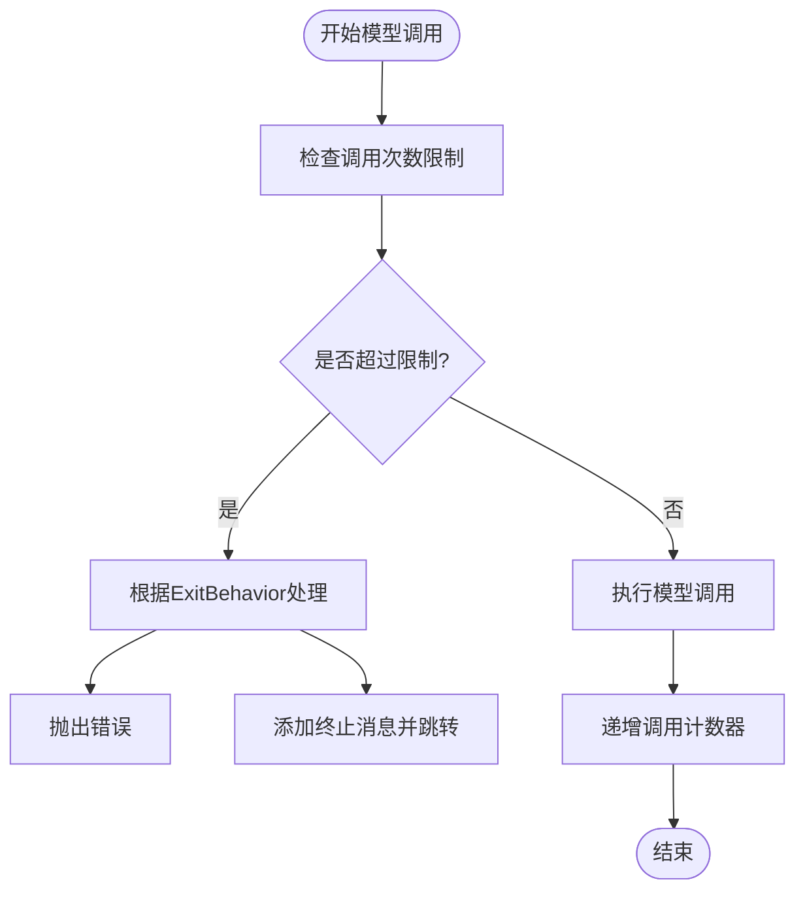
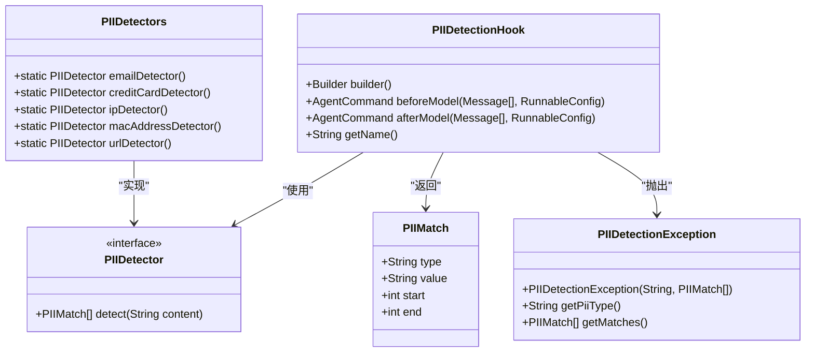
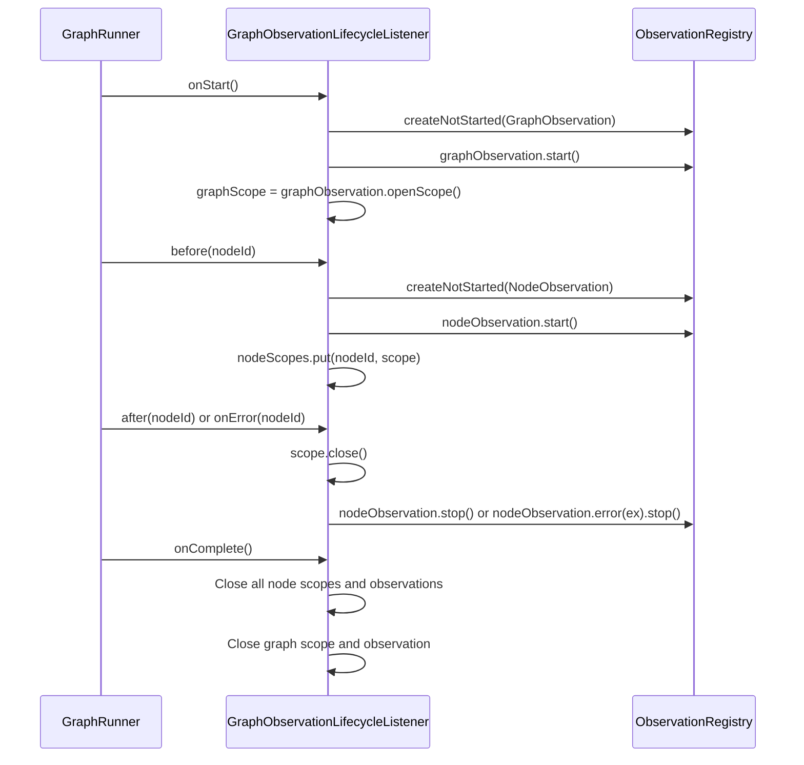

# 最佳实践

<cite>
**本文档中引用的文件**  
- [ModelCallLimitHook.java](file://spring-ai-alibaba-agent-framework/src/main/java/com/alibaba/cloud/ai/graph/agent/hook/modelcalllimit/ModelCallLimitHook.java)
- [PIIDetectionHook.java](file://spring-ai-alibaba-agent-framework/src/main/java/com/alibaba/cloud/ai/graph/agent/hook/pii/PIIDetectionHook.java)
- [PIIDetectors.java](file://spring-ai-alibaba-agent-framework/src/main/java/com/alibaba/cloud/ai/graph/agent/hook/pii/PIIDetectors.java)
- [ShellTool.java](file://spring-ai-alibaba-agent-framework/src/main/java/com/alibaba/cloud/ai/graph/agent/tools/ShellTool.java)
- [RedisStore.java](file://spring-ai-alibaba-graph-core/src/main/java/com/alibaba/cloud/ai/graph/store/stores/RedisStore.java)
- [GraphObservationLifecycleListener.java](file://spring-ai-alibaba-graph-core/src/main/java/com/alibaba/cloud/ai/graph/observation/GraphObservationLifecycleListener.java)
- [application.yml](file://examples/documentation/src/main/resources/application.yml)
- [CONTRIBUTING.md](file://CONTRIBUTING.md)
- [README.md](file://README.md)
</cite>

## 目录
1. [简介](#简介)
2. [性能优化](#性能优化)
3. [安全考虑](#安全考虑)
4. [部署建议](#部署建议)
5. [代码规范](#代码规范)
6. [监控与可观测性](#监控与可观测性)
7. [团队协作与贡献指南](#团队协作与贡献指南)
8. [结论](#结论)

## 简介

本指南旨在为使用Spring AI Alibaba框架的开发团队提供一套全面的最佳实践。涵盖性能优化、安全考虑、部署策略、代码规范、监控与可观测性以及团队协作等方面，帮助团队构建高效、安全、可维护的智能体应用。

**本文档中引用的文件**  
- [README.md](file://README.md)

## 性能优化

### 模型调用次数限制

为避免智能体在执行过程中因无限循环或过度调用模型而导致超时或资源耗尽，框架提供了`ModelCallLimitHook`机制。该机制允许开发者设置线程级别和运行级别（run-level）的模型调用次数限制。

`ModelCallLimitHook`通过在`RunnableConfig`的上下文中维护计数器来跟踪调用次数。当调用次数达到预设限制时，可以根据配置的`ExitBehavior`采取不同行为：
- **END**: 终止智能体执行，并向消息流中添加一条说明信息。
- **ERROR**: 抛出`ModelCallLimitExceededException`异常。

此机制应在智能体构建时通过`Builder`模式配置，确保在生产环境中有效防止无限循环和资源滥用。

**图示来源**  
- [ModelCallLimitHook.java](file://spring-ai-alibaba-agent-framework/src/main/java/com/alibaba/cloud/ai/graph/agent/hook/modelcalllimit/ModelCallLimitHook.java#L40-L174)

**本节来源**  
- [ModelCallLimitHook.java](file://spring-ai-alibaba-agent-framework/src/main/java/com/alibaba/cloud/ai/graph/agent/hook/modelcalllimit/ModelCallLimitHook.java)

### 工具调用次数限制

与模型调用类似，框架也提供了`ToolCallLimitHook`来限制工具的调用次数。这可以防止智能体在特定工具上陷入无限循环或过度使用。

`ToolCallLimitHook`支持对所有工具或特定工具（通过`toolName`指定）进行调用次数限制。其工作原理与`ModelCallLimitHook`类似，通过上下文中的计数器进行跟踪，并在达到限制时触发相应的退出行为。

## 安全考虑

### PII（个人身份信息）检测与脱敏

保护用户隐私是智能体应用的重中之重。框架通过`PIIDetectionHook`提供了一套强大的PII检测和处理机制。

#### 检测机制
`PIIDetectionHook`利用`PIIDetector`接口和`PIIDetectors`工具类，能够检测多种类型的PII，包括：
- 电子邮件地址
- 信用卡号
- IP地址
- MAC地址
- URL

检测过程发生在模型调用之前（`beforeModel`）和之后（`afterModel`），确保输入和输出内容都经过检查。

#### 处理策略
当检测到PII时，`PIIDetectionHook`支持多种脱敏策略（`RedactionStrategy`）：
- **REDACT**: 用`[REDACTED_TYPE]`替换敏感信息。
- **MASK**: 对信息进行部分遮盖，例如保留后四位。
- **HASH**: 使用哈希函数处理信息。
- **BLOCK**: 阻止操作并抛出`PIIDetectionException`异常。

开发者可以灵活配置策略，例如对输入应用`REDACT`策略以保护用户隐私，对输出应用`BLOCK`策略以防止敏感信息泄露。

**图示来源**  
- [PIIDetectionHook.java](file://spring-ai-alibaba-agent-framework/src/main/java/com/alibaba/cloud/ai/graph/agent/hook/pii/PIIDetectionHook.java#L50-L378)
- [PIIDetectors.java](file://spring-ai-alibaba-agent-framework/src/main/java/com/alibaba/cloud/ai/graph/agent/hook/pii/PIIDetectors.java#L27-L151)
- [PIIDetectionException.java](file://spring-ai-alibaba-agent-framework/src/main/java/com/alibaba/cloud/ai/graph/agent/hook/pii/PIIDetectionException.java#L23-L47)

**本节来源**  
- [PIIDetectionHook.java](file://spring-ai-alibaba-agent-framework/src/main/java/com/alibaba/cloud/ai/graph/agent/hook/pii/PIIDetectionHook.java)
- [PIIDetectors.java](file://spring-ai-alibaba-agent-framework/src/main/java/com/alibaba/cloud/ai/graph/agent/hook/pii/PIIDetectors.java)

### 工具调用沙箱执行

直接执行用户请求的shell命令存在巨大的安全风险。框架通过`ShellTool`和`ShellSessionManager`提供了沙箱化的执行环境。

`ShellTool`允许执行shell命令，但其执行受到严格控制：
- **工作区隔离**: 所有命令在指定的持久化会话和工作目录中执行，限制了文件系统的访问范围。
- **超时控制**: 每个命令都有配置的超时时间（`commandTimeout`），防止长时间运行的进程。
- **输出截断**: 可以设置最大输出行数（`maxOutputLines`）和字节数，防止大输出阻塞系统。
- **环境变量控制**: 可以通过`withEnvironment`方法配置执行环境。

通过`ShellTool.Builder`，开发者可以安全地创建和配置一个`ToolCallback`，将其注入到智能体中，从而在受控环境下执行必要的系统操作。

**本节来源**  
- [ShellTool.java](file://spring-ai-alibaba-agent-framework/src/main/java/com/alibaba/cloud/ai/graph/agent/tools/ShellTool.java)

## 部署建议

### 使用Redis作为检查点存储

在生产环境中，智能体的状态管理和持久化至关重要。框架的`Graph`核心支持检查点（Checkpoint）机制，用于保存和恢复长时间运行的智能体的状态。

虽然框架提供了内存和文件系统等检查点存储，但在生产环境中强烈推荐使用**Redis**作为检查点存储。RedisStore提供了高性能、低延迟的键值存储，非常适合存储智能体的瞬时状态。

尽管当前代码库中的`RedisStore`是一个模拟实现（使用`ConcurrentHashMap`），但它为集成真正的Redis客户端（如Lettuce或Jedis）提供了清晰的接口和设计模式。在生产部署时，应替换为基于真实Redis的实现，以确保状态的可靠性和高可用性。

**本节来源**  
- [RedisStore.java](file://spring-ai-alibaba-graph-core/src/main/java/com/alibaba/cloud/ai/graph/store/stores/RedisStore.java)

## 代码规范

### 命名约定

遵循清晰、一致的命名约定是代码可读性的基础。
- **类名**: 使用大驼峰命名法（PascalCase），如`ModelCallLimitHook`、`PIIDetectionHook`。
- **方法名**: 使用小驼峰命名法（camelCase），如`builder()`、`beforeModel()`。
- **常量**: 使用全大写字母和下划线，如`THREAD_COUNT_KEY`。
- **变量名**: 使用有意义的、描述性的名称，避免单字母变量。

### 日志记录

使用SLF4J进行日志记录，并遵循以下原则：
- 在关键操作（如执行命令、发生错误）时记录日志。
- 使用适当的日志级别（DEBUG, INFO, WARN, ERROR）。
- 在异常处理中，使用`log.error("message", exception)`来记录完整的堆栈跟踪。

### 错误处理

- **异常抛出**: 对于可恢复的错误，应抛出具体的、有意义的异常（如`PIIDetectionException`），并包含足够的上下文信息。
- **异常捕获**: 捕获异常时，应进行适当的处理（如重试、降级、记录），避免静默失败。
- **资源清理**: 使用try-with-resources或在finally块中确保资源（如文件句柄、网络连接）被正确释放。

**本节来源**  
- [ShellTool.java](file://spring-ai-alibaba-agent-framework/src/main/java/com/alibaba/cloud/ai/graph/agent/tools/ShellTool.java#L48)
- [GraphObservationLifecycleListener.java](file://spring-ai-alibaba-graph-core/src/main/java/com/alibaba/cloud/ai/graph/observation/GraphObservationLifecycleListener.java#L40)

## 监控与可观测性

### 利用Observation机制

框架内置了强大的可观测性支持，通过`GraphObservationLifecycleListener`实现了与Micrometer Observation的集成。

该监听器会自动为图（Graph）的执行和每个节点（Node）的执行创建观测（Observation）。它会记录：
- **开始和结束时间**: 用于性能分析。
- **输入和输出状态**: 用于调试和审计。
- **错误信息**: 当节点执行失败时，会记录异常。

通过集成Micrometer，这些观测数据可以被导出到Prometheus、Datadog等监控系统，实现对智能体应用的全面监控。

**图示来源**  
- [GraphObservationLifecycleListener.java](file://spring-ai-alibaba-graph-core/src/main/java/com/alibaba/cloud/ai/graph/observation/GraphObservationLifecycleListener.java#L38-L247)

**本节来源**  
- [GraphObservationLifecycleListener.java](file://spring-ai-alibaba-graph-core/src/main/java/com/alibaba/cloud/ai/graph/observation/GraphObservationLifecycleListener.java)

## 团队协作与贡献指南

### 代码审查

- **Pull Request (PR)**: 所有代码变更都应通过PR提交。
- **PR标题**: 遵循`type(module): descriptive message`格式，例如`feat(hook): add new PII detector`。
- **代码审查**: PR需要至少一位核心成员的批准才能合并。

### 测试覆盖率

- **单元测试**: 为所有核心功能编写单元测试，确保逻辑正确性。
- **集成测试**: 编写集成测试以验证组件间的交互。
- **测试覆盖率**: 努力保持高测试覆盖率，特别是对于安全和性能关键的代码。

### 文档更新

- **代码注释**: 为公共API和复杂逻辑添加清晰的JavaDoc注释。
- **README更新**: 当添加新功能或修改现有行为时，及时更新`README.md`和相关文档。
- **贡献指南**: 遵循项目根目录下的`CONTRIBUTING.md`文档中的流程。

**本节来源**  
- [CONTRIBUTING.md](file://CONTRIBUTING.md)
- [README.md](file://README.md)

## 结论

本最佳实践指南涵盖了使用Spring AI Alibaba框架开发智能体应用的关键方面。通过合理应用模型和工具调用限制、实施PII检测与脱敏、在生产环境中使用Redis进行状态管理、遵循清晰的代码规范以及利用内置的可观测性机制，团队可以构建出高性能、安全、可维护且易于协作的智能体系统。遵循这些实践将有助于确保项目的长期成功和稳定性。