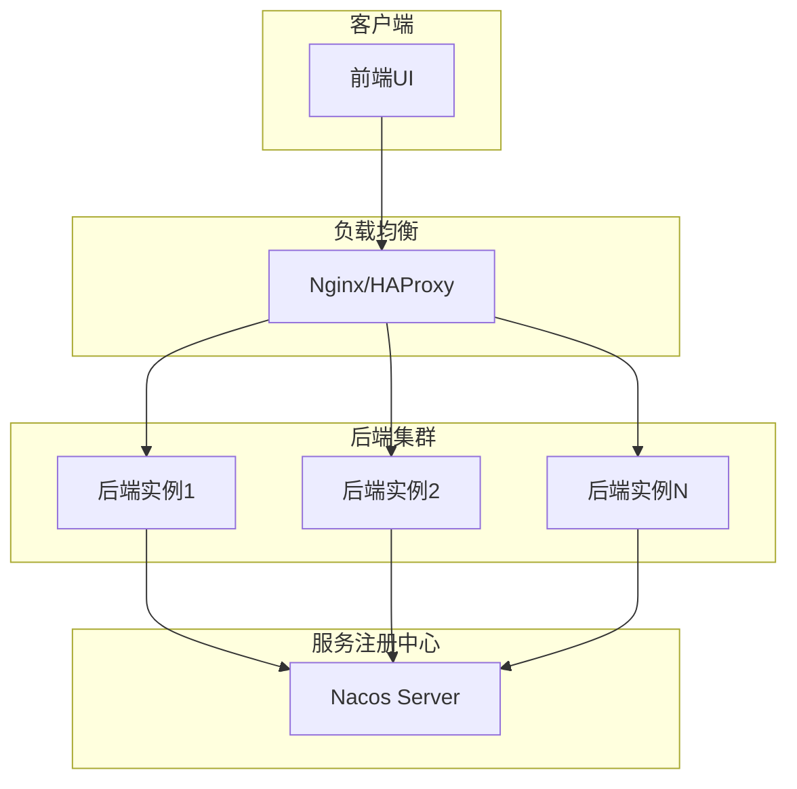

# 部署建议

<cite>
**本文档引用的文件**  
- [package.json](file://spring-ai-alibaba-studio/agent-chat-ui/package.json)
- [README.md](file://spring-ai-alibaba-studio/README.md)
- [.env.example](file://spring-ai-alibaba-studio/agent-chat-ui/.env.example)
- [next.config.mjs](file://spring-ai-alibaba-studio/agent-chat-ui/next.config.mjs)
- [application.yml](file://spring-ai-alibaba-studio/src/test/resources/application.yml)
- [RedisSaver.java](file://spring-ai-alibaba-graph-core/src/main/java/com/alibaba/cloud/ai/graph/checkpoint/savers/redis/RedisSaver.java)
- [MySqlSaver.java](file://spring-ai-alibaba-graph-core/src/main/java/com/alibaba/cloud/ai/graph/checkpoint/savers/mysql/MySqlSaver.java)
- [SaverEnum.java](file://spring-ai-alibaba-graph-core/src/main/java/com/alibaba/cloud/ai/graph/checkpoint/constant/SaverEnum.java)
- [GraphObservationAutoConfiguration.java](file://spring-boot-starters/spring-ai-alibaba-starter-graph-observation/src/main/java/com/alibaba/cloud/ai/autoconfigure/graph/GraphObservationAutoConfiguration.java)
- [NacosA2aRegistryAutoConfiguration.java](file://spring-boot-starters/spring-ai-alibaba-starter-a2a-nacos/src/main/java/com/alibaba/cloud/ai/a2a/autoconfigure/nacos/NacosA2aRegistryAutoConfiguration.java)
</cite>

## 目录
1. [前端UI独立部署方案](#前端ui独立部署方案)
2. [后端服务高可用集群配置](#后端服务高可用集群配置)
3. [状态持久化存储建议](#状态持久化存储建议)
4. [日志级别与监控告警配置](#日志级别与监控告警配置)
5. [Docker镜像构建与Kubernetes部署参考](#docker镜像构建与kubernetes部署参考)

## 前端UI独立部署方案

为提升访问速度和稳定性，建议采用独立模式部署spring-ai-alibaba-studio的前端UI。前端应用基于Next.js构建，可通过静态导出方式进行部署。通过Nginx进行静态资源托管和反向代理，实现前后端分离架构。

前端构建配置中已支持静态导出功能，在`next.config.mjs`文件中配置了`output: 'export'`选项，可生成静态文件用于部署。同时配置了`basePath: '/chatui'`基础路径，便于在Nginx中进行路径映射。

Nginx配置示例：
```
server {
    listen 80;
    server_name your-domain.com;
    
    # 前端UI静态资源托管
    location /chatui {
        alias /path/to/static/files;
        try_files $uri $uri/ /chatui/index.html;
        expires 1y;
        add_header Cache-Control "public, immutable";
    }
    
    # 反向代理后端API
    location /api {
        proxy_pass http://backend-cluster;
        proxy_set_header Host $host;
        proxy_set_header X-Real-IP $remote_addr;
    }
}
```

**Section sources**
- [package.json](file://spring-ai-alibaba-studio/agent-chat-ui/package.json)
- [next.config.mjs](file://spring-ai-alibaba-studio/agent-chat-ui/next.config.mjs)
- [README.md](file://spring-ai-alibaba-studio/README.md)

## 后端服务高可用集群配置

后端服务应配置高可用集群，通过Nacos进行服务注册与发现。项目提供了Nacos集成的启动器模块`spring-ai-alibaba-starter-a2a-nacos`，支持将Agent服务注册到Nacos注册中心。

在生产环境中，应部署多个后端实例形成集群，通过负载均衡器分发请求。Nacos作为服务注册中心，可实现服务的自动发现和健康检查。当某个实例故障时，流量会自动路由到其他健康实例，确保服务的高可用性。

服务注册配置主要通过`NacosA2aRegistryAutoConfiguration`类实现，其中定义了`nacosAgentRegistry` Bean，负责将AgentCard注册到Nacos。相关配置属性包括服务器地址、命名空间、认证信息等，可通过配置文件进行设置。



**Diagram sources**
- [NacosA2aRegistryAutoConfiguration.java](file://spring-boot-starters/spring-ai-alibaba-starter-a2a-nacos/src/main/java/com/alibaba/cloud/ai/a2a/autoconfigure/nacos/NacosA2aRegistryAutoConfiguration.java)
- [NacosAgentRegistry.java](file://spring-boot-starters/spring-ai-alibaba-starter-a2a-nacos/src/main/java/com/alibaba/cloud/ai/a2a/registry/nacos/register/NacosAgentRegistry.java)

**Section sources**
- [NacosA2aRegistryAutoConfiguration.java](file://spring-boot-starters/spring-ai-alibaba-starter-a2a-nacos/src/main/java/com/alibaba/cloud/ai/a2a/autoconfigure/nacos/NacosA2aRegistryAutoConfiguration.java)
- [NacosA2aProperties.java](file://spring-boot-starters/spring-ai-alibaba-starter-a2a-nacos/src/main/java/com/alibaba/cloud/ai/a2a/registry/nacos/properties/NacosA2aProperties.java)

## 状态持久化存储建议

对于状态持久化，强烈建议在生产环境中使用Redis或MySQL作为检查点存储（Checkpoint Saver），避免使用内存存储以防数据丢失。项目提供了多种检查点存储实现，包括Redis、MySQL、文件系统和内存存储。

`SaverEnum`枚举类定义了可用的存储类型：DB、REDIS、MEMORY和FILE。其中MEMORY存储仅适用于开发测试环境，生产环境应使用REDIS或DB存储。

Redis存储实现（RedisSaver）提供了高性能的键值存储，支持并发访问控制和数据序列化。通过Redisson客户端实现分布式锁，确保多实例环境下的数据一致性。Redis存储适用于需要低延迟访问的场景。

MySQL存储实现（MySqlSaver）提供了关系型数据库的持久化能力，通过预定义的表结构存储检查点数据。包含`GRAPH_THREAD`和`GRAPH_CHECKPOINT`两张表，支持事务处理和数据完整性约束。MySQL存储适用于需要复杂查询和数据审计的场景。

配置示例：
```yaml
spring:
  ai:
    graph:
      checkpoint:
        saver: redis # 或 mysql
        redis:
          host: redis-server
          port: 6379
        mysql:
          datasource: # 数据源配置
```

**Section sources**
- [SaverEnum.java](file://spring-ai-alibaba-graph-core/src/main/java/com/alibaba/cloud/ai/graph/checkpoint/constant/SaverEnum.java)
- [RedisSaver.java](file://spring-ai-alibaba-graph-core/src/main/java/com/alibaba/cloud/ai/graph/checkpoint/savers/redis/RedisSaver.java)
- [MySqlSaver.java](file://spring-ai-alibaba-graph-core/src/main/java/com/alibaba/cloud/ai/graph/checkpoint/savers/mysql/MySqlSaver.java)

## 日志级别与监控告警配置

应配置合理的日志级别和监控告警，集成Prometheus和Grafana进行系统健康度监控。项目基于Micrometer实现了观测性支持，可收集和暴露各种指标数据。

通过`GraphObservationAutoConfiguration`配置类，集成了Graph、Node和Edge三个层级的观测处理器。这些处理器将运行时指标注册到MeterRegistry中，供Prometheus抓取。监控指标包括图执行时间、节点调用次数、错误率等关键性能指标。

日志级别建议配置：
- 生产环境：INFO级别，记录关键操作和错误信息
- 调试环境：DEBUG级别，记录详细执行流程
- 异常情况：ERROR级别，立即触发告警

Prometheus配置示例：
```yaml
scrape_configs:
  - job_name: 'spring-ai-backend'
    metrics_path: '/actuator/prometheus'
    static_configs:
      - targets: ['backend-instance1:8080', 'backend-instance2:8080']
```

Grafana仪表板可展示以下关键指标：
- 请求吞吐量（Requests per second）
- 平均响应时间（Average response time）
- 错误率（Error rate）
- JVM内存使用情况
- 数据库连接池状态

**Section sources**
- [GraphObservationAutoConfiguration.java](file://spring-boot-starters/spring-ai-alibaba-starter-graph-observation/src/main/java/com/alibaba/cloud/ai/autoconfigure/graph/GraphObservationAutoConfiguration.java)
- [GraphObservationHandler.java](file://spring-ai-alibaba-graph-core/src/main/java/com/alibaba/cloud/ai/graph/observation/graph/GraphObservationHandler.java)

## Docker镜像构建与Kubernetes部署参考

提供Docker镜像构建和Kubernetes部署的参考配置。前端和后端服务应分别构建Docker镜像，便于在Kubernetes环境中部署和管理。

Dockerfile构建建议：
- 使用多阶段构建减少镜像体积
- 前端使用Node.js基础镜像，后端使用JRE基础镜像
- 设置合理的资源限制和请求

Kubernetes部署配置包括：
- Deployment：定义Pod副本数和更新策略
- Service：提供内部服务发现
- Ingress：配置外部访问路由
- ConfigMap：管理配置文件
- Secret：存储敏感信息如API密钥

Helm Chart建议结构：
```
charts/
  spring-ai-alibaba/
    templates/
      deployment.yaml
      service.yaml
      ingress.yaml
      configmap.yaml
    values.yaml
    Chart.yaml
```

通过Helm Chart可实现一键部署，支持不同环境的配置参数化。结合CI/CD流水线，可实现自动化构建和部署。

**Section sources**
- [package.json](file://spring-ai-alibaba-studio/agent-chat-ui/package.json)
- [pom.xml](file://spring-ai-alibaba-studio/pom.xml)
- [Docker相关配置文件]