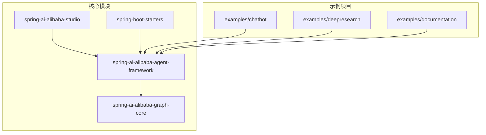
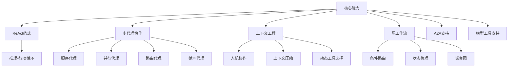
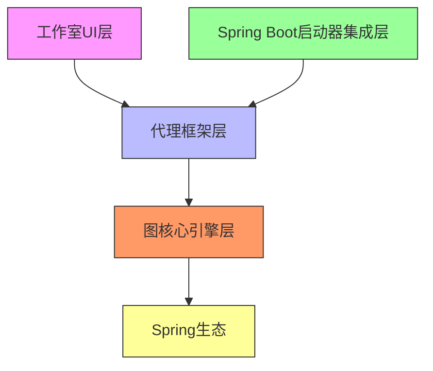
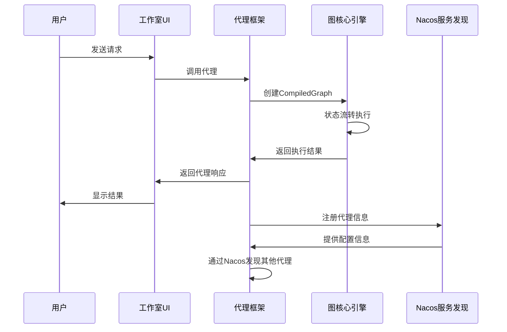

# 项目概述

<cite>
**本文档中引用的文件**  
- [README.md](file://README.md)
- [spring-ai-alibaba-agent-framework/README.md](file://spring-ai-alibaba-agent-framework/README.md)
- [spring-ai-alibaba-graph-core/README.md](file://spring-ai-alibaba-graph-core/README.md)
- [spring-ai-alibaba-studio/README.md](file://spring-ai-alibaba-studio/README.md)
- [examples/chatbot/src/main/java/com/alibaba/cloud/ai/examples/chatbot/ChatbotAgent.java](file://examples/chatbot/src/main/java/com/alibaba/cloud/ai/examples/chatbot/ChatbotAgent.java)
- [examples/chatbot/src/main/java/com/alibaba/cloud/ai/examples/chatbot/ChatbotApplication.java](file://examples/chatbot/src/main/java/com/alibaba/cloud/ai/examples/chatbot/ChatbotApplication.java)
- [examples/deepresearch/src/main/java/com/alibaba/cloud/ai/examples/deepresearch/Application.java](file://examples/deepresearch/src/main/java/com/alibaba/cloud/ai/examples/deepresearch/Application.java)
- [examples/deepresearch/src/main/resources/application.yml](file://examples/deepresearch/src/main/resources/application.yml)
- [spring-ai-alibaba-agent-framework/src/main/java/com/alibaba/cloud/ai/graph/agent/ReactAgent.java](file://spring-ai-alibaba-agent-framework/src/main/java/com/alibaba/cloud/ai/graph/agent/ReactAgent.java)
- [spring-ai-alibaba-graph-core/src/main/java/com/alibaba/cloud/ai/graph/GraphRunner.java](file://spring-ai-alibaba-graph-core/src/main/java/com/alibaba/cloud/ai/graph/GraphRunner.java)
- [spring-boot-starters/spring-ai-alibaba-starter-config-nacos/pom.xml](file://spring-boot-starters/spring-ai-alibaba-starter-config-nacos/pom.xml)
- [spring-ai-alibaba-agent-framework/pom.xml](file://spring-ai-alibaba-agent-framework/pom.xml)
</cite>

## 目录
1. [简介](#简介)
2. [项目结构](#项目结构)
3. [核心能力](#核心能力)
4. [架构分层](#架构分层)
5. [模块依赖与数据流](#模块依赖与数据流)
6. [典型应用场景](#典型应用场景)
7. [技术选型考量](#技术选型考量)
8. [学习路径指引](#学习路径指引)

## 简介

spring-ai-alibaba项目是一个基于Spring生态的AI代理开发框架，旨在为Java开发者提供构建、编排和部署智能AI代理的完整解决方案。该项目以ReAct范式为核心设计理念，支持多代理协作、工作流编排等高级功能，使开发者能够快速构建复杂的AI应用。框架通过分层架构设计，将代理框架、图核心引擎、工作室UI和Spring Boot启动器集成有机结合，为不同层次的开发者提供了灵活的开发体验。

**Section sources**
- [README.md](file://README.md)

## 项目结构

spring-ai-alibaba项目由多个核心模块组成，形成了一个完整的生态系统。项目根目录下包含examples示例项目、核心框架模块、工作室UI和Spring Boot启动器等主要部分。examples目录提供了多个实际应用示例，包括聊天机器人、深度研究代理等，为开发者提供了直观的学习参考。核心框架分为代理框架层和图核心引擎层，分别位于spring-ai-alibaba-agent-framework和spring-ai-alibaba-graph-core目录中。spring-ai-alibaba-studio提供了可视化交互界面，而spring-boot-starters则包含了与Nacos等服务发现组件集成的启动器模块。

**Diagram sources**
- [README.md](file://README.md)

**Section sources**
- [README.md](file://README.md)

## 核心能力

spring-ai-alibaba项目提供了多项核心能力，支持开发者构建复杂的AI代理应用。首先，框架基于ReAct（推理+行动）范式，使代理能够通过迭代式的问题解决过程完成复杂任务。其次，项目支持多代理协作，提供了SequentialAgent、ParallelAgent、LlmRoutingAgent和LoopAgent等内置模式，便于实现复杂的任务执行流程。在上下文工程方面，框架集成了人机协作、上下文压缩、上下文编辑、模型与工具调用限制、工具重试、规划和动态工具选择等最佳实践，提升了代理的可靠性和性能。此外，项目还支持基于图的工作流，提供了条件路由、嵌套图、并行执行和状态管理等能力，并可将工作流导出为PlantUML和Mermaid格式。

**Diagram sources**
- [README.md](file://README.md)

**Section sources**
- [README.md](file://README.md)

## 架构分层

spring-ai-alibaba项目采用清晰的分层架构设计，主要包括代理框架层、图核心引擎层、工作室UI层和Spring Boot启动器集成层。代理框架层是开发者最常接触的层面，提供了ReactAgent等高级抽象，简化了代理的创建和管理。图核心引擎层作为底层运行时，为代理框架提供支持，同时也可独立使用，为开发者提供更细粒度的控制能力。工作室UI层提供了可视化界面，使开发者能够直观地与代理进行交互。Spring Boot启动器集成层则实现了与Nacos等服务发现组件的集成，支持A2A（代理到代理）通信和动态配置功能。

**Diagram sources**
- [README.md](file://README.md)
- [spring-ai-alibaba-agent-framework/README.md](file://spring-ai-alibaba-agent-framework/README.md)
- [spring-ai-alibaba-graph-core/README.md](file://spring-ai-alibaba-graph-core/README.md)

**Section sources**
- [README.md](file://README.md)
- [spring-ai-alibaba-agent-framework/README.md](file://spring-ai-alibaba-agent-framework/README.md)
- [spring-ai-alibaba-graph-core/README.md](file://spring-ai-alibaba-graph-core/README.md)

## 模块依赖与数据流

spring-ai-alibaba项目的各核心模块之间存在明确的依赖关系和数据流。代理框架层依赖于图核心引擎层，利用其提供的StateGraph、Node、Edge和OverAllState等核心组件来实现状态管理和流程控制。当开发者创建一个ReactAgent时，框架会将其转换为图核心引擎可执行的CompiledGraph，通过GraphRunner进行实际的执行。数据流从用户输入开始，经过代理框架的处理，由图核心引擎管理状态流转，最终通过工作室UI层呈现给用户。Spring Boot启动器集成层通过Nacos实现配置的动态加载和代理间的通信协调，确保了系统的灵活性和可扩展性。

**Diagram sources**
- [spring-ai-alibaba-agent-framework/src/main/java/com/alibaba/cloud/ai/graph/agent/ReactAgent.java](file://spring-ai-alibaba-agent-framework/src/main/java/com/alibaba/cloud/ai/graph/agent/ReactAgent.java)
- [spring-ai-alibaba-graph-core/src/main/java/com/alibaba/cloud/ai/graph/GraphRunner.java](file://spring-ai-alibaba-graph-core/src/main/java/com/alibaba/cloud/ai/graph/GraphRunner.java)

**Section sources**
- [spring-ai-alibaba-agent-framework/src/main/java/com/alibaba/cloud/ai/graph/agent/ReactAgent.java](file://spring-ai-alibaba-agent-framework/src/main/java/com/alibaba/cloud/ai/graph/agent/ReactAgent.java)
- [spring-ai-alibaba-graph-core/src/main/java/com/alibaba/cloud/ai/graph/GraphRunner.java](file://spring-ai-alibaba-graph-core/src/main/java/com/alibaba/cloud/ai/graph/GraphRunner.java)

## 典型应用场景

spring-ai-alibaba项目适用于多种典型的AI应用场景。在智能聊天机器人场景中，如examples/chatbot示例所示，代理可以结合ShellTool、PythonTool等工具，执行命令行操作、运行Python代码和读取文件内容，为用户提供强大的辅助功能。在深度研究代理场景中，如examples/deepresearch示例所示，代理能够通过多步推理和工具调用，完成复杂的网络搜索和信息整合任务。此外，项目还可应用于自动化工作流、智能客服、数据分析助手等场景，通过组合不同的工具和代理模式，实现多样化的业务需求。

**Section sources**
- [examples/chatbot/src/main/java/com/alibaba/cloud/ai/examples/chatbot/ChatbotAgent.java](file://examples/chatbot/src/main/java/com/alibaba/cloud/ai/examples/chatbot/ChatbotAgent.java)
- [examples/deepresearch/src/main/java/com/alibaba/cloud/ai/examples/deepresearch/Application.java](file://examples/deepresearch/src/main/java/com/alibaba/cloud/ai/examples/deepresearch/Application.java)
- [examples/deepresearch/src/main/resources/application.yml](file://examples/deepresearch/src/main/resources/application.yml)

## 技术选型考量

spring-ai-alibaba项目在技术选型上进行了深思熟虑的考量。选择Spring Boot作为基础框架，充分利用了其成熟的生态和自动配置能力，降低了开发者的使用门槛。采用Nacos作为服务发现组件，实现了代理间的动态发现和配置管理，支持了A2A通信模式。在编程模型上，项目采用了反应式编程，通过Project Reactor实现了非阻塞的异步处理，提高了系统的吞吐量和响应性。图核心引擎的设计灵感来源于LangGraph，但针对Java生态进行了优化，提供了丰富的预构建节点和简化的图状态定义，便于与低代码平台集成。这些技术选型共同构成了一个生产就绪的AI代理开发框架。

**Section sources**
- [spring-boot-starters/spring-ai-alibaba-starter-config-nacos/pom.xml](file://spring-boot-starters/spring-ai-alibaba-starter-config-nacos/pom.xml)
- [spring-ai-alibaba-agent-framework/pom.xml](file://spring-ai-alibaba-agent-framework/pom.xml)
- [README.md](file://README.md)

## 学习路径指引

对于初学者，建议从examples目录中的示例项目入手，特别是chatbot示例，通过运行和修改代码来理解框架的基本用法。首先学习如何创建一个简单的ReactAgent，然后逐步了解多代理协作和上下文工程等高级功能。对于资深开发者，建议深入研究图核心引擎的源码，理解StateGraph、Node、Edge等核心组件的实现原理，掌握如何通过Graph API构建复杂的自定义工作流。同时，可以探索A2A通信模式和Nacos集成的实现细节，理解系统设计中的权衡与约束。通过结合官方文档和源码阅读，开发者可以全面掌握spring-ai-alibaba项目的使用和扩展方法。

**Section sources**
- [README.md](file://README.md)
- [examples/chatbot/src/main/java/com/alibaba/cloud/ai/examples/chatbot/ChatbotApplication.java](file://examples/chatbot/src/main/java/com/alibaba/cloud/ai/examples/chatbot/ChatbotApplication.java)
- [spring-ai-alibaba-studio/README.md](file://spring-ai-alibaba-studio/README.md)