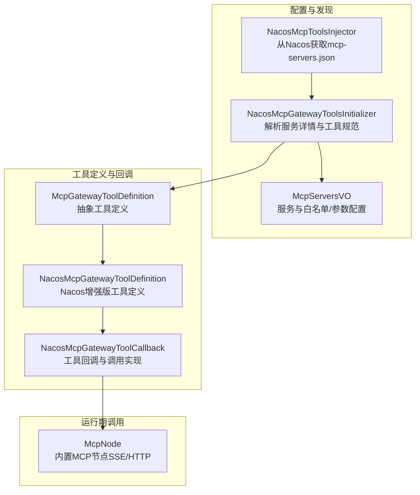
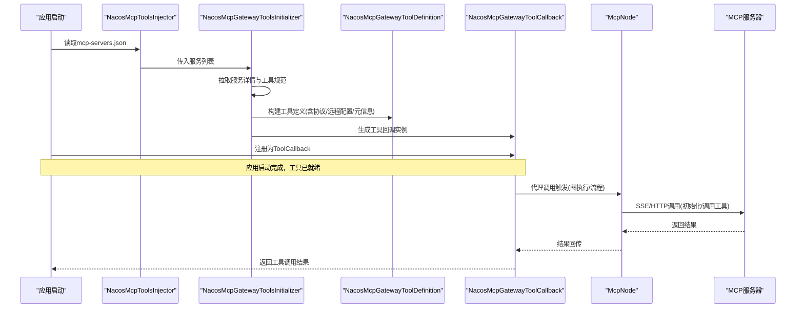
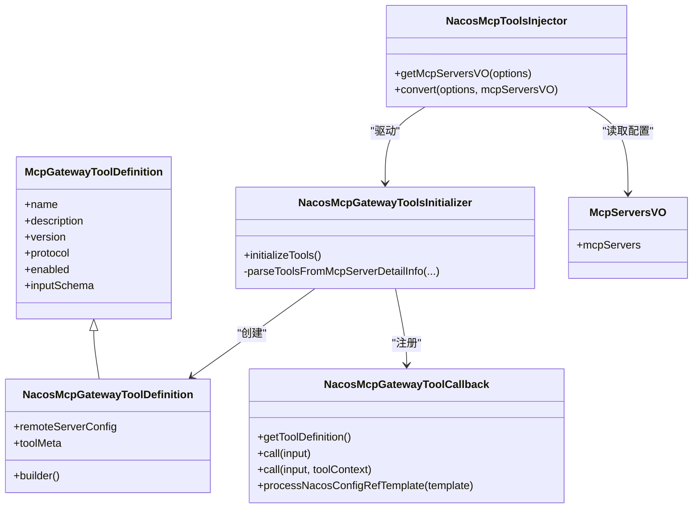
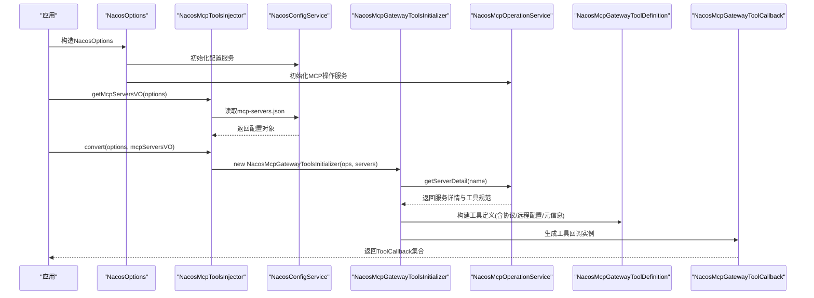
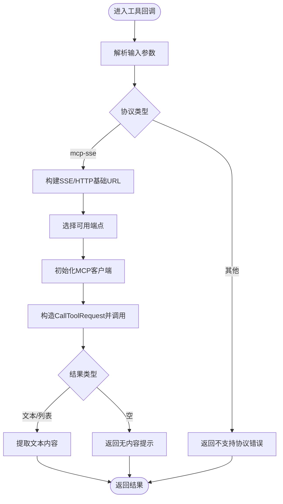
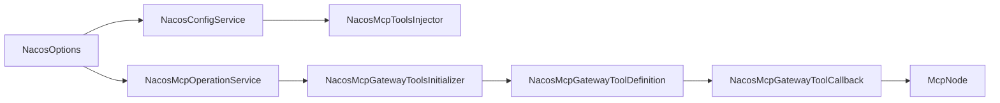

# MCP工具集成

<cite>
**本文引用的文件**
- [McpGatewayToolDefinition.java](file://spring-boot-starters/spring-ai-alibaba-starter-config-nacos/src/main/java/com/alibaba/cloud/ai/agent/nacos/tools/McpGatewayToolDefinition.java)
- [NacosMcpGatewayToolDefinition.java](file://spring-boot-starters/spring-ai-alibaba-starter-config-nacos/src/main/java/com/alibaba/cloud/ai/agent/nacos/tools/NacosMcpGatewayToolDefinition.java)
- [NacosMcpGatewayToolCallback.java](file://spring-boot-starters/spring-ai-alibaba-starter-config-nacos/src/main/java/com/alibaba/cloud/ai/agent/nacos/tools/NacosMcpGatewayToolCallback.java)
- [NacosMcpGatewayToolsInitializer.java](file://spring-boot-starters/spring-ai-alibaba-starter-config-nacos/src/main/java/com/alibaba/cloud/ai/agent/nacos/tools/NacosMcpGatewayToolsInitializer.java)
- [NacosMcpToolsInjector.java](file://spring-boot-starters/spring-ai-alibaba-starter-config-nacos/src/main/java/com/alibaba/cloud/ai/agent/nacos/NacosMcpToolsInjector.java)
- [NacosOptions.java](file://spring-boot-starters/spring-ai-alibaba-starter-config-nacos/src/main/java/com/alibaba/cloud/ai/agent/nacos/NacosOptions.java)
- [McpServersVO.java](file://spring-boot-starters/spring-ai-alibaba-starter-config-nacos/src/main/java/com/alibaba/cloud/ai/agent/nacos/vo/McpServersVO.java)
- [McpNode.java](file://spring-boot-starters/spring-ai-alibaba-starter-builtin-nodes/src/main/java/com/alibaba/cloud/ai/graph/node/McpNode.java)
- [AgentStaticLoader.java（chatbot示例）](file://examples/chatbot/src/main/java/com/alibaba/cloud/ai/examples/chatbot/AgentStaticLoader.java)
</cite>

## 目录
1. [简介](#简介)
2. [项目结构](#项目结构)
3. [核心组件](#核心组件)
4. [架构总览](#架构总览)
5. [详细组件分析](#详细组件分析)
6. [依赖关系分析](#依赖关系分析)
7. [性能与可靠性考量](#性能与可靠性考量)
8. [故障排查指南](#故障排查指南)
9. [结论](#结论)
10. [附录：配置与示例](#附录配置与示例)

## 简介
本指南聚焦于在Spring AI Alibaba生态中集成MCP（Model Context Protocol）工具的高级配置与实践。文档围绕以下目标展开：
- 通过NacosMcpGatewayToolCallback与McpGatewayToolDefinition定义与注册MCP工具；
- 展示这些工具如何扩展代理能力，使其可访问外部MCP服务器与数据源；
- 基于AgentStaticLoader.java中的示例，说明应用启动时如何加载与初始化MCP工具；
- 讨论MCP工具的发现、调用与错误处理机制，并给出安全与可靠性的建议。

## 项目结构
与MCP工具集成相关的核心模块位于“spring-ai-alibaba-starter-config-nacos”与“spring-ai-alibaba-starter-builtin-nodes”。前者负责从Nacos动态拉取MCP服务清单与工具规范，后者提供基于MCP的内置节点以执行工具调用。

图表来源
- [NacosMcpToolsInjector.java](file://spring-boot-starters/spring-ai-alibaba-starter-config-nacos/src/main/java/com/alibaba/cloud/ai/agent/nacos/NacosMcpToolsInjector.java#L31-L54)
- [NacosMcpGatewayToolsInitializer.java](file://spring-boot-starters/spring-ai-alibaba-starter-config-nacos/src/main/java/com/alibaba/cloud/ai/agent/nacos/tools/NacosMcpGatewayToolsInitializer.java#L49-L102)
- [McpServersVO.java](file://spring-boot-starters/spring-ai-alibaba-starter-config-nacos/src/main/java/com/alibaba/cloud/ai/agent/nacos/vo/McpServersVO.java#L1-L92)
- [McpGatewayToolDefinition.java](file://spring-boot-starters/spring-ai-alibaba-starter-config-nacos/src/main/java/com/alibaba/cloud/ai/agent/nacos/tools/McpGatewayToolDefinition.java#L1-L102)
- [NacosMcpGatewayToolDefinition.java](file://spring-boot-starters/spring-ai-alibaba-starter-config-nacos/src/main/java/com/alibaba/cloud/ai/agent/nacos/tools/NacosMcpGatewayToolDefinition.java#L1-L221)
- [NacosMcpGatewayToolCallback.java](file://spring-boot-starters/spring-ai-alibaba-starter-config-nacos/src/main/java/com/alibaba/cloud/ai/agent/nacos/tools/NacosMcpGatewayToolCallback.java#L1-L600)
- [McpNode.java](file://spring-boot-starters/spring-ai-alibaba-starter-builtin-nodes/src/main/java/com/alibaba/cloud/ai/graph/node/McpNode.java#L39-L114)

章节来源
- [NacosMcpToolsInjector.java](file://spring-boot-starters/spring-ai-alibaba-starter-config-nacos/src/main/java/com/alibaba/cloud/ai/agent/nacos/NacosMcpToolsInjector.java#L31-L54)
- [NacosMcpGatewayToolsInitializer.java](file://spring-boot-starters/spring-ai-alibaba-starter-config-nacos/src/main/java/com/alibaba/cloud/ai/agent/nacos/tools/NacosMcpGatewayToolsInitializer.java#L49-L102)
- [McpServersVO.java](file://spring-boot-starters/spring-ai-alibaba-starter-config-nacos/src/main/java/com/alibaba/cloud/ai/agent/nacos/vo/McpServersVO.java#L1-L92)

## 核心组件
- 抽象工具定义：McpGatewayToolDefinition，统一承载工具名称、描述、版本、协议、启用状态与输入Schema等元信息。
- Nacos增强工具定义：NacosMcpGatewayToolDefinition，在抽象基础上增加远程服务配置与工具元信息，便于回调侧直接使用。
- 工具回调：NacosMcpGatewayToolCallback，实现ToolCallback接口，负责将外部MCP工具封装为代理可用的回调实例，支持模板变量替换、Nacos配置引用、MCP SSE调用等。
- 动态初始化器：NacosMcpGatewayToolsInitializer，从Nacos拉取服务详情与工具规范，构建工具定义与回调列表。
- 注入器：NacosMcpToolsInjector，负责从Nacos读取mcp-servers.json并转换为ToolCallback集合。
- 运行期节点：McpNode，提供基于SSE/HTTP的MCP调用能力，用于图执行或流程编排。
- 启动加载示例：AgentStaticLoader（chatbot示例），演示如何在应用启动时加载与注册代理实例（可结合MCP工具回调一并注入）。

章节来源
- [McpGatewayToolDefinition.java](file://spring-boot-starters/spring-ai-alibaba-starter-config-nacos/src/main/java/com/alibaba/cloud/ai/agent/nacos/tools/McpGatewayToolDefinition.java#L1-L102)
- [NacosMcpGatewayToolDefinition.java](file://spring-boot-starters/spring-ai-alibaba-starter-config-nacos/src/main/java/com/alibaba/cloud/ai/agent/nacos/tools/NacosMcpGatewayToolDefinition.java#L1-L221)
- [NacosMcpGatewayToolCallback.java](file://spring-boot-starters/spring-ai-alibaba-starter-config-nacos/src/main/java/com/alibaba/cloud/ai/agent/nacos/tools/NacosMcpGatewayToolCallback.java#L1-L600)
- [NacosMcpGatewayToolsInitializer.java](file://spring-boot-starters/spring-ai-alibaba-starter-config-nacos/src/main/java/com/alibaba/cloud/ai/agent/nacos/tools/NacosMcpGatewayToolsInitializer.java#L49-L102)
- [NacosMcpToolsInjector.java](file://spring-boot-starters/spring-ai-alibaba-starter-config-nacos/src/main/java/com/alibaba/cloud/ai/agent/nacos/NacosMcpToolsInjector.java#L31-L54)
- [McpNode.java](file://spring-boot-starters/spring-ai-alibaba-starter-builtin-nodes/src/main/java/com/alibaba/cloud/ai/graph/node/McpNode.java#L39-L114)
- [AgentStaticLoader.java（chatbot示例）](file://examples/chatbot/src/main/java/com/alibaba/cloud/ai/examples/chatbot/AgentStaticLoader.java#L1-L82)

## 架构总览
下图展示了从Nacos到工具回调再到MCP调用的整体链路。

图表来源
- [NacosMcpToolsInjector.java](file://spring-boot-starters/spring-ai-alibaba-starter-config-nacos/src/main/java/com/alibaba/cloud/ai/agent/nacos/NacosMcpToolsInjector.java#L31-L54)
- [NacosMcpGatewayToolsInitializer.java](file://spring-boot-starters/spring-ai-alibaba-starter-config-nacos/src/main/java/com/alibaba/cloud/ai/agent/nacos/tools/NacosMcpGatewayToolsInitializer.java#L49-L102)
- [NacosMcpGatewayToolDefinition.java](file://spring-boot-starters/spring-ai-alibaba-starter-config-nacos/src/main/java/com/alibaba/cloud/ai/agent/nacos/tools/NacosMcpGatewayToolDefinition.java#L140-L208)
- [NacosMcpGatewayToolCallback.java](file://spring-boot-starters/spring-ai-alibaba-starter-config-nacos/src/main/java/com/alibaba/cloud/ai/agent/nacos/tools/NacosMcpGatewayToolCallback.java#L372-L444)
- [McpNode.java](file://spring-boot-starters/spring-ai-alibaba-starter-builtin-nodes/src/main/java/com/alibaba/cloud/ai/graph/node/McpNode.java#L39-L114)

## 详细组件分析

### 组件A：工具定义与回调（类关系）

图表来源
- [McpGatewayToolDefinition.java](file://spring-boot-starters/spring-ai-alibaba-starter-config-nacos/src/main/java/com/alibaba/cloud/ai/agent/nacos/tools/McpGatewayToolDefinition.java#L1-L102)
- [NacosMcpGatewayToolDefinition.java](file://spring-boot-starters/spring-ai-alibaba-starter-config-nacos/src/main/java/com/alibaba/cloud/ai/agent/nacos/tools/NacosMcpGatewayToolDefinition.java#L1-L221)
- [NacosMcpGatewayToolCallback.java](file://spring-boot-starters/spring-ai-alibaba-starter-config-nacos/src/main/java/com/alibaba/cloud/ai/agent/nacos/tools/NacosMcpGatewayToolCallback.java#L1-L600)
- [NacosMcpGatewayToolsInitializer.java](file://spring-boot-starters/spring-ai-alibaba-starter-config-nacos/src/main/java/com/alibaba/cloud/ai/agent/nacos/tools/NacosMcpGatewayToolsInitializer.java#L49-L102)
- [NacosMcpToolsInjector.java](file://spring-boot-starters/spring-ai-alibaba-starter-config-nacos/src/main/java/com/alibaba/cloud/ai/agent/nacos/NacosMcpToolsInjector.java#L31-L54)
- [McpServersVO.java](file://spring-boot-starters/spring-ai-alibaba-starter-config-nacos/src/main/java/com/alibaba/cloud/ai/agent/nacos/vo/McpServersVO.java#L1-L92)

章节来源
- [McpGatewayToolDefinition.java](file://spring-boot-starters/spring-ai-alibaba-starter-config-nacos/src/main/java/com/alibaba/cloud/ai/agent/nacos/tools/McpGatewayToolDefinition.java#L1-L102)
- [NacosMcpGatewayToolDefinition.java](file://spring-boot-starters/spring-ai-alibaba-starter-config-nacos/src/main/java/com/alibaba/cloud/ai/agent/nacos/tools/NacosMcpGatewayToolDefinition.java#L1-L221)
- [NacosMcpGatewayToolCallback.java](file://spring-boot-starters/spring-ai-alibaba-starter-config-nacos/src/main/java/com/alibaba/cloud/ai/agent/nacos/tools/NacosMcpGatewayToolCallback.java#L1-L600)
- [NacosMcpGatewayToolsInitializer.java](file://spring-boot-starters/spring-ai-alibaba-starter-config-nacos/src/main/java/com/alibaba/cloud/ai/agent/nacos/tools/NacosMcpGatewayToolsInitializer.java#L49-L102)
- [NacosMcpToolsInjector.java](file://spring-boot-starters/spring-ai-alibaba-starter-config-nacos/src/main/java/com/alibaba/cloud/ai/agent/nacos/NacosMcpToolsInjector.java#L31-L54)
- [McpServersVO.java](file://spring-boot-starters/spring-ai-alibaba-starter-config-nacos/src/main/java/com/alibaba/cloud/ai/agent/nacos/vo/McpServersVO.java#L1-L92)

### 组件B：工具发现与注册流程（序列图）

图表来源
- [NacosOptions.java](file://spring-boot-starters/spring-ai-alibaba-starter-config-nacos/src/main/java/com/alibaba/cloud/ai/agent/nacos/NacosOptions.java#L68-L184)
- [NacosMcpToolsInjector.java](file://spring-boot-starters/spring-ai-alibaba-starter-config-nacos/src/main/java/com/alibaba/cloud/ai/agent/nacos/NacosMcpToolsInjector.java#L31-L54)
- [NacosMcpGatewayToolsInitializer.java](file://spring-boot-starters/spring-ai-alibaba-starter-config-nacos/src/main/java/com/alibaba/cloud/ai/agent/nacos/tools/NacosMcpGatewayToolsInitializer.java#L49-L102)
- [NacosMcpGatewayToolDefinition.java](file://spring-boot-starters/spring-ai-alibaba-starter-config-nacos/src/main/java/com/alibaba/cloud/ai/agent/nacos/tools/NacosMcpGatewayToolDefinition.java#L140-L208)
- [NacosMcpGatewayToolCallback.java](file://spring-boot-starters/spring-ai-alibaba-starter-config-nacos/src/main/java/com/alibaba/cloud/ai/agent/nacos/tools/NacosMcpGatewayToolCallback.java#L1-L600)

章节来源
- [NacosOptions.java](file://spring-boot-starters/spring-ai-alibaba-starter-config-nacos/src/main/java/com/alibaba/cloud/ai/agent/nacos/NacosOptions.java#L68-L184)
- [NacosMcpToolsInjector.java](file://spring-boot-starters/spring-ai-alibaba-starter-config-nacos/src/main/java/com/alibaba/cloud/ai/agent/nacos/NacosMcpToolsInjector.java#L31-L54)
- [NacosMcpGatewayToolsInitializer.java](file://spring-boot-starters/spring-ai-alibaba-starter-config-nacos/src/main/java/com/alibaba/cloud/ai/agent/nacos/tools/NacosMcpGatewayToolsInitializer.java#L49-L102)

### 组件C：工具调用与错误处理（流程图）

图表来源
- [NacosMcpGatewayToolCallback.java](file://spring-boot-starters/spring-ai-alibaba-starter-config-nacos/src/main/java/com/alibaba/cloud/ai/agent/nacos/tools/NacosMcpGatewayToolCallback.java#L372-L444)
- [NacosMcpGatewayToolCallback.java](file://spring-boot-starters/spring-ai-alibaba-starter-config-nacos/src/main/java/com/alibaba/cloud/ai/agent/nacos/tools/NacosMcpGatewayToolCallback.java#L461-L542)

章节来源
- [NacosMcpGatewayToolCallback.java](file://spring-boot-starters/spring-ai-alibaba-starter-config-nacos/src/main/java/com/alibaba/cloud/ai/agent/nacos/tools/NacosMcpGatewayToolCallback.java#L372-L444)
- [NacosMcpGatewayToolCallback.java](file://spring-boot-starters/spring-ai-alibaba-starter-config-nacos/src/main/java/com/alibaba/cloud/ai/agent/nacos/tools/NacosMcpGatewayToolCallback.java#L461-L542)

### 组件D：启动时加载与注册（示例）
AgentStaticLoader（chatbot示例）展示了如何在应用启动时加载代理实例并进行注册。结合MCP工具回调，可在应用启动阶段完成工具的动态注入与注册，使代理具备访问外部MCP服务的能力。

章节来源
- [AgentStaticLoader.java（chatbot示例）](file://examples/chatbot/src/main/java/com/alibaba/cloud/ai/examples/chatbot/AgentStaticLoader.java#L1-L82)

## 依赖关系分析
- 组件内聚与耦合
  - McpGatewayToolDefinition与NacosMcpGatewayToolDefinition形成清晰的继承关系，前者提供抽象契约，后者承载Nacos特有元信息，降低上层对具体实现的耦合。
  - NacosMcpGatewayToolsInitializer与NacosMcpToolsInjector职责分离：前者专注工具发现与构建，后者专注配置读取与转换，提升可测试性与可维护性。
- 外部依赖
  - NacosConfigService与NacosMcpOperationService分别负责配置与MCP服务发现，二者通过NacosOptions注入。
  - McpNode依赖MCP客户端库（SSE/HTTP）进行远端调用，协议类型由工具定义中的protocol字段决定。

图表来源
- [NacosOptions.java](file://spring-boot-starters/spring-ai-alibaba-starter-config-nacos/src/main/java/com/alibaba/cloud/ai/agent/nacos/NacosOptions.java#L68-L184)
- [NacosMcpToolsInjector.java](file://spring-boot-starters/spring-ai-alibaba-starter-config-nacos/src/main/java/com/alibaba/cloud/ai/agent/nacos/NacosMcpToolsInjector.java#L31-L54)
- [NacosMcpGatewayToolsInitializer.java](file://spring-boot-starters/spring-ai-alibaba-starter-config-nacos/src/main/java/com/alibaba/cloud/ai/agent/nacos/tools/NacosMcpGatewayToolsInitializer.java#L49-L102)
- [NacosMcpGatewayToolDefinition.java](file://spring-boot-starters/spring-ai-alibaba-starter-config-nacos/src/main/java/com/alibaba/cloud/ai/agent/nacos/tools/NacosMcpGatewayToolDefinition.java#L140-L208)
- [NacosMcpGatewayToolCallback.java](file://spring-boot-starters/spring-ai-alibaba-starter-config-nacos/src/main/java/com/alibaba/cloud/ai/agent/nacos/tools/NacosMcpGatewayToolCallback.java#L1-L600)
- [McpNode.java](file://spring-boot-starters/spring-ai-alibaba-starter-builtin-nodes/src/main/java/com/alibaba/cloud/ai/graph/node/McpNode.java#L39-L114)

章节来源
- [NacosOptions.java](file://spring-boot-starters/spring-ai-alibaba-starter-config-nacos/src/main/java/com/alibaba/cloud/ai/agent/nacos/NacosOptions.java#L68-L184)
- [NacosMcpToolsInjector.java](file://spring-boot-starters/spring-ai-alibaba-starter-config-nacos/src/main/java/com/alibaba/cloud/ai/agent/nacos/NacosMcpToolsInjector.java#L31-L54)
- [NacosMcpGatewayToolsInitializer.java](file://spring-boot-starters/spring-ai-alibaba-starter-config-nacos/src/main/java/com/alibaba/cloud/ai/agent/nacos/tools/NacosMcpGatewayToolsInitializer.java#L49-L102)
- [NacosMcpGatewayToolDefinition.java](file://spring-boot-starters/spring-ai-alibaba-starter-config-nacos/src/main/java/com/alibaba/cloud/ai/agent/nacos/tools/NacosMcpGatewayToolDefinition.java#L140-L208)
- [NacosMcpGatewayToolCallback.java](file://spring-boot-starters/spring-ai-alibaba-starter-config-nacos/src/main/java/com/alibaba/cloud/ai/agent/nacos/tools/NacosMcpGatewayToolCallback.java#L1-L600)
- [McpNode.java](file://spring-boot-starters/spring-ai-alibaba-starter-builtin-nodes/src/main/java/com/alibaba/cloud/ai/graph/node/McpNode.java#L39-L114)

## 性能与可靠性考量
- 协议与传输
  - 当protocol为mcp-sse时，回调会通过SSE建立连接并调用工具；当为http/https时，可通过McpNode进行SSE/HTTP调用。合理选择协议有助于降低延迟与提高吞吐。
- 端点选择与重试
  - 回调在调用前会依据服务引用选择可用端点；若无可用端点，应记录错误并返回明确提示，避免静默失败。
- 输入解析与模板替换
  - 回调对输入进行参数解析与模板替换，包括对Nacos配置引用的解析。建议在配置层面减少不必要的复杂模板，以降低解析开销。
- 资源清理
  - 回调在关闭时移除Nacos监听器，避免资源泄漏；同时在SSE调用后及时关闭客户端，确保连接池健康。

[本节为通用指导，无需特定文件来源]

## 故障排查指南
- 配置读取失败
  - 现象：无法从Nacos读取mcp-servers.json或服务详情为空。
  - 排查要点：确认dataId命名规则（支持加密前缀）、group与agentName是否正确；检查NacosOptions中命名空间与标签设置。
  - 参考位置
    - [NacosMcpToolsInjector.java](file://spring-boot-starters/spring-ai-alibaba-starter-config-nacos/src/main/java/com/alibaba/cloud/ai/agent/nacos/NacosMcpToolsInjector.java#L31-L54)
    - [NacosOptions.java](file://spring-boot-starters/spring-ai-alibaba-starter-config-nacos/src/main/java/com/alibaba/cloud/ai/agent/nacos/NacosOptions.java#L68-L184)
- 工具未被发现或被过滤
  - 现象：工具列表为空或某些工具未出现。
  - 排查要点：检查McpServersVO中的whiteTools白名单；确认工具meta信息的enabled状态；核对协议类型是否受支持。
  - 参考位置
    - [NacosMcpGatewayToolsInitializer.java](file://spring-boot-starters/spring-ai-alibaba-starter-config-nacos/src/main/java/com/alibaba/cloud/ai/agent/nacos/tools/NacosMcpGatewayToolsInitializer.java#L90-L135)
    - [McpServersVO.java](file://spring-boot-starters/spring-ai-alibaba-starter-config-nacos/src/main/java/com/alibaba/cloud/ai/agent/nacos/vo/McpServersVO.java#L1-L92)
- 调用失败或协议不支持
  - 现象：工具调用返回错误或提示协议不支持。
  - 排查要点：确认protocol字段与当前实现支持的协议一致；检查远程服务配置与端点可达性；查看回调日志中的错误堆栈。
  - 参考位置
    - [NacosMcpGatewayToolCallback.java](file://spring-boot-starters/spring-ai-alibaba-starter-config-nacos/src/main/java/com/alibaba/cloud/ai/agent/nacos/tools/NacosMcpGatewayToolCallback.java#L372-L444)
    - [NacosMcpGatewayToolCallback.java](file://spring-boot-starters/spring-ai-alibaba-starter-config-nacos/src/main/java/com/alibaba/cloud/ai/agent/nacos/tools/NacosMcpGatewayToolCallback.java#L461-L542)
- Nacos配置引用解析异常
  - 现象：模板中{{ ${nacos.dataId/group} }}或点语法解析失败。
  - 排查要点：确认dataId/group格式正确；检查配置内容是否为有效JSON；点语法路径是否存在。
  - 参考位置
    - [NacosMcpGatewayToolCallback.java](file://spring-boot-starters/spring-ai-alibaba-starter-config-nacos/src/main/java/com/alibaba/cloud/ai/agent/nacos/tools/NacosMcpGatewayToolCallback.java#L102-L165)
    - [NacosMcpGatewayToolCallback.java](file://spring-boot-starters/spring-ai-alibaba-starter-config-nacos/src/main/java/com/alibaba/cloud/ai/agent/nacos/tools/NacosMcpGatewayToolCallback.java#L200-L254)

章节来源
- [NacosMcpToolsInjector.java](file://spring-boot-starters/spring-ai-alibaba-starter-config-nacos/src/main/java/com/alibaba/cloud/ai/agent/nacos/NacosMcpToolsInjector.java#L31-L54)
- [NacosOptions.java](file://spring-boot-starters/spring-ai-alibaba-starter-config-nacos/src/main/java/com/alibaba/cloud/ai/agent/nacos/NacosOptions.java#L68-L184)
- [NacosMcpGatewayToolsInitializer.java](file://spring-boot-starters/spring-ai-alibaba-starter-config-nacos/src/main/java/com/alibaba/cloud/ai/agent/nacos/tools/NacosMcpGatewayToolsInitializer.java#L90-L135)
- [McpServersVO.java](file://spring-boot-starters/spring-ai-alibaba-starter-config-nacos/src/main/java/com/alibaba/cloud/ai/agent/nacos/vo/McpServersVO.java#L1-L92)
- [NacosMcpGatewayToolCallback.java](file://spring-boot-starters/spring-ai-alibaba-starter-config-nacos/src/main/java/com/alibaba/cloud/ai/agent/nacos/tools/NacosMcpGatewayToolCallback.java#L102-L165)
- [NacosMcpGatewayToolCallback.java](file://spring-boot-starters/spring-ai-alibaba-starter-config-nacos/src/main/java/com/alibaba/cloud/ai/agent/nacos/tools/NacosMcpGatewayToolCallback.java#L200-L254)
- [NacosMcpGatewayToolCallback.java](file://spring-boot-starters/spring-ai-alibaba-starter-config-nacos/src/main/java/com/alibaba/cloud/ai/agent/nacos/tools/NacosMcpGatewayToolCallback.java#L372-L444)
- [NacosMcpGatewayToolCallback.java](file://spring-boot-starters/spring-ai-alibaba-starter-config-nacos/src/main/java/com/alibaba/cloud/ai/agent/nacos/tools/NacosMcpGatewayToolCallback.java#L461-L542)

## 结论
通过上述组件与流程，MCP工具得以在Spring AI Alibaba中实现从Nacos动态发现、定义、注册到调用的全链路闭环。借助NacosMcpGatewayToolDefinition与NacosMcpGatewayToolCallback，代理可以灵活地访问外部MCP服务；配合NacosMcpGatewayToolsInitializer与NacosMcpToolsInjector，能够在应用启动阶段完成工具的初始化与注入。运行期通过McpNode或回调实现SSE/HTTP调用，保障了工具调用的灵活性与可扩展性。

[本节为总结性内容，无需特定文件来源]

## 附录：配置与示例
- 配置项与来源
  - mcp-servers.json：由NacosMcpToolsInjector从Nacos读取，包含服务列表、版本、白名单与请求头/查询参数等。
  - NacosOptions：负责初始化NacosConfigService与NacosMcpOperationService，并设置命名空间与标签。
  - McpServersVO：封装mcp-servers.json的结构化对象，便于后续解析与过滤。
- 启动加载示例
  - AgentStaticLoader（chatbot示例）展示了如何在应用启动时加载代理实例并进行注册，可结合MCP工具回调一并注入，使代理具备访问外部MCP服务的能力。

章节来源
- [NacosMcpToolsInjector.java](file://spring-boot-starters/spring-ai-alibaba-starter-config-nacos/src/main/java/com/alibaba/cloud/ai/agent/nacos/NacosMcpToolsInjector.java#L31-L54)
- [NacosOptions.java](file://spring-boot-starters/spring-ai-alibaba-starter-config-nacos/src/main/java/com/alibaba/cloud/ai/agent/nacos/NacosOptions.java#L68-L184)
- [McpServersVO.java](file://spring-boot-starters/spring-ai-alibaba-starter-config-nacos/src/main/java/com/alibaba/cloud/ai/agent/nacos/vo/McpServersVO.java#L1-L92)
- [AgentStaticLoader.java（chatbot示例）](file://examples/chatbot/src/main/java/com/alibaba/cloud/ai/examples/chatbot/AgentStaticLoader.java#L1-L82)