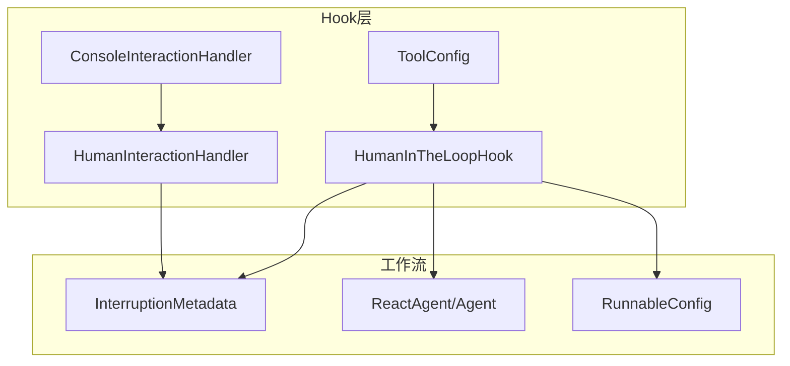
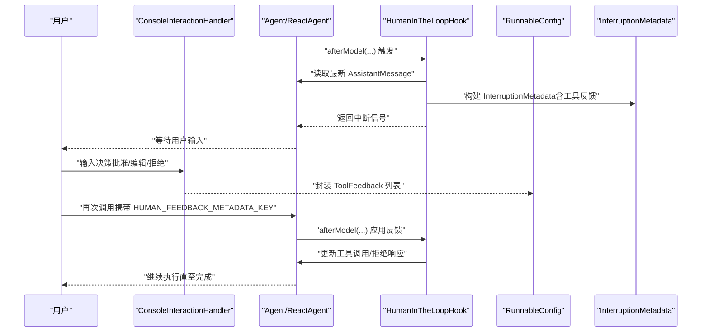
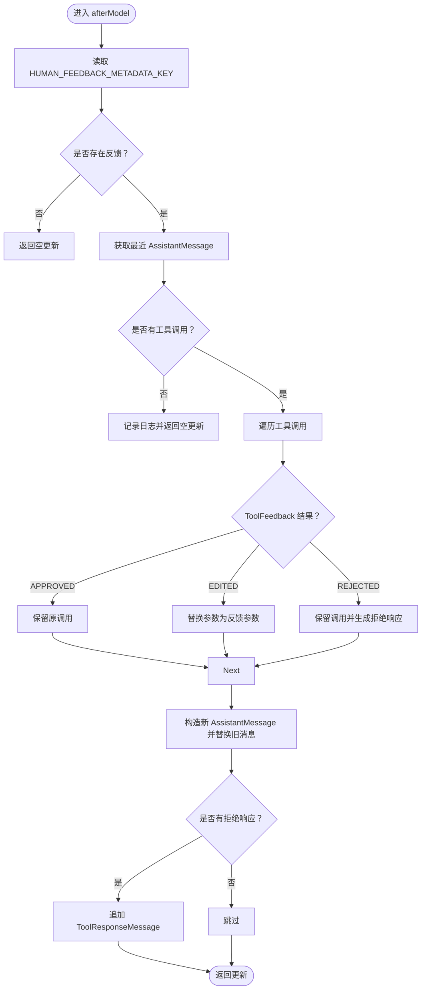
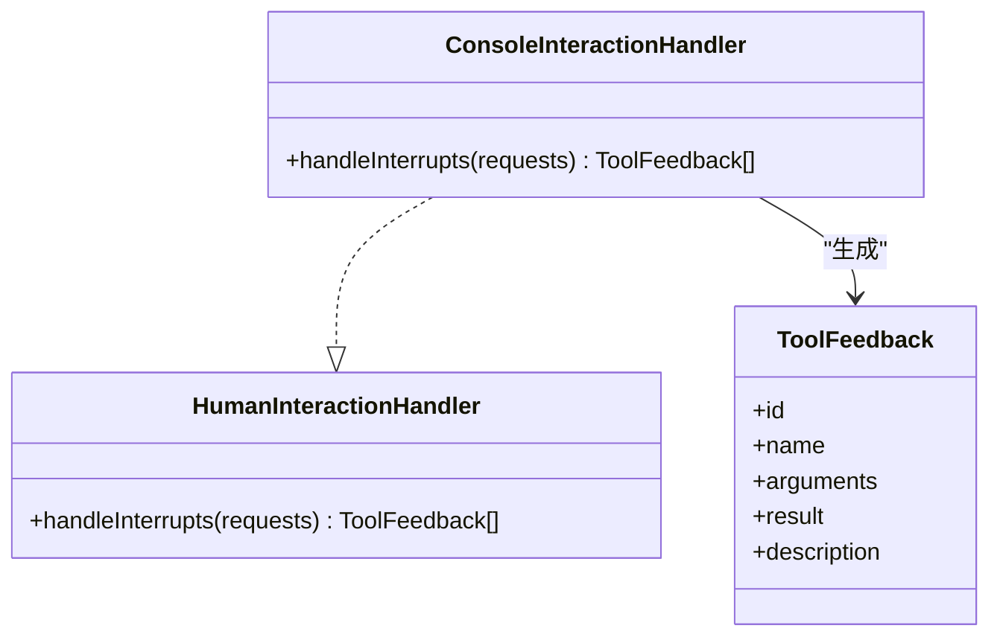
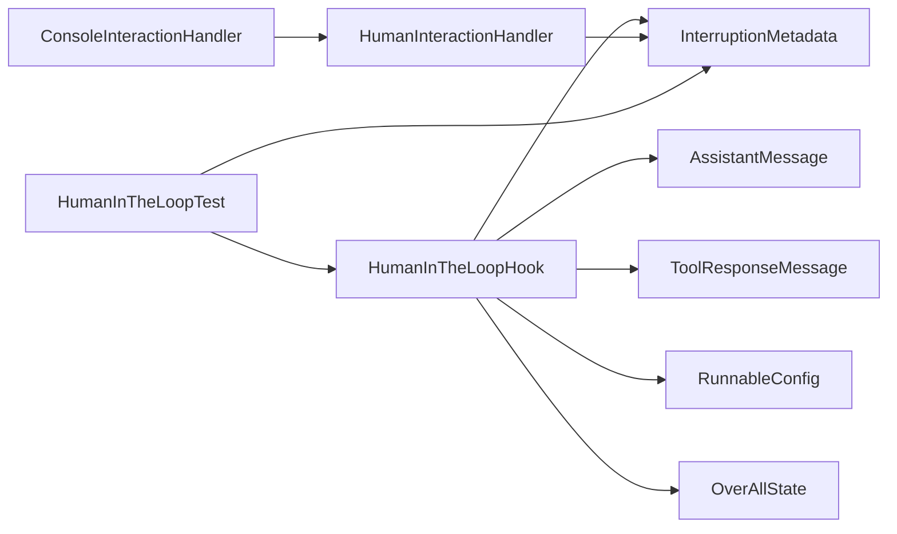

# 人机交互

<cite>
**本文引用的文件列表**
- [HumanInTheLoopHook.java](file://spring-ai-alibaba-agent-framework/src/main/java/com/alibaba/cloud/ai/graph/agent/hook/hip/HumanInTheLoopHook.java)
- [ConsoleInteractionHandler.java](file://spring-ai-alibaba-agent-framework/src/main/java/com/alibaba/cloud/ai/graph/agent/hook/hip/ConsoleInteractionHandler.java)
- [HumanInteractionHandler.java](file://spring-ai-alibaba-agent-framework/src/main/java/com/alibaba/cloud/ai/graph/agent/hook/hip/HumanInteractionHandler.java)
- [ToolConfig.java](file://spring-ai-alibaba-agent-framework/src/main/java/com/alibaba/cloud/ai/graph/agent/hook/hip/ToolConfig.java)
- [InterruptionMetadata.java](file://spring-ai-alibaba-graph-core/src/main/java/com/alibaba/cloud/ai/graph/action/InterruptionMetadata.java)
- [HumanInTheLoopExample.java（文档示例）](file://examples/documentation/src/main/java/com/alibaba/cloud/ai/examples/documentation/graph/examples/HumanInTheLoopExample.java)
- [HumanInTheLoopExample.java（高级示例）](file://examples/documentation/src/main/java/com/alibaba/cloud/ai/examples/documentation/framework/advanced/HumanInTheLoopExample.java)
- [HumanInTheLoopTest.java](file://spring-ai-alibaba-agent-framework/src/test/java/com/alibaba/cloud/ai/graph/agent/hooks/hip/HumanInTheLoopTest.java)
</cite>

## 目录
1. [简介](#简介)
2. [项目结构与定位](#项目结构与定位)
3. [核心组件](#核心组件)
4. [架构总览](#架构总览)
5. [详细组件分析](#详细组件分析)
6. [依赖关系分析](#依赖关系分析)
7. [性能与可靠性考量](#性能与可靠性考量)
8. [故障排查指南](#故障排查指南)
9. [结论](#结论)
10. [附录：配置与使用要点](#附录配置与使用要点)

## 简介
本章节系统性阐述“人机交互（Human-in-the-Loop, HITL）”在该代码库中的实现机制，重点围绕以下目标展开：
- 解释 HumanInTheLoopHook 如何在代理执行流程中插入中断点，暂停自动化流程并等待用户输入或确认；
- 说明 ConsoleInteractionHandler 如何处理用户反馈并将其重新注入工作流；
- 基于 HumanInTheLoopExample.java 展示典型应用场景（如敏感操作确认、模糊决策辅助等）；
- 讨论该机制在提升系统可靠性与安全性方面的作用，并给出触发条件与超时策略的配置建议。

## 项目结构与定位
- 人机交互能力主要位于 agent 框架的 hook 子模块中，核心类包括 HumanInTheLoopHook、ConsoleInteractionHandler、HumanInteractionHandler、ToolConfig；
- 工作流中断与恢复的关键数据结构为 InterruptionMetadata，用于携带中断时的上下文、节点信息及工具反馈；
- 文档示例与测试覆盖了两种中断模式：基于 InterruptionMetadata 的可中断节点模式、以及基于 interruptBefore 的预设中断点模式。

图表来源
- [HumanInTheLoopHook.java](file://spring-ai-alibaba-agent-framework/src/main/java/com/alibaba/cloud/ai/graph/agent/hook/hip/HumanInTheLoopHook.java#L47-L306)
- [ConsoleInteractionHandler.java](file://spring-ai-alibaba-agent-framework/src/main/java/com/alibaba/cloud/ai/graph/agent/hook/hip/ConsoleInteractionHandler.java#L24-L49)
- [HumanInteractionHandler.java](file://spring-ai-alibaba-agent-framework/src/main/java/com/alibaba/cloud/ai/graph/agent/hook/hip/HumanInteractionHandler.java#L22-L25)
- [ToolConfig.java](file://spring-ai-alibaba-agent-framework/src/main/java/com/alibaba/cloud/ai/graph/agent/hook/hip/ToolConfig.java#L18-L54)
- [InterruptionMetadata.java](file://spring-ai-alibaba-graph-core/src/main/java/com/alibaba/cloud/ai/graph/action/InterruptionMetadata.java#L38-L293)

章节来源
- [HumanInTheLoopHook.java](file://spring-ai-alibaba-agent-framework/src/main/java/com/alibaba/cloud/ai/graph/agent/hook/hip/HumanInTheLoopHook.java#L47-L306)
- [HumanInTheLoopExample.java（文档示例）](file://examples/documentation/src/main/java/com/alibaba/cloud/ai/examples/documentation/graph/examples/HumanInTheLoopExample.java#L1-L449)

## 核心组件
- HumanInTheLoopHook：在模型调用之后阶段进行拦截，根据配置的工具白名单生成中断请求（InterruptionMetadata），并在恢复时将用户反馈转换为新的工具调用集合或拒绝响应。
- ConsoleInteractionHandler：提供命令行交互界面，收集用户对每个工具调用的“批准/编辑/拒绝”决策，并封装为 ToolFeedback 列表。
- HumanInteractionHandler：交互处理器接口，支持扩展其他交互渠道（如图形界面、消息队列等）。
- ToolConfig：工具级配置，用于描述工具用途与审批提示。
- InterruptionMetadata：不可变的中断元数据，承载节点ID、状态快照、工具自动批准列表与逐个工具的反馈结果。

章节来源
- [HumanInTheLoopHook.java](file://spring-ai-alibaba-agent-framework/src/main/java/com/alibaba/cloud/ai/graph/agent/hook/hip/HumanInTheLoopHook.java#L47-L306)
- [ConsoleInteractionHandler.java](file://spring-ai-alibaba-agent-framework/src/main/java/com/alibaba/cloud/ai/graph/agent/hook/hip/ConsoleInteractionHandler.java#L24-L49)
- [HumanInteractionHandler.java](file://spring-ai-alibaba-agent-framework/src/main/java/com/alibaba/cloud/ai/graph/agent/hook/hip/HumanInteractionHandler.java#L22-L25)
- [ToolConfig.java](file://spring-ai-alibaba-agent-framework/src/main/java/com/alibaba/cloud/ai/graph/agent/hook/hip/ToolConfig.java#L18-L54)
- [InterruptionMetadata.java](file://spring-ai-alibaba-graph-core/src/main/java/com/alibaba/cloud/ai/graph/action/InterruptionMetadata.java#L38-L293)

## 架构总览
HumanInTheLoopHook 通过 Hook 机制在模型调用后阶段介入，识别最近一条 AssistantMessage 中的工具调用，按需构建 InterruptionMetadata 并中断执行；当用户通过 ConsoleInteractionHandler 或其他 HumanInteractionHandler 提供反馈后，系统将反馈写回 RunnableConfig 的元数据键，再次运行以应用“批准/编辑/拒绝”的决策。

图表来源
- [HumanInTheLoopHook.java](file://spring-ai-alibaba-agent-framework/src/main/java/com/alibaba/cloud/ai/graph/agent/hook/hip/HumanInTheLoopHook.java#L66-L145)
- [ConsoleInteractionHandler.java](file://spring-ai-alibaba-agent-framework/src/main/java/com/alibaba/cloud/ai/graph/agent/hook/hip/ConsoleInteractionHandler.java#L24-L49)
- [InterruptionMetadata.java](file://spring-ai-alibaba-graph-core/src/main/java/com/alibaba/cloud/ai/graph/action/InterruptionMetadata.java#L120-L193)
- [HumanInTheLoopExample.java（文档示例）](file://examples/documentation/src/main/java/com/alibaba/cloud/ai/examples/documentation/graph/examples/HumanInTheLoopExample.java#L118-L193)

## 详细组件分析

### HumanInTheLoopHook 分析
- 触发位置与职责
  - 注解声明在模型调用之后阶段介入；
  - 在 afterModel 中从 RunnableConfig 元数据中提取 HUMAN_FEEDBACK_METADATA_KEY 对应的 InterruptionMetadata；
  - 若无反馈则直接返回空更新；若有反馈且存在最近的 AssistantMessage，则根据 ToolFeedback 的结果（批准/编辑/拒绝）重写工具调用列表，并在必要时追加 ToolResponseMessage 以记录拒绝原因。
- 中断构建与校验
  - interrupt 方法在需要时构建 InterruptionMetadata，仅对 approvalOn 中配置的工具生成反馈项；
  - validateFeedback 校验每项工具调用是否都有对应反馈且结果非空，缺失或空结果会继续等待用户输入；
  - 未匹配的反馈会被记录为忽略警告，避免误用。
- 关键行为
  - 获取最近 AssistantMessage 的工具调用；
  - 将 APPROVED 保持原调用、EDITED 替换参数、REJECTED 记录拒绝响应；
  - 通过状态更新 messages 字段替换最后一条 AssistantMessage，并追加 ToolResponseMessage（如有）。

图表来源
- [HumanInTheLoopHook.java](file://spring-ai-alibaba-agent-framework/src/main/java/com/alibaba/cloud/ai/graph/agent/hook/hip/HumanInTheLoopHook.java#L66-L145)
- [InterruptionMetadata.java](file://spring-ai-alibaba-graph-core/src/main/java/com/alibaba/cloud/ai/graph/action/InterruptionMetadata.java#L195-L293)

章节来源
- [HumanInTheLoopHook.java](file://spring-ai-alibaba-agent-framework/src/main/java/com/alibaba/cloud/ai/graph/agent/hook/hip/HumanInTheLoopHook.java#L66-L145)
- [HumanInTheLoopHook.java](file://spring-ai-alibaba-agent-framework/src/main/java/com/alibaba/cloud/ai/graph/agent/hook/hip/HumanInTheLoopHook.java#L147-L211)
- [HumanInTheLoopHook.java](file://spring-ai-alibaba-agent-framework/src/main/java/com/alibaba/cloud/ai/graph/agent/hook/hip/HumanInTheLoopHook.java#L213-L269)

### ConsoleInteractionHandler 与 HumanInteractionHandler
- HumanInteractionHandler 是统一的交互接口，支持多种实现；
- ConsoleInteractionHandler 提供命令行交互，逐个工具询问用户选择（accept/approve、edit、respond/reject），并将结果封装为 ToolFeedback 列表返回。

图表来源
- [HumanInteractionHandler.java](file://spring-ai-alibaba-agent-framework/src/main/java/com/alibaba/cloud/ai/graph/agent/hook/hip/HumanInteractionHandler.java#L22-L25)
- [ConsoleInteractionHandler.java](file://spring-ai-alibaba-agent-framework/src/main/java/com/alibaba/cloud/ai/graph/agent/hook/hip/ConsoleInteractionHandler.java#L24-L49)
- [InterruptionMetadata.java](file://spring-ai-alibaba-graph-core/src/main/java/com/alibaba/cloud/ai/graph/action/InterruptionMetadata.java#L195-L293)

章节来源
- [ConsoleInteractionHandler.java](file://spring-ai-alibaba-agent-framework/src/main/java/com/alibaba/cloud/ai/graph/agent/hook/hip/ConsoleInteractionHandler.java#L24-L49)
- [HumanInteractionHandler.java](file://spring-ai-alibaba-agent-framework/src/main/java/com/alibaba/cloud/ai/graph/agent/hook/hip/HumanInteractionHandler.java#L22-L25)

### 工具配置与审批范围
- ToolConfig 支持为工具设置描述信息，HumanInTheLoopHook 仅对 approvalOn 中登记的工具生成中断请求；
- Builder 提供字符串描述与对象配置两种方式，便于灵活组合。

章节来源
- [ToolConfig.java](file://spring-ai-alibaba-agent-framework/src/main/java/com/alibaba/cloud/ai/graph/agent/hook/hip/ToolConfig.java#L18-L54)
- [HumanInTheLoopHook.java](file://spring-ai-alibaba-agent-framework/src/main/java/com/alibaba/cloud/ai/graph/agent/hook/hip/HumanInTheLoopHook.java#L281-L306)

### 文档示例与应用场景
- 文档示例 HumanInTheLoopExample 展示两类中断模式：
  - InterruptionMetadata 模式：通过实现 InterruptableAction 在任意节点中断，无需 interruptBefore 配置；
  - interruptBefore 模式：在编译配置中指定节点前中断，适合固定流程节点的人工确认。
- 高级示例 HumanInTheLoopExample（framework/advanced）展示了：
  - 为敏感工具（如文件写入、SQL 执行）配置审批；
  - 用户批准、编辑参数、拒绝三种决策的完整恢复流程；
  - 多轮工具调用的分批审批与混合决策处理。

章节来源
- [HumanInTheLoopExample.java（文档示例）](file://examples/documentation/src/main/java/com/alibaba/cloud/ai/examples/documentation/graph/examples/HumanInTheLoopExample.java#L57-L112)
- [HumanInTheLoopExample.java（文档示例）](file://examples/documentation/src/main/java/com/alibaba/cloud/ai/examples/documentation/graph/examples/HumanInTheLoopExample.java#L195-L314)
- [HumanInTheLoopExample.java（高级示例）](file://examples/documentation/src/main/java/com/alibaba/cloud/ai/examples/documentation/framework/advanced/HumanInTheLoopExample.java#L173-L218)
- [HumanInTheLoopExample.java（高级示例）](file://examples/documentation/src/main/java/com/alibaba/cloud/ai/examples/documentation/framework/advanced/HumanInTheLoopExample.java#L220-L305)
- [HumanInTheLoopExample.java（高级示例）](file://examples/documentation/src/main/java/com/alibaba/cloud/ai/examples/documentation/framework/advanced/HumanInTheLoopExample.java#L307-L332)

## 依赖关系分析
- HumanInTheLoopHook 依赖：
  - InterruptionMetadata：用于构建与校验中断反馈；
  - AssistantMessage/ToolResponseMessage：用于更新消息历史；
  - RunnableConfig：用于读取/移除 HUMAN_FEEDBACK_METADATA_KEY；
  - OverAllState：用于读取消息序列并定位最近的 AssistantMessage。
- ConsoleInteractionHandler 依赖 HumanInteractionHandler 接口，面向未来扩展其他交互实现；
- 测试用例 HumanInTheLoopTest 覆盖了批准、编辑、拒绝、多工具、多轮中断等场景，验证 validateFeedback 与恢复执行的正确性。

图表来源
- [HumanInTheLoopHook.java](file://spring-ai-alibaba-agent-framework/src/main/java/com/alibaba/cloud/ai/graph/agent/hook/hip/HumanInTheLoopHook.java#L66-L145)
- [InterruptionMetadata.java](file://spring-ai-alibaba-graph-core/src/main/java/com/alibaba/cloud/ai/graph/action/InterruptionMetadata.java#L38-L293)
- [HumanInTheLoopTest.java](file://spring-ai-alibaba-agent-framework/src/test/java/com/alibaba/cloud/ai/graph/agent/hooks/hip/HumanInTheLoopTest.java#L1-L678)

章节来源
- [HumanInTheLoopHook.java](file://spring-ai-alibaba-agent-framework/src/main/java/com/alibaba/cloud/ai/graph/agent/hook/hip/HumanInTheLoopHook.java#L66-L145)
- [HumanInTheLoopTest.java](file://spring-ai-alibaba-agent-framework/src/test/java/com/alibaba/cloud/ai/graph/agent/hooks/hip/HumanInTheLoopTest.java#L1-L678)

## 性能与可靠性考量
- 性能特性
  - HumanInTheLoopHook 在 afterModel 阶段进行消息解析与反馈校验，属于轻量计算，开销主要来自消息序列扫描与反馈列表构建；
  - validateFeedback 会对每个需要审批的工具逐一比对，若工具较多，建议合理拆分工具调用，减少单次中断反馈数量。
- 可靠性保障
  - 未提供反馈或反馈结果为空时，系统会继续中断等待，避免误执行；
  - 对多余或不匹配的反馈进行告警，防止误用；
  - 支持工具拒绝时生成 ToolResponseMessage，便于后续可观测与审计。
- 可扩展性
  - 通过 HumanInteractionHandler 接口可接入 GUI、消息队列等不同交互通道；
  - ToolConfig 支持为工具附加描述，便于用户决策。

[本节为通用指导，不直接分析具体文件]

## 故障排查指南
- 常见问题与定位
  - “未找到人类反馈元数据”：确认在恢复执行时是否正确添加 HUMAN_FEEDBACK_METADATA_KEY；
  - “缺少工具反馈或结果为空”：validateFeedback 会记录警告并继续等待，检查 ConsoleInteractionHandler 是否完整收集；
  - “工具名称或ID不匹配”：validateFeedback 会忽略不匹配的反馈，确保工具名与ID与 AssistantMessage 中一致；
  - “中断未发生”：确认 HumanInTheLoopHook 的 approvalOn 是否包含相关工具，或中断节点是否正确配置。
- 测试参考
  - HumanInTheLoopTest 覆盖批准/编辑/拒绝、多工具、多轮中断、混合决策等场景，可对照定位问题。

章节来源
- [HumanInTheLoopHook.java](file://spring-ai-alibaba-agent-framework/src/main/java/com/alibaba/cloud/ai/graph/agent/hook/hip/HumanInTheLoopHook.java#L147-L211)
- [HumanInTheLoopHook.java](file://spring-ai-alibaba-agent-framework/src/main/java/com/alibaba/cloud/ai/graph/agent/hook/hip/HumanInTheLoopHook.java#L213-L269)
- [HumanInTheLoopTest.java](file://spring-ai-alibaba-agent-framework/src/test/java/com/alibaba/cloud/ai/graph/agent/hooks/hip/HumanInTheLoopTest.java#L1-L678)

## 结论
HumanInTheLoopHook 通过在模型调用后阶段插入中断点，结合 InterruptionMetadata 与 HumanInteractionHandler，实现了对工具调用的可控审批与反馈注入。该机制在保障安全与合规的同时，提升了系统的可解释性与可恢复性。文档示例与测试用例覆盖了典型场景，便于快速落地。

[本节为总结性内容，不直接分析具体文件]

## 附录：配置与使用要点
- 触发条件
  - 通过 HumanInTheLoopHook.Builder 的 approvalOn 指定需要人工审批的工具名与描述；
  - 在 ReactAgent/Agent 中注册 HumanInTheLoopHook；
  - 使用 MemorySaver 等检查点保存器以支持中断恢复。
- 恢复执行
  - 首次调用可能返回 InterruptionMetadata；
  - 用户通过 ConsoleInteractionHandler 或自定义 HumanInteractionHandler 提供 ToolFeedback；
  - 再次调用时在 RunnableConfig 中添加 HUMAN_FEEDBACK_METADATA_KEY，系统将应用“批准/编辑/拒绝”决策并继续执行。
- 超时策略
  - 代码库未内置超时钩子，可在上层应用侧结合外部调度或会话管理实现超时控制（例如在 UI 层限制等待时间并清理会话）。

章节来源
- [HumanInTheLoopHook.java](file://spring-ai-alibaba-agent-framework/src/main/java/com/alibaba/cloud/ai/graph/agent/hook/hip/HumanInTheLoopHook.java#L281-L306)
- [HumanInTheLoopExample.java（文档示例）](file://examples/documentation/src/main/java/com/alibaba/cloud/ai/examples/documentation/graph/examples/HumanInTheLoopExample.java#L118-L193)
- [HumanInTheLoopExample.java（高级示例）](file://examples/documentation/src/main/java/com/alibaba/cloud/ai/examples/documentation/framework/advanced/HumanInTheLoopExample.java#L220-L305)