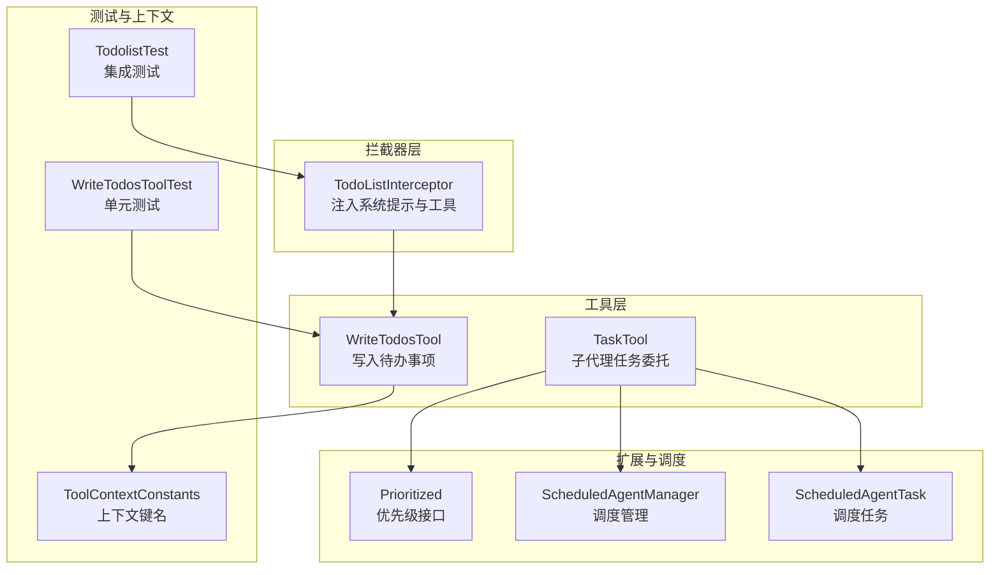
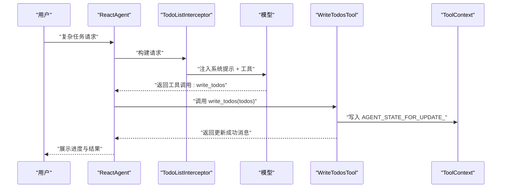
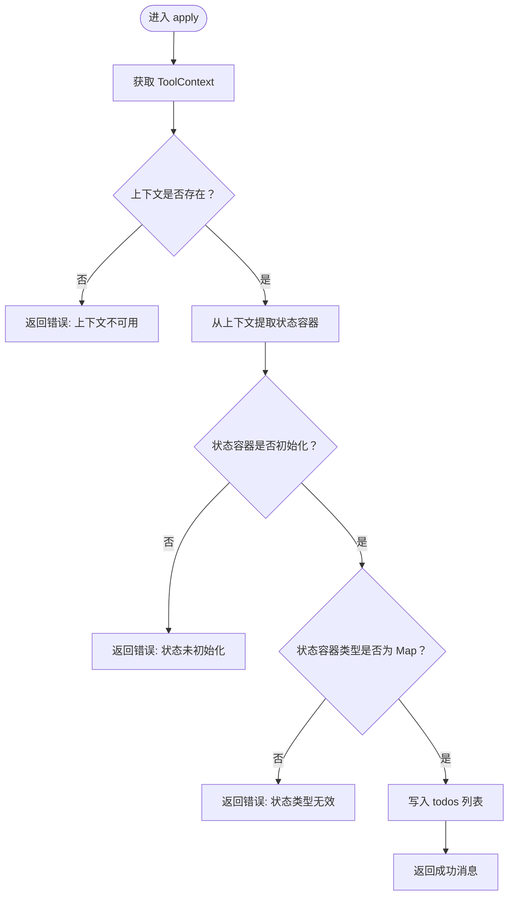
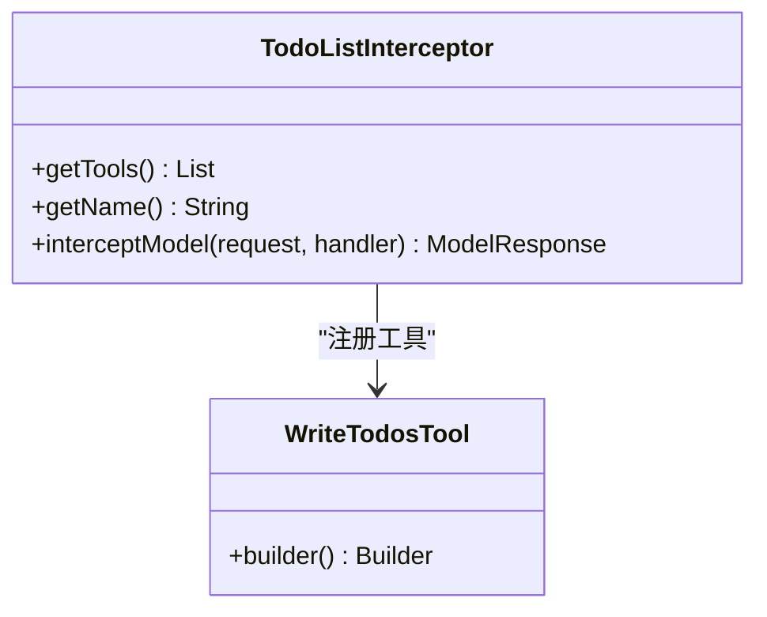
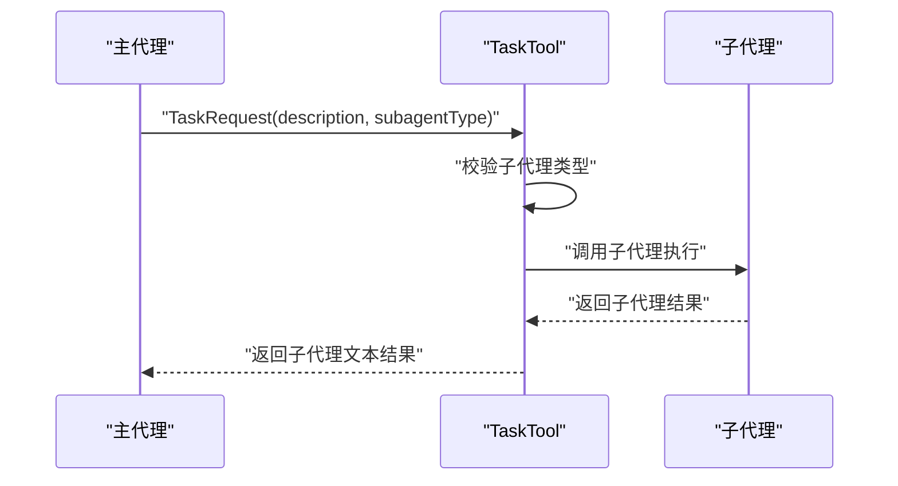
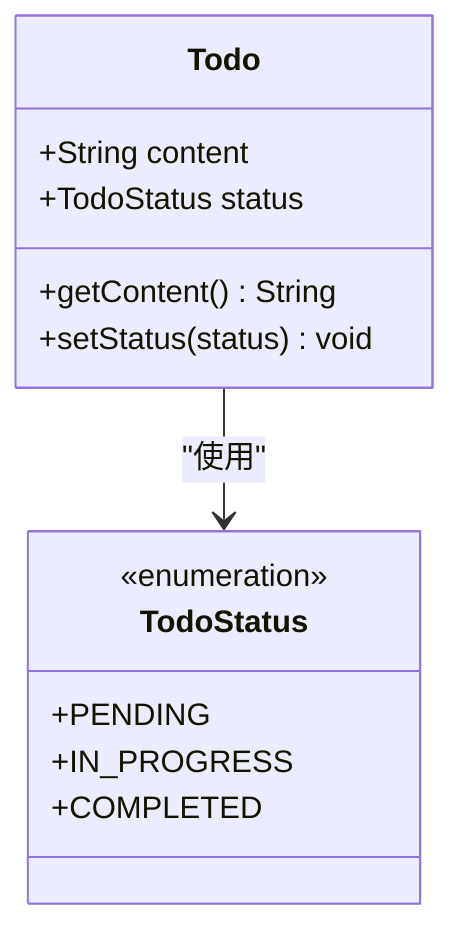
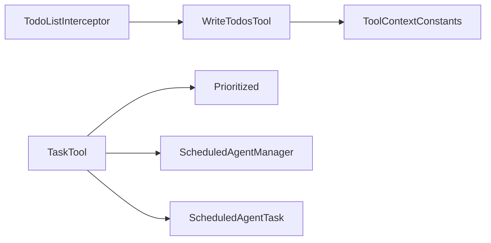

# 任务规划

<cite>
**本文引用的文件**
- [WriteTodosTool.java](file://spring-ai-alibaba-agent-framework/src/main/java/com/alibaba/cloud/ai/graph/agent/tools/WriteTodosTool.java)
- [TodoListInterceptor.java](file://spring-ai-alibaba-agent-framework/src/main/java/com/alibaba/cloud/ai/graph/agent/interceptor/todolist/TodoListInterceptor.java)
- [ToolContextConstants.java](file://spring-ai-alibaba-agent-framework/src/main/java/com/alibaba/cloud/ai/graph/agent/tools/ToolContextConstants.java)
- [TaskTool.java](file://spring-ai-alibaba-agent-framework/src/main/java/com/alibaba/cloud/ai/graph/agent/extension/tools/model/TaskTool.java)
- [TodolistTest.java](file://spring-ai-alibaba-agent-framework/src/test/java/com/alibaba/cloud/ai/graph/agent/interceptors/TodolistTest.java)
- [WriteTodosToolTest.java](file://spring-ai-alibaba-agent-framework/src/test/java/com/alibaba/cloud/ai/graph/agent/tools/WriteTodosToolTest.java)
- [Prioritized.java](file://spring-ai-alibaba-agent-framework/src/main/java/com/alibaba/cloud/ai/graph/agent/Prioritized.java)
- [ScheduledAgentManager.java](file://spring-ai-alibaba-graph-core/src/main/java/com/alibaba/cloud/ai/graph/scheduling/ScheduledAgentManager.java)
- [ScheduledAgentTask.java](file://spring-ai-alibaba-graph-core/src/main/java/com/alibaba/cloud/ai/graph/scheduling/ScheduledAgentTask.java)
</cite>

## 目录
1. [简介](#简介)
2. [项目结构](#项目结构)
3. [核心组件](#核心组件)
4. [架构总览](#架构总览)
5. [详细组件分析](#详细组件分析)
6. [依赖关系分析](#依赖关系分析)
7. [性能考量](#性能考量)
8. [故障排查指南](#故障排查指南)
9. [结论](#结论)
10. [附录](#附录)

## 简介
本文件聚焦于“任务规划与待办事项生成”的实践，系统性阐述如何将大模型的规划输出结构化为可追踪的待办事项列表（To-Do List），并通过 TodoListInterceptor 注入系统提示与工具能力，借助 WriteTodosTool 将规划结果写入代理上下文状态，从而实现复杂任务的分步分解与进度可视化。同时，结合 TaskTool 的子代理委托机制，说明如何在工作流中集成任务管理与执行，覆盖任务优先级、依赖关系与完成状态更新的最佳实践。

## 项目结构
围绕任务规划与待办事项的核心模块位于 agent 框架与拦截器扩展中：
- 工具层：WriteTodosTool 提供待办事项写入能力；TaskTool 提供子代理任务委托能力
- 拦截器层：TodoListInterceptor 注入系统提示与 write_todos 工具，引导模型按规范维护待办事项
- 测试层：TodolistTest 与 WriteTodosToolTest 展示典型用法与边界条件
- 上下文常量：ToolContextConstants 定义写入状态的关键键名
- 扩展接口：Prioritized 用于排序与优先级控制；调度相关接口位于 graph-core 模块

图表来源
- [WriteTodosTool.java](file://spring-ai-alibaba-agent-framework/src/main/java/com/alibaba/cloud/ai/graph/agent/tools/WriteTodosTool.java#L1-L182)
- [TodoListInterceptor.java](file://spring-ai-alibaba-agent-framework/src/main/java/com/alibaba/cloud/ai/graph/agent/interceptor/todolist/TodoListInterceptor.java#L1-L228)
- [TaskTool.java](file://spring-ai-alibaba-agent-framework/src/main/java/com/alibaba/cloud/ai/graph/agent/extension/tools/model/TaskTool.java#L1-L101)
- [TodolistTest.java](file://spring-ai-alibaba-agent-framework/src/test/java/com/alibaba/cloud/ai/graph/agent/interceptors/TodolistTest.java#L1-L113)
- [WriteTodosToolTest.java](file://spring-ai-alibaba-agent-framework/src/test/java/com/alibaba/cloud/ai/graph/agent/tools/WriteTodosToolTest.java#L1-L150)
- [ToolContextConstants.java](file://spring-ai-alibaba-agent-framework/src/main/java/com/alibaba/cloud/ai/graph/agent/tools/ToolContextConstants.java#L1-L23)
- [Prioritized.java](file://spring-ai-alibaba-agent-framework/src/main/java/com/alibaba/cloud/ai/graph/agent/Prioritized.java#L1-L48)
- [ScheduledAgentManager.java](file://spring-ai-alibaba-graph-core/src/main/java/com/alibaba/cloud/ai/graph/scheduling/ScheduledAgentManager.java#L1-L83)
- [ScheduledAgentTask.java](file://spring-ai-alibaba-graph-core/src/main/java/com/alibaba/cloud/ai/graph/scheduling/ScheduledAgentTask.java#L75-L115)

章节来源
- [WriteTodosTool.java](file://spring-ai-alibaba-agent-framework/src/main/java/com/alibaba/cloud/ai/graph/agent/tools/WriteTodosTool.java#L1-L182)
- [TodoListInterceptor.java](file://spring-ai-alibaba-agent-framework/src/main/java/com/alibaba/cloud/ai/graph/agent/interceptor/todolist/TodoListInterceptor.java#L1-L228)
- [TaskTool.java](file://spring-ai-alibaba-agent-framework/src/main/java/com/alibaba/cloud/ai/graph/agent/extension/tools/model/TaskTool.java#L1-L101)
- [TodolistTest.java](file://spring-ai-alibaba-agent-framework/src/test/java/com/alibaba/cloud/ai/graph/agent/interceptors/TodolistTest.java#L1-L113)
- [WriteTodosToolTest.java](file://spring-ai-alibaba-agent-framework/src/test/java/com/alibaba/cloud/ai/graph/agent/tools/WriteTodosToolTest.java#L1-L150)
- [ToolContextConstants.java](file://spring-ai-alibaba-agent-framework/src/main/java/com/alibaba/cloud/ai/graph/agent/tools/ToolContextConstants.java#L1-L23)
- [Prioritized.java](file://spring-ai-alibaba-agent-framework/src/main/java/com/alibaba/cloud/ai/graph/agent/Prioritized.java#L1-L48)
- [ScheduledAgentManager.java](file://spring-ai-alibaba-graph-core/src/main/java/com/alibaba/cloud/ai/graph/scheduling/ScheduledAgentManager.java#L1-L83)
- [ScheduledAgentTask.java](file://spring-ai-alibaba-graph-core/src/main/java/com/alibaba/cloud/ai/graph/scheduling/ScheduledAgentTask.java#L75-L115)

## 核心组件
- WriteTodosTool：将请求中的待办事项列表写入代理上下文状态，作为任务状态的持久化入口
- TodoListInterceptor：向模型注入系统提示与 write_todos 工具，指导模型在复杂任务中使用待办事项
- TaskTool：将复杂任务委托给子代理执行，适合需要并行或隔离处理的任务
- ToolContextConstants：定义写入状态的上下文键名，确保 WriteTodosTool 能正确定位目标状态容器
- 测试用例：验证工具行为、错误处理与集成场景

章节来源
- [WriteTodosTool.java](file://spring-ai-alibaba-agent-framework/src/main/java/com/alibaba/cloud/ai/graph/agent/tools/WriteTodosTool.java#L32-L180)
- [TodoListInterceptor.java](file://spring-ai-alibaba-agent-framework/src/main/java/com/alibaba/cloud/ai/graph/agent/interceptor/todolist/TodoListInterceptor.java#L53-L118)
- [TaskTool.java](file://spring-ai-alibaba-agent-framework/src/main/java/com/alibaba/cloud/ai/graph/agent/extension/tools/model/TaskTool.java#L37-L100)
- [ToolContextConstants.java](file://spring-ai-alibaba-agent-framework/src/main/java/com/alibaba/cloud/ai/graph/agent/tools/ToolContextConstants.java#L18-L22)
- [WriteTodosToolTest.java](file://spring-ai-alibaba-agent-framework/src/test/java/com/alibaba/cloud/ai/graph/agent/tools/WriteTodosToolTest.java#L30-L150)
- [TodolistTest.java](file://spring-ai-alibaba-agent-framework/src/test/java/com/alibaba/cloud/ai/graph/agent/interceptors/TodolistTest.java#L68-L110)

## 架构总览
WriteTodosTool 与 TodoListInterceptor 协同工作，形成“提示增强 + 工具调用 + 状态写入”的闭环：
- TodoListInterceptor 在模型请求前注入系统提示，声明 write_todos 工具可用，并强调复杂任务应使用待办事项
- 模型根据提示调用 write_todos，WriteTodosTool 将请求中的 todos 写入 ToolContext 中的指定键值
- 测试用例 TodolistTest 验证模型确实返回了 write_todos 的工具响应消息

图表来源
- [TodoListInterceptor.java](file://spring-ai-alibaba-agent-framework/src/main/java/com/alibaba/cloud/ai/graph/agent/interceptor/todolist/TodoListInterceptor.java#L101-L118)
- [WriteTodosTool.java](file://spring-ai-alibaba-agent-framework/src/main/java/com/alibaba/cloud/ai/graph/agent/tools/WriteTodosTool.java#L103-L129)
- [ToolContextConstants.java](file://spring-ai-alibaba-agent-framework/src/main/java/com/alibaba/cloud/ai/graph/agent/tools/ToolContextConstants.java#L18-L22)
- [TodolistTest.java](file://spring-ai-alibaba-agent-framework/src/test/java/com/alibaba/cloud/ai/graph/agent/interceptors/TodolistTest.java#L87-L103)

## 详细组件分析

### WriteTodosTool 分析
- 功能职责：接收待办事项请求，写入 ToolContext 的状态容器，作为任务状态的统一入口
- 输入输出：请求体包含 todos 列表；响应为操作结果消息
- 错误处理：对空上下文、类型不匹配等异常进行捕获并返回明确错误信息
- 使用建议：在每次任务状态变更时及时调用，避免批量完成导致状态滞后

图表来源
- [WriteTodosTool.java](file://spring-ai-alibaba-agent-framework/src/main/java/com/alibaba/cloud/ai/graph/agent/tools/WriteTodosTool.java#L103-L137)

章节来源
- [WriteTodosTool.java](file://spring-ai-alibaba-agent-framework/src/main/java/com/alibaba/cloud/ai/graph/agent/tools/WriteTodosTool.java#L32-L180)
- [WriteTodosToolTest.java](file://spring-ai-alibaba-agent-framework/src/test/java/com/alibaba/cloud/ai/graph/agent/tools/WriteTodosToolTest.java#L39-L149)

### TodoListInterceptor 分析
- 功能职责：增强系统提示，引导模型在复杂任务中使用 write_todos 工具；提供工具注册入口
- 关键点：默认系统提示强调“立即标记完成”“不要并批”“仅对多步骤复杂任务使用”等最佳实践
- 可定制性：支持自定义系统提示与工具描述，便于适配不同业务场景

图表来源
- [TodoListInterceptor.java](file://spring-ai-alibaba-agent-framework/src/main/java/com/alibaba/cloud/ai/graph/agent/interceptor/todolist/TodoListInterceptor.java#L71-L118)
- [WriteTodosTool.java](file://spring-ai-alibaba-agent-framework/src/main/java/com/alibaba/cloud/ai/graph/agent/tools/WriteTodosTool.java#L149-L179)

章节来源
- [TodoListInterceptor.java](file://spring-ai-alibaba-agent-framework/src/main/java/com/alibaba/cloud/ai/graph/agent/interceptor/todolist/TodoListInterceptor.java#L53-L226)
- [TodolistTest.java](file://spring-ai-alibaba-agent-framework/src/test/java/com/alibaba/cloud/ai/graph/agent/interceptors/TodolistTest.java#L68-L110)

### TaskTool 分析
- 功能职责：将复杂任务委托给子代理执行，适合需要隔离上下文或并行处理的子任务
- 输入结构：包含任务描述与子代理类型，便于选择合适的子代理
- 异常处理：对未知子代理类型与执行异常进行友好提示

图表来源
- [TaskTool.java](file://spring-ai-alibaba-agent-framework/src/main/java/com/alibaba/cloud/ai/graph/agent/extension/tools/model/TaskTool.java#L45-L66)

章节来源
- [TaskTool.java](file://spring-ai-alibaba-agent-framework/src/main/java/com/alibaba/cloud/ai/graph/agent/extension/tools/model/TaskTool.java#L37-L100)

### 待办事项数据模型
- TodoStatus：待办状态枚举，支持 pending、in_progress、completed
- Todo：包含内容与状态的对象，支持序列化与反序列化

图表来源
- [TodoListInterceptor.java](file://spring-ai-alibaba-agent-framework/src/main/java/com/alibaba/cloud/ai/graph/agent/interceptor/todolist/TodoListInterceptor.java#L120-L200)

章节来源
- [TodoListInterceptor.java](file://spring-ai-alibaba-agent-framework/src/main/java/com/alibaba/cloud/ai/graph/agent/interceptor/todolist/TodoListInterceptor.java#L120-L200)

## 依赖关系分析
- WriteTodosTool 依赖 ToolContext 与 ToolContextConstants 的键名，确保写入正确的状态容器
- TodoListInterceptor 依赖 WriteTodosTool，动态注册工具并增强系统提示
- TaskTool 依赖 ReactAgent 子代理集合，用于任务委托
- Prioritized 接口为排序与优先级控制提供抽象，便于在复杂流程中安排执行顺序
- 调度相关接口（ScheduledAgentManager/ScheduledAgentTask）可用于定时或周期性任务的执行与管理

图表来源
- [TodoListInterceptor.java](file://spring-ai-alibaba-agent-framework/src/main/java/com/alibaba/cloud/ai/graph/agent/interceptor/todolist/TodoListInterceptor.java#L71-L118)
- [WriteTodosTool.java](file://spring-ai-alibaba-agent-framework/src/main/java/com/alibaba/cloud/ai/graph/agent/tools/WriteTodosTool.java#L103-L129)
- [ToolContextConstants.java](file://spring-ai-alibaba-agent-framework/src/main/java/com/alibaba/cloud/ai/graph/agent/tools/ToolContextConstants.java#L18-L22)
- [TaskTool.java](file://spring-ai-alibaba-agent-framework/src/main/java/com/alibaba/cloud/ai/graph/agent/extension/tools/model/TaskTool.java#L37-L100)
- [Prioritized.java](file://spring-ai-alibaba-agent-framework/src/main/java/com/alibaba/cloud/ai/graph/agent/Prioritized.java#L1-L48)
- [ScheduledAgentManager.java](file://spring-ai-alibaba-graph-core/src/main/java/com/alibaba/cloud/ai/graph/scheduling/ScheduledAgentManager.java#L1-L83)
- [ScheduledAgentTask.java](file://spring-ai-alibaba-graph-core/src/main/java/com/alibaba/cloud/ai/graph/scheduling/ScheduledAgentTask.java#L75-L115)

章节来源
- [WriteTodosTool.java](file://spring-ai-alibaba-agent-framework/src/main/java/com/alibaba/cloud/ai/graph/agent/tools/WriteTodosTool.java#L103-L137)
- [TodoListInterceptor.java](file://spring-ai-alibaba-agent-framework/src/main/java/com/alibaba/cloud/ai/graph/agent/interceptor/todolist/TodoListInterceptor.java#L71-L118)
- [TaskTool.java](file://spring-ai-alibaba-agent-framework/src/main/java/com/alibaba/cloud/ai/graph/agent/extension/tools/model/TaskTool.java#L37-L100)
- [Prioritized.java](file://spring-ai-alibaba-agent-framework/src/main/java/com/alibaba/cloud/ai/graph/agent/Prioritized.java#L1-L48)
- [ScheduledAgentManager.java](file://spring-ai-alibaba-graph-core/src/main/java/com/alibaba/cloud/ai/graph/scheduling/ScheduledAgentManager.java#L1-L83)
- [ScheduledAgentTask.java](file://spring-ai-alibaba-graph-core/src/main/java/com/alibaba/cloud/ai/graph/scheduling/ScheduledAgentTask.java#L75-L115)

## 性能考量
- 工具调用成本：频繁调用 write_todos 会增加令牌消耗，建议仅在复杂任务中使用
- 状态写入频率：采用“即时完成、即时写入”的策略，避免批量完成导致状态不一致
- 并行与串行：对相互独立的任务可并行推进（多个 in_progress），但需避免重复并行同一任务
- 子代理委托：TaskTool 适合隔离复杂子任务，减少主流程耦合，提升整体吞吐

## 故障排查指南
- 上下文缺失：当 ToolContext 为空或状态容器未初始化时，WriteTodosTool 返回明确错误信息
- 类型不匹配：若状态容器不是 Map 类型，将触发类型错误提示
- 未知子代理：TaskTool 对不存在的子代理类型返回错误提示
- 集成验证：TodolistTest 断言模型返回了 write_todos 的工具响应消息，确保工具被正确调用

章节来源
- [WriteTodosToolTest.java](file://spring-ai-alibaba-agent-framework/src/test/java/com/alibaba/cloud/ai/graph/agent/tools/WriteTodosToolTest.java#L61-L87)
- [WriteTodosTool.java](file://spring-ai-alibaba-agent-framework/src/main/java/com/alibaba/cloud/ai/graph/agent/tools/WriteTodosTool.java#L103-L137)
- [TaskTool.java](file://spring-ai-alibaba-agent-framework/src/main/java/com/alibaba/cloud/ai/graph/agent/extension/tools/model/TaskTool.java#L45-L66)
- [TodolistTest.java](file://spring-ai-alibaba-agent-framework/src/test/java/com/alibaba/cloud/ai/graph/agent/interceptors/TodolistTest.java#L87-L103)

## 结论
通过 TodoListInterceptor 与 WriteTodosTool 的协同，系统实现了“提示驱动 + 工具调用 + 状态写入”的任务规划闭环；配合 TaskTool 的子代理委托，可在复杂任务中实现分而治之与并行推进。结合 ToolContextConstants 的键名约定与测试用例的验证路径，开发者可以安全地将待办事项集成到工作流中，并在复杂任务分解与进度可视化方面获得稳定可靠的支撑。

## 附录

### 配置与使用要点
- 注入拦截器：在构建代理时添加 TodoListInterceptor，以启用 write_todos 工具与系统提示
- 调用工具：在模型提示的引导下，针对复杂任务调用 write_todos 更新 todos 列表
- 状态写入：确保 ToolContext 包含 AGENT_STATE_FOR_UPDATE_ 键，以便 WriteTodosTool 正确写入
- 子代理委托：使用 TaskTool 将复杂子任务委派给专用子代理，提升可维护性与并发能力

章节来源
- [TodoListInterceptor.java](file://spring-ai-alibaba-agent-framework/src/main/java/com/alibaba/cloud/ai/graph/agent/interceptor/todolist/TodoListInterceptor.java#L71-L118)
- [WriteTodosTool.java](file://spring-ai-alibaba-agent-framework/src/main/java/com/alibaba/cloud/ai/graph/agent/tools/WriteTodosTool.java#L103-L129)
- [ToolContextConstants.java](file://spring-ai-alibaba-agent-framework/src/main/java/com/alibaba/cloud/ai/graph/agent/tools/ToolContextConstants.java#L18-L22)
- [TaskTool.java](file://spring-ai-alibaba-agent-framework/src/main/java/com/alibaba/cloud/ai/graph/agent/extension/tools/model/TaskTool.java#L71-L76)

### 最佳实践清单
- 何时使用待办事项：复杂多步骤、非平凡任务、用户显式要求、提供多项任务、计划可能需要修订
- 状态管理：实时更新、完成后立即标记、当前任务优先、删除不再相关的任务、始终至少保留一个 in_progress
- 完成标准：仅在完全达成目标时标记完成，遇到问题保持 in_progress 或新增阻塞任务
- 任务拆分：创建具体可执行项，将复杂任务拆分为更小步骤，使用清晰描述
- 优先级与依赖：通过 Prioritized 接口控制执行顺序；对相互独立的任务可并行推进
- 调度与重试：对周期性或定时任务使用 ScheduledAgentManager/ScheduledAgentTask 进行管理

章节来源
- [WriteTodosTool.java](file://spring-ai-alibaba-agent-framework/src/main/java/com/alibaba/cloud/ai/graph/agent/tools/WriteTodosTool.java#L51-L98)
- [Prioritized.java](file://spring-ai-alibaba-agent-framework/src/main/java/com/alibaba/cloud/ai/graph/agent/Prioritized.java#L1-L48)
- [ScheduledAgentManager.java](file://spring-ai-alibaba-graph-core/src/main/java/com/alibaba/cloud/ai/graph/scheduling/ScheduledAgentManager.java#L1-L83)
- [ScheduledAgentTask.java](file://spring-ai-alibaba-graph-core/src/main/java/com/alibaba/cloud/ai/graph/scheduling/ScheduledAgentTask.java#L75-L115)