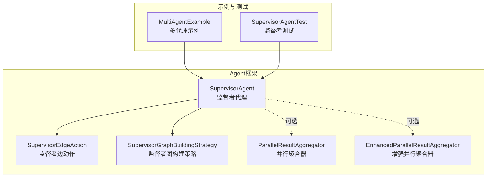
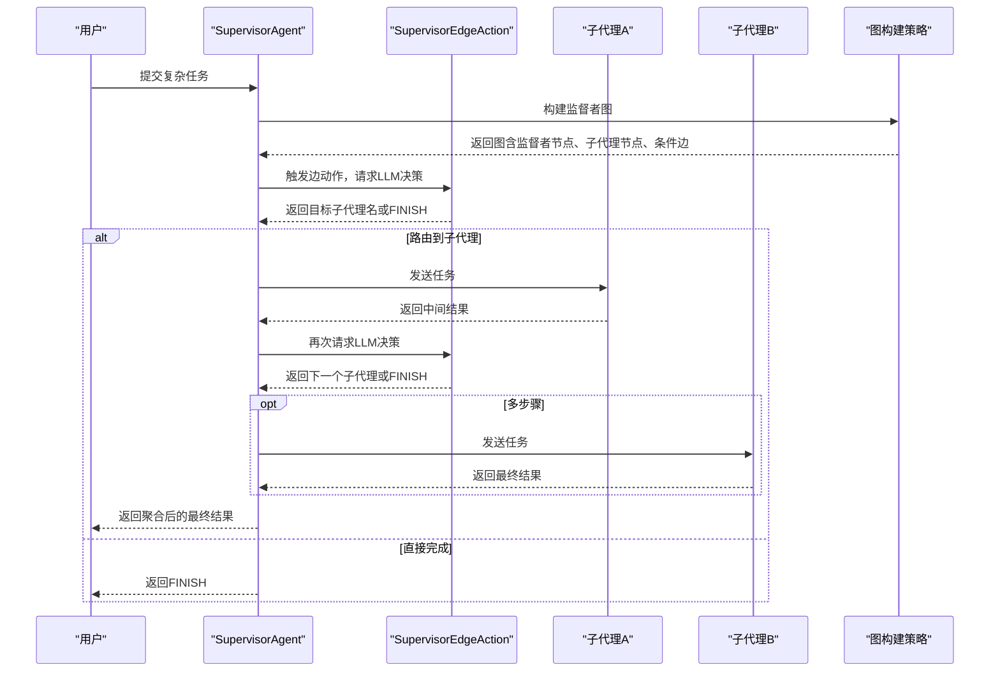
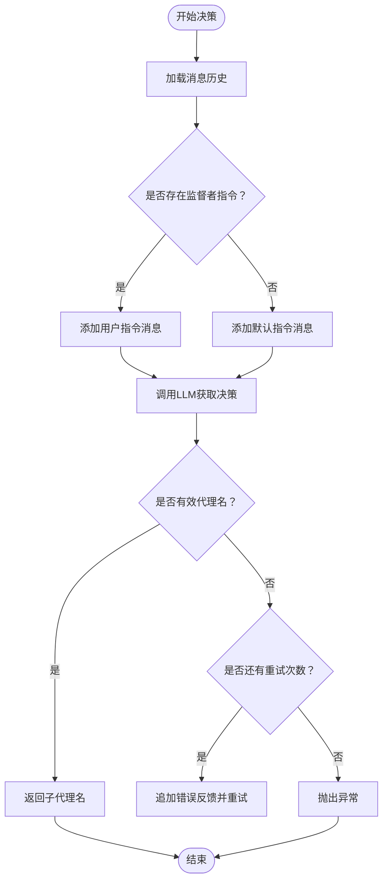
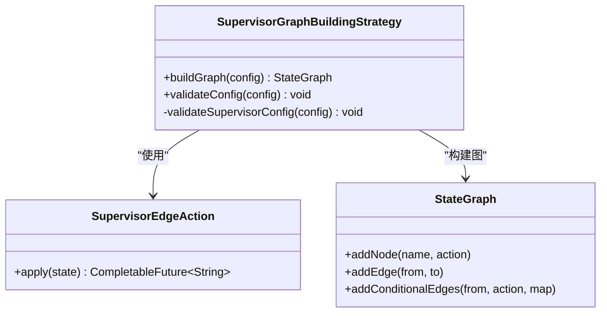
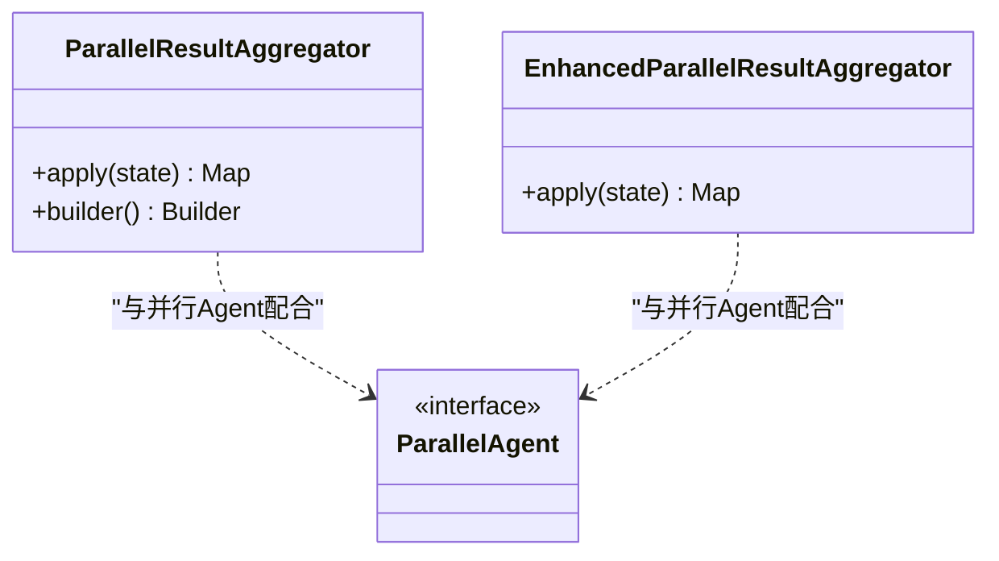
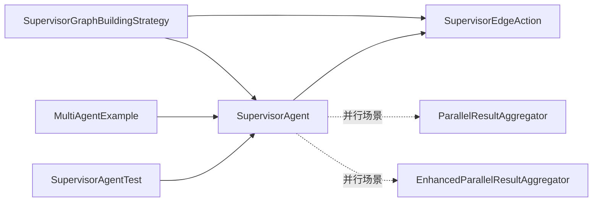

# 任务协调

<cite>
**本文引用的文件**
- [SupervisorAgent.java](file://spring-ai-alibaba-agent-framework/src/main/java/com/alibaba/cloud/ai/graph/agent/flow/agent/SupervisorAgent.java)
- [SupervisorEdgeAction.java](file://spring-ai-alibaba-agent-framework/src/main/java/com/alibaba/cloud/ai/graph/agent/flow/node/SupervisorEdgeAction.java)
- [SupervisorGraphBuildingStrategy.java](file://spring-ai-alibaba-agent-framework/src/main/java/com/alibaba/cloud/ai/graph/agent/flow/strategy/SupervisorGraphBuildingStrategy.java)
- [ParallelResultAggregator.java](file://spring-ai-alibaba-agent-framework/src/main/java/com/alibaba/cloud/ai/graph/agent/flow/node/ParallelResultAggregator.java)
- [EnhancedParallelResultAggregator.java](file://spring-ai-alibaba-agent-framework/src/main/java/com/alibaba/cloud/ai/graph/agent/flow/node/EnhancedParallelResultAggregator.java)
- [MultiAgentExample.java](file://examples/documentation/src/main/java/com/alibaba/cloud/ai/examples/documentation/framework/advanced/MultiAgentExample.java)
- [SupervisorAgentTest.java](file://spring-ai-alibaba-agent-framework/src/test/java/com/alibaba/cloud/ai/graph/agent/SupervisorAgentTest.java)
</cite>

## 目录
1. [简介](#简介)
2. [项目结构](#项目结构)
3. [核心组件](#核心组件)
4. [架构总览](#架构总览)
5. [详细组件分析](#详细组件分析)
6. [依赖关系分析](#依赖关系分析)
7. [性能考量](#性能考量)
8. [故障排查指南](#故障排查指南)
9. [结论](#结论)
10. [附录](#附录)

## 简介
本文件围绕 SupervisorAgent 在多代理协作中的任务协调机制展开，重点解释其如何接收复杂任务、通过 LLM 进行任务分解与路由、将子任务分发给不同子代理执行、以及结果聚合与完成判定流程。同时结合 MultiAgentExample.java 中的示例，演示如何配置 SupervisorAgent 的决策逻辑、子代理列表与聚合规则；并给出任务分解提示词（prompt engineering）的最佳实践建议，以提升协调效率与稳定性。

## 项目结构
SupervisorAgent 的实现位于 agent-flow 层，配合图构建策略与边动作实现“监督者”式路由与回路控制。并行聚合器用于并行场景下的结果汇总，示例工程提供了丰富的 SupervisorAgent 使用范式。

**图表来源**
- [SupervisorAgent.java](file://spring-ai-alibaba-agent-framework/src/main/java/com/alibaba/cloud/ai/graph/agent/flow/agent/SupervisorAgent.java#L1-L110)
- [SupervisorEdgeAction.java](file://spring-ai-alibaba-agent-framework/src/main/java/com/alibaba/cloud/ai/graph/agent/flow/node/SupervisorEdgeAction.java#L1-L273)
- [SupervisorGraphBuildingStrategy.java](file://spring-ai-alibaba-agent-framework/src/main/java/com/alibaba/cloud/ai/graph/agent/flow/strategy/SupervisorGraphBuildingStrategy.java#L1-L111)
- [ParallelResultAggregator.java](file://spring-ai-alibaba-agent-framework/src/main/java/com/alibaba/cloud/ai/graph/agent/flow/node/ParallelResultAggregator.java#L1-L89)
- [EnhancedParallelResultAggregator.java](file://spring-ai-alibaba-agent-framework/src/main/java/com/alibaba/cloud/ai/graph/agent/flow/node/EnhancedParallelResultAggregator.java#L1-L116)
- [MultiAgentExample.java](file://examples/documentation/src/main/java/com/alibaba/cloud/ai/examples/documentation/framework/advanced/MultiAgentExample.java#L535-L707)
- [SupervisorAgentTest.java](file://spring-ai-alibaba-agent-framework/src/test/java/com/alibaba/cloud/ai/graph/agent/SupervisorAgentTest.java#L1-L200)

**章节来源**
- [SupervisorAgent.java](file://spring-ai-alibaba-agent-framework/src/main/java/com/alibaba/cloud/ai/graph/agent/flow/agent/SupervisorAgent.java#L1-L110)
- [SupervisorEdgeAction.java](file://spring-ai-alibaba-agent-framework/src/main/java/com/alibaba/cloud/ai/graph/agent/flow/node/SupervisorEdgeAction.java#L1-L273)
- [SupervisorGraphBuildingStrategy.java](file://spring-ai-alibaba-agent-framework/src/main/java/com/alibaba/cloud/ai/graph/agent/flow/strategy/SupervisorGraphBuildingStrategy.java#L1-L111)
- [ParallelResultAggregator.java](file://spring-ai-alibaba-agent-framework/src/main/java/com/alibaba/cloud/ai/graph/agent/flow/node/ParallelResultAggregator.java#L1-L89)
- [EnhancedParallelResultAggregator.java](file://spring-ai-alibaba-agent-framework/src/main/java/com/alibaba/cloud/ai/graph/agent/flow/node/EnhancedParallelResultAggregator.java#L1-L116)
- [MultiAgentExample.java](file://examples/documentation/src/main/java/com/alibaba/cloud/ai/examples/documentation/framework/advanced/MultiAgentExample.java#L535-L707)
- [SupervisorAgentTest.java](file://spring-ai-alibaba-agent-framework/src/test/java/com/alibaba/cloud/ai/graph/agent/SupervisorAgentTest.java#L1-L200)

## 核心组件
- SupervisorAgent：监督者代理，负责基于 LLM 的任务分解与路由决策，支持子代理列表与系统提示词配置。
- SupervisorEdgeAction：监督者边动作，封装 LLM 决策逻辑，将任务路由到子代理或标记完成（FINISH），并具备重试与校验能力。
- SupervisorGraphBuildingStrategy：监督者图构建策略，定义监督者图的节点与条件边，确保子代理完成后总是回到监督者，由监督者决定下一步。
- ParallelResultAggregator / EnhancedParallelResultAggregator：并行聚合器，用于并行执行场景下的结果收集与合并，支持自定义合并策略与并发度控制。
- MultiAgentExample：示例工程，展示 SupervisorAgent 的多种使用方式，包括简单路由、嵌套工作流、占位符引用前序输出等。
- SupervisorAgentTest：单元测试，验证监督者在简单任务、嵌套工作流、多步骤任务等场景的行为。

**章节来源**
- [SupervisorAgent.java](file://spring-ai-alibaba-agent-framework/src/main/java/com/alibaba/cloud/ai/graph/agent/flow/agent/SupervisorAgent.java#L1-L110)
- [SupervisorEdgeAction.java](file://spring-ai-alibaba-agent-framework/src/main/java/com/alibaba/cloud/ai/graph/agent/flow/node/SupervisorEdgeAction.java#L1-L273)
- [SupervisorGraphBuildingStrategy.java](file://spring-ai-alibaba-agent-framework/src/main/java/com/alibaba/cloud/ai/graph/agent/flow/strategy/SupervisorGraphBuildingStrategy.java#L1-L111)
- [ParallelResultAggregator.java](file://spring-ai-alibaba-agent-framework/src/main/java/com/alibaba/cloud/ai/graph/agent/flow/node/ParallelResultAggregator.java#L1-L89)
- [EnhancedParallelResultAggregator.java](file://spring-ai-alibaba-agent-framework/src/main/java/com/alibaba/cloud/ai/graph/agent/flow/node/EnhancedParallelResultAggregator.java#L1-L116)
- [MultiAgentExample.java](file://examples/documentation/src/main/java/com/alibaba/cloud/ai/examples/documentation/framework/advanced/MultiAgentExample.java#L535-L707)
- [SupervisorAgentTest.java](file://spring-ai-alibaba-agent-framework/src/test/java/com/alibaba/cloud/ai/graph/agent/SupervisorAgentTest.java#L1-L200)

## 架构总览
监督者模式的关键在于“先分解、再路由、后回路”的闭环控制。监督者通过 LLM 判断当前步骤是否需要继续，子代理执行完毕后必须返回监督者，由监督者决定是否 FINISH 或继续路由到下一个子代理。

**图表来源**
- [SupervisorAgent.java](file://spring-ai-alibaba-agent-framework/src/main/java/com/alibaba/cloud/ai/graph/agent/flow/agent/SupervisorAgent.java#L43-L55)
- [SupervisorEdgeAction.java](file://spring-ai-alibaba-agent-framework/src/main/java/com/alibaba/cloud/ai/graph/agent/flow/node/SupervisorEdgeAction.java#L94-L131)
- [SupervisorGraphBuildingStrategy.java](file://spring-ai-alibaba-agent-framework/src/main/java/com/alibaba/cloud/ai/graph/agent/flow/strategy/SupervisorGraphBuildingStrategy.java#L40-L76)

## 详细组件分析

### SupervisorAgent：监督者代理
- 职责：持有 ChatModel、系统提示词与指令，构建监督者图，暴露系统提示词与指令访问接口。
- 关键点：
  - 构建图时注入 ChatModel，委托 FlowGraphBuilder 生成监督者类型图。
  - 构建器要求提供 ChatModel，否则抛出非法参数异常。
  - 提供 systemPrompt 与 instruction 字段，分别用于指导监督者决策与补充上下文。

**章节来源**
- [SupervisorAgent.java](file://spring-ai-alibaba-agent-framework/src/main/java/com/alibaba/cloud/ai/graph/agent/flow/agent/SupervisorAgent.java#L24-L109)

### SupervisorEdgeAction：监督者边动作
- 职责：封装监督者决策逻辑，将任务路由到子代理或标记完成（FINISH），并具备重试与校验能力。
- 关键点：
  - 默认最大重试次数为 2，若模型返回无效代理名，将追加错误反馈并重试。
  - 若最终仍无效，抛出非法参数异常；若达到 FINISH，返回图常量 END。
  - 支持在监督者指令为空时，自动生成可用子代理列表与示例格式，确保输出结构化。
  - 可根据监督者是否设置 instruction，动态添加用户消息以增强上下文。

**图表来源**
- [SupervisorEdgeAction.java](file://spring-ai-alibaba-agent-framework/src/main/java/com/alibaba/cloud/ai/graph/agent/flow/node/SupervisorEdgeAction.java#L94-L131)
- [SupervisorEdgeAction.java](file://spring-ai-alibaba-agent-framework/src/main/java/com/alibaba/cloud/ai/graph/agent/flow/node/SupervisorEdgeAction.java#L133-L162)
- [SupervisorEdgeAction.java](file://spring-ai-alibaba-agent-framework/src/main/java/com/alibaba/cloud/ai/graph/agent/flow/node/SupervisorEdgeAction.java#L164-L271)

**章节来源**
- [SupervisorEdgeAction.java](file://spring-ai-alibaba-agent-framework/src/main/java/com/alibaba/cloud/ai/graph/agent/flow/node/SupervisorEdgeAction.java#L1-L273)

### SupervisorGraphBuildingStrategy：监督者图构建策略
- 职责：构建监督者图，确保子代理完成后总是回到监督者，监督者再决定下一步或 FINISH。
- 关键点：
  - 添加根透明节点与起始边。
  - 为每个子代理添加节点，并将子代理的完成边连接回监督者。
  - 通过条件边与 SupervisorEdgeAction 实现“监督者 -> 子代理/END”的路由映射。
  - 校验：至少一个子代理、必须提供 ChatModel、根代理必须为 FlowAgent。

**图表来源**
- [SupervisorGraphBuildingStrategy.java](file://spring-ai-alibaba-agent-framework/src/main/java/com/alibaba/cloud/ai/graph/agent/flow/strategy/SupervisorGraphBuildingStrategy.java#L40-L76)
- [SupervisorEdgeAction.java](file://spring-ai-alibaba-agent-framework/src/main/java/com/alibaba/cloud/ai/graph/agent/flow/node/SupervisorEdgeAction.java#L94-L131)

**章节来源**
- [SupervisorGraphBuildingStrategy.java](file://spring-ai-alibaba-agent-framework/src/main/java/com/alibaba/cloud/ai/graph/agent/flow/strategy/SupervisorGraphBuildingStrategy.java#L1-L111)

### 并行聚合器：结果聚合策略
- ParallelResultAggregator：基础并行聚合器，将并行执行的各子代理输出合并为字符串摘要。
- EnhancedParallelResultAggregator：增强并行聚合器，支持自定义合并策略、并发度控制、以及对 GraphResponse 的解析与释放策略。

**图表来源**
- [ParallelResultAggregator.java](file://spring-ai-alibaba-agent-framework/src/main/java/com/alibaba/cloud/ai/graph/agent/flow/node/ParallelResultAggregator.java#L1-L89)
- [EnhancedParallelResultAggregator.java](file://spring-ai-alibaba-agent-framework/src/main/java/com/alibaba/cloud/ai/graph/agent/flow/node/EnhancedParallelResultAggregator.java#L1-L116)

**章节来源**
- [ParallelResultAggregator.java](file://spring-ai-alibaba-agent-framework/src/main/java/com/alibaba/cloud/ai/graph/agent/flow/node/ParallelResultAggregator.java#L1-L89)
- [EnhancedParallelResultAggregator.java](file://spring-ai-alibaba-agent-framework/src/main/java/com/alibaba/cloud/ai/graph/agent/flow/node/EnhancedParallelResultAggregator.java#L1-L116)

### MultiAgentExample：配置与使用示例
- 示例涵盖：
  - 简单写作与翻译任务：监督者根据需求路由到 writer_agent 或 translator_agent。
  - 嵌套工作流：监督者路由到包含顺序步骤的 writing_workflow_agent，完成后返回监督者并完成任务。
  - 多步骤任务：监督者分步路由，先写文章，再翻译，最终返回 FINISH。
  - 占位符引用：监督者 instruction 与子代理 instruction 可引用前序 Agent 输出，实现上下文驱动的决策。
- 关键配置点：
  - systemPrompt：定义监督者的职责、可用子代理、决策规则与响应格式。
  - instruction：可选的补充指令，用于向监督者提供上下文占位符。
  - subAgents：子代理列表，支持普通 Agent 与嵌套 Agent（如 SequentialAgent）。

**章节来源**
- [MultiAgentExample.java](file://examples/documentation/src/main/java/com/alibaba/cloud/ai/examples/documentation/framework/advanced/MultiAgentExample.java#L535-L707)
- [MultiAgentExample.java](file://examples/documentation/src/main/java/com/alibaba/cloud/ai/examples/documentation/framework/advanced/MultiAgentExample.java#L675-L699)

### SupervisorAgentTest：行为验证
- 验证点：
  - 简单任务：监督者正确路由到 writer_agent 或 translator_agent。
  - 嵌套工作流：监督者路由到包含顺序步骤的 Agent，完成后返回监督者并完成任务。
  - 多步骤任务：监督者分步路由，最终返回 FINISH。
  - 图表示打印：验证图包含监督者与子代理节点。

**章节来源**
- [SupervisorAgentTest.java](file://spring-ai-alibaba-agent-framework/src/test/java/com/alibaba/cloud/ai/graph/agent/SupervisorAgentTest.java#L1-L200)
- [SupervisorAgentTest.java](file://spring-ai-alibaba-agent-framework/src/test/java/com/alibaba/cloud/ai/graph/agent/SupervisorAgentTest.java#L345-L371)

## 依赖关系分析
监督者模式的依赖关系围绕“图构建策略 -> 边动作 -> 监督者代理”的链路展开，同时与并行聚合器协同处理并行场景。

**图表来源**
- [SupervisorGraphBuildingStrategy.java](file://spring-ai-alibaba-agent-framework/src/main/java/com/alibaba/cloud/ai/graph/agent/flow/strategy/SupervisorGraphBuildingStrategy.java#L40-L76)
- [SupervisorEdgeAction.java](file://spring-ai-alibaba-agent-framework/src/main/java/com/alibaba/cloud/ai/graph/agent/flow/node/SupervisorEdgeAction.java#L94-L131)
- [SupervisorAgent.java](file://spring-ai-alibaba-agent-framework/src/main/java/com/alibaba/cloud/ai/graph/agent/flow/agent/SupervisorAgent.java#L43-L55)
- [ParallelResultAggregator.java](file://spring-ai-alibaba-agent-framework/src/main/java/com/alibaba/cloud/ai/graph/agent/flow/node/ParallelResultAggregator.java#L1-L89)
- [EnhancedParallelResultAggregator.java](file://spring-ai-alibaba-agent-framework/src/main/java/com/alibaba/cloud/ai/graph/agent/flow/node/EnhancedParallelResultAggregator.java#L1-L116)
- [MultiAgentExample.java](file://examples/documentation/src/main/java/com/alibaba/cloud/ai/examples/documentation/framework/advanced/MultiAgentExample.java#L535-L707)
- [SupervisorAgentTest.java](file://spring-ai-alibaba-agent-framework/src/test/java/com/alibaba/cloud/ai/graph/agent/SupervisorAgentTest.java#L1-L200)

**章节来源**
- [SupervisorGraphBuildingStrategy.java](file://spring-ai-alibaba-agent-framework/src/main/java/com/alibaba/cloud/ai/graph/agent/flow/strategy/SupervisorGraphBuildingStrategy.java#L1-L111)
- [SupervisorEdgeAction.java](file://spring-ai-alibaba-agent-framework/src/main/java/com/alibaba/cloud/ai/graph/agent/flow/node/SupervisorEdgeAction.java#L1-L273)
- [SupervisorAgent.java](file://spring-ai-alibaba-agent-framework/src/main/java/com/alibaba/cloud/ai/graph/agent/flow/agent/SupervisorAgent.java#L1-L110)
- [ParallelResultAggregator.java](file://spring-ai-alibaba-agent-framework/src/main/java/com/alibaba/cloud/ai/graph/agent/flow/node/ParallelResultAggregator.java#L1-L89)
- [EnhancedParallelResultAggregator.java](file://spring-ai-alibaba-agent-framework/src/main/java/com/alibaba/cloud/ai/graph/agent/flow/node/EnhancedParallelResultAggregator.java#L1-L116)
- [MultiAgentExample.java](file://examples/documentation/src/main/java/com/alibaba/cloud/ai/examples/documentation/framework/advanced/MultiAgentExample.java#L535-L707)
- [SupervisorAgentTest.java](file://spring-ai-alibaba-agent-framework/src/test/java/com/alibaba/cloud/ai/graph/agent/SupervisorAgentTest.java#L1-L200)

## 性能考量
- 决策重试与反馈：监督者边动作默认最多两次重试，若模型输出无效，将追加错误反馈帮助模型纠正。合理设置重试次数可在稳定性与延迟之间取得平衡。
- 并行聚合：在并行场景下，增强聚合器支持自定义合并策略与并发度控制，有助于减少状态膨胀与提升吞吐。
- 图构建开销：监督者图包含透明节点与条件边，构建成本与子代理数量线性相关，建议在大规模场景下复用已编译图或缓存图表示。

[本节为通用性能讨论，无需特定文件引用]

## 故障排查指南
- 决策无效或异常：
  - 现象：监督者返回无效代理名或抛出异常。
  - 排查：检查 systemPrompt 是否明确列出可用子代理与响应格式；确认子代理名称大小写与拼写一致；观察日志中重试次数与最后一次无效决策。
  - 参考路径：[SupervisorEdgeAction.java](file://spring-ai-alibaba-agent-framework/src/main/java/com/alibaba/cloud/ai/graph/agent/flow/node/SupervisorEdgeAction.java#L164-L271)
- 路由循环或未完成：
  - 现象：子代理执行完毕未回到监督者，导致无法继续下一步。
  - 排查：确认图构建策略是否将子代理完成边连接回监督者；检查监督者指令是否包含“FINISH”判断逻辑。
  - 参考路径：[SupervisorGraphBuildingStrategy.java](file://spring-ai-alibaba-agent-framework/src/main/java/com/alibaba/cloud/ai/graph/agent/flow/strategy/SupervisorGraphBuildingStrategy.java#L40-L76)
- 并行结果缺失：
  - 现象：并行聚合后缺少某些子代理输出。
  - 排查：确认子代理 outputKey 是否正确设置；检查增强聚合器是否对 GraphResponse 进行了正确的解析与释放策略。
  - 参考路径：[EnhancedParallelResultAggregator.java](file://spring-ai-alibaba-agent-framework/src/main/java/com/alibaba/cloud/ai/graph/agent/flow/node/EnhancedParallelResultAggregator.java#L57-L115)
- 示例与测试验证：
  - 使用示例与测试验证监督者在简单任务、嵌套工作流、多步骤任务中的行为，定位问题范围。
  - 参考路径：[MultiAgentExample.java](file://examples/documentation/src/main/java/com/alibaba/cloud/ai/examples/documentation/framework/advanced/MultiAgentExample.java#L535-L707), [SupervisorAgentTest.java](file://spring-ai-alibaba-agent-framework/src/test/java/com/alibaba/cloud/ai/graph/agent/SupervisorAgentTest.java#L1-L200)

**章节来源**
- [SupervisorEdgeAction.java](file://spring-ai-alibaba-agent-framework/src/main/java/com/alibaba/cloud/ai/graph/agent/flow/node/SupervisorEdgeAction.java#L164-L271)
- [SupervisorGraphBuildingStrategy.java](file://spring-ai-alibaba-agent-framework/src/main/java/com/alibaba/cloud/ai/graph/agent/flow/strategy/SupervisorGraphBuildingStrategy.java#L40-L76)
- [EnhancedParallelResultAggregator.java](file://spring-ai-alibaba-agent-framework/src/main/java/com/alibaba/cloud/ai/graph/agent/flow/node/EnhancedParallelResultAggregator.java#L57-L115)
- [MultiAgentExample.java](file://examples/documentation/src/main/java/com/alibaba/cloud/ai/examples/documentation/framework/advanced/MultiAgentExample.java#L535-L707)
- [SupervisorAgentTest.java](file://spring-ai-alibaba-agent-framework/src/test/java/com/alibaba/cloud/ai/graph/agent/SupervisorAgentTest.java#L1-L200)

## 结论
SupervisorAgent 通过“监督者边动作 + 图构建策略”的组合，实现了面向复杂任务的动态分解与路由控制。其核心优势在于：
- 以 LLM 为中枢进行任务拆解与路由，支持多步骤与嵌套工作流；
- 子代理完成后必须返回监督者，确保监督者对全局进度与完成状态的掌控；
- 提供 systemPrompt 与 instruction 配置，便于通过提示词工程提升决策准确性；
- 在并行场景下，可通过增强聚合器实现灵活的合并策略与并发控制。

在实际应用中，建议优先完善监督者提示词，明确职责边界、可用子代理与响应格式；在复杂任务中采用嵌套工作流与占位符引用，使监督者能够基于上下文做出更稳健的决策。

[本节为总结性内容，无需特定文件引用]

## 附录

### 任务分解提示词（Prompt Engineering）最佳实践
- 明确职责与边界：在 systemPrompt 中清晰列出每个子代理的功能、适用场景与输出键，避免职责重叠导致路由歧义。
- 统一响应格式：要求监督者仅返回子代理名称或 FINISH，避免多余解释，降低模型输出解析难度。
- 多步骤规则：针对多步骤任务，定义“先做什么、后做什么、何时完成”的明确规则，必要时在 instruction 中使用占位符引用前序输出。
- 错误反馈与重试：在 systemPrompt 中强调“无效代理名将触发重试”，并提供示例格式，帮助模型在首次输出不规范时快速纠正。
- 可观测性：在示例中打印图表示，便于验证图结构与路由路径，辅助调试与优化。

[本节为通用指导，无需特定文件引用]