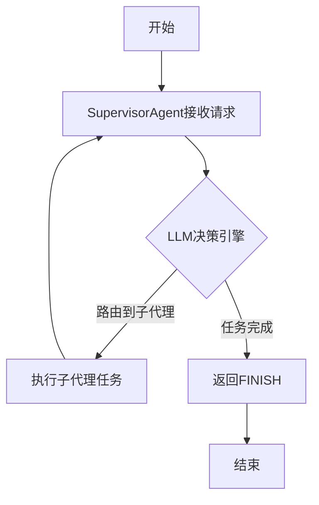
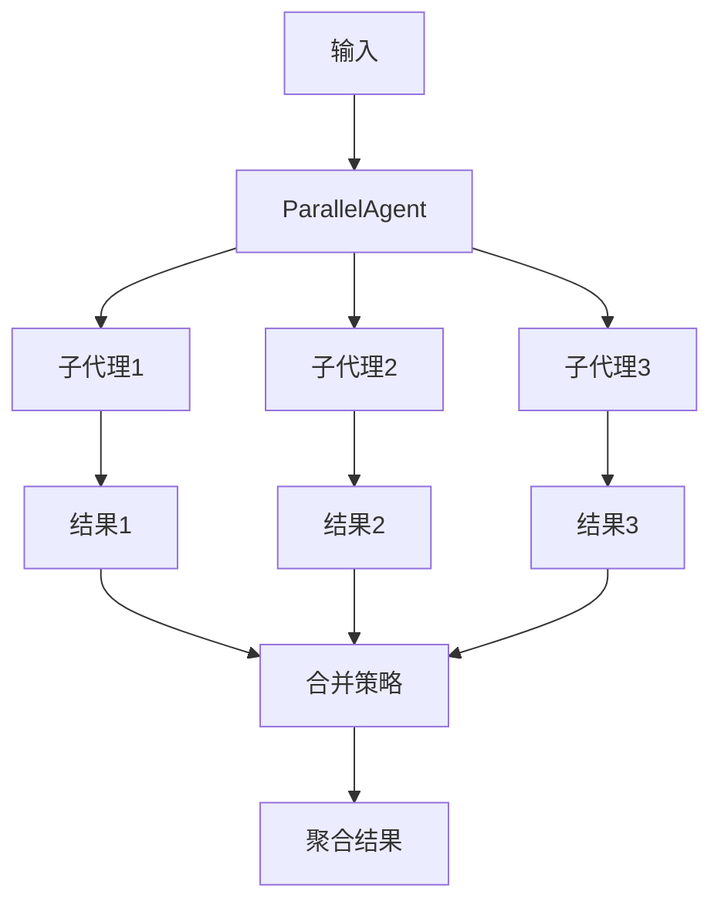
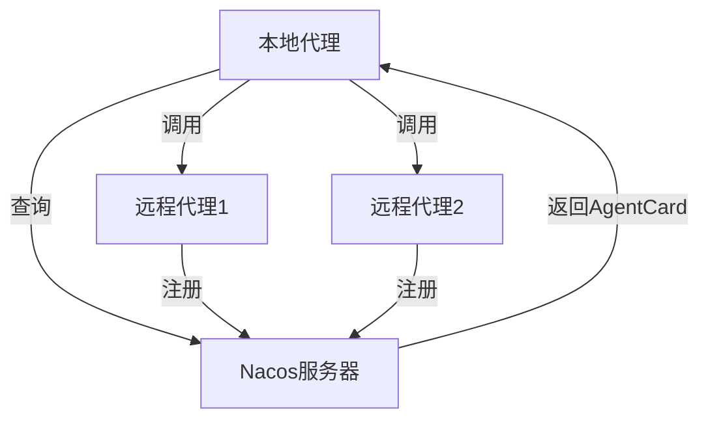

# 多代理协作

<cite>
**本文档引用的文件**
- [SupervisorAgent.java](file://spring-ai-alibaba-agent-framework/src/main/java/com/alibaba/cloud/ai/graph/agent/flow/agent/SupervisorAgent.java)
- [ParallelAgent.java](file://spring-ai-alibaba-agent-framework/src/main/java/com/alibaba/cloud/ai/graph/agent/flow/agent/ParallelAgent.java)
- [MultiAgentExample.java](file://examples/documentation/src/main/java/com/alibaba/cloud/ai/examples/documentation/framework/advanced/MultiAgentExample.java)
- [A2aRemoteAgent.java](file://spring-ai-alibaba-agent-framework/src/main/java/com/alibaba/cloud/ai/graph/agent/a2a/A2aRemoteAgent.java)
- [NacosAgentCardProvider.java](file://spring-boot-starters/spring-ai-alibaba-starter-a2a-nacos/src/main/java/com/alibaba/cloud/ai/a2a/registry/nacos/discovery/NacosAgentCardProvider.java)
- [SupervisorGraphBuildingStrategy.java](file://spring-ai-alibaba-agent-framework/src/main/java/com/alibaba/cloud/ai/graph/agent/flow/strategy/SupervisorGraphBuildingStrategy.java)
- [SupervisorEdgeAction.java](file://spring-ai-alibaba-agent-framework/src/main/java/com/alibaba/cloud/ai/graph/agent/flow/node/SupervisorEdgeAction.java)
- [application.yml](file://examples/documentation/src/main/resources/application.yml)
</cite>

## 目录
1. [引言](#引言)
2. [核心组件分析](#核心组件分析)
3. [SupervisorAgent：任务分解与协调](#supervisoragent任务分解与协调)
4. [ParallelAgent：并行任务处理](#parallelagent并行任务处理)
5. [多代理协作模式](#多代理协作模式)
6. [代理间通信与服务发现](#代理间通信与服务发现)
7. [最佳实践](#最佳实践)
8. [结论](#结论)

## 引言

多代理协作系统是一种先进的架构模式，它通过协调多个专业化的智能代理（Agent）来解决复杂任务。与单一代理系统不同，多代理系统能够将一个复杂的请求分解为多个子任务，并将这些子任务分配给最适合处理它们的子代理。这种模式不仅提高了系统的灵活性和可扩展性，还通过并行处理显著提升了性能。本文档将深入探讨该系统中的高级协作模式，重点分析`SupervisorAgent`如何作为协调者分解和分发任务，`ParallelAgent`如何实现并行处理，以及如何通过Nacos进行服务发现和注册。

**Section sources**
- [MultiAgentExample.java](file://examples/documentation/src/main/java/com/alibaba/cloud/ai/examples/documentation/framework/advanced/MultiAgentExample.java#L45-L56)

## 核心组件分析

多代理协作系统的核心由几个关键组件构成，它们共同协作以实现复杂的任务处理流程。这些组件包括`SupervisorAgent`、`ParallelAgent`、`A2aRemoteAgent`以及支持服务发现的`NacosAgentCardProvider`。`SupervisorAgent`负责任务的分解、路由和结果聚合，是整个协作流程的协调中心。`ParallelAgent`则专注于并行执行多个子代理任务，以最大化处理效率。`A2aRemoteAgent`代表了系统与外部代理的通信接口，使得本地代理能够调用远程服务。最后，`NacosAgentCardProvider`实现了基于Nacos的服务发现机制，为代理间的动态发现和注册提供了基础设施。

**Section sources**
- [SupervisorAgent.java](file://spring-ai-alibaba-agent-framework/src/main/java/com/alibaba/cloud/ai/graph/agent/flow/agent/SupervisorAgent.java#L26-L58)
- [ParallelAgent.java](file://spring-ai-alibaba-agent-framework/src/main/java/com/alibaba/cloud/ai/graph/agent/flow/agent/ParallelAgent.java#L54-L58)
- [A2aRemoteAgent.java](file://spring-ai-alibaba-agent-framework/src/main/java/com/alibaba/cloud/ai/graph/agent/a2a/A2aRemoteAgent.java#L34-L38)
- [NacosAgentCardProvider.java](file://spring-boot-starters/spring-ai-alibaba-starter-a2a-nacos/src/main/java/com/alibaba/cloud/ai/a2a/registry/nacos/discovery/NacosAgentCardProvider.java#L39-L43)

## SupervisorAgent：任务分解与协调

`SupervisorAgent`是多代理系统中的核心协调者，其设计灵感来源于人类团队中的项目经理。它不直接执行具体任务，而是负责将复杂的用户请求分解为一系列子任务，并根据子代理的专业能力，将这些子任务动态地分发给最合适的子代理。任务完成后，`SupervisorAgent`会接收并聚合所有子代理的结果，最终形成一个完整的响应。

### 架构与工作流程

`SupervisorAgent`的内部架构基于一个状态图（State Graph），其工作流程如下：
1.  **接收请求**：`SupervisorAgent`接收来自用户的初始请求。
2.  **决策路由**：利用一个大语言模型（LLM）作为决策引擎，`SupervisorAgent`分析当前的对话历史和任务状态，决定下一步应该将任务路由给哪个子代理，或者判断任务是否已经完成（返回`FINISH`）。
3.  **分发任务**：根据决策结果，将任务分发给指定的子代理执行。
4.  **等待返回**：与`LlmRoutingAgent`不同，子代理在完成任务后，其执行流程会返回到`SupervisorAgent`，而不是直接结束。
5.  **循环决策**：`SupervisorAgent`再次评估任务的完成情况。如果还有未完成的部分，它会继续路由到下一个子代理；如果所有任务都已完成，则返回`FINISH`，结束整个流程。

这种“分发-返回-再决策”的循环模式，使得`SupervisorAgent`能够处理需要多步骤、多轮交互的复杂任务。



**Diagram sources**
- [SupervisorGraphBuildingStrategy.java](file://spring-ai-alibaba-agent-framework/src/main/java/com/alibaba/cloud/ai/graph/agent/flow/strategy/SupervisorGraphBuildingStrategy.java#L40-L76)
- [SupervisorEdgeAction.java](file://spring-ai-alibaba-agent-framework/src/main/java/com/alibaba/cloud/ai/graph/agent/flow/node/SupervisorEdgeAction.java#L40-L131)

### 任务分解与结果聚合

`SupervisorAgent`通过其`systemPrompt`和`instruction`来指导LLM进行任务分解。在`MultiAgentExample.java`的示例中，`SUPERVISOR_INSTRUCTION`详细定义了可用的子代理及其职责，以及决策规则。这使得LLM能够理解如何将一个模糊的请求（如“先写文章，然后翻译”）分解为两个明确的子任务。

结果聚合是`SupervisorAgent`的另一个关键功能。它将所有子代理的输出（如`writer_output`、`translator_output`等）收集到一个统一的状态（`OverAllState`）中。用户可以通过`state.value("outputKey")`来访问任意一个子代理的历史输出，从而实现对整个任务流程的全面追溯和结果整合。

**Section sources**
- [SupervisorAgent.java](file://spring-ai-alibaba-agent-framework/src/main/java/com/alibaba/cloud/ai/graph/agent/flow/agent/SupervisorAgent.java#L26-L58)
- [SupervisorEdgeAction.java](file://spring-ai-alibaba-agent-framework/src/main/java/com/alibaba/cloud/ai/graph/agent/flow/node/SupervisorEdgeAction.java#L50-L92)
- [MultiAgentExample.java](file://examples/documentation/src/main/java/com/alibaba/cloud/ai/examples/documentation/framework/advanced/MultiAgentExample.java#L547-L602)

## ParallelAgent：并行任务处理

`ParallelAgent`实现了“并行扇出/聚合”（Parallel Fan-Out/Gather）的设计模式，旨在通过并行执行来最大化任务处理的吞吐量和效率。当一个任务可以被分解为多个独立的子任务时，`ParallelAgent`是最佳选择。

### 机制与性能优势

`ParallelAgent`的工作机制分为三个阶段：
1.  **扇出（Fan-Out）**：`ParallelAgent`将相同的输入数据同时分发给所有配置的子代理。
2.  **并行执行（Parallel Execution）**：所有子代理使用独立的执行器（Executor）并发地处理任务。这充分利用了多核CPU的优势，显著缩短了总处理时间。
3.  **聚合（Gather）**：当所有子代理都完成执行后，`ParallelAgent`会收集它们的结果，并通过一个可配置的`MergeStrategy`（合并策略）将这些结果合并为一个最终输出。

其性能优势在于，总执行时间不再等于所有子代理执行时间的总和，而是约等于执行时间最长的那个子代理的时间。例如，如果三个子代理分别需要1秒、2秒和1.5秒，那么串行执行需要4.5秒，而并行执行仅需约2秒。



**Diagram sources**
- [ParallelAgent.java](file://spring-ai-alibaba-agent-framework/src/main/java/com/alibaba/cloud/ai/graph/agent/flow/agent/ParallelAgent.java#L37-L47)
- [MultiAgentExample.java](file://examples/documentation/src/main/java/com/alibaba/cloud/ai/examples/documentation/framework/advanced/MultiAgentExample.java#L191-L230)

### 合并策略

`ParallelAgent`提供了灵活的合并策略接口（`MergeStrategy`），允许开发者根据业务需求自定义结果的合并方式。系统内置了多种策略：
- **`DefaultMergeStrategy`**：将所有子代理的输出结果合并到一个`Map`中，键为子代理的`outputKey`。
- **`ListMergeStrategy`**：将所有子代理的输出结果合并为一个`List`。
- **`ConcatenationMergeStrategy`**：将所有子代理的输出结果（字符串）用指定的分隔符连接起来。

此外，开发者还可以实现自定义的`MergeStrategy`，例如，将不同格式的结果进行结构化整合。

**Section sources**
- [ParallelAgent.java](file://spring-ai-alibaba-agent-framework/src/main/java/com/alibaba/cloud/ai/graph/agent/flow/agent/ParallelAgent.java#L107-L354)
- [MultiAgentExample.java](file://examples/documentation/src/main/java/com/alibaba/cloud/ai/examples/documentation/framework/advanced/MultiAgentExample.java#L274-L300)

## 多代理协作模式

通过`MultiAgentExample.java`中的代码实例，我们可以清晰地看到如何配置和编排多个代理协同工作。该示例展示了多种高级协作模式的组合应用。

### 配置与编排

在代码中，首先通过`ReactAgent.builder()`创建了多个专业化的子代理，如`writerAgent`（写作）、`reviewerAgent`（评审）和`translatorAgent`（翻译）。然后，通过`SupervisorAgent.builder()`或`ParallelAgent.builder()`等构建器，将这些子代理作为`subAgents`注入到协调代理中。例如：
```java
SupervisorAgent supervisorAgent = SupervisorAgent.builder()
    .name("content_supervisor")
    .model(chatModel) // 提供决策用的LLM
    .systemPrompt(SUPERVISOR_INSTRUCTION) // 提供详细的决策指南
    .subAgents(List.of(writerAgent, translatorAgent, writingWorkflowAgent)) // 注入子代理
    .build();
```
这种构建器模式（Builder Pattern）使得代理的配置清晰、类型安全且易于维护。

### 混合模式

一个强大的工作流往往不是单一模式的，而是多种模式的混合。例如，在`example7_hybridPattern()`中，系统构建了一个复杂的混合工作流：
1.  使用`ParallelAgent`并行地从Web和数据库收集研究数据。
2.  使用`SequentialAgent`将`ParallelAgent`的输出传递给`analysisAgent`进行分析。
3.  最后，使用`LlmRoutingAgent`根据需求选择生成PDF或HTML格式的报告。

这种组合展示了多代理系统在处理复杂、多阶段任务时的强大能力。

**Section sources**
- [MultiAgentExample.java](file://examples/documentation/src/main/java/com/alibaba/cloud/ai/examples/documentation/framework/advanced/MultiAgentExample.java#L99-L707)

## 代理间通信与服务发现

代理间通信（A2A, Agent-to-Agent）是多代理系统实现分布式协作的基础。系统通过`A2aRemoteAgent`和Nacos服务发现机制，实现了本地代理与远程代理的无缝集成。

### A2A通信机制

`A2aRemoteAgent`是系统与外部代理通信的桥梁。它封装了一个`AgentCard`，该卡片包含了远程代理的元数据，如名称、描述、功能、接口和访问URL。当本地代理需要调用远程服务时，它会创建一个`A2aRemoteAgent`实例，并通过其`initGraph()`方法构建一个调用流程，将请求转发到远程代理。

### 基于Nacos的服务发现

Nacos作为服务注册与发现中心，为A2A通信提供了动态的基础设施。`NacosAgentCardProvider`是`AgentCardProvider`接口的一个实现，它负责从Nacos服务器获取远程代理的`AgentCard`。

其工作流程如下：
1.  **注册**：当一个远程代理启动时，它会将自己的`AgentCard`注册到Nacos服务器。
2.  **发现**：本地代理通过`NacosAgentCardProvider.getAgentCard(agentName)`方法，向Nacos查询指定名称的代理卡片。
3.  **订阅**：`NacosAgentCardProvider`会订阅该代理的变更事件。一旦远程代理的配置（如URL）发生变化，Nacos会推送更新，`NacosAgentCardProvider`会自动刷新本地缓存的`AgentCard`，确保通信的可靠性。

在`application.yml`中，相关配置启用了Nacos的发现和注册功能，使得整个系统能够动态地发现和调用网络中的其他智能代理。



**Diagram sources**
- [A2aRemoteAgent.java](file://spring-ai-alibaba-agent-framework/src/main/java/com/alibaba/cloud/ai/graph/agent/a2a/A2aRemoteAgent.java#L34-L74)
- [NacosAgentCardProvider.java](file://spring-boot-starters/spring-ai-alibaba-starter-a2a-nacos/src/main/java/com/alibaba/cloud/ai/a2a/registry/nacos/discovery/NacosAgentCardProvider.java#L39-L74)
- [application.yml](file://examples/documentation/src/main/resources/application.yml#L14-L24)

**Section sources**
- [A2aRemoteAgent.java](file://spring-ai-alibaba-agent-framework/src/main/java/com/alibaba/cloud/ai/graph/agent/a2a/A2aRemoteAgent.java#L34-L80)
- [NacosAgentCardProvider.java](file://spring-boot-starters/spring-ai-alibaba-starter-a2a-nacos/src/main/java/com/alibaba/cloud/ai/a2a/registry/nacos/discovery/NacosAgentCardProvider.java#L39-L86)
- [application.yml](file://examples/documentation/src/main/resources/application.yml#L14-L24)

## 最佳实践

为了构建高效、可靠的多代理系统，应遵循以下最佳实践：

### 任务分配策略
- **明确职责**：为每个子代理定义清晰、无重叠的职责范围，避免LLM在路由时产生歧义。
- **使用嵌套代理**：对于复杂的子任务，可以将`SequentialAgent`或`ParallelAgent`本身作为`SupervisorAgent`的子代理，实现任务的层次化分解。

### 错误处理
- **重试机制**：`SupervisorEdgeAction`内置了最大2次的重试逻辑，以应对LLM偶尔生成无效路由决策的情况。
- **验证输入**：`ParallelAgentBuilder`在构建时会验证子代理的`outputKey`是否唯一，防止结果聚合时发生冲突。

### 超时控制
- **并发限制**：`ParallelAgent`通过`maxConcurrency`参数限制同时执行的子代理数量，防止资源耗尽。
- **流式处理**：使用`stream()`方法而非`invoke()`，可以更好地处理长时间运行的任务，并实时获取中间结果。

## 结论

本文档深入探讨了多代理协作系统的高级模式。`SupervisorAgent`作为智能协调者，通过LLM驱动的决策实现了复杂任务的动态分解与闭环管理。`ParallelAgent`则通过并行执行极大地提升了系统性能。通过`MultiAgentExample.java`的实例，我们看到了如何灵活地编排这些组件。最后，基于Nacos的A2A服务发现机制，为构建一个可扩展、分布式的智能代理网络提供了坚实的基础。这些模式的结合，为构建下一代智能应用提供了强大的架构支持。