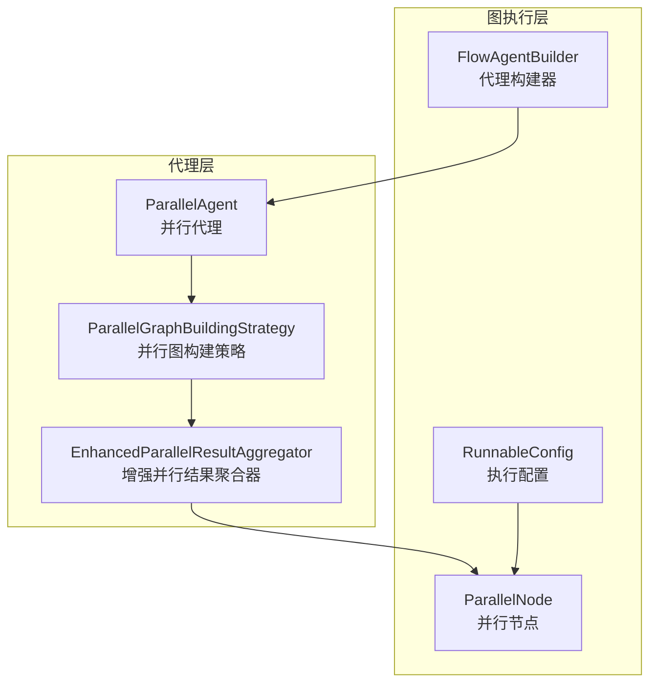
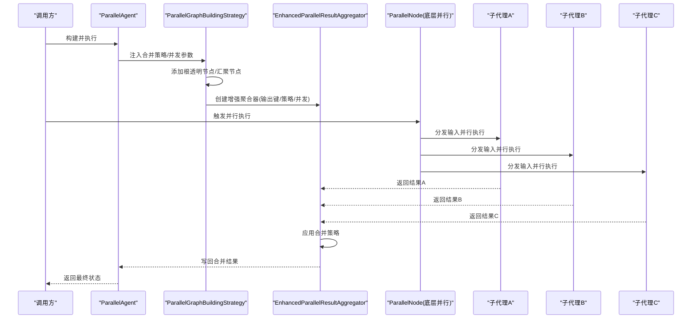
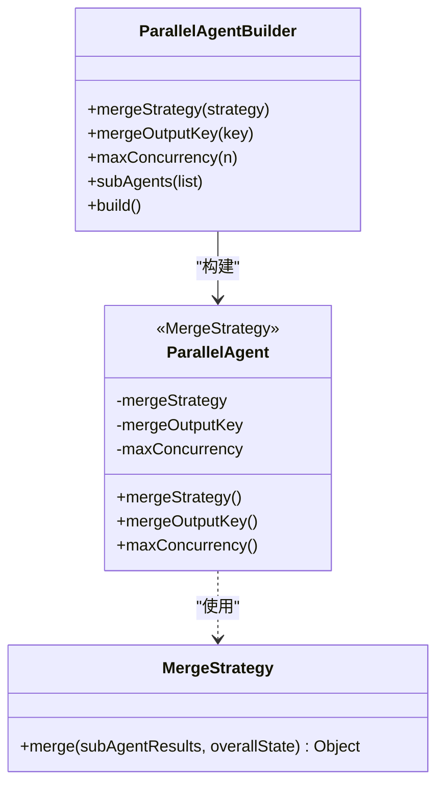
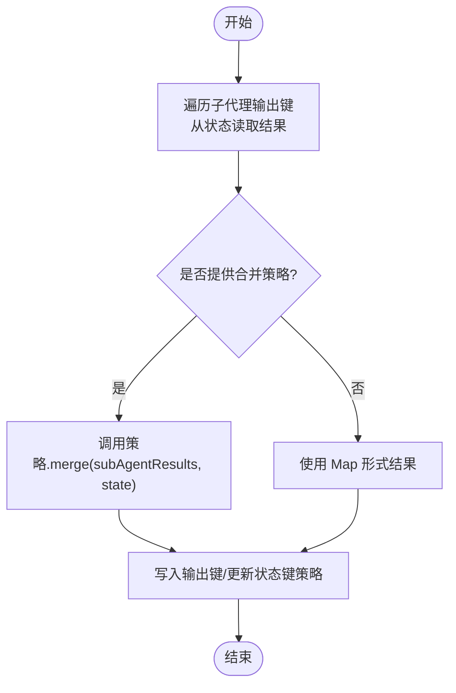
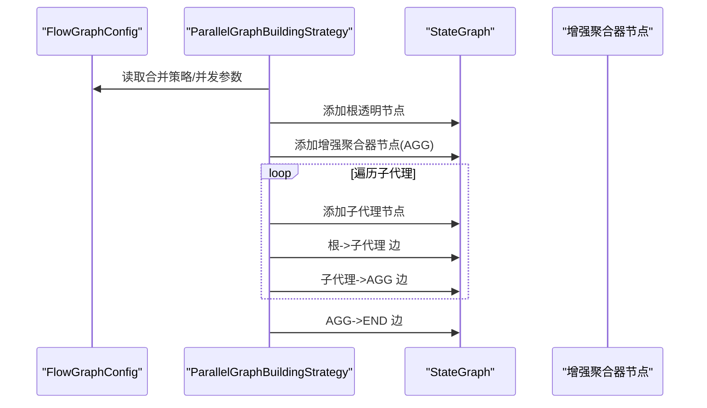
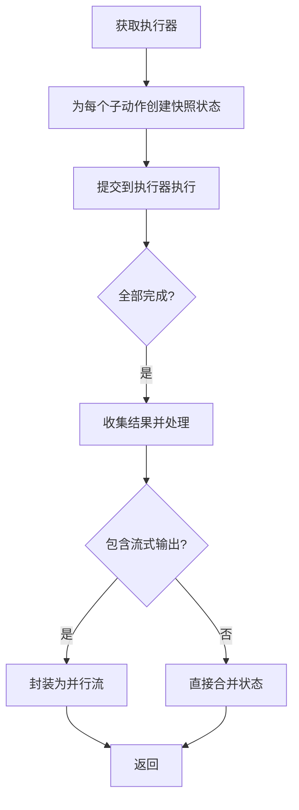
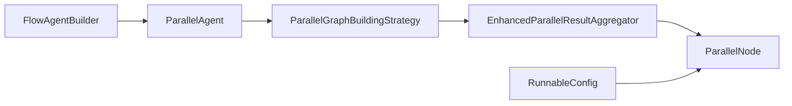

# 并行处理

<cite>
**本文引用的文件**
- [ParallelAgent.java](file://spring-ai-alibaba-agent-framework/src/main/java/com/alibaba/cloud/ai/graph/agent/flow/agent/ParallelAgent.java)
- [EnhancedParallelResultAggregator.java](file://spring-ai-alibaba-agent-framework/src/main/java/com/alibaba/cloud/ai/graph/agent/flow/node/EnhancedParallelResultAggregator.java)
- [ParallelGraphBuildingStrategy.java](file://spring-ai-alibaba-agent-framework/src/main/java/com/alibaba/cloud/ai/graph/agent/flow/strategy/ParallelGraphBuildingStrategy.java)
- [ParallelNode.java](file://spring-ai-alibaba-graph-core/src/main/java/com/alibaba/cloud/ai/graph/internal/node/ParallelNode.java)
- [FlowAgentBuilder.java](file://spring-ai-alibaba-agent-framework/src/main/java/com/alibaba/cloud/ai/graph/agent/flow/builder/FlowAgentBuilder.java)
- [RunnableConfig.java](file://spring-ai-alibaba-graph-core/src/main/java/com/alibaba/cloud/ai/graph/RunnableConfig.java)
- [ParallelAgentTest.java](file://spring-ai-alibaba-agent-framework/src/test/java/com/alibaba/cloud/ai/graph/agent/flow/ParallelAgentTest.java)
- [ParallelAgentIntegrationTest.java](file://spring-ai-alibaba-agent-framework/src/test/java/com/alibaba/cloud/ai/graph/agent/ParallelAgentIntegrationTest.java)
- [MultiAgentExample.java](file://examples/documentation/src/main/java/com/alibaba/cloud/ai/examples/documentation/framework/advanced/MultiAgentExample.java)
</cite>

## 目录
1. [引言](#引言)
2. [项目结构](#项目结构)
3. [核心组件](#核心组件)
4. [架构总览](#架构总览)
5. [详细组件分析](#详细组件分析)
6. [依赖关系分析](#依赖关系分析)
7. [性能考量](#性能考量)
8. [故障排查指南](#故障排查指南)
9. [结论](#结论)
10. [附录](#附录)

## 引言
本文件围绕 ParallelAgent 在多代理协作中的并行处理机制展开，重点说明其如何同时启动多个子代理执行独立任务，并通过 EnhancedParallelResultAggregator 收集与整合结果；进一步分析并行带来的性能优势与资源消耗权衡；并通过示例路径展示如何配置执行策略、并发上限与执行器；最后给出高并发场景下的最佳实践建议（线程池配置与负载均衡策略）。

## 项目结构
并行处理能力由“代理层”与“图执行层”协同实现：
- 代理层：ParallelAgent、EnhancedParallelResultAggregator、ParallelGraphBuildingStrategy
- 图执行层：ParallelNode（底层并行节点）、FlowAgentBuilder（构建器）、RunnableConfig（执行配置）

**图表来源**
- [ParallelAgent.java](file://spring-ai-alibaba-agent-framework/src/main/java/com/alibaba/cloud/ai/graph/agent/flow/agent/ParallelAgent.java#L1-L120)
- [EnhancedParallelResultAggregator.java](file://spring-ai-alibaba-agent-framework/src/main/java/com/alibaba/cloud/ai/graph/agent/flow/node/EnhancedParallelResultAggregator.java#L1-L116)
- [ParallelGraphBuildingStrategy.java](file://spring-ai-alibaba-agent-framework/src/main/java/com/alibaba/cloud/ai/graph/agent/flow/strategy/ParallelGraphBuildingStrategy.java#L1-L131)
- [ParallelNode.java](file://spring-ai-alibaba-graph-core/src/main/java/com/alibaba/cloud/ai/graph/internal/node/ParallelNode.java#L1-L120)
- [FlowAgentBuilder.java](file://spring-ai-alibaba-agent-framework/src/main/java/com/alibaba/cloud/ai/graph/agent/flow/builder/FlowAgentBuilder.java#L1-L162)
- [RunnableConfig.java](file://spring-ai-alibaba-graph-core/src/main/java/com/alibaba/cloud/ai/graph/RunnableConfig.java#L367-L399)

**章节来源**
- [ParallelAgent.java](file://spring-ai-alibaba-agent-framework/src/main/java/com/alibaba/cloud/ai/graph/agent/flow/agent/ParallelAgent.java#L1-L120)
- [ParallelGraphBuildingStrategy.java](file://spring-ai-alibaba-agent-framework/src/main/java/com/alibaba/cloud/ai/graph/agent/flow/strategy/ParallelGraphBuildingStrategy.java#L1-L131)

## 核心组件
- ParallelAgent：声明式并行代理，支持自定义合并策略与最大并发度；在构建图时注入合并策略与并发参数。
- EnhancedParallelResultAggregator：在并行汇聚阶段，从各子代理输出键收集结果，应用合并策略，并将最终结果写回状态。
- ParallelGraphBuildingStrategy：将 ParallelAgent 的 fan-out/fan-in 模式映射为图节点与边，插入增强聚合器节点。
- ParallelNode：底层并行节点，负责并发调度、线程池选择、结果合并与流式输出处理。
- FlowAgentBuilder：提供统一的构建接口，支持设置执行器、序列化器、检查点等。
- RunnableConfig：提供默认并行执行器键值，允许为特定节点或全局配置执行器。

**章节来源**
- [ParallelAgent.java](file://spring-ai-alibaba-agent-framework/src/main/java/com/alibaba/cloud/ai/graph/agent/flow/agent/ParallelAgent.java#L120-L355)
- [EnhancedParallelResultAggregator.java](file://spring-ai-alibaba-agent-framework/src/main/java/com/alibaba/cloud/ai/graph/agent/flow/node/EnhancedParallelResultAggregator.java#L1-L116)
- [ParallelGraphBuildingStrategy.java](file://spring-ai-alibaba-agent-framework/src/main/java/com/alibaba/cloud/ai/graph/agent/flow/strategy/ParallelGraphBuildingStrategy.java#L40-L131)
- [ParallelNode.java](file://spring-ai-alibaba-graph-core/src/main/java/com/alibaba/cloud/ai/graph/internal/node/ParallelNode.java#L73-L120)
- [FlowAgentBuilder.java](file://spring-ai-alibaba-agent-framework/src/main/java/com/alibaba/cloud/ai/graph/agent/flow/builder/FlowAgentBuilder.java#L1-L162)
- [RunnableConfig.java](file://spring-ai-alibaba-graph-core/src/main/java/com/alibaba/cloud/ai/graph/RunnableConfig.java#L367-L399)

## 架构总览
并行处理遵循 Fan-Out/Gather 模式：根透明节点分发输入至所有子代理，子代理并发执行，完成后汇聚到增强聚合器，再写回状态并进入下游。

**图表来源**
- [ParallelGraphBuildingStrategy.java](file://spring-ai-alibaba-agent-framework/src/main/java/com/alibaba/cloud/ai/graph/agent/flow/strategy/ParallelGraphBuildingStrategy.java#L59-L95)
- [EnhancedParallelResultAggregator.java](file://spring-ai-alibaba-agent-framework/src/main/java/com/alibaba/cloud/ai/graph/agent/flow/node/EnhancedParallelResultAggregator.java#L57-L113)
- [ParallelNode.java](file://spring-ai-alibaba-graph-core/src/main/java/com/alibaba/cloud/ai/graph/internal/node/ParallelNode.java#L249-L373)

## 详细组件分析

### ParallelAgent 并行代理
- 设计要点
  - Fan-Out：将输入同时分发给所有子代理。
  - 并行执行：依赖底层 ParallelNode 的并发调度。
  - Gather：通过增强聚合器收集并合并结果。
- 关键能力
  - 合并策略接口：支持 Map/List/字符串拼接等策略，也可自定义。
  - 最大并发度：可限制同时执行的子代理数量。
  - 输出键：指定合并结果写入的状态键。
- 构建校验
  - 至少 2 个子代理（性能限制最多 10 个）。
  - 子代理输出键唯一，避免合并冲突。
  - 根代理需为 FlowAgent，保证输入键可用。

**图表来源**
- [ParallelAgent.java](file://spring-ai-alibaba-agent-framework/src/main/java/com/alibaba/cloud/ai/graph/agent/flow/agent/ParallelAgent.java#L104-L355)

**章节来源**
- [ParallelAgent.java](file://spring-ai-alibaba-agent-framework/src/main/java/com/alibaba/cloud/ai/graph/agent/flow/agent/ParallelAgent.java#L120-L355)

### EnhancedParallelResultAggregator 增强聚合器
- 功能
  - 从 OverAllState 中按子代理输出键收集结果。
  - 若合并策略为 ParallelAgent.MergeStrategy，则调用其 merge；否则返回 Map 形式。
  - 将合并结果写入指定输出键，并更新状态键策略。
- 关键点
  - 支持 GraphResponse 的 resultValue 提取。
  - 日志记录收集过程，便于可观测性。

**图表来源**
- [EnhancedParallelResultAggregator.java](file://spring-ai-alibaba-agent-framework/src/main/java/com/alibaba/cloud/ai/graph/agent/flow/node/EnhancedParallelResultAggregator.java#L57-L113)

**章节来源**
- [EnhancedParallelResultAggregator.java](file://spring-ai-alibaba-agent-framework/src/main/java/com/alibaba/cloud/ai/graph/agent/flow/node/EnhancedParallelResultAggregator.java#L1-L116)

### ParallelGraphBuildingStrategy 并行图构建策略
- 功能
  - 为 ParallelAgent 构建 StateGraph，添加根透明节点与汇聚节点。
  - 插入增强聚合器节点，连接每个子代理到汇聚节点。
  - 校验并行配置（至少 2 个子代理、根代理类型、并发上限）。
- 关键点
  - 从 FlowGraphBuilder.FlowGraphConfig 中读取合并策略与并发参数。
  - 使用 node_async 包装增强聚合器，确保异步并行执行。

**图表来源**
- [ParallelGraphBuildingStrategy.java](file://spring-ai-alibaba-agent-framework/src/main/java/com/alibaba/cloud/ai/graph/agent/flow/strategy/ParallelGraphBuildingStrategy.java#L59-L95)

**章节来源**
- [ParallelGraphBuildingStrategy.java](file://spring-ai-alibaba-agent-framework/src/main/java/com/alibaba/cloud/ai/graph/agent/flow/strategy/ParallelGraphBuildingStrategy.java#L40-L131)

### ParallelNode 底层并行节点
- 功能
  - 获取执行器：优先节点级元数据，其次全局默认并行执行器，最后使用内置默认线程池。
  - 并发执行：为每个子动作提交到执行器，使用 CompletableFuture.allOf 聚合。
  - 结果处理：支持 GraphFlux/传统 Flux/常规对象，统一合并或包装为并行流。
- 默认线程池
  - 核心/最大线程数与队列容量按 CPU 核心数动态计算，拒绝策略采用 CallerRunsPolicy，兼顾吞吐与稳定性。
  - 提供优雅关闭钩子与终止日志。

**图表来源**
- [ParallelNode.java](file://spring-ai-alibaba-graph-core/src/main/java/com/alibaba/cloud/ai/graph/internal/node/ParallelNode.java#L249-L373)
- [RunnableConfig.java](file://spring-ai-alibaba-graph-core/src/main/java/com/alibaba/cloud/ai/graph/RunnableConfig.java#L367-L399)

**章节来源**
- [ParallelNode.java](file://spring-ai-alibaba-graph-core/src/main/java/com/alibaba/cloud/ai/graph/internal/node/ParallelNode.java#L73-L211)
- [RunnableConfig.java](file://spring-ai-alibaba-graph-core/src/main/java/com/alibaba/cloud/ai/graph/RunnableConfig.java#L367-L399)

### 执行器与并发控制
- 设置方式
  - 通过 FlowAgentBuilder.executor 或在 RunnableConfig 中设置默认并行执行器键。
  - 也可为特定节点单独配置执行器。
- 并发上限
  - ParallelAgent.Builder.maxConcurrency 限制同时执行的子代理数量。
  - ParallelGraphBuildingStrategy 与 ParallelNode 的执行器共同作用于并发控制。

**章节来源**
- [FlowAgentBuilder.java](file://spring-ai-alibaba-agent-framework/src/main/java/com/alibaba/cloud/ai/graph/agent/flow/builder/FlowAgentBuilder.java#L108-L121)
- [ParallelAgent.java](file://spring-ai-alibaba-agent-framework/src/main/java/com/alibaba/cloud/ai/graph/agent/flow/agent/ParallelAgent.java#L173-L181)
- [ParallelGraphBuildingStrategy.java](file://spring-ai-alibaba-agent-framework/src/main/java/com/alibaba/cloud/ai/graph/agent/flow/strategy/ParallelGraphBuildingStrategy.java#L118-L128)
- [ParallelNode.java](file://spring-ai-alibaba-graph-core/src/main/java/com/alibaba/cloud/ai/graph/internal/node/ParallelNode.java#L73-L81)

## 依赖关系分析
- 组件耦合
  - ParallelAgent 与 ParallelGraphBuildingStrategy 解耦：前者专注语义，后者专注图结构。
  - EnhancedParallelResultAggregator 与 ParallelAgent.MergeStrategy 解耦：通过对象注入实现策略切换。
  - ParallelNode 与执行器解耦：通过 RunnableConfig 的元数据键选择执行器。
- 外部依赖
  - 线程池与拒绝策略来自 JDK 线程池实现。
  - 流式输出处理依赖 GraphFlux/Flux 抽象。

**图表来源**
- [ParallelAgent.java](file://spring-ai-alibaba-agent-framework/src/main/java/com/alibaba/cloud/ai/graph/agent/flow/agent/ParallelAgent.java#L75-L82)
- [ParallelGraphBuildingStrategy.java](file://spring-ai-alibaba-agent-framework/src/main/java/com/alibaba/cloud/ai/graph/agent/flow/strategy/ParallelGraphBuildingStrategy.java#L59-L95)
- [EnhancedParallelResultAggregator.java](file://spring-ai-alibaba-agent-framework/src/main/java/com/alibaba/cloud/ai/graph/agent/flow/node/EnhancedParallelResultAggregator.java#L49-L55)
- [ParallelNode.java](file://spring-ai-alibaba-graph-core/src/main/java/com/alibaba/cloud/ai/graph/internal/node/ParallelNode.java#L73-L81)
- [FlowAgentBuilder.java](file://spring-ai-alibaba-agent-framework/src/main/java/com/alibaba/cloud/ai/graph/agent/flow/builder/FlowAgentBuilder.java#L108-L121)
- [RunnableConfig.java](file://spring-ai-alibaba-graph-core/src/main/java/com/alibaba/cloud/ai/graph/RunnableConfig.java#L367-L399)

**章节来源**
- [ParallelAgent.java](file://spring-ai-alibaba-agent-framework/src/main/java/com/alibaba/cloud/ai/graph/agent/flow/agent/ParallelAgent.java#L75-L82)
- [ParallelGraphBuildingStrategy.java](file://spring-ai-alibaba-agent-framework/src/main/java/com/alibaba/cloud/ai/graph/agent/flow/strategy/ParallelGraphBuildingStrategy.java#L59-L95)
- [EnhancedParallelResultAggregator.java](file://spring-ai-alibaba-agent-framework/src/main/java/com/alibaba/cloud/ai/graph/agent/flow/node/EnhancedParallelResultAggregator.java#L49-L55)
- [ParallelNode.java](file://spring-ai-alibaba-graph-core/src/main/java/com/alibaba/cloud/ai/graph/internal/node/ParallelNode.java#L73-L81)
- [FlowAgentBuilder.java](file://spring-ai-alibaba-agent-framework/src/main/java/com/alibaba/cloud/ai/graph/agent/flow/builder/FlowAgentBuilder.java#L108-L121)
- [RunnableConfig.java](file://spring-ai-alibaba-graph-core/src/main/java/com/alibaba/cloud/ai/graph/RunnableConfig.java#L367-L399)

## 性能考量
- 并发度与吞吐
  - ParallelAgent.maxConcurrency 限制同时执行的子代理数量，避免过度并发导致上下文切换与锁竞争。
  - ParallelNode 默认线程池按 CPU 核心数动态计算核心/最大线程数与队列容量，适合混合 IO/CPU 场景。
- 资源消耗
  - 线程池大小与队列容量影响内存占用与 GC 压力；CallerRunsPolicy 在极端情况下让调用线程执行任务，避免丢弃。
  - GraphFlux/Flux 流式输出会引入额外的背压与缓冲开销，需结合业务场景评估。
- 可观测性
  - ParallelNode 在 beforeExecute/afterExecute 中记录日志，便于定位执行异常与性能瓶颈。
  - 增强聚合器记录收集过程，有助于排查合并策略与键冲突问题。

[本节为通用指导，无需列出具体文件来源]

## 故障排查指南
- 常见问题与定位
  - 子代理输出键冲突：构建期校验失败，提示重复输出键；应为每个子代理分配唯一输出键。
  - 子代理数量不合法：少于 2 个或超过 10 个会触发异常；请调整子代理数量。
  - 并发上限非法：maxConcurrency < 1 会报错；请设置为正整数。
  - 执行器未生效：确认通过 FlowAgentBuilder.executor 或 RunnableConfig.defaultParallelExecutor 正确配置。
  - 并行流式输出异常：检查 GraphFlux/Flux 的节点 ID 与合并逻辑。
- 单元测试与集成测试
  - 单元测试覆盖了构建器链式调用、序列化器、执行器配置、合并策略与并发控制。
  - 集成测试验证了真实 LLM 场景下的并行执行与结果合并。

**章节来源**
- [ParallelAgentTest.java](file://spring-ai-alibaba-agent-framework/src/test/java/com/alibaba/cloud/ai/graph/agent/flow/ParallelAgentTest.java#L140-L180)
- [ParallelAgentIntegrationTest.java](file://spring-ai-alibaba-agent-framework/src/test/java/com/alibaba/cloud/ai/graph/agent/ParallelAgentIntegrationTest.java#L232-L341)

## 结论
ParallelAgent 通过“并行分发 + 增强聚合”的设计，在多代理协作中实现了高吞吐与灵活的合并策略。配合 ParallelNode 的默认线程池与可插拔执行器，可在不同负载下平衡性能与稳定性。通过合理设置并发上限与执行器，可在高并发场景下获得更优的资源利用与响应时间表现。

[本节为总结性内容，无需列出具体文件来源]

## 附录

### 配置与示例路径
- 配置执行策略与并发上限
  - 合并策略：参考 [ParallelAgent.java](file://spring-ai-alibaba-agent-framework/src/main/java/com/alibaba/cloud/ai/graph/agent/flow/agent/ParallelAgent.java#L104-L161)
  - 最大并发度：参考 [ParallelAgent.java](file://spring-ai-alibaba-agent-framework/src/main/java/com/alibaba/cloud/ai/graph/agent/flow/agent/ParallelAgent.java#L173-L181)
- 设置执行器
  - 通过构建器：参考 [FlowAgentBuilder.java](file://spring-ai-alibaba-agent-framework/src/main/java/com/alibaba/cloud/ai/graph/agent/flow/builder/FlowAgentBuilder.java#L108-L121)
  - 通过 RunnableConfig 默认并行执行器：参考 [RunnableConfig.java](file://spring-ai-alibaba-graph-core/src/main/java/com/alibaba/cloud/ai/graph/RunnableConfig.java#L367-L399)
- 并行流式执行示例
  - 参考 [MultiAgentExample.java](file://examples/documentation/src/main/java/com/alibaba/cloud/ai/examples/documentation/framework/advanced/MultiAgentExample.java#L232-L265)
- 集成测试验证
  - 并行执行与合并策略：参考 [ParallelAgentIntegrationTest.java](file://spring-ai-alibaba-agent-framework/src/test/java/com/alibaba/cloud/ai/graph/agent/ParallelAgentIntegrationTest.java#L53-L132)
  - 并发上限测试：参考 [ParallelAgentIntegrationTest.java](file://spring-ai-alibaba-agent-framework/src/test/java/com/alibaba/cloud/ai/graph/agent/ParallelAgentIntegrationTest.java#L310-L341)