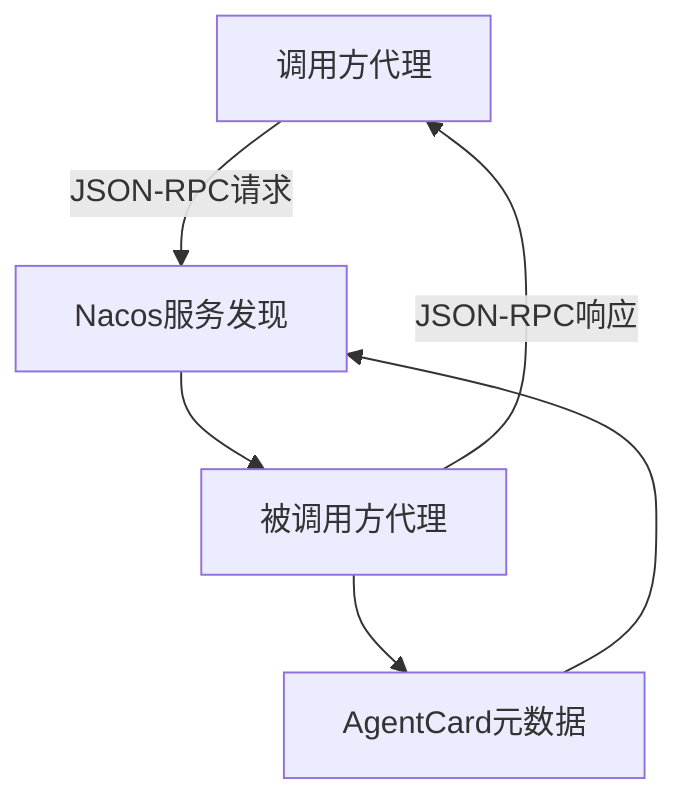
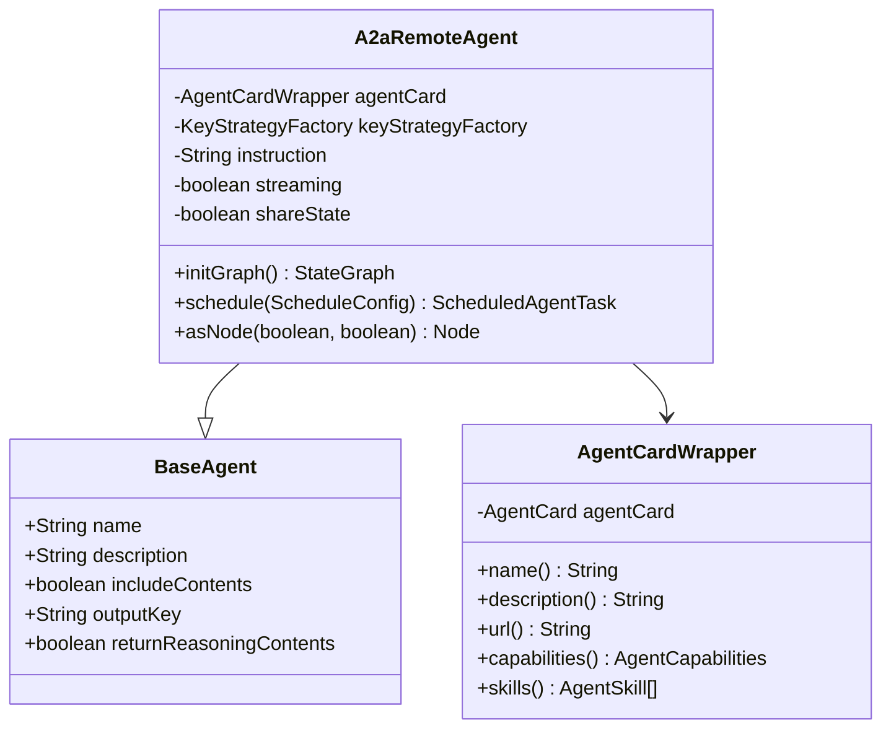
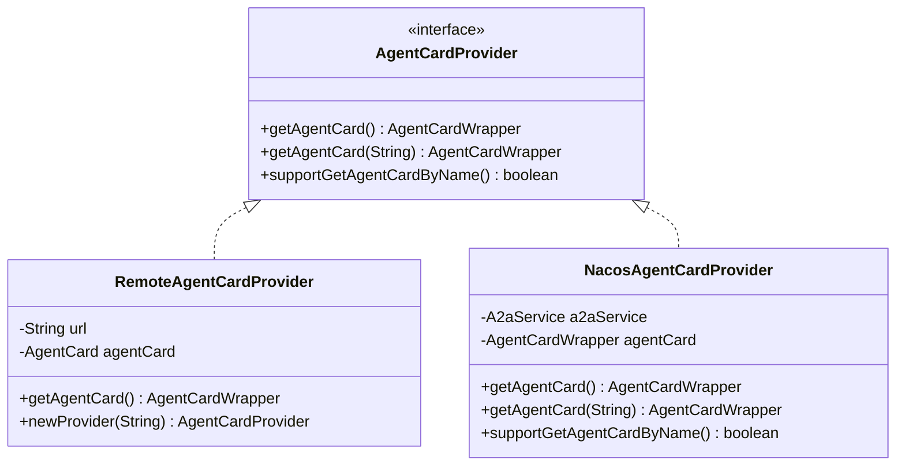
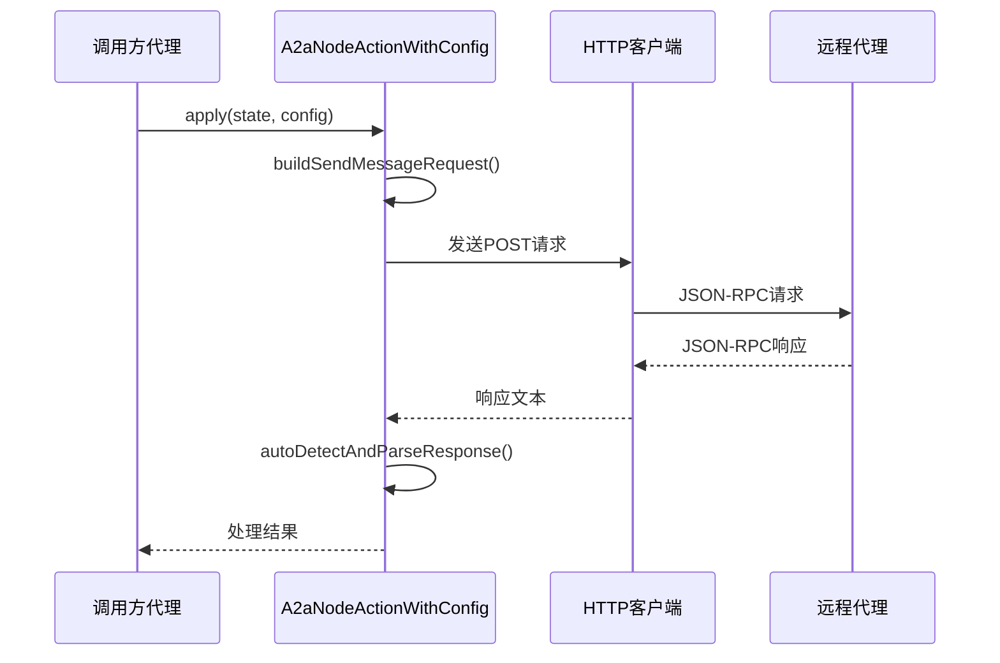
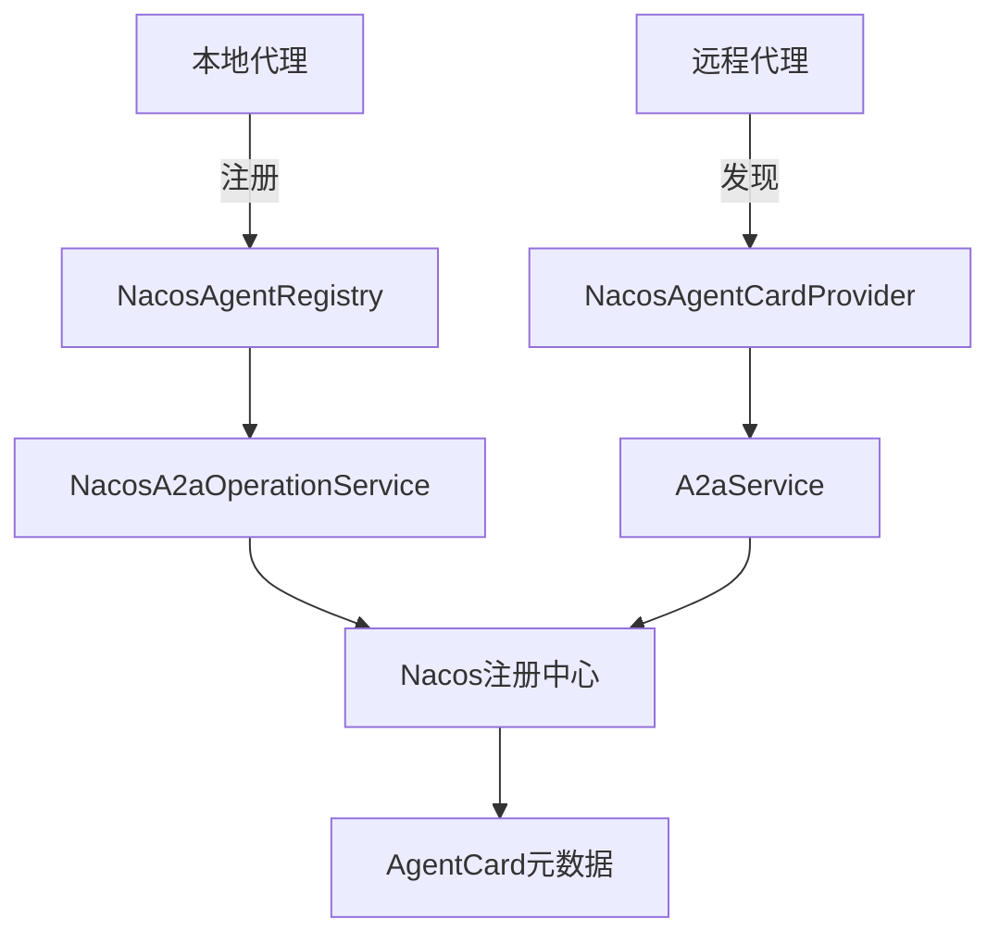

# 通信机制

<cite>
**本文档引用的文件**  
- [A2aRemoteAgent.java](file://spring-ai-alibaba-agent-framework/src/main/java/com/alibaba/cloud/ai/graph/agent/a2a/A2aRemoteAgent.java)
- [AgentCardProvider.java](file://spring-ai-alibaba-agent-framework/src/main/java/com/alibaba/cloud/ai/graph/agent/a2a/AgentCardProvider.java)
- [RemoteAgentCardProvider.java](file://spring-ai-alibaba-agent-framework/src/main/java/com/alibaba/cloud/ai/graph/agent/a2a/RemoteAgentCardProvider.java)
- [AgentCardWrapper.java](file://spring-ai-alibaba-agent-framework/src/main/java/com/alibaba/cloud/ai/graph/agent/a2a/AgentCardWrapper.java)
- [A2aNodeActionWithConfig.java](file://spring-ai-alibaba-agent-framework/src/main/java/com/alibaba/cloud/ai/graph/agent/a2a/A2aNodeActionWithConfig.java)
- [NacosAgentCardProvider.java](file://spring-boot-starters/spring-ai-alibaba-starter-a2a-nacos/src/main/java/com/alibaba/cloud/ai/a2a/registry/nacos/discovery/NacosAgentCardProvider.java)
- [NacosAgentRegistry.java](file://spring-boot-starters/spring-ai-alibaba-starter-a2a-nacos/src/main/java/com/alibaba/cloud/ai/a2a/registry/nacos/register/NacosAgentRegistry.java)
- [JsonRpcA2aRequestHandler.java](file://spring-boot-starters/spring-ai-alibaba-starter-a2a-nacos/src/main/java/com/alibaba/cloud/ai/a2a/core/server/JsonRpcA2aRequestHandler.java)
- [JsonRpcA2aRouterProvider.java](file://spring-boot-starters/spring-ai-alibaba-starter-a2a-nacos/src/main/java/com/alibaba/cloud/ai/a2a/core/route/JsonRpcA2aRouterProvider.java)
</cite>

## 目录
1. [引言](#引言)
2. [A2A通信协议概述](#a2a通信协议概述)
3. [A2aRemoteAgent实现机制](#a2aremotagent实现机制)
4. [AgentCardProvider与服务发现](#agentcardprovider与服务发现)
5. [JSON-RPC调用流程分析](#json-rpc调用流程分析)
6. [Nacos服务注册与发现](#nacos服务注册与发现)
7. [通信配置与安全](#通信配置与安全)
8. [性能与可靠性](#性能与可靠性)
9. [总结](#总结)

## 引言
本文档全面解析Spring AI Alibaba框架中多代理协作的通信机制，重点介绍A2A（Agent-to-Agent）通信协议。文档详细阐述了A2aRemoteAgent如何通过JSON-RPC调用远程代理，以及Nacos在服务发现和注册中的作用。同时，文档说明了AgentCardProvider如何暴露代理的元数据（如名称、描述、工具列表）以支持动态发现，并通过配置示例展示如何设置A2A客户端和服务端。

## A2A通信协议概述
A2A（Agent-to-Agent）通信协议是Spring AI Alibaba框架中实现多代理协作的核心机制。该协议基于JSON-RPC 2.0标准，通过定义标准化的通信格式和接口，实现了不同代理之间的互操作性。A2A协议的核心是AgentCard，它作为代理的元数据描述，包含了代理的名称、描述、功能、接口、安全机制等关键信息。

A2A通信采用客户端-服务器架构，其中调用方代理作为客户端，被调用方代理作为服务端。通信过程通过HTTP/HTTPS协议传输JSON-RPC消息，支持同步和异步两种调用模式。协议设计考虑了跨网络调用的安全性和可靠性，通过Nacos服务注册中心实现动态服务发现和负载均衡。

**图示来源**  
- [JsonRpcA2aRouterProvider.java](file://spring-boot-starters/spring-ai-alibaba-starter-a2a-nacos/src/main/java/com/alibaba/cloud/ai/a2a/core/route/JsonRpcA2aRouterProvider.java)
- [NacosAgentRegistry.java](file://spring-boot-starters/spring-ai-alibaba-starter-a2a-nacos/src/main/java/com/alibaba/cloud/ai/a2a/registry/nacos/register/NacosAgentRegistry.java)

## A2aRemoteAgent实现机制
A2aRemoteAgent是A2A通信协议的客户端实现，负责发起对远程代理的调用。该类继承自BaseAgent，通过Builder模式构建，封装了远程代理调用的全部逻辑。A2aRemoteAgent的核心功能是通过AgentCardWrapper获取远程代理的元数据，并基于这些元数据构建JSON-RPC请求。

A2aRemoteAgent的初始化过程在initGraph方法中完成，该方法创建一个状态图，包含一个A2aNode节点，该节点执行A2aNodeActionWithConfig动作。当代理被调用时，系统会根据配置决定是否启用流式传输（streaming），并相应地调用不同的处理逻辑。

**图示来源**  
- [A2aRemoteAgent.java](file://spring-ai-alibaba-agent-framework/src/main/java/com/alibaba/cloud/ai/graph/agent/a2a/A2aRemoteAgent.java)
- [AgentCardWrapper.java](file://spring-ai-alibaba-agent-framework/src/main/java/com/alibaba/cloud/ai/graph/agent/a2a/AgentCardWrapper.java)

**本节来源**  
- [A2aRemoteAgent.java](file://spring-ai-alibaba-agent-framework/src/main/java/com/alibaba/cloud/ai/graph/agent/a2a/A2aRemoteAgent.java#L34-L233)

## AgentCardProvider与服务发现
AgentCardProvider是A2A通信协议中服务发现的核心接口，负责获取远程代理的元数据信息。该接口定义了getAgentCard()和getAgentCard(String agentName)两个方法，分别用于获取默认代理和指定名称代理的元数据。通过supportGetAgentCardByName()方法，可以判断实现类是否支持按名称获取代理卡。

在Spring AI Alibaba框架中，提供了多种AgentCardProvider实现，其中NacosAgentCardProvider是基于Nacos注册中心的实现。该实现通过A2aService从Nacos获取代理元数据，并支持订阅代理卡的变更事件，实现动态更新。当代理卡信息发生变化时，系统会自动通知所有订阅者，确保通信双方始终使用最新的元数据。

**图示来源**  
- [AgentCardProvider.java](file://spring-ai-alibaba-agent-framework/src/main/java/com/alibaba/cloud/ai/graph/agent/a2a/AgentCardProvider.java)
- [RemoteAgentCardProvider.java](file://spring-ai-alibaba-agent-framework/src/main/java/com/alibaba/cloud/ai/graph/agent/a2a/RemoteAgentCardProvider.java)
- [NacosAgentCardProvider.java](file://spring-boot-starters/spring-ai-alibaba-starter-a2a-nacos/src/main/java/com/alibaba/cloud/ai/a2a/registry/nacos/discovery/NacosAgentCardProvider.java)

**本节来源**  
- [AgentCardProvider.java](file://spring-ai-alibaba-agent-framework/src/main/java/com/alibaba/cloud/ai/graph/agent/a2a/AgentCardProvider.java#L24-L55)
- [RemoteAgentCardProvider.java](file://spring-ai-alibaba-agent-framework/src/main/java/com/alibaba/cloud/ai/graph/agent/a2a/RemoteAgentCardProvider.java#L26-L72)
- [NacosAgentCardProvider.java](file://spring-boot-starters/spring-ai-alibaba-starter-a2a-nacos/src/main/java/com/alibaba/cloud/ai/a2a/registry/nacos/discovery/NacosAgentCardProvider.java#L39-L86)

## JSON-RPC调用流程分析
A2A通信协议的JSON-RPC调用流程由A2aNodeActionWithConfig类实现，该类负责构建和发送JSON-RPC请求，并处理响应。调用流程分为同步和异步两种模式，由streaming配置决定。当启用流式传输时，系统使用Server-Sent Events（SSE）协议实现实时数据流传输。

JSON-RPC请求的构建过程在buildSendMessageRequest和buildSendStreamingMessageRequest方法中完成。请求包含id、jsonrpc版本、method和params四个核心字段。其中method字段指定调用的方法，如"message/send"或"message/stream"，params字段包含消息内容和元数据。请求通过HTTP POST方法发送到远程代理的URL，响应则根据调用模式返回JSON对象或SSE流。

**图示来源**  
- [A2aNodeActionWithConfig.java](file://spring-ai-alibaba-agent-framework/src/main/java/com/alibaba/cloud/ai/graph/agent/a2a/A2aNodeActionWithConfig.java)
- [JsonRpcA2aRequestHandler.java](file://spring-boot-starters/spring-ai-alibaba-starter-a2a-nacos/src/main/java/com/alibaba/cloud/ai/a2a/core/server/JsonRpcA2aRequestHandler.java)

**本节来源**  
- [A2aNodeActionWithConfig.java](file://spring-ai-alibaba-agent-framework/src/main/java/com/alibaba/cloud/ai/graph/agent/a2a/A2aNodeActionWithConfig.java#L60-L768)

## Nacos服务注册与发现
Nacos在A2A通信协议中扮演着服务注册与发现的核心角色。NacosAgentRegistry负责将本地代理注册到Nacos注册中心，而NacosAgentCardProvider则负责从Nacos发现远程代理。这种设计实现了服务的动态注册和发现，支持微服务架构下的弹性伸缩和故障转移。

代理注册过程由NacosA2aOperationService实现，该服务将代理的AgentCard转换为Nacos可识别的格式，并通过Nacos API注册到指定的服务组。注册信息包括代理的名称、URL、元数据等，这些信息被存储在Nacos的配置中心，供其他代理发现和调用。当代理实例发生变化时，Nacos会自动通知所有订阅者，确保服务列表的实时性。

**图示来源**  
- [NacosAgentRegistry.java](file://spring-boot-starters/spring-ai-alibaba-starter-a2a-nacos/src/main/java/com/alibaba/cloud/ai/a2a/registry/nacos/register/NacosAgentRegistry.java)
- [NacosA2aOperationService.java](file://spring-boot-starters/spring-ai-alibaba-starter-a2a-nacos/src/main/java/com/alibaba/cloud/ai/a2a/registry/nacos/service/NacosA2aOperationService.java)
- [NacosAgentCardProvider.java](file://spring-boot-starters/spring-ai-alibaba-starter-a2a-nacos/src/main/java/com/alibaba/cloud/ai/a2a/registry/nacos/discovery/NacosAgentCardProvider.java)

**本节来源**  
- [NacosAgentRegistry.java](file://spring-boot-starters/spring-ai-alibaba-starter-a2a-nacos/src/main/java/com/alibaba/cloud/ai/a2a/registry/nacos/register/NacosAgentRegistry.java#L30-L51)
- [NacosA2aOperationService.java](file://spring-boot-starters/spring-ai-alibaba-starter-a2a-nacos/src/main/java/com/alibaba/cloud/ai/a2a/registry/nacos/service/NacosA2aOperationService.java#L38-L68)

## 通信配置与安全
A2A通信协议的配置和安全机制通过多种方式实现。首先，通过A2aClientAgentCardProperties和A2aServerProperties等配置类，可以灵活设置客户端和服务端的通信参数，如超时时间、重试策略、连接池大小等。其次，协议支持多种安全机制，包括基于Token的认证、HTTPS加密传输、请求签名等。

在安全方面，AgentCard中定义了securitySchemes和security字段，用于描述代理支持的安全方案和配置。调用方在发起请求时，需要根据这些信息提供相应的认证凭证。例如，当代理要求Bearer Token认证时，调用方需要在请求头中包含"Authorization: Bearer <token>"。此外，框架还支持动态凭证管理，通过Nacos配置中心集中管理认证信息，提高安全性。

**本节来源**  
- [A2aNodeActionWithConfig.java](file://spring-ai-alibaba-agent-framework/src/main/java/com/alibaba/cloud/ai/graph/agent/a2a/A2aNodeActionWithConfig.java#L733-L758)
- [JsonRpcA2aRequestHandler.java](file://spring-boot-starters/spring-ai-alibaba-starter-a2a-nacos/src/main/java/com/alibaba/cloud/ai/a2a/core/server/JsonRpcA2aRequestHandler.java#L74-L84)

## 性能与可靠性
A2A通信协议在设计时充分考虑了性能和可靠性。性能方面，通过流式传输（streaming）支持大文件和实时数据的高效传输，减少了内存占用和延迟。可靠性方面，实现了超时重试、断路器、熔断等机制，确保在网络不稳定或服务故障时仍能提供稳定的服务。

通信延迟主要受网络带宽、序列化开销和远程代理处理时间的影响。为优化性能，框架采用了高效的JSON序列化库（Fastjson），并支持异步非阻塞IO，提高了并发处理能力。故障恢复策略包括自动重试、备用代理切换和状态恢复，当主代理不可用时，系统可以自动切换到备用代理，确保服务的连续性。

**本节来源**  
- [A2aNodeActionWithConfig.java](file://spring-ai-alibaba-agent-framework/src/main/java/com/alibaba/cloud/ai/graph/agent/a2a/A2aNodeActionWithConfig.java#L208-L307)
- [JsonRpcA2aRequestHandler.java](file://spring-boot-starters/spring-ai-alibaba-starter-a2a-nacos/src/main/java/com/alibaba/cloud/ai/a2a/core/server/JsonRpcA2aRequestHandler.java#L79-L84)

## 总结
本文档全面解析了Spring AI Alibaba框架中A2A通信协议的实现机制。通过A2aRemoteAgent、AgentCardProvider和Nacos服务注册中心的协同工作，实现了高效、可靠、安全的多代理协作。A2A协议基于JSON-RPC标准，支持同步和异步调用，通过流式传输优化了大文件和实时数据的传输性能。Nacos作为服务注册与发现的核心，提供了动态服务管理和故障恢复能力。整体架构设计充分考虑了微服务环境下的弹性伸缩和高可用性需求，为构建复杂的多代理系统提供了坚实的基础。