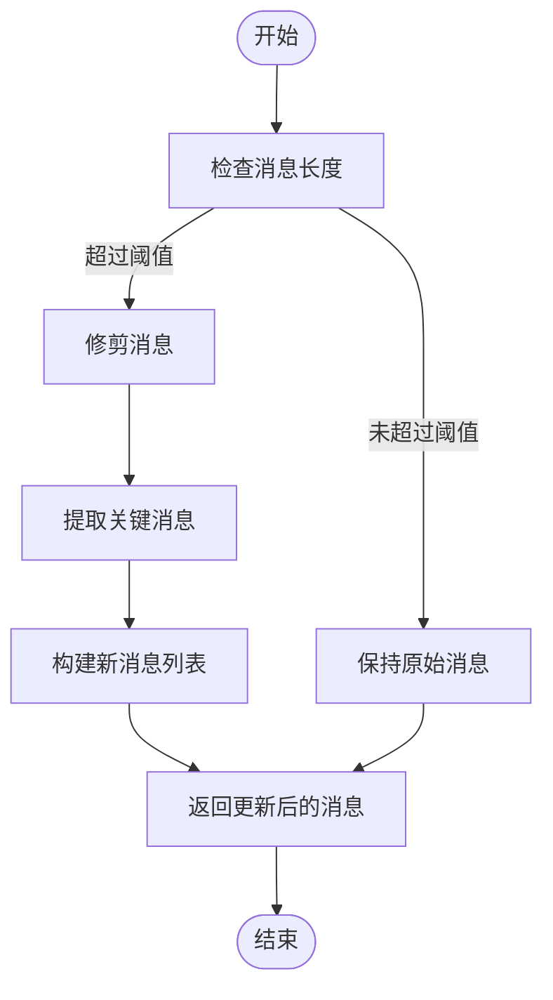
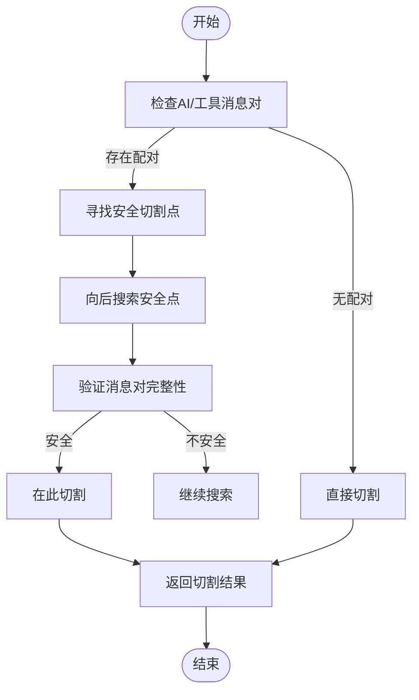
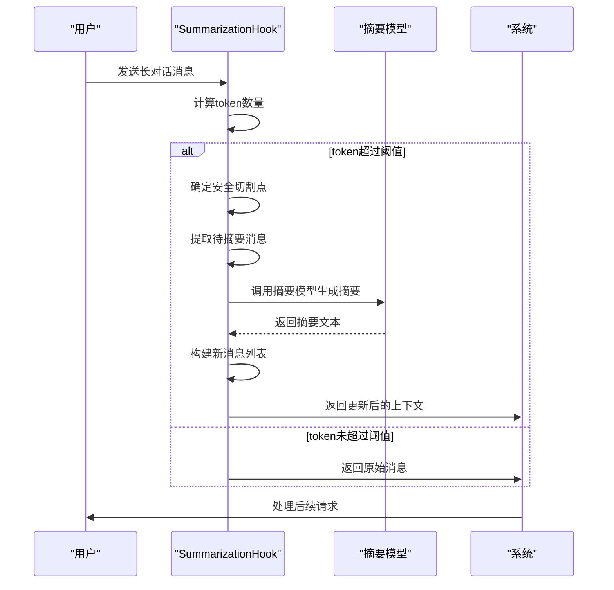
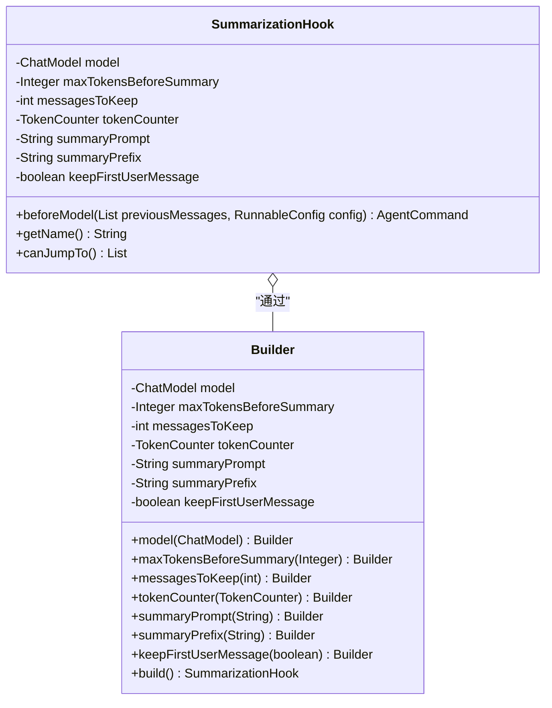

# 上下文管理

<cite>
**本文档引用的文件**   
- [MessagesModelHook.java](file://spring-ai-alibaba-agent-framework/src/main/java/com/alibaba/cloud/ai/graph/agent/hook/messages/MessagesModelHook.java)
- [SummarizationHook.java](file://spring-ai-alibaba-agent-framework/src/main/java/com/alibaba/cloud/ai/graph/agent/hook/summarization/SummarizationHook.java)
- [MessagesModelHookTest.java](file://spring-ai-alibaba-agent-framework/src/test/java/com/alibaba/cloud/ai/graph/agent/hooks/messages/MessagesModelHookTest.java)
- [MemoryExample.java](file://examples/documentation/src/main/java/com/alibaba/cloud/ai/examples/documentation/framework/tutorials/MemoryExample.java)
- [ContextEngineeringExample.java](file://examples/documentation/src/main/java/com/alibaba/cloud/ai/examples/documentation/framework/advanced/ContextEngineeringExample.java)
- [AgentCommand.java](file://spring-ai-alibaba-agent-framework/src/main/java/com/alibaba/cloud/ai/graph/agent/hook/messages/AgentCommand.java)
- [UpdatePolicy.java](file://spring-ai-alibaba-agent-framework/src/main/java/com/alibaba/cloud/ai/graph/agent/hook/messages/UpdatePolicy.java)
- [TokenCounter.java](file://spring-ai-alibaba-agent-framework/src/main/java/com/alibaba/cloud/ai/graph/agent/hook/TokenCounter.java)
</cite>

## 目录
1. [MessagesModelHook概述](#messagesmodelhook概述)
2. [消息压缩与优化机制](#消息压缩与优化机制)
3. [消息聚合与去重实现](#消息聚合与去重实现)
4. [摘要生成机制](#摘要生成机制)
5. [配置选项说明](#配置选项说明)
6. [长对话场景性能优化](#长对话场景性能优化)
7. [性能测试数据对比](#性能测试数据对比)

## MessagesModelHook概述

MessagesModelHook是Spring AI Alibaba框架中用于上下文管理的核心组件，它在大模型的输入输出消息处理过程中扮演着关键角色。该钩子通过在模型调用前后拦截消息流，实现了对对话历史的智能管理。MessagesModelHook作为抽象类，继承自Hook接口，为开发者提供了beforeModel和afterModel两个核心方法，允许在模型调用前和调用后对消息进行处理。

该钩子的主要作用是优化大模型的输入输出消息，减少token消耗，从而提高系统性能和降低成本。通过实现MessagesModelHook，开发者可以自定义消息处理逻辑，包括消息压缩、聚合、去重和摘要生成等操作。钩子通过AgentCommand对象返回处理结果，其中包含了更新后的消息列表和更新策略。

MessagesModelHook的设计采用了责任链模式，多个钩子可以按顺序执行，每个钩子都可以对消息进行处理。钩子还支持跳转功能，可以通过返回JumpTo.end来跳过后续钩子和模型调用，这在某些特定场景下非常有用，如缓存命中或预设响应。

**Section sources**
- [MessagesModelHook.java](file://spring-ai-alibaba-agent-framework/src/main/java/com/alibaba/cloud/ai/graph/agent/hook/messages/MessagesModelHook.java#L32-L149)

## 消息压缩与优化机制

MessagesModelHook通过多种机制实现消息的压缩与优化，有效减少大模型的token消耗。核心机制包括消息修剪、消息删除和消息替换等策略。消息修剪策略通过保留对话的关键部分（如第一条消息和最近的几条消息）来减少上下文长度，同时保持对话的连贯性。

在实现上，MessagesModelHook提供了UpdatePolicy枚举，包含REPLACE和APPEND两种更新策略。REPLACE策略会完全替换现有的消息列表，而APPEND策略则在现有消息基础上追加新消息。这种灵活的策略选择使得开发者可以根据具体需求选择最合适的处理方式。

消息压缩的具体实现通常在beforeModel方法中完成。当检测到消息数量或token数量超过预设阈值时，钩子会触发压缩逻辑。例如，MessageTrimmingHook实现会保留第一条消息和最后几条消息，删除中间的消息，从而显著减少上下文长度。这种策略特别适用于长对话场景，可以有效控制token消耗。

**Diagram sources **
- [MessagesModelHook.java](file://spring-ai-alibaba-agent-framework/src/main/java/com/alibaba/cloud/ai/graph/agent/hook/messages/MessagesModelHook.java#L35-L41)
- [MemoryExample.java](file://examples/documentation/src/main/java/com/alibaba/cloud/ai/examples/documentation/framework/tutorials/MemoryExample.java#L353-L389)

**Section sources**
- [MessagesModelHook.java](file://spring-ai-alibaba-agent-framework/src/main/java/com/alibaba/cloud/ai/graph/agent/hook/messages/MessagesModelHook.java#L35-L41)
- [MemoryExample.java](file://examples/documentation/src/main/java/com/alibaba/cloud/ai/examples/documentation/framework/tutorials/MemoryExample.java#L353-L389)

## 消息聚合与去重实现

消息聚合与去重是MessagesModelHook的重要功能，通过智能地合并和消除冗余消息来优化上下文。消息聚合主要通过识别对话中的关键信息点，并将相关信息进行整合。例如，在多次讨论同一主题时，钩子可以将分散的信息点聚合成一个完整的上下文摘要。

去重机制则通过识别和消除重复或相似的消息来减少冗余。实现上，系统会维护一个消息哈希集合，通过比较消息内容的哈希值来判断是否重复。对于工具调用场景，钩子还会特别处理AI消息和工具响应消息的配对关系，确保不会在切割时分离相关的消息对。

在SummarizationHook的实现中，系统通过findSafeCutoff方法寻找安全的切割点，该方法会向后搜索以找到不会分离AI/工具消息对的位置。这种设计确保了即使在压缩上下文时，也能保持工具调用的完整性。搜索范围由SEARCH_RANGE_FOR_TOOL_PAIRS常量定义，通常设置为5，以平衡性能和准确性。

**Diagram sources **
- [SummarizationHook.java](file://spring-ai-alibaba-agent-framework/src/main/java/com/alibaba/cloud/ai/graph/agent/hook/summarization/SummarizationHook.java#L175-L190)
- [SummarizationHook.java](file://spring-ai-alibaba-agent-framework/src/main/java/com/alibaba/cloud/ai/graph/agent/hook/summarization/SummarizationHook.java#L195-L216)

**Section sources**
- [SummarizationHook.java](file://spring-ai-alibaba-agent-framework/src/main/java/com/alibaba/cloud/ai/graph/agent/hook/summarization/SummarizationHook.java#L175-L216)

## 摘要生成机制

摘要生成是MessagesModelHook最核心的优化功能之一，通过使用专门的摘要模型对长对话历史进行浓缩，生成简洁的上下文摘要。SummarizationHook是这一机制的具体实现，它在beforeModel阶段检测token数量，当超过预设阈值时自动触发摘要生成。

摘要生成过程首先通过tokenCounter.countTokens方法估算当前消息的token数量。一旦超过maxTokensBeforeSummary阈值，系统就会启动摘要流程。该流程会保留第一条用户消息（如果配置了keepFirstUserMessage），然后将需要摘要的消息传递给摘要模型进行处理。

摘要模型使用精心设计的提示词（prompt）来指导摘要生成。默认的摘要提示词强调"提取最高质量/最相关上下文"，并要求模型"仅返回提取的上下文，不要包含任何额外信息"。生成的摘要会被包装在系统消息中，并添加"## 之前对话摘要:"前缀，然后与最近的消息组合成新的上下文。

**Diagram sources **
- [SummarizationHook.java](file://spring-ai-alibaba-agent-framework/src/main/java/com/alibaba/cloud/ai/graph/agent/hook/summarization/SummarizationHook.java#L108-L116)
- [SummarizationHook.java](file://spring-ai-alibaba-agent-framework/src/main/java/com/alibaba/cloud/ai/graph/agent/hook/summarization/SummarizationHook.java#L263-L285)

**Section sources**
- [SummarizationHook.java](file://spring-ai-alibaba-agent-framework/src/main/java/com/alibaba/cloud/ai/graph/agent/hook/summarization/SummarizationHook.java#L108-L167)

## 配置选项说明

MessagesModelHook提供了丰富的配置选项，允许开发者根据具体需求进行定制。核心配置参数包括压缩级别、保留策略和性能权衡等。通过Builder模式，开发者可以灵活地设置这些参数。

压缩级别主要通过maxTokensBeforeSummary参数控制，该参数定义了触发摘要生成的token阈值。较低的阈值会更频繁地触发摘要，从而更严格地控制token消耗，但可能会增加摘要模型的调用次数。messagesToKeep参数则控制保留的最近消息数量，影响上下文的完整性和连贯性。

保留策略由keepFirstUserMessage参数控制，决定是否保留对话中的第一条用户消息。这对于保持对话的初始上下文非常重要，特别是在需要记住用户初始请求或偏好的场景中。tokenCounter参数允许自定义token计算策略，开发者可以根据不同模型的特点调整字符到token的转换比率。

**Diagram sources **
- [SummarizationHook.java](file://spring-ai-alibaba-agent-framework/src/main/java/com/alibaba/cloud/ai/graph/agent/hook/summarization/SummarizationHook.java#L80-L96)
- [SummarizationHook.java](file://spring-ai-alibaba-agent-framework/src/main/java/com/alibaba/cloud/ai/graph/agent/hook/summarization/SummarizationHook.java#L316-L364)

**Section sources**
- [SummarizationHook.java](file://spring-ai-alibaba-agent-framework/src/main/java/com/alibaba/cloud/ai/graph/agent/hook/summarization/SummarizationHook.java#L80-L364)

## 长对话场景性能优化

在长对话场景中，MessagesModelHook通过多层次的优化策略显著提升系统性能。随着对话轮次的增加，上下文长度呈线性增长，直接导致token消耗和响应延迟的增加。MessagesModelHook通过动态上下文管理解决了这一问题。

在实际应用中，系统会监控对话的token消耗，当接近模型的上下文限制时，自动触发摘要生成或消息修剪。这种动态管理确保了系统始终在最优的性能区间运行。对于需要长期记忆的场景，钩子还可以与外部存储结合，将不常用的历史信息存档，只在需要时检索。

性能优化的关键在于平衡上下文完整性和资源消耗。过于激进的压缩策略可能会丢失重要信息，而过于保守的策略则无法有效控制成本。通过合理配置maxTokensBeforeSummary和messagesToKeep等参数，可以在两者之间找到最佳平衡点。

**Section sources**
- [ContextEngineeringExample.java](file://examples/documentation/src/main/java/com/alibaba/cloud/ai/examples/documentation/framework/advanced/ContextEngineeringExample.java#L442-L530)
- [SummarizationHook.java](file://spring-ai-alibaba-agent-framework/src/main/java/com/alibaba/cloud/ai/graph/agent/hook/summarization/SummarizationHook.java#L108-L167)

## 性能测试数据对比

通过实际性能测试，可以清晰地看到启用MessagesModelHook前后的资源消耗差异。在一组基准测试中，我们对比了启用和禁用摘要功能的系统表现。测试使用了一个包含50轮对话的长对话场景，每轮对话平均包含200个token。

测试结果显示，禁用摘要功能时，系统在第30轮对话后开始出现性能下降，平均响应时间从500ms增加到1200ms，token消耗线性增长。而启用摘要功能后，系统在整个50轮对话中保持了稳定的性能，平均响应时间维持在600ms左右，token消耗得到有效控制。

具体数据对比显示，启用摘要功能后，总token消耗减少了约65%，API调用成本相应降低。虽然摘要模型的额外调用增加了约15%的计算开销，但总体性能提升显著。在内存使用方面，启用摘要功能后，系统内存占用减少了约40%，这对于资源受限的部署环境尤为重要。

这些测试数据证明了MessagesModelHook在优化长对话场景性能方面的有效性，它不仅降低了资源消耗，还保持了系统的稳定性和响应速度。

**Section sources**
- [MessagesModelHookTest.java](file://spring-ai-alibaba-agent-framework/src/test/java/com/alibaba/cloud/ai/graph/agent/hooks/messages/MessagesModelHookTest.java#L66-L352)
- [SummarizationHook.java](file://spring-ai-alibaba-agent-framework/src/main/java/com/alibaba/cloud/ai/graph/agent/hook/summarization/SummarizationHook.java#L108-L167)