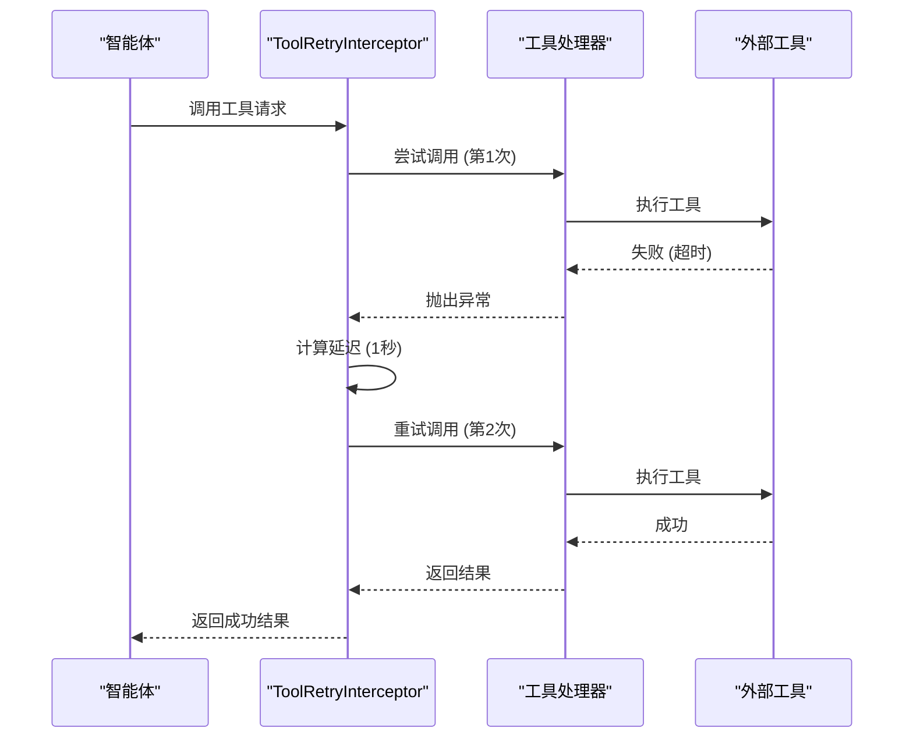
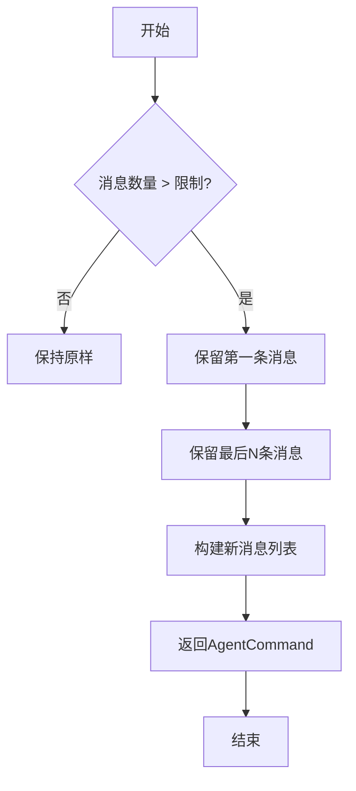
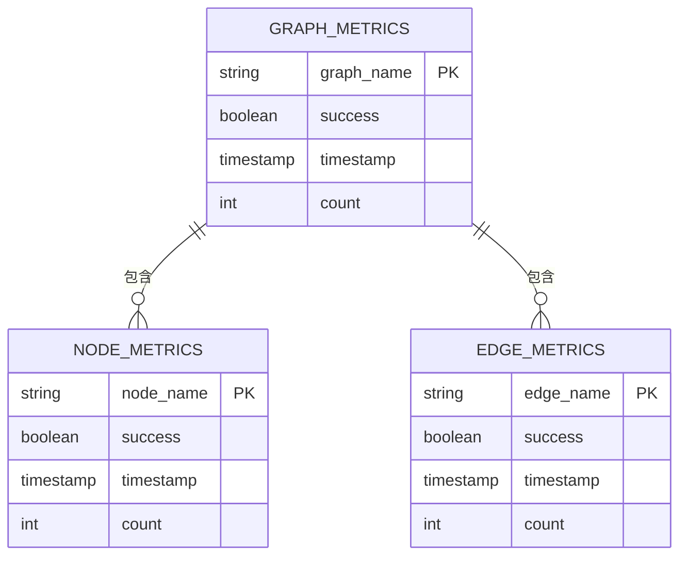

# 性能调优

<cite>
**本文档引用的文件**   
- [ToolSelectionInterceptor.java](file://spring-ai-alibaba-agent-framework/src/main/java/com/alibaba/cloud/ai/graph/agent/interceptor/toolselection/ToolSelectionInterceptor.java)
- [ToolRetryInterceptor.java](file://spring-ai-alibaba-agent-framework/src/main/java/com/alibaba/cloud/ai/graph/agent/interceptor/toolretry/ToolRetryInterceptor.java)
- [MessagesModelHook.java](file://spring-ai-alibaba-agent-framework/src/main/java/com/alibaba/cloud/ai/graph/agent/hook/messages/MessagesModelHook.java)
- [GraphObservationHandler.java](file://spring-ai-alibaba-graph-core/src/main/java/com/alibaba/cloud/ai/graph/observation/graph/GraphObservationHandler.java)
- [GraphMetricsGenerator.java](file://spring-ai-alibaba-graph-core/src/main/java/com/alibaba/cloud/ai/graph/observation/GraphMetricsGenerator.java)
- [MemoryExample.java](file://examples/documentation/src/main/java/com/alibaba/cloud/ai/examples/documentation/framework/tutorials/MemoryExample.java)
- [ToolSelectionTest.java](file://spring-ai-alibaba-agent-framework/src/test/java/com/alibaba/cloud/ai/graph/agent/interceptors/ToolSelectionTest.java)
- [ToolRetryTest.java](file://spring-ai-alibaba-agent-framework/src/test/java/com/alibaba/cloud/ai/graph/agent/interceptors/ToolRetryTest.java)
</cite>

## 目录
1. [引言](#引言)
2. [通过ToolSelectionInterceptor优化提示词工程](#通过toolselectioninterceptor优化提示词工程)
3. [通过ToolRetryInterceptor实现智能重试策略](#通过toolretryinterceptor实现智能重试策略)
4. [通过MessagesModelHook优化上下文管理](#通过messagesmodelhook优化上下文管理)
5. [性能监控与分析](#性能监控与分析)
6. [结论](#结论)

## 引言
本文档深入探讨Spring AI Alibaba框架中的高级性能调优技巧。我们将重点分析三个核心组件：`ToolSelectionInterceptor`、`ToolRetryInterceptor`和`MessagesModelHook`，它们分别用于优化提示词工程、实现智能重试策略和管理大模型的上下文。通过减少不必要的工具调用、提高工具调用成功率和优化消息流，开发者可以显著降低系统延迟和成本。此外，本文档还将介绍全面的性能监控方法，帮助开发者识别瓶颈并进行针对性优化。

## 通过ToolSelectionInterceptor优化提示词工程

`ToolSelectionInterceptor` 是一个强大的拦截器，旨在通过优化提示词工程来减少不必要的工具调用次数，从而降低延迟和成本。当一个智能体（Agent）拥有大量可用工具时，直接将所有工具暴露给主模型会导致提示词（prompt）过长，增加token消耗，并可能使模型难以聚焦于最相关的工具。该拦截器通过引入一个专门的“选择模型”（selection model）来解决此问题。

其工作原理是：在主模型调用之前，`ToolSelectionInterceptor` 会使用一个（通常是更小、更便宜的）选择模型来分析用户的查询，并从所有可用工具中筛选出最相关的一个子集。这个过程可以看作是一个两阶段的决策流程：首先，一个轻量级模型快速过滤出候选工具；然后，主模型在这些精选的工具上进行更深入的推理。这不仅减少了主模型的输入复杂度，还显著降低了整体的token消耗。

该拦截器提供了灵活的配置选项：
- **`selectionModel`**: 指定用于工具选择的模型，通常选择成本较低的模型以优化整体性能。
- **`maxTools`**: 设置允许传递给主模型的最大工具数量，防止工具列表过长。
- **`alwaysInclude`**: 定义一组必须始终包含的工具，确保关键功能不会被过滤掉。
- **`systemPrompt`**: 允许自定义选择模型的系统提示词，以指导其选择逻辑。

通过这种方式，`ToolSelectionInterceptor` 实现了提示词工程的精细化管理，确保主模型只接收到最相关的信息，从而在保证功能完整性的同时，最大化地提升了效率和降低了成本。

**Section sources**
- [ToolSelectionInterceptor.java](file://spring-ai-alibaba-agent-framework/src/main/java/com/alibaba/cloud/ai/graph/agent/interceptor/toolselection/ToolSelectionInterceptor.java#L41-L237)
- [ToolSelectionTest.java](file://spring-ai-alibaba-agent-framework/src/test/java/com/alibaba/cloud/ai/graph/agent/interceptors/ToolSelectionTest.java#L70-L274)

## 通过ToolRetryInterceptor实现智能重试策略

`ToolRetryInterceptor` 提供了一种健壮的机制来处理工具调用失败，通过实现智能重试策略来提高工具调用的成功率。在网络请求、外部API调用或资源竞争等场景下，工具调用可能会因暂时性故障（如超时、服务降级）而失败。`ToolRetryInterceptor` 能够自动捕获这些失败，并根据配置的策略进行重试，从而增强系统的容错能力。

该拦截器的核心功能包括：
- **可配置的重试次数 (`maxRetries`)**: 开发者可以指定最大重试次数，避免无限循环。
- **指数退避与抖动 (`backoffFactor`, `initialDelay`, `jitter`)**: 重试间隔不是固定的，而是随着每次失败而指数级增长（例如，1秒、2秒、4秒），这有助于避免对故障服务造成“重试风暴”。可选的抖动（jitter）功能在退避时间上增加随机性，进一步分散重试请求。
- **异常过滤 (`retryOn`)**: 可以精确指定哪些类型的异常触发重试。例如，只对网络超时异常进行重试，而对参数错误等业务异常则立即失败。
- **失败后行为 (`onFailure`)**: 当所有重试都耗尽后，可以选择抛出异常（`RAISE`）或返回一条包含错误信息的工具响应（`RETURN_MESSAGE`），后者允许智能体在更高层次上处理错误。

通过将 `ToolRetryInterceptor` 注入到智能体的拦截器链中，开发者可以为特定工具或所有工具统一配置重试逻辑，极大地简化了错误处理代码，并显著提升了系统的稳定性和用户体验。

**Diagram sources **
- [ToolRetryInterceptor.java](file://spring-ai-alibaba-agent-framework/src/main/java/com/alibaba/cloud/ai/graph/agent/interceptor/toolretry/ToolRetryInterceptor.java#L74-L134)
- [ToolRetryTest.java](file://spring-ai-alibaba-agent-framework/src/test/java/com/alibaba/cloud/ai/graph/agent/interceptors/ToolRetryTest.java#L68-L247)

**Section sources**
- [ToolRetryInterceptor.java](file://spring-ai-alibaba-agent-framework/src/main/java/com/alibaba/cloud/ai/graph/agent/interceptor/toolretry/ToolRetryInterceptor.java#L32-L247)
- [ToolRetryTest.java](file://spring-ai-alibaba-agent-framework/src/test/java/com/alibaba/cloud/ai/graph/agent/interceptors/ToolRetryTest.java#L68-L247)

## 通过MessagesModelHook优化上下文管理

`MessagesModelHook` 是一个关键的钩子（Hook）机制，用于在模型调用前后对消息流进行拦截和修改，从而实现消息压缩和上下文管理，优化大模型的输入输出。在长时间的对话或多轮交互中，消息历史会不断增长，导致上下文窗口迅速填满，增加token成本并可能影响模型性能。

`MessagesModelHook` 允许开发者在 `BEFORE_MODEL` 和 `AFTER_MODEL` 两个关键位置插入自定义逻辑。通过继承此类并重写 `beforeModel` 或 `afterModel` 方法，可以实现各种上下文优化策略。

一个典型的优化策略是**消息修剪（Message Trimming）**。例如，`MessageTrimmingHook` 可以在每次模型调用前，保留对话的初始系统消息和最近的N条消息，同时删除中间的历史消息。这确保了模型既能理解对话的初始背景，又能关注最新的交互，同时将上下文长度控制在合理范围内。

另一个策略是**消息总结（Summarization）**。当对话历史过长时，可以使用一个模型将早期的对话内容总结成一条简洁的摘要消息，然后用这条摘要替换原始的长消息序列。这极大地压缩了上下文，同时保留了关键信息。

`MessagesModelHook` 通过返回一个 `AgentCommand` 对象来应用修改，该对象可以指定新的消息列表以及更新策略（`UpdatePolicy.REPLACE` 或 `APPEND`）。这种机制为开发者提供了强大的控制力，使其能够根据具体的应用场景设计最优的上下文管理方案。

**Diagram sources **
- [MessagesModelHook.java](file://spring-ai-alibaba-agent-framework/src/main/java/com/alibaba/cloud/ai/graph/agent/hook/messages/MessagesModelHook.java#L36-L147)
- [MemoryExample.java](file://examples/documentation/src/main/java/com/alibaba/cloud/ai/examples/documentation/framework/tutorials/MemoryExample.java#L354-L389)

**Section sources**
- [MessagesModelHook.java](file://spring-ai-alibaba-agent-framework/src/main/java/com/alibaba/cloud/ai/graph/agent/hook/messages/MessagesModelHook.java#L32-L147)
- [AgentCommand.java](file://spring-ai-alibaba-agent-framework/src/main/java/com/alibaba/cloud/ai/graph/agent/hook/messages/AgentCommand.java#L24-L70)
- [UpdatePolicy.java](file://spring-ai-alibaba-agent-framework/src/main/java/com/alibaba/cloud/ai/graph/agent/hook/messages/UpdatePolicy.java#L21-L31)
- [MemoryExample.java](file://examples/documentation/src/main/java/com/alibaba/cloud/ai/examples/documentation/framework/tutorials/MemoryExample.java#L354-L404)

## 性能监控与分析

为了有效进行性能调优，必须具备全面的监控和分析能力。Spring AI Alibaba框架通过其内置的观测（Observation）系统，提供了强大的性能监控功能，帮助开发者识别瓶颈并进行针对性优化。

该系统基于Micrometer Observations，为图（Graph）、节点（Node）和边（Edge）的操作生成详细的指标（Metrics）。核心的指标生成器 `GraphMetricsGenerator` 会为每一次操作创建计数器（Counter），并附带丰富的标签（Tags），如操作名称、成功/失败状态等。这些指标可以在Prometheus等监控系统中被收集和可视化。

关键的监控组件包括：
- **`GraphObservationHandler`**: 负责处理图级别操作的完成和错误事件，生成 `spring.ai.alibaba.graph` 指标。
- **`GraphNodeObservationHandler`**: 负责处理节点级别操作的完成和错误事件，生成 `spring.ai.alibaba.graph.node` 指标。
- **`GraphEdgeObservationHandler`**: 负责处理边级别操作的完成和错误事件，生成 `spring.ai.alibaba.graph.edge` 指标。

通过分析这些指标，开发者可以：
1.  **识别性能瓶颈**：通过观察 `GraphNode` 指标，可以发现哪些节点的执行时间最长或失败率最高。
2.  **评估工具调用效率**：结合 `ToolSelectionInterceptor` 的日志和 `GraphNode` 指标，可以量化工具选择策略带来的token节省和延迟降低。
3.  **验证重试策略效果**：通过 `ToolRetryInterceptor` 的日志和 `GraphNode` 指标，可以分析重试的频率、延迟和最终成功率，从而调整 `maxRetries` 和 `backoffFactor` 等参数。
4.  **监控上下文管理**：通过观察消息数量和token消耗的趋势，可以评估 `MessagesModelHook` 的消息修剪或总结策略是否有效。

总之，将拦截器和钩子的配置与强大的观测系统相结合，开发者可以建立一个闭环的性能优化流程：实施优化 -> 监控指标 -> 分析数据 -> 调整策略。

**Diagram sources **
- [GraphMetricsGenerator.java](file://spring-ai-alibaba-graph-core/src/main/java/com/alibaba/cloud/ai/graph/observation/GraphMetricsGenerator.java#L47-L79)
- [GraphObservationHandler.java](file://spring-ai-alibaba-graph-core/src/main/java/com/alibaba/cloud/ai/graph/observation/graph/GraphObservationHandler.java#L50-L66)
- [SpringAiAlibabaObservationMetricNames.java](file://spring-ai-alibaba-graph-core/src/main/java/com/alibaba/cloud/ai/graph/observation/metric/SpringAiAlibabaObservationMetricNames.java#L26-L41)

**Section sources**
- [GraphMetricsGenerator.java](file://spring-ai-alibaba-graph-core/src/main/java/com/alibaba/cloud/ai/graph/observation/GraphMetricsGenerator.java#L40-L79)
- [GraphObservationHandler.java](file://spring-ai-alibaba-graph-core/src/main/java/com/alibaba/cloud/ai/graph/observation/graph/GraphObservationHandler.java#L38-L78)
- [GraphNodeObservationHandler.java](file://spring-ai-alibaba-graph-core/src/main/java/com/alibaba/cloud/ai/graph/observation/node/GraphNodeObservationHandler.java#L39-L78)
- [GraphEdgeObservationHandler.java](file://spring-ai-alibaba-graph-core/src/main/java/com/alibaba/cloud/ai/graph/observation/edge/GraphEdgeObservationHandler.java#L36-L83)
- [SpringAiAlibabaObservationMetricNames.java](file://spring-ai-alibaba-graph-core/src/main/java/com/alibaba/cloud/ai/graph/observation/metric/SpringAiAlibabaObservationMetricNames.java#L26-L61)

## 结论
本文档详细介绍了Spring AI Alibaba框架中用于性能调优的三大核心组件：`ToolSelectionInterceptor`、`ToolRetryInterceptor` 和 `MessagesModelHook`。通过合理配置 `ToolSelectionInterceptor`，可以显著减少不必要的工具调用，优化提示词工程，从而降低延迟和成本。`ToolRetryInterceptor` 通过智能的重试策略，有效提高了工具调用的容错能力和成功率。而 `MessagesModelHook` 则为上下文管理提供了强大的灵活性，通过消息压缩和修剪，优化了大模型的输入输出。最后，结合内置的观测系统，开发者可以获得全面的性能洞察，实现数据驱动的持续优化。综合运用这些技术，可以构建出高效、稳定且成本可控的AI应用。