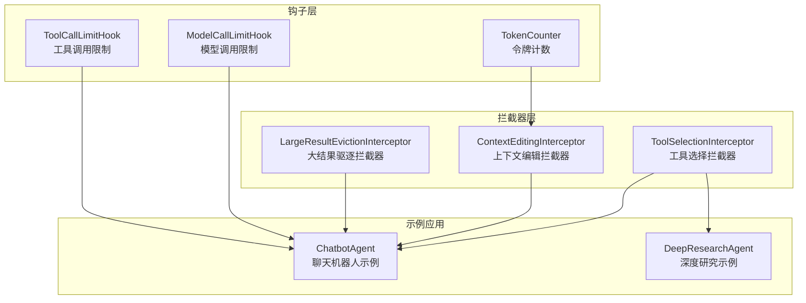
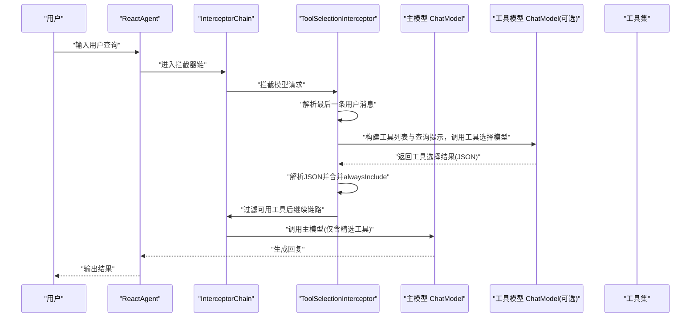
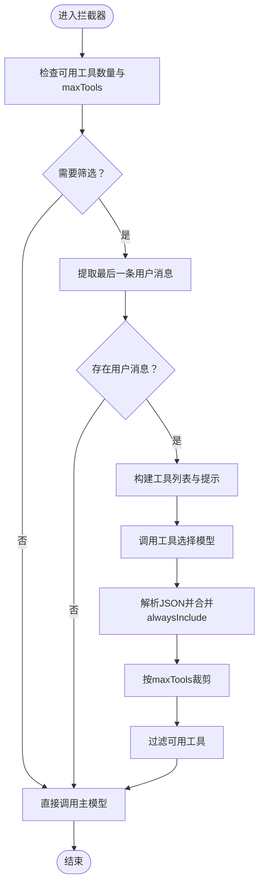
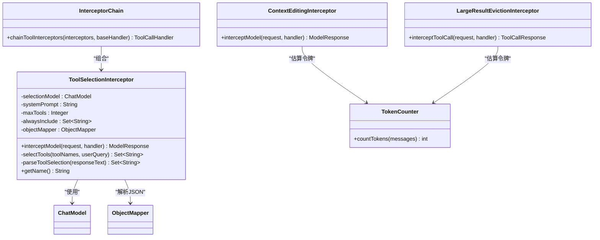

# 提示词工程优化

<cite>
**本文引用的文件**
- [ToolSelectionInterceptor.java](file://spring-ai-alibaba-agent-framework/src/main/java/com/alibaba/cloud/ai/graph/agent/interceptor/toolselection/ToolSelectionInterceptor.java)
- [ToolSelectionTest.java](file://spring-ai-alibaba-agent-framework/src/test/java/com/alibaba/cloud/ai/graph/agent/interceptors/ToolSelectionTest.java)
- [InterceptorChain.java](file://spring-ai-alibaba-agent-framework/src/main/java/com/alibaba/cloud/ai/graph/agent/interceptor/InterceptorChain.java)
- [ChatModelCallCounter.java](file://spring-ai-alibaba-agent-framework/src/test/java/com/alibaba/cloud/ai/graph/agent/interceptors/ChatModelCallCounter.java)
- [TokenCounter.java](file://spring-ai-alibaba-agent-framework/src/main/java/com/alibaba/cloud/ai/graph/agent/hook/TokenCounter.java)
- [LargeResultEvictionInterceptor.java](file://spring-ai-alibaba-agent-framework/src/main/java/com/alibaba/cloud/ai/graph/agent/extension/interceptor/LargeResultEvictionInterceptor.java)
- [ContextEditingInterceptor.java](file://spring-ai-alibaba-agent-framework/src/main/java/com/alibaba/cloud/ai/graph/agent/interceptor/contextediting/ContextEditingInterceptor.java)
- [ModelCallLimitHook.java](file://spring-ai-alibaba-agent-framework/src/main/java/com/alibaba/cloud/ai/graph/agent/hook/modelcalllimit/ModelCallLimitHook.java)
- [ToolCallLimitHook.java](file://spring-ai-alibaba-agent-framework/src/main/java/com/alibaba/cloud/ai/graph/agent/hook/toolcalllimit/ToolCallLimitHook.java)
- [ChatbotAgent.java](file://examples/chatbot/src/main/java/com/alibaba/cloud/ai/examples/chatbot/ChatbotAgent.java)
- [DeepResearchAgent.java](file://examples/deepresearch/src/main/java/com/alibaba/cloud/ai/examples/deepresearch/DeepResearchAgent.java)
</cite>

## 目录
1. [简介](#简介)
2. [项目结构](#项目结构)
3. [核心组件](#核心组件)
4. [架构总览](#架构总览)
5. [详细组件分析](#详细组件分析)
6. [依赖关系分析](#依赖关系分析)
7. [性能考量](#性能考量)
8. [故障排查指南](#故障排查指南)
9. [结论](#结论)
10. [附录](#附录)

## 简介
本文件围绕 ToolSelectionInterceptor 展开，系统性阐述如何通过“提示词工程”与拦截器机制实现工具调用的智能筛选与成本控制。重点包括：
- 如何分析工具调用需求，智能选择最合适的工具，避免不必要的工具调用
- 实际配置与使用方法：Builder 参数、拦截器链路、与 Agent 的集成
- 高效提示词模板设计：减少模型推理次数、降低 API 调用成本
- 性能对比思路：延迟与成本差异的量化方法
- 常见问题与解决方案：工具选择偏差、过度调用等

## 项目结构
围绕 ToolSelectionInterceptor 的相关模块分布如下：
- 拦截器实现与测试：ToolSelectionInterceptor 及其单元测试
- 拦截器链路：InterceptorChain 对 ToolInterceptor 的组合
- 成本与性能辅助：TokenCounter、LargeResultEvictionInterceptor、ContextEditingInterceptor、ModelCallLimitHook、ToolCallLimitHook
- 示例应用：ChatbotAgent、DeepResearchAgent 展示了如何在真实场景中集成工具与钩子

图表来源
- [ToolSelectionInterceptor.java](file://spring-ai-alibaba-agent-framework/src/main/java/com/alibaba/cloud/ai/graph/agent/interceptor/toolselection/ToolSelectionInterceptor.java#L1-L238)
- [InterceptorChain.java](file://spring-ai-alibaba-agent-framework/src/main/java/com/alibaba/cloud/ai/graph/agent/interceptor/InterceptorChain.java#L59-L112)
- [TokenCounter.java](file://spring-ai-alibaba-agent-framework/src/main/java/com/alibaba/cloud/ai/graph/agent/hook/TokenCounter.java#L1-L93)
- [LargeResultEvictionInterceptor.java](file://spring-ai-alibaba-agent-framework/src/main/java/com/alibaba/cloud/ai/graph/agent/extension/interceptor/LargeResultEvictionInterceptor.java#L26-L237)
- [ContextEditingInterceptor.java](file://spring-ai-alibaba-agent-framework/src/main/java/com/alibaba/cloud/ai/graph/agent/interceptor/contextediting/ContextEditingInterceptor.java#L80-L122)
- [ModelCallLimitHook.java](file://spring-ai-alibaba-agent-framework/src/main/java/com/alibaba/cloud/ai/graph/agent/hook/modelcalllimit/ModelCallLimitHook.java#L27-L174)
- [ToolCallLimitHook.java](file://spring-ai-alibaba-agent-framework/src/main/java/com/alibaba/cloud/ai/graph/agent/hook/toolcalllimit/ToolCallLimitHook.java#L107-L145)
- [ChatbotAgent.java](file://examples/chatbot/src/main/java/com/alibaba/cloud/ai/examples/chatbot/ChatbotAgent.java#L1-L119)
- [DeepResearchAgent.java](file://examples/deepresearch/src/main/java/com/alibaba/cloud/ai/examples/deepresearch/DeepResearchAgent.java#L103-L141)

章节来源
- [ToolSelectionInterceptor.java](file://spring-ai-alibaba-agent-framework/src/main/java/com/alibaba/cloud/ai/graph/agent/interceptor/toolselection/ToolSelectionInterceptor.java#L1-L238)
- [ToolSelectionTest.java](file://spring-ai-alibaba-agent-framework/src/test/java/com/alibaba/cloud/ai/graph/agent/interceptors/ToolSelectionTest.java#L1-L274)

## 核心组件
- ToolSelectionInterceptor：在主模型调用前，基于 LLM 对可用工具进行筛选，仅保留最相关的工具集合，从而减少主模型负担与 API 调用成本。
- InterceptorChain：将多个 ToolInterceptor 组合为一个处理链，保证执行顺序与嵌套包装。
- TokenCounter：估算消息中的令牌数量，用于上下文压缩与成本控制。
- LargeResultEvictionInterceptor：当工具结果过大时自动落盘并返回精简摘要，避免上下文膨胀。
- ContextEditingInterceptor：按阈值清理工具响应，降低上下文长度，缓解长对话成本。
- ModelCallLimitHook / ToolCallLimitHook：限制模型或工具调用次数，防止无限循环与过度消耗。

章节来源
- [ToolSelectionInterceptor.java](file://spring-ai-alibaba-agent-framework/src/main/java/com/alibaba/cloud/ai/graph/agent/interceptor/toolselection/ToolSelectionInterceptor.java#L1-L238)
- [InterceptorChain.java](file://spring-ai-alibaba-agent-framework/src/main/java/com/alibaba/cloud/ai/graph/agent/interceptor/InterceptorChain.java#L59-L112)
- [TokenCounter.java](file://spring-ai-alibaba-agent-framework/src/main/java/com/alibaba/cloud/ai/graph/agent/hook/TokenCounter.java#L1-L93)
- [LargeResultEvictionInterceptor.java](file://spring-ai-alibaba-agent-framework/src/main/java/com/alibaba/cloud/ai/graph/agent/extension/interceptor/LargeResultEvictionInterceptor.java#L26-L237)
- [ContextEditingInterceptor.java](file://spring-ai-alibaba-agent-framework/src/main/java/com/alibaba/cloud/ai/graph/agent/interceptor/contextediting/ContextEditingInterceptor.java#L80-L122)
- [ModelCallLimitHook.java](file://spring-ai-alibaba-agent-framework/src/main/java/com/alibaba/cloud/ai/graph/agent/hook/modelcalllimit/ModelCallLimitHook.java#L27-L174)
- [ToolCallLimitHook.java](file://spring-ai-alibaba-agent-framework/src/main/java/com/alibaba/cloud/ai/graph/agent/hook/toolcalllimit/ToolCallLimitHook.java#L107-L145)

## 架构总览
下图展示了 ToolSelectionInterceptor 在 Agent 执行流程中的位置与作用路径。

图表来源
- [ToolSelectionInterceptor.java](file://spring-ai-alibaba-agent-framework/src/main/java/com/alibaba/cloud/ai/graph/agent/interceptor/toolselection/ToolSelectionInterceptor.java#L81-L115)
- [ToolSelectionInterceptor.java](file://spring-ai-alibaba-agent-framework/src/main/java/com/alibaba/cloud/ai/graph/agent/interceptor/toolselection/ToolSelectionInterceptor.java#L127-L171)
- [InterceptorChain.java](file://spring-ai-alibaba-agent-framework/src/main/java/com/alibaba/cloud/ai/graph/agent/interceptor/InterceptorChain.java#L59-L112)

## 详细组件分析

### ToolSelectionInterceptor 分析
- 功能要点
  - 在主模型调用前，从消息历史中提取最后一条用户消息作为查询依据
  - 使用 selectionModel 对可用工具进行排序与筛选，支持 maxTools 限制与 alwaysInclude 强制保留
  - 若工具数量小于等于 maxTools 或无可用工具，则跳过筛选直接调用主模型
  - 当工具选择失败时，回退到全部工具，保证可用性
- 关键流程
  - 解析用户消息：findLastUserMessage
  - 构建工具列表与提示：selectTools
  - 解析 JSON 结果：parseToolSelection
  - 过滤工具并重构成 ModelRequest：interceptModel
- 提示词工程要点
  - 明确系统提示(systemPrompt)目标：聚焦“选择最相关工具”
  - 显式约束：maxTools 指令与 JSON 输出格式要求
  - 失败回退：捕获异常并回退全量工具，保障稳定性
- 配置与使用
  - Builder 支持：selectionModel、systemPrompt、maxTools、alwaysInclude
  - 在 Agent 中通过 interceptors(...) 注入
  - 测试用例展示了不同场景下的行为验证

图表来源
- [ToolSelectionInterceptor.java](file://spring-ai-alibaba-agent-framework/src/main/java/com/alibaba/cloud/ai/graph/agent/interceptor/toolselection/ToolSelectionInterceptor.java#L81-L115)
- [ToolSelectionInterceptor.java](file://spring-ai-alibaba-agent-framework/src/main/java/com/alibaba/cloud/ai/graph/agent/interceptor/toolselection/ToolSelectionInterceptor.java#L127-L171)

章节来源
- [ToolSelectionInterceptor.java](file://spring-ai-alibaba-agent-framework/src/main/java/com/alibaba/cloud/ai/graph/agent/interceptor/toolselection/ToolSelectionInterceptor.java#L1-L238)
- [ToolSelectionTest.java](file://spring-ai-alibaba-agent-framework/src/test/java/com/alibaba/cloud/ai/graph/agent/interceptors/ToolSelectionTest.java#L70-L120)
- [ToolSelectionTest.java](file://spring-ai-alibaba-agent-framework/src/test/java/com/alibaba/cloud/ai/graph/agent/interceptors/ToolSelectionTest.java#L122-L171)
- [ToolSelectionTest.java](file://spring-ai-alibaba-agent-framework/src/test/java/com/alibaba/cloud/ai/graph/agent/interceptors/ToolSelectionTest.java#L173-L227)
- [ToolSelectionTest.java](file://spring-ai-alibaba-agent-framework/src/test/java/com/alibaba/cloud/ai/graph/agent/interceptors/ToolSelectionTest.java#L229-L271)

### 拦截器链路与集成
- InterceptorChain 将多个 ToolInterceptor 以右到左的方式嵌套组合，确保第一个拦截器在外层
- 在 Agent 中通过 interceptors(...) 注入 ToolSelectionInterceptor，即可参与工具选择阶段

章节来源
- [InterceptorChain.java](file://spring-ai-alibaba-agent-framework/src/main/java/com/alibaba/cloud/ai/graph/agent/interceptor/InterceptorChain.java#L59-L112)

### 成本与性能辅助组件
- TokenCounter：估算消息中令牌数量，用于上下文压缩与成本控制
- LargeResultEvictionInterceptor：当工具结果过大时自动落盘并返回精简摘要，避免上下文膨胀
- ContextEditingInterceptor：按阈值清理工具响应，降低上下文长度
- ModelCallLimitHook / ToolCallLimitHook：限制模型或工具调用次数，防止无限循环与过度消耗

章节来源
- [TokenCounter.java](file://spring-ai-alibaba-agent-framework/src/main/java/com/alibaba/cloud/ai/graph/agent/hook/TokenCounter.java#L1-L93)
- [LargeResultEvictionInterceptor.java](file://spring-ai-alibaba-agent-framework/src/main/java/com/alibaba/cloud/ai/graph/agent/extension/interceptor/LargeResultEvictionInterceptor.java#L26-L237)
- [ContextEditingInterceptor.java](file://spring-ai-alibaba-agent-framework/src/main/java/com/alibaba/cloud/ai/graph/agent/interceptor/contextediting/ContextEditingInterceptor.java#L80-L122)
- [ModelCallLimitHook.java](file://spring-ai-alibaba-agent-framework/src/main/java/com/alibaba/cloud/ai/graph/agent/hook/modelcalllimit/ModelCallLimitHook.java#L27-L174)
- [ToolCallLimitHook.java](file://spring-ai-alibaba-agent-framework/src/main/java/com/alibaba/cloud/ai/graph/agent/hook/toolcalllimit/ToolCallLimitHook.java#L107-L145)

### 示例应用集成
- ChatbotAgent：演示如何在 Agent 中注册工具与钩子，便于结合 ToolSelectionInterceptor 进行工具筛选
- DeepResearchAgent：展示复杂场景下的子代理与钩子组合，体现工具选择在多轮对话中的价值

章节来源
- [ChatbotAgent.java](file://examples/chatbot/src/main/java/com/alibaba/cloud/ai/examples/chatbot/ChatbotAgent.java#L1-L119)
- [DeepResearchAgent.java](file://examples/deepresearch/src/main/java/com/alibaba/cloud/ai/examples/deepresearch/DeepResearchAgent.java#L103-L141)

## 依赖关系分析
- ToolSelectionInterceptor 依赖：
  - ModelInterceptor 接口约定的拦截能力
  - ChatModel 作为工具选择模型
  - ObjectMapper 用于解析 JSON
  - 日志记录与异常回退策略
- 与 Agent 的耦合：
  - 通过 InterceptorChain 注入，不改变 Agent 的核心逻辑
  - 仅在工具列表阶段进行筛选，不影响后续工具调用

图表来源
- [ToolSelectionInterceptor.java](file://spring-ai-alibaba-agent-framework/src/main/java/com/alibaba/cloud/ai/graph/agent/interceptor/toolselection/ToolSelectionInterceptor.java#L1-L238)
- [InterceptorChain.java](file://spring-ai-alibaba-agent-framework/src/main/java/com/alibaba/cloud/ai/graph/agent/interceptor/InterceptorChain.java#L59-L112)
- [TokenCounter.java](file://spring-ai-alibaba-agent-framework/src/main/java/com/alibaba/cloud/ai/graph/agent/hook/TokenCounter.java#L1-L93)
- [LargeResultEvictionInterceptor.java](file://spring-ai-alibaba-agent-framework/src/main/java/com/alibaba/cloud/ai/graph/agent/extension/interceptor/LargeResultEvictionInterceptor.java#L26-L237)
- [ContextEditingInterceptor.java](file://spring-ai-alibaba-agent-framework/src/main/java/com/alibaba/cloud/ai/graph/agent/interceptor/contextediting/ContextEditingInterceptor.java#L80-L122)

## 性能考量
- 减少模型推理次数
  - 通过 ToolSelectionInterceptor 在主模型前进行工具筛选，避免主模型面对大量无关工具
  - 使用 maxTools 限制候选工具数量，降低主模型的工具选择与调用压力
- 降低 API 调用成本
  - 工具选择模型 selectionModel 通常较轻量，仅用于筛选；主模型仅接收精选工具，减少工具调用次数
  - 结合 TokenCounter 估算上下文大小，配合 ContextEditingInterceptor 与 LargeResultEvictionInterceptor 控制上下文膨胀
- 延迟与吞吐
  - 工具选择阶段增加一次额外调用，但通常收益显著：减少主模型工具调用次数与上下文长度
  - 可通过 ChatModelCallCounter 统计模型调用次数，评估优化效果

章节来源
- [ToolSelectionInterceptor.java](file://spring-ai-alibaba-agent-framework/src/main/java/com/alibaba/cloud/ai/graph/agent/interceptor/toolselection/ToolSelectionInterceptor.java#L127-L171)
- [TokenCounter.java](file://spring-ai-alibaba-agent-framework/src/main/java/com/alibaba/cloud/ai/graph/agent/hook/TokenCounter.java#L1-L93)
- [ContextEditingInterceptor.java](file://spring-ai-alibaba-agent-framework/src/main/java/com/alibaba/cloud/ai/graph/agent/interceptor/contextediting/ContextEditingInterceptor.java#L80-L122)
- [LargeResultEvictionInterceptor.java](file://spring-ai-alibaba-agent-framework/src/main/java/com/alibaba/cloud/ai/graph/agent/extension/interceptor/LargeResultEvictionInterceptor.java#L26-L237)
- [ChatModelCallCounter.java](file://spring-ai-alibaba-agent-framework/src/test/java/com/alibaba/cloud/ai/graph/agent/interceptors/ChatModelCallCounter.java#L1-L79)

## 故障排查指南
- 工具选择失败
  - 现象：工具选择模型返回非 JSON 或解析失败
  - 处理：拦截器会记录警告并回退到全部工具，确保可用性
  - 建议：优化提示词模板，明确 JSON 输出格式；必要时提升 selectionModel 的稳定性
- 工具选择偏差
  - 现象：未选择到正确工具或遗漏关键工具
  - 处理：使用 alwaysInclude 强制保留关键工具；调整 systemPrompt 与 maxTools
- 过度调用
  - 现象：工具调用次数过多导致成本上升
  - 处理：结合 ToolCallLimitHook 限制工具调用；使用 LargeResultEvictionInterceptor 控制结果大小；通过 ContextEditingInterceptor 清理冗余上下文
- 上下文过长
  - 现象：消息长度超限导致成本高或报错
  - 处理：启用 TokenCounter 估算；使用 ContextEditingInterceptor 清理工具响应；LargeResultEvictionInterceptor 自动落盘

章节来源
- [ToolSelectionInterceptor.java](file://spring-ai-alibaba-agent-framework/src/main/java/com/alibaba/cloud/ai/graph/agent/interceptor/toolselection/ToolSelectionInterceptor.java#L167-L171)
- [ToolCallLimitHook.java](file://spring-ai-alibaba-agent-framework/src/main/java/com/alibaba/cloud/ai/graph/agent/hook/toolcalllimit/ToolCallLimitHook.java#L107-L145)
- [LargeResultEvictionInterceptor.java](file://spring-ai-alibaba-agent-framework/src/main/java/com/alibaba/cloud/ai/graph/agent/extension/interceptor/LargeResultEvictionInterceptor.java#L26-L237)
- [ContextEditingInterceptor.java](file://spring-ai-alibaba-agent-framework/src/main/java/com/alibaba/cloud/ai/graph/agent/interceptor/contextediting/ContextEditingInterceptor.java#L80-L122)

## 结论
ToolSelectionInterceptor 通过“先筛后用”的策略，在工具数量众多时显著降低主模型负担与 API 调用成本。结合 TokenCounter、ContextEditingInterceptor、LargeResultEvictionInterceptor 与调用限制钩子，可形成一套完整的提示词工程与成本控制体系。建议在实际项目中：
- 明确 systemPrompt 与 JSON 输出约束，提升工具选择准确性
- 合理设置 maxTools 与 alwaysInclude，兼顾效率与可靠性
- 使用调用限制与上下文压缩策略，稳定长对话的成本与延迟表现

## 附录
- 配置与使用要点
  - 通过 Builder 设置 selectionModel、systemPrompt、maxTools、alwaysInclude
  - 在 Agent 中注入拦截器，无需修改业务逻辑
  - 使用测试用例验证不同场景下的行为（最大工具数、强制包含、相关性过滤、工具数量较少时跳过）
- 性能对比建议
  - 使用 ChatModelCallCounter 统计模型调用次数
  - 使用 TokenCounter 估算上下文令牌数
  - 对比开启/关闭 ToolSelectionInterceptor 的延迟与成本，形成基线数据

章节来源
- [ToolSelectionTest.java](file://spring-ai-alibaba-agent-framework/src/test/java/com/alibaba/cloud/ai/graph/agent/interceptors/ToolSelectionTest.java#L70-L120)
- [ToolSelectionTest.java](file://spring-ai-alibaba-agent-framework/src/test/java/com/alibaba/cloud/ai/graph/agent/interceptors/ToolSelectionTest.java#L122-L171)
- [ToolSelectionTest.java](file://spring-ai-alibaba-agent-framework/src/test/java/com/alibaba/cloud/ai/graph/agent/interceptors/ToolSelectionTest.java#L173-L227)
- [ToolSelectionTest.java](file://spring-ai-alibaba-agent-framework/src/test/java/com/alibaba/cloud/ai/graph/agent/interceptors/ToolSelectionTest.java#L229-L271)
- [ChatModelCallCounter.java](file://spring-ai-alibaba-agent-framework/src/test/java/com/alibaba/cloud/ai/graph/agent/interceptors/ChatModelCallCounter.java#L1-L79)