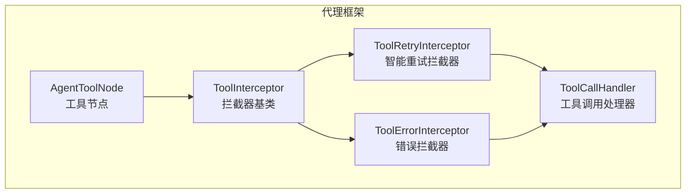
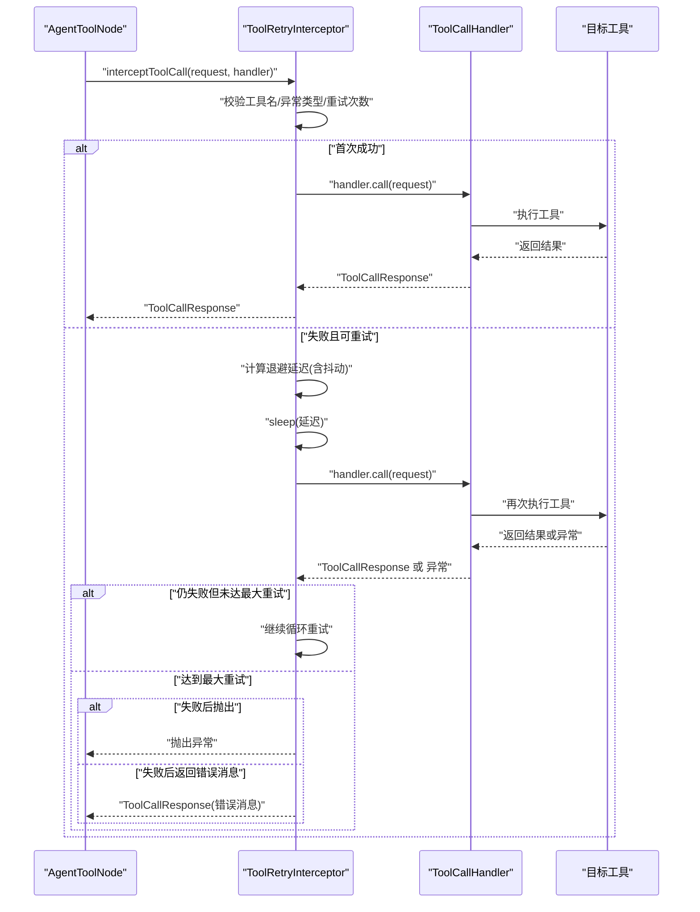
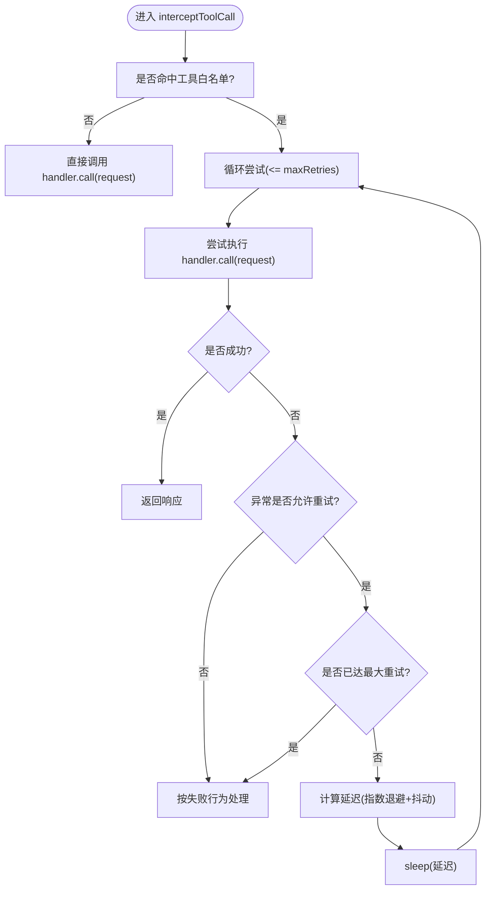
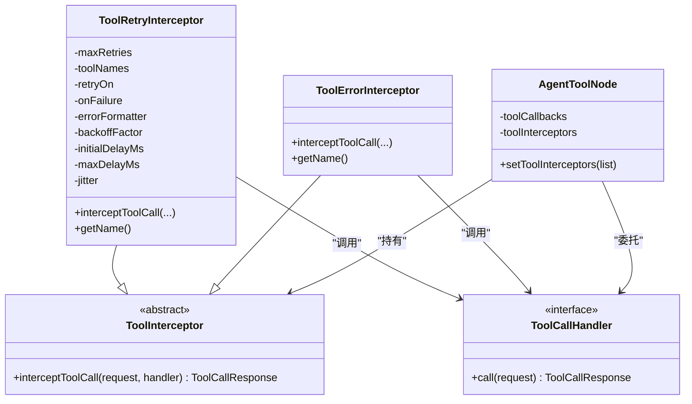
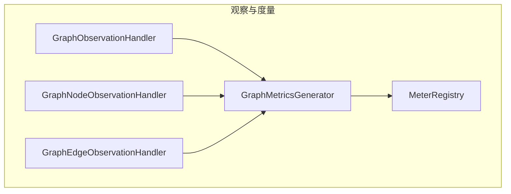

# 调用控制

<cite>
**本文引用的文件列表**
- [ToolRetryInterceptor.java](file://spring-ai-alibaba-agent-framework/src/main/java/com/alibaba/cloud/ai/graph/agent/interceptor/toolretry/ToolRetryInterceptor.java)
- [ToolInterceptor.java](file://spring-ai-alibaba-agent-framework/src/main/java/com/alibaba/cloud/ai/graph/agent/interceptor/ToolInterceptor.java)
- [ToolCallHandler.java](file://spring-ai-alibaba-agent-framework/src/main/java/com/alibaba/cloud/ai/graph/agent/interceptor/ToolCallHandler.java)
- [ToolErrorInterceptor.java](file://spring-ai-alibaba-agent-framework/src/main/java/com/alibaba/cloud/ai/graph/agent/interceptor/toolerror/ToolErrorInterceptor.java)
- [AgentToolNode.java](file://spring-ai-alibaba-agent-framework/src/main/java/com/alibaba/cloud/ai/graph/agent/node/AgentToolNode.java)
- [ToolRetryTest.java](file://spring-ai-alibaba-agent-framework/src/test/java/com/alibaba/cloud/ai/graph/agent/interceptors/ToolRetryTest.java)
- [GraphMetricsGenerator.java](file://spring-ai-alibaba-graph-core/src/main/java/com/alibaba/cloud/ai/graph/observation/GraphMetricsGenerator.java)
- [GraphObservationHandler.java](file://spring-ai-alibaba-graph-core/src/main/java/com/alibaba/cloud/ai/graph/observation/graph/GraphObservationHandler.java)
- [GraphNodeObservationHandler.java](file://spring-ai-alibaba-graph-core/src/main/java/com/alibaba/cloud/ai/graph/observation/node/GraphNodeObservationHandler.java)
- [GraphEdgeObservationHandler.java](file://spring-ai-alibaba-graph-core/src/main/java/com/alibaba/cloud/ai/graph/observation/edge/GraphEdgeObservationHandler.java)
- [SpringAiAlibabaObservationMetricNames.java](file://spring-ai-alibaba-graph-core/src/main/java/com/alibaba/cloud/ai/graph/observation/metric/SpringAiAlibabaObservationMetricNames.java)
- [GraphObservationAutoConfiguration.java](file://spring-boot-starters/spring-ai-alibaba-starter-graph-observation/src/main/java/com/alibaba/cloud/ai/autoconfigure/graph/GraphObservationAutoConfiguration.java)
</cite>

## 目录
1. [简介](#简介)
2. [项目结构与定位](#项目结构与定位)
3. [核心组件](#核心组件)
4. [架构总览](#架构总览)
5. [详细组件分析](#详细组件分析)
6. [依赖关系分析](#依赖关系分析)
7. [性能与可观察性](#性能与可观察性)
8. [故障排查指南](#故障排查指南)
9. [结论](#结论)
10. [附录：配置与实践示例](#附录配置与实践示例)

## 简介
本文件系统化介绍 ToolRetryInterceptor 的智能重试策略，包括其如何在工具调用失败时按错误类型与上下文进行重试决策、指数退避与抖动控制、最大重试次数限制、以及失败后的两种行为模式（抛出异常或返回错误消息）。同时提供结合熔断机制的建议、性能监控指标与评估方法，并给出网络抖动、服务降级等典型场景的实战建议。

## 项目结构与定位
ToolRetryInterceptor 属于“代理框架”模块中的“工具拦截器”体系，位于工具调用链路的中间层，负责对 ToolCallRequest/ToolCallResponse 进行包装与增强，支持重试、错误格式化、失败回退等能力。它与 AgentToolNode、ToolInterceptor、ToolCallHandler 等共同构成工具调用的拦截与执行骨架。

图表来源
- [AgentToolNode.java](file://spring-ai-alibaba-agent-framework/src/main/java/com/alibaba/cloud/ai/graph/agent/node/AgentToolNode.java#L57-L97)
- [ToolInterceptor.java](file://spring-ai-alibaba-agent-framework/src/main/java/com/alibaba/cloud/ai/graph/agent/interceptor/ToolInterceptor.java#L18-L38)
- [ToolRetryInterceptor.java](file://spring-ai-alibaba-agent-framework/src/main/java/com/alibaba/cloud/ai/graph/agent/interceptor/toolretry/ToolRetryInterceptor.java#L44-L153)
- [ToolErrorInterceptor.java](file://spring-ai-alibaba-agent-framework/src/main/java/com/alibaba/cloud/ai/graph/agent/interceptor/toolerror/ToolErrorInterceptor.java#L16-L51)
- [ToolCallHandler.java](file://spring-ai-alibaba-agent-framework/src/main/java/com/alibaba/cloud/ai/graph/agent/interceptor/ToolCallHandler.java#L18-L33)

章节来源
- [AgentToolNode.java](file://spring-ai-alibaba-agent-framework/src/main/java/com/alibaba/cloud/ai/graph/agent/node/AgentToolNode.java#L57-L97)
- [ToolInterceptor.java](file://spring-ai-alibaba-agent-framework/src/main/java/com/alibaba/cloud/ai/graph/agent/interceptor/ToolInterceptor.java#L18-L38)
- [ToolRetryInterceptor.java](file://spring-ai-alibaba-agent-framework/src/main/java/com/alibaba/cloud/ai/graph/agent/interceptor/toolretry/ToolRetryInterceptor.java#L44-L153)
- [ToolErrorInterceptor.java](file://spring-ai-alibaba-agent-framework/src/main/java/com/alibaba/cloud/ai/graph/agent/interceptor/toolerror/ToolErrorInterceptor.java#L16-L51)
- [ToolCallHandler.java](file://spring-ai-alibaba-agent-framework/src/main/java/com/alibaba/cloud/ai/graph/agent/interceptor/ToolCallHandler.java#L18-L33)

## 核心组件
- ToolInterceptor：工具拦截器抽象，定义 interceptToolCall 包装逻辑。
- ToolRetryInterceptor：基于指数退避的智能重试拦截器，支持：
  - 最大重试次数
  - 指数退避因子与初始延迟
  - 最大延迟上限
  - 抖动（±25%）以避免“惊群”
  - 仅对指定工具名重试
  - 仅对匹配的异常类型重试
  - 失败后两种行为：抛出异常或返回错误消息
- ToolErrorInterceptor：统一捕获异常并返回错误消息，作为兜底策略。
- ToolCallHandler：工具调用处理器接口，由拦截器链逐层调用。
- AgentToolNode：承载工具回调与拦截器集合，负责组装与调度。

章节来源
- [ToolInterceptor.java](file://spring-ai-alibaba-agent-framework/src/main/java/com/alibaba/cloud/ai/graph/agent/interceptor/ToolInterceptor.java#L18-L38)
- [ToolRetryInterceptor.java](file://spring-ai-alibaba-agent-framework/src/main/java/com/alibaba/cloud/ai/graph/agent/interceptor/toolretry/ToolRetryInterceptor.java#L44-L153)
- [ToolErrorInterceptor.java](file://spring-ai-alibaba-agent-framework/src/main/java/com/alibaba/cloud/ai/graph/agent/interceptor/toolerror/ToolErrorInterceptor.java#L16-L51)
- [ToolCallHandler.java](file://spring-ai-alibaba-agent-framework/src/main/java/com/alibaba/cloud/ai/graph/agent/interceptor/ToolCallHandler.java#L18-L33)
- [AgentToolNode.java](file://spring-ai-alibaba-agent-framework/src/main/java/com/alibaba/cloud/ai/graph/agent/node/AgentToolNode.java#L57-L97)

## 架构总览
下图展示了从 AgentToolNode 到 ToolRetryInterceptor 再到 ToolCallHandler 的调用链路，以及重试决策与退避流程。

图表来源
- [AgentToolNode.java](file://spring-ai-alibaba-agent-framework/src/main/java/com/alibaba/cloud/ai/graph/agent/node/AgentToolNode.java#L57-L97)
- [ToolRetryInterceptor.java](file://spring-ai-alibaba-agent-framework/src/main/java/com/alibaba/cloud/ai/graph/agent/interceptor/toolretry/ToolRetryInterceptor.java#L74-L134)
- [ToolCallHandler.java](file://spring-ai-alibaba-agent-framework/src/main/java/com/alibaba/cloud/ai/graph/agent/interceptor/ToolCallHandler.java#L18-L33)

## 详细组件分析

### ToolRetryInterceptor 实现要点
- 工具选择：可通过工具名白名单或单个工具名精确控制重试范围。
- 异常选择：默认对所有异常重试；也可通过异常类型数组或自定义谓词仅对特定异常重试。
- 退避策略：指数退避，延迟 = min(initialDelay * factor^attempt, maxDelay)，并可开启抖动。
- 最大重试：超过最大重试次数后，按 OnFailureBehavior 决定抛出异常或返回错误消息。
- 日志与中断：记录警告日志并在每次重试前 sleep；若线程被中断则抛出运行时异常。

图表来源
- [ToolRetryInterceptor.java](file://spring-ai-alibaba-agent-framework/src/main/java/com/alibaba/cloud/ai/graph/agent/interceptor/toolretry/ToolRetryInterceptor.java#L74-L134)
- [ToolRetryInterceptor.java](file://spring-ai-alibaba-agent-framework/src/main/java/com/alibaba/cloud/ai/graph/agent/interceptor/toolretry/ToolRetryInterceptor.java#L136-L147)

章节来源
- [ToolRetryInterceptor.java](file://spring-ai-alibaba-agent-framework/src/main/java/com/alibaba/cloud/ai/graph/agent/interceptor/toolretry/ToolRetryInterceptor.java#L44-L153)
- [ToolRetryInterceptor.java](file://spring-ai-alibaba-agent-framework/src/main/java/com/alibaba/cloud/ai/graph/agent/interceptor/toolretry/ToolRetryInterceptor.java#L154-L158)
- [ToolRetryInterceptor.java](file://spring-ai-alibaba-agent-framework/src/main/java/com/alibaba/cloud/ai/graph/agent/interceptor/toolretry/ToolRetryInterceptor.java#L159-L245)

### 与 ToolErrorInterceptor 的协作
- ToolErrorInterceptor 提供统一的异常捕获与错误消息封装，适合在 ToolRetryInterceptor 之后作为兜底策略，确保失败时返回可消费的消息而非抛出异常。
- 在某些场景中，先启用 ToolRetryInterceptor 进行重试，再由 ToolErrorInterceptor 统一兜底，能兼顾“尽力而为”的重试与“稳定输出”的错误处理。

章节来源
- [ToolErrorInterceptor.java](file://spring-ai-alibaba-agent-framework/src/main/java/com/alibaba/cloud/ai/graph/agent/interceptor/toolerror/ToolErrorInterceptor.java#L16-L51)

### 与 AgentToolNode 的集成
- AgentToolNode 维护工具回调与拦截器列表，ToolRetryInterceptor 作为其中一项拦截器参与工具调用链。
- 可通过 AgentToolNode 的 setToolInterceptors 注入 ToolRetryInterceptor，从而影响所有工具的调用行为。

章节来源
- [AgentToolNode.java](file://spring-ai-alibaba-agent-framework/src/main/java/com/alibaba/cloud/ai/graph/agent/node/AgentToolNode.java#L57-L97)

## 依赖关系分析
- ToolRetryInterceptor 继承 ToolInterceptor，实现 ToolCallHandler 的包装与重试逻辑。
- ToolErrorInterceptor 同样继承 ToolInterceptor，提供错误消息封装。
- ToolCallHandler 为函数式接口，ToolRetryInterceptor/ToolErrorInterceptor 均通过其 call(request) 触发后续工具执行。
- AgentToolNode 将拦截器与工具回调组合，形成完整的工具调用执行链。

图表来源
- [ToolInterceptor.java](file://spring-ai-alibaba-agent-framework/src/main/java/com/alibaba/cloud/ai/graph/agent/interceptor/ToolInterceptor.java#L18-L38)
- [ToolRetryInterceptor.java](file://spring-ai-alibaba-agent-framework/src/main/java/com/alibaba/cloud/ai/graph/agent/interceptor/toolretry/ToolRetryInterceptor.java#L44-L153)
- [ToolErrorInterceptor.java](file://spring-ai-alibaba-agent-framework/src/main/java/com/alibaba/cloud/ai/graph/agent/interceptor/toolerror/ToolErrorInterceptor.java#L16-L51)
- [ToolCallHandler.java](file://spring-ai-alibaba-agent-framework/src/main/java/com/alibaba/cloud/ai/graph/agent/interceptor/ToolCallHandler.java#L18-L33)
- [AgentToolNode.java](file://spring-ai-alibaba-agent-framework/src/main/java/com/alibaba/cloud/ai/graph/agent/node/AgentToolNode.java#L57-L97)

## 性能与可观察性
- 指标维度建议
  - 节点级指标：节点名称、成功/失败标签、耗时、重试次数、异常类型等。
  - 图级指标：图名称、成功/失败标签、整体耗时。
  - 边级指标：边名称、成功/失败标签、状态信息。
- 指标命名与注册
  - 使用 GraphMetricsGenerator 生成计数器，结合 GraphObservationHandler/GraphNodeObservationHandler/GraphEdgeObservationHandler 在完成或错误时上报。
  - 通过 GraphObservationAutoConfiguration 自动装配观察与度量组件。
- 评估重试策略有效性
  - 关注“重试次数分布”、“平均重试延迟”、“失败率下降趋势”、“总耗时与吞吐变化”。

图表来源
- [GraphObservationHandler.java](file://spring-ai-alibaba-graph-core/src/main/java/com/alibaba/cloud/ai/graph/observation/graph/GraphObservationHandler.java#L38-L78)
- [GraphNodeObservationHandler.java](file://spring-ai-alibaba-graph-core/src/main/java/com/alibaba/cloud/ai/graph/observation/node/GraphNodeObservationHandler.java#L39-L78)
- [GraphEdgeObservationHandler.java](file://spring-ai-alibaba-graph-core/src/main/java/com/alibaba/cloud/ai/graph/observation/edge/GraphEdgeObservationHandler.java#L36-L83)
- [GraphMetricsGenerator.java](file://spring-ai-alibaba-graph-core/src/main/java/com/alibaba/cloud/ai/graph/observation/GraphMetricsGenerator.java#L32-L79)
- [GraphObservationAutoConfiguration.java](file://spring-boot-starters/spring-ai-alibaba-starter-graph-observation/src/main/java/com/alibaba/cloud/ai/autoconfigure/graph/GraphObservationAutoConfiguration.java#L98-L135)
- [SpringAiAlibabaObservationMetricNames.java](file://spring-ai-alibaba-graph-core/src/main/java/com/alibaba/cloud/ai/graph/observation/metric/SpringAiAlibabaObservationMetricNames.java#L1-L61)

章节来源
- [GraphMetricsGenerator.java](file://spring-ai-alibaba-graph-core/src/main/java/com/alibaba/cloud/ai/graph/observation/GraphMetricsGenerator.java#L32-L79)
- [GraphObservationHandler.java](file://spring-ai-alibaba-graph-core/src/main/java/com/alibaba/cloud/ai/graph/observation/graph/GraphObservationHandler.java#L38-L78)
- [GraphNodeObservationHandler.java](file://spring-ai-alibaba-graph-core/src/main/java/com/alibaba/cloud/ai/graph/observation/node/GraphNodeObservationHandler.java#L39-L78)
- [GraphEdgeObservationHandler.java](file://spring-ai-alibaba-graph-core/src/main/java/com/alibaba/cloud/ai/graph/observation/edge/GraphEdgeObservationHandler.java#L36-L83)
- [SpringAiAlibabaObservationMetricNames.java](file://spring-ai-alibaba-graph-core/src/main/java/com/alibaba/cloud/ai/graph/observation/metric/SpringAiAlibabaObservationMetricNames.java#L1-L61)
- [GraphObservationAutoConfiguration.java](file://spring-boot-starters/spring-ai-alibaba-starter-graph-observation/src/main/java/com/alibaba/cloud/ai/autoconfigure/graph/GraphObservationAutoConfiguration.java#L98-L135)

## 故障排查指南
- 常见问题
  - 重试无效：确认工具名白名单是否正确配置；确认异常类型是否被 retryOn 匹配。
  - 重试过多导致延迟过长：调整 backoffFactor、initialDelay、maxDelay；必要时开启 jitter。
  - 失败后仍抛出异常：检查 onFailure 是否为 RAISE；如需返回消息，请改为 RETURN_MESSAGE 并提供 errorFormatter。
  - 线程被中断：拦截器会将 InterruptedException 包装为运行时异常并抛出，需检查上层是否正确处理中断。
- 单元测试参考
  - 测试用例覆盖了“首次失败但重试成功”、“达到最大重试后抛出异常”、“针对特定工具的重试”等场景，可据此验证配置与行为。

章节来源
- [ToolRetryTest.java](file://spring-ai-alibaba-agent-framework/src/test/java/com/alibaba/cloud/ai/graph/agent/interceptors/ToolRetryTest.java#L68-L132)
- [ToolRetryTest.java](file://spring-ai-alibaba-agent-framework/src/test/java/com/alibaba/cloud/ai/graph/agent/interceptors/ToolRetryTest.java#L164-L210)

## 结论
ToolRetryInterceptor 提供了灵活可控的工具调用重试能力，通过工具白名单、异常过滤、指数退避与抖动、最大重试次数与失败行为控制，能够有效应对网络抖动、瞬时超时等偶发性故障。结合统一的错误拦截与可观测性指标，可在保证稳定性的同时提升系统的韧性与可运维性。

## 附录：配置与实践示例

### 配置项说明（Builder）
- maxRetries：最大重试次数（非负整数）
- toolNames：工具名集合，仅对白名单内的工具生效
- toolName：添加单个工具名
- retryOn(Class<? extends Exception>...)：仅对指定异常类型重试
- retryOn(Predicate<Exception>)：自定义异常过滤条件
- onFailure(OnFailureBehavior)：失败后行为（RAISE/RETURN_MESSAGE）
- errorFormatter(Function<Exception,String>)：失败时的消息格式化器
- backoffFactor：退避因子（>1）
- initialDelay：初始延迟（毫秒）
- maxDelay：最大延迟（毫秒）
- jitter(boolean)：是否启用抖动（±25%）

章节来源
- [ToolRetryInterceptor.java](file://spring-ai-alibaba-agent-framework/src/main/java/com/alibaba/cloud/ai/graph/agent/interceptor/toolretry/ToolRetryInterceptor.java#L159-L245)

### 实战建议与场景
- 网络抖动
  - 设置较小 initialDelay 与适中的 backoffFactor，开启 jitter，避免集中重试。
  - 限定仅对网络相关异常（如超时、连接异常）重试。
- 服务降级
  - 对关键工具开启重试，对非关键工具关闭重试或降低重试次数。
  - 失败后采用 RETURN_MESSAGE，避免阻塞主流程。
- 熔断与限流配合
  - 建议在上游网关或 SDK 层引入熔断（如 CircuitBreaker），当错误率过高时快速失败，避免重试放大雪崩。
  - ToolRetryInterceptor 作为“软熔断”，在局部范围内减少重复压力；与外部熔断器协同工作效果更佳。
- 监控与评估
  - 采集节点/图/边的成功/失败计数与耗时，观察重试次数与失败率的变化趋势，动态优化 initialDelay/backoffFactor/maxRetries。

### 行为对比与选择
- 失败后抛出异常（RAISE）
  - 适用于需要上层明确感知失败并进行补偿或终止的场景。
- 失败后返回错误消息（RETURN_MESSAGE）
  - 适用于需要保持流程连续性的场景，便于下游统一处理。

章节来源
- [ToolRetryInterceptor.java](file://spring-ai-alibaba-agent-framework/src/main/java/com/alibaba/cloud/ai/graph/agent/interceptor/toolretry/ToolRetryInterceptor.java#L154-L158)
- [ToolRetryInterceptor.java](file://spring-ai-alibaba-agent-framework/src/main/java/com/alibaba/cloud/ai/graph/agent/interceptor/toolretry/ToolRetryInterceptor.java#L121-L134)