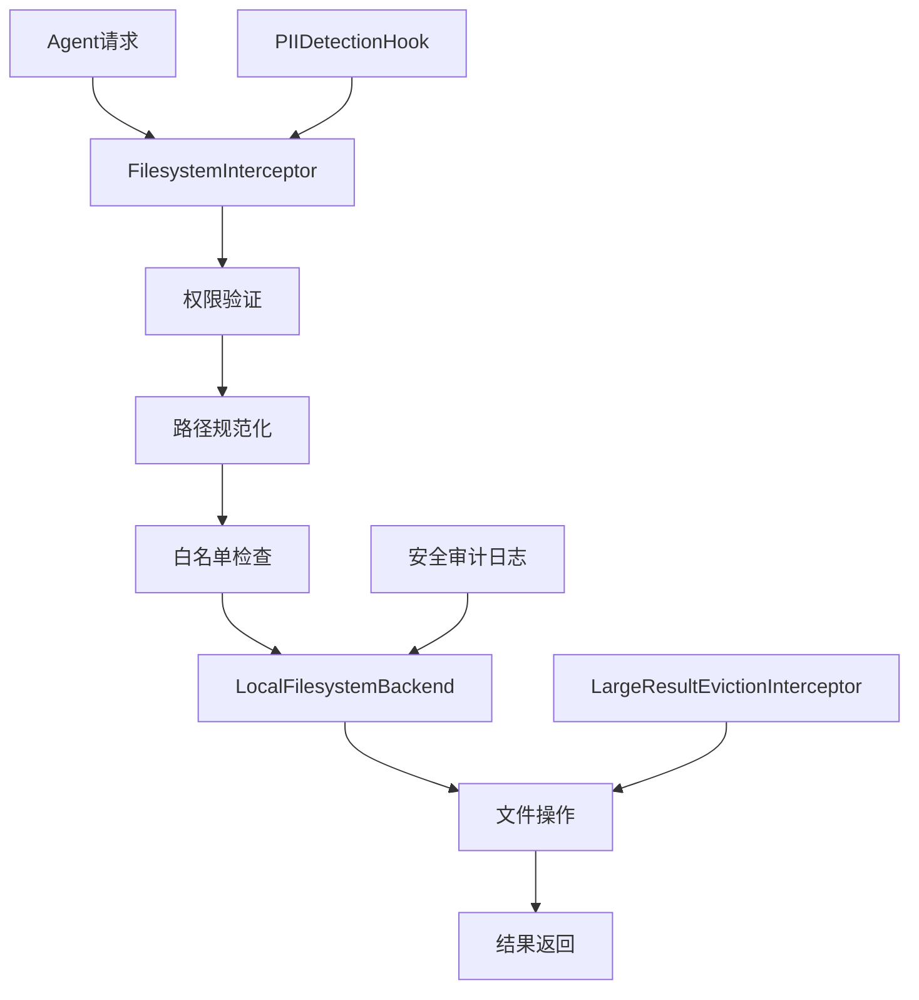
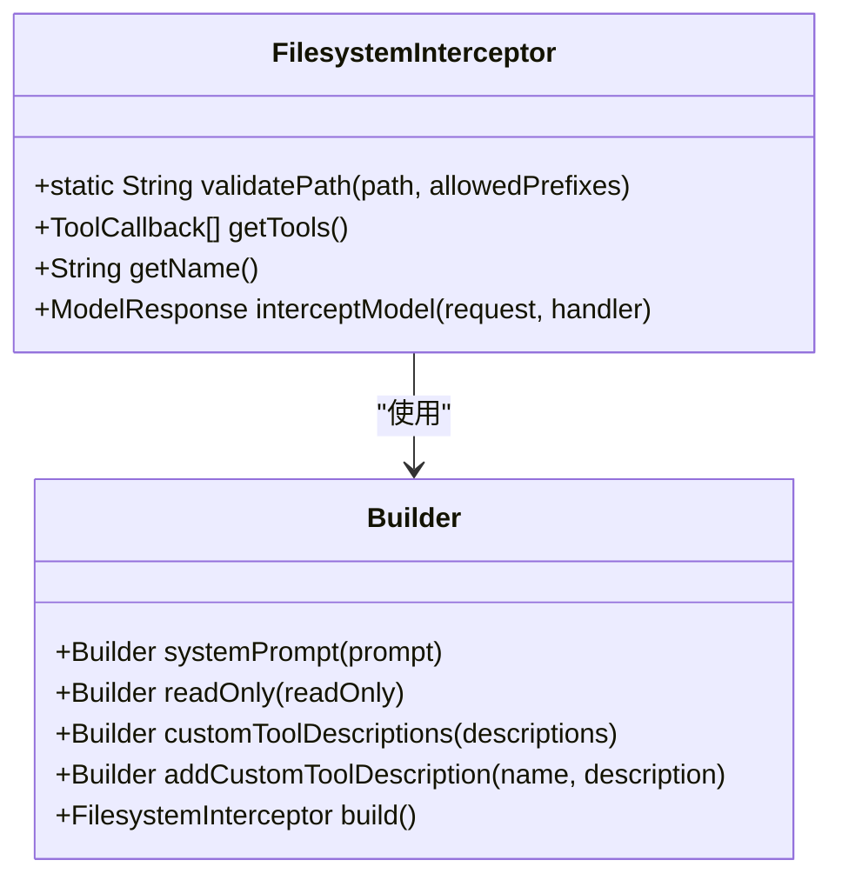
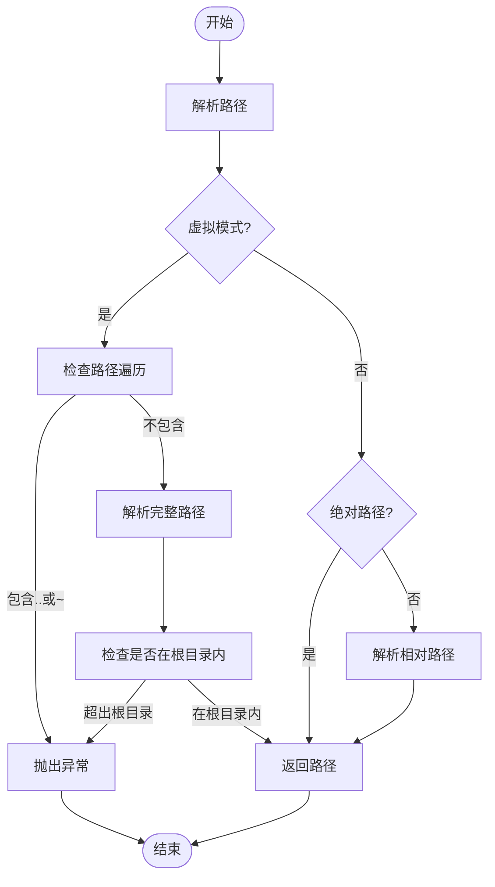
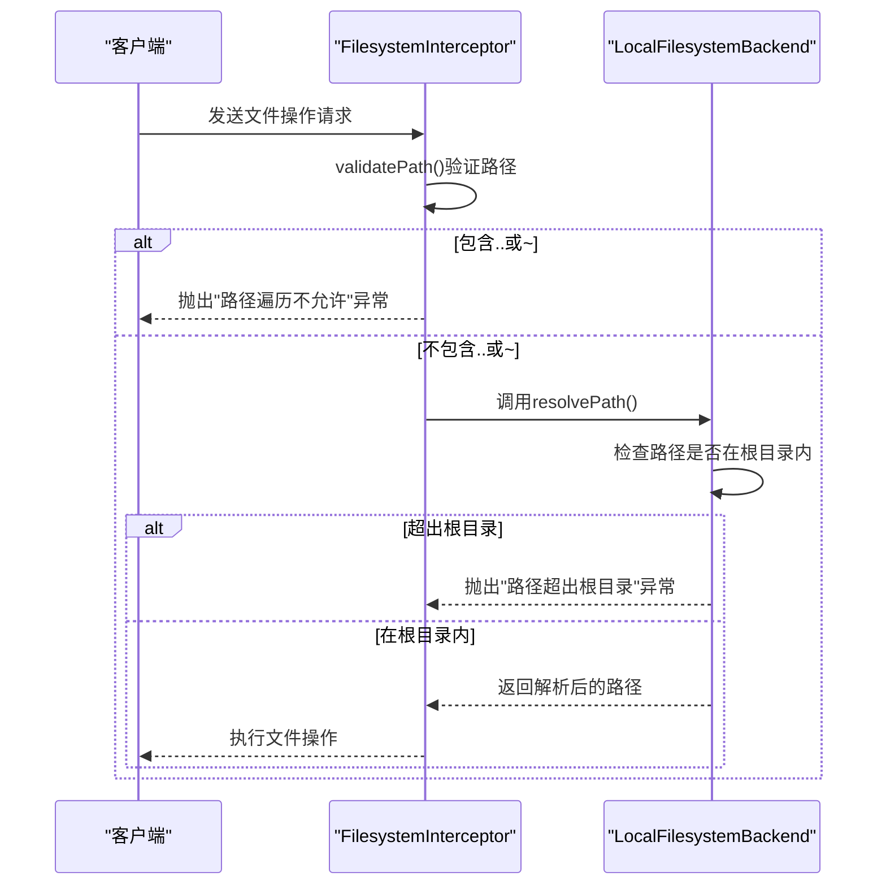
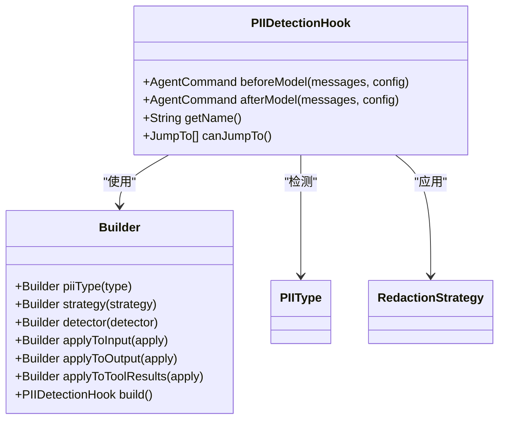

# 安全策略

<cite>
**本文档中引用的文件**  
- [FilesystemInterceptor.java](file://spring-ai-alibaba-agent-framework/src/main/java/com/alibaba/cloud/ai/graph/agent/extension/interceptor/FilesystemInterceptor.java)
- [LocalFilesystemBackend.java](file://spring-ai-alibaba-agent-framework/src/main/java/com/alibaba/cloud/ai/graph/agent/extension/file/LocalFilesystemBackend.java)
- [PIIDetectionHook.java](file://spring-ai-alibaba-agent-framework/src/main/java/com/alibaba/cloud/ai/graph/agent/hook/pii/PIIDetectionHook.java)
- [LargeResultEvictionInterceptor.java](file://spring-ai-alibaba-agent-framework/src/main/java/com/alibaba/cloud/ai/graph/agent/extension/interceptor/LargeResultEvictionInterceptor.java)
- [application.yml](file://examples/deepresearch/src/main/resources/application.yml)
</cite>

## 目录
1. [引言](#引言)
2. [文件系统访问控制架构](#文件系统访问控制架构)
3. [核心安全组件分析](#核心安全组件分析)
4. [FilesystemInterceptor 详细分析](#filesysteminterceptor-详细分析)
5. [LocalFilesystemBackend 权限验证逻辑](#localfilesystembackend-权限验证逻辑)
6. [安全配置选项与示例](#安全配置选项与示例)
7. [路径遍历攻击防护机制](#路径遍历攻击防护机制)
8. [PII检测钩子集成](#pii检测钩子集成)
9. [安全审计与应急响应](#安全审计与应急响应)
10. [总结](#总结)

## 引言

本安全策略文档系统阐述了Spring AI Alibaba框架中文件系统访问的安全控制机制。文档详细说明了如何通过FilesystemInterceptor拦截文件操作请求，实施访问控制策略。内容涵盖安全配置选项，包括可访问目录的白名单、文件大小限制、文件类型过滤和敏感路径保护。文档还深入分析了LocalFilesystemBackend的权限验证逻辑，以及如何防止路径遍历攻击。此外，包含安全审计日志的配置和监控建议，以及应对文件系统攻击的应急响应流程，并讨论了与PII检测钩子的集成，实现敏感数据访问的双重保护。

## 文件系统访问控制架构



**图表来源**  
- [FilesystemInterceptor.java](file://spring-ai-alibaba-agent-framework/src/main/java/com/alibaba/cloud/ai/graph/agent/extension/interceptor/FilesystemInterceptor.java)
- [LocalFilesystemBackend.java](file://spring-ai-alibaba-agent-framework/src/main/java/com/alibaba/cloud/ai/graph/agent/extension/file/LocalFilesystemBackend.java)

**章节来源**  
- [FilesystemInterceptor.java](file://spring-ai-alibaba-agent-framework/src/main/java/com/alibaba/cloud/ai/graph/agent/extension/interceptor/FilesystemInterceptor.java#L32-L191)
- [LocalFilesystemBackend.java](file://spring-ai-alibaba-agent-framework/src/main/java/com/alibaba/cloud/ai/graph/agent/extension/file/LocalFilesystemBackend.java#L37-L119)

## 核心安全组件分析

本系统的核心安全组件包括FilesystemInterceptor、LocalFilesystemBackend、PIIDetectionHook和LargeResultEvictionInterceptor。这些组件协同工作，确保文件系统访问的安全性。FilesystemInterceptor作为入口点，负责拦截和验证所有文件操作请求。LocalFilesystemBackend提供底层文件操作功能，并实施具体的权限验证逻辑。PIIDetectionHook用于检测和处理敏感个人信息，而LargeResultEvictionInterceptor则管理大结果的存储，防止内存溢出。

**章节来源**  
- [FilesystemInterceptor.java](file://spring-ai-alibaba-agent-framework/src/main/java/com/alibaba/cloud/ai/graph/agent/extension/interceptor/FilesystemInterceptor.java#L32-L191)
- [LocalFilesystemBackend.java](file://spring-ai-alibaba-agent-framework/src/main/java/com/alibaba/cloud/ai/graph/agent/extension/file/LocalFilesystemBackend.java#L37-L119)
- [PIIDetectionHook.java](file://spring-ai-alibaba-agent-framework/src/main/java/com/alibaba/cloud/ai/graph/agent/hook/pii/PIIDetectionHook.java#L35-L48)
- [LargeResultEvictionInterceptor.java](file://spring-ai-alibaba-agent-framework/src/main/java/com/alibaba/cloud/ai/graph/agent/extension/interceptor/LargeResultEvictionInterceptor.java#L28-L48)

## FilesystemInterceptor 详细分析

FilesystemInterceptor是文件系统访问控制的核心组件，它通过拦截模型请求来实施安全策略。该拦截器提供了多种文件系统工具，包括ls、read_file、write_file、edit_file、glob和grep，并增强了系统提示以指导代理有效使用这些文件系统操作。



**图表来源**  
- [FilesystemInterceptor.java](file://spring-ai-alibaba-agent-framework/src/main/java/com/alibaba/cloud/ai/graph/agent/extension/interceptor/FilesystemInterceptor.java#L74-L283)

**章节来源**  
- [FilesystemInterceptor.java](file://spring-ai-alibaba-agent-framework/src/main/java/com/alibaba/cloud/ai/graph/agent/extension/interceptor/FilesystemInterceptor.java#L32-L191)

## LocalFilesystemBackend 权限验证逻辑

LocalFilesystemBackend负责执行实际的文件系统操作，并实施严格的权限验证逻辑。该组件在虚拟模式下运行时，会将传入的路径视为当前工作目录下的虚拟绝对路径，禁止遍历（..，~），并确保解析的路径保持在根目录内。



**图表来源**  
- [LocalFilesystemBackend.java](file://spring-ai-alibaba-agent-framework/src/main/java/com/alibaba/cloud/ai/graph/agent/extension/file/LocalFilesystemBackend.java#L87-L105)

**章节来源**  
- [LocalFilesystemBackend.java](file://spring-ai-alibaba-agent-framework/src/main/java/com/alibaba/cloud/ai/graph/agent/extension/file/LocalFilesystemBackend.java#L37-L119)

## 安全配置选项与示例

系统提供了多种安全配置选项，可以通过application.yml文件进行设置。这些选项包括可访问目录的白名单、文件大小限制、文件类型过滤等。

```yaml
spring:
  ai:
    filesystem:
      enabled: true
      read-only: false
      allowed-paths:
        - /safe/directory1
        - /safe/directory2
      max-file-size-mb: 10
      virtual-mode: true
```

配置说明：
- `enabled`: 是否启用文件系统访问
- `read-only`: 是否为只读模式
- `allowed-paths`: 允许访问的目录白名单
- `max-file-size-mb`: 最大文件大小（MB）
- `virtual-mode`: 是否启用虚拟模式

**章节来源**  
- [application.yml](file://examples/deepresearch/src/main/resources/application.yml#L1-L21)

## 路径遍历攻击防护机制

系统通过多种机制防止路径遍历攻击。首先，在FilesystemInterceptor中使用正则表达式模式检测路径遍历：



**图表来源**  
- [FilesystemInterceptor.java](file://spring-ai-alibaba-agent-framework/src/main/java/com/alibaba/cloud/ai/graph/agent/extension/interceptor/FilesystemInterceptor.java#L151-L181)
- [LocalFilesystemBackend.java](file://spring-ai-alibaba-agent-framework/src/main/java/com/alibaba/cloud/ai/graph/agent/extension/file/LocalFilesystemBackend.java#L87-L97)

**章节来源**  
- [FilesystemInterceptor.java](file://spring-ai-alibaba-agent-framework/src/main/java/com/alibaba/cloud/ai/graph/agent/extension/interceptor/FilesystemInterceptor.java#L151-L181)
- [LocalFilesystemBackend.java](file://spring-ai-alibaba-agent-framework/src/main/java/com/alibaba/cloud/ai/graph/agent/extension/file/LocalFilesystemBackend.java#L87-L97)

## PII检测钩子集成

PIIDetectionHook组件用于检测和处理敏感个人信息，实现敏感数据访问的双重保护。该钩子可以在模型调用前后检测PII信息，并应用可配置的策略来处理它们。



**图表来源**  
- [PIIDetectionHook.java](file://spring-ai-alibaba-agent-framework/src/main/java/com/alibaba/cloud/ai/graph/agent/hook/pii/PIIDetectionHook.java#L50-L377)

**章节来源**  
- [PIIDetectionHook.java](file://spring-ai-alibaba-agent-framework/src/main/java/com/alibaba/cloud/ai/graph/agent/hook/pii/PIIDetectionHook.java#L35-L48)

## 安全审计与应急响应

系统应配置安全审计日志，记录所有文件系统访问操作。审计日志应包括操作类型、文件路径、操作时间、操作结果等信息。对于异常情况，如频繁的失败访问尝试或大文件读取，应触发警报。

应急响应流程：
1. 检测到可疑活动
2. 立即禁用相关代理的文件系统访问权限
3. 分析审计日志，确定攻击范围
4. 通知安全团队
5. 修复漏洞并恢复服务
6. 更新安全策略以防止类似攻击

**章节来源**  
- [LocalFilesystemBackend.java](file://spring-ai-alibaba-agent-framework/src/main/java/com/alibaba/cloud/ai/graph/agent/extension/file/LocalFilesystemBackend.java#L214-L248)
- [FilesystemInterceptor.java](file://spring-ai-alibaba-agent-framework/src/main/java/com/alibaba/cloud/ai/graph/agent/extension/interceptor/FilesystemInterceptor.java#L204-L210)

## 总结

本文档全面阐述了Spring AI Alibaba框架中文件系统访问的安全策略。通过FilesystemInterceptor和LocalFilesystemBackend的协同工作，系统实现了严格的访问控制和路径遍历防护。安全配置选项提供了灵活的白名单和限制机制，而PIIDetectionHook的集成则为敏感数据提供了额外保护层。建议在生产环境中启用虚拟模式，配置严格的白名单，并定期审查安全审计日志，以确保系统的安全性。