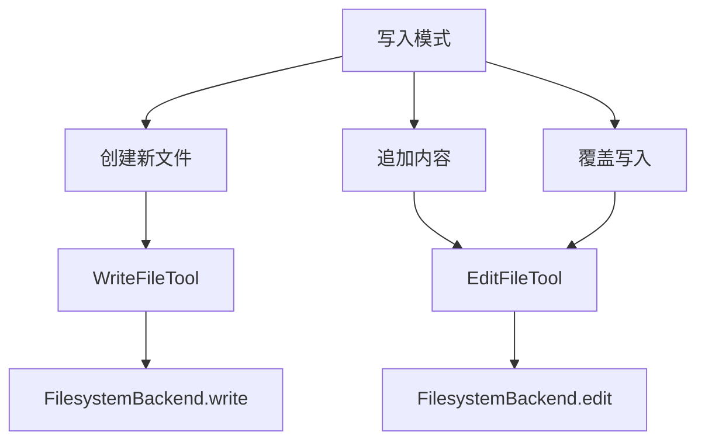
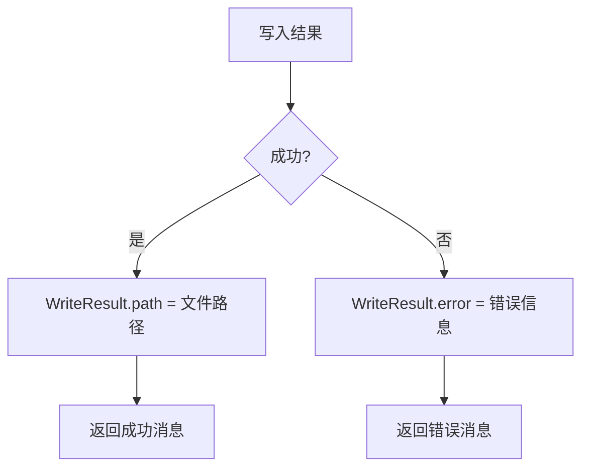
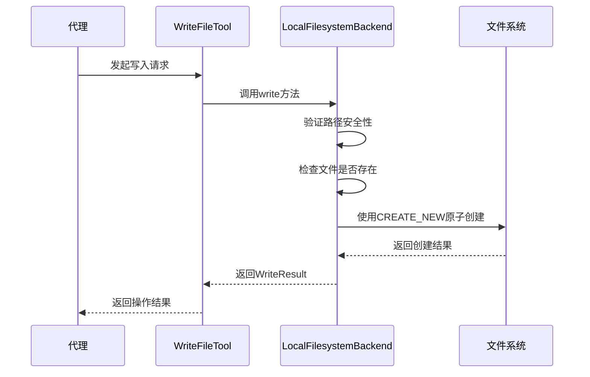
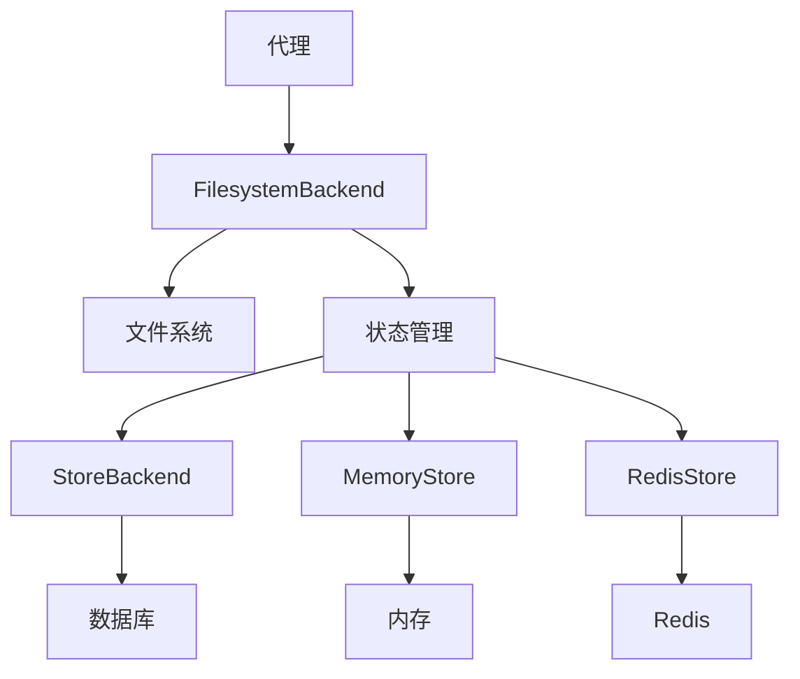

# 文件写入

<cite>
**本文档中引用的文件**  
- [WriteFileTool.java](file://spring-ai-alibaba-agent-framework/src/main/java/com/alibaba/cloud/ai/graph/agent/extension/tools/filesystem/WriteFileTool.java)
- [LocalFilesystemBackend.java](file://spring-ai-alibaba-agent-framework/src/main/java/com/alibaba/cloud/ai/graph/agent/extension/file/LocalFilesystemBackend.java)
- [FilesystemBackend.java](file://spring-ai-alibaba-agent-framework/src/main/java/com/alibaba/cloud/ai/graph/agent/extension/file/FilesystemBackend.java)
- [WriteResult.java](file://spring-ai-alibaba-agent-framework/src/main/java/com/alibaba/cloud/ai/graph/agent/extension/file/WriteResult.java)
- [EditResult.java](file://spring-ai-alibaba-agent-framework/src/main/java/com/alibaba/cloud/ai/graph/agent/extension/file/EditResult.java)
- [FileInfo.java](file://spring-ai-alibaba-agent-framework/src/main/java/com/alibaba/cloud/ai/graph/agent/extension/file/FileInfo.java)
- [FileData.java](file://spring-ai-alibaba-agent-framework/src/main/java/com/alibaba/cloud/ai/graph/agent/extension/file/FileData.java)
- [EditFileTool.java](file://spring-ai-alibaba-agent-framework/src/main/java/com/alibaba/cloud/ai/graph/agent/extension/tools/filesystem/EditFileTool.java)
- [FilesystemInterceptor.java](file://spring-ai-alibaba-agent-framework/src/main/java/com/alibaba/cloud/ai/graph/agent/extension/interceptor/FilesystemInterceptor.java)
</cite>

## 目录
1. [简介](#简介)
2. [核心组件](#核心组件)
3. [文件写入模式](#文件写入模式)
4. [接口参数详解](#接口参数详解)
5. [返回结果与错误码](#返回结果与错误码)
6. [事务性写入与原子操作](#事务性写入与原子操作)
7. [写入失败恢复机制](#写入失败恢复机制)
8. [性能考量](#性能考量)
9. [与状态管理组件的协同](#与状态管理组件的协同)
10. [实际应用示例](#实际应用示例)
11. [安全最佳实践](#安全最佳实践)

## 简介
本文件详细阐述了Spring AI Alibaba框架中文件写入功能的实现原理和最佳实践。文档重点分析了WriteFileTool工具类的实现机制，以及如何通过FilesystemBackend进行安全的文件写入操作。内容涵盖创建新文件、追加内容和覆盖写入等不同模式，详细说明了接口参数、返回结果和错误处理机制。同时，文档还探讨了事务性写入、原子操作、写入失败恢复等高级特性，以及性能优化策略和与状态管理组件的协同工作方式。

## 核心组件

文件写入功能的核心组件包括WriteFileTool、FilesystemBackend和WriteResult。WriteFileTool是提供文件写入能力的工具类，实现了BiFunction接口，能够处理写入请求并返回结果。FilesystemBackend是文件系统后端接口，定义了文件操作的统一契约，LocalFilesystemBackend是其具体实现，直接在文件系统上执行操作。WriteResult封装了写入操作的结果，包含路径、错误信息和文件更新状态。

**本节来源**
- [WriteFileTool.java](file://spring-ai-alibaba-agent-framework/src/main/java/com/alibaba/cloud/ai/graph/agent/extension/tools/filesystem/WriteFileTool.java#L1-L103)
- [FilesystemBackend.java](file://spring-ai-alibaba-agent-framework/src/main/java/com/alibaba/cloud/ai/graph/agent/extension/file/FilesystemBackend.java#L1-L93)
- [WriteResult.java](file://spring-ai-alibaba-agent-framework/src/main/java/com/alibaba/cloud/ai/graph/agent/extension/file/WriteResult.java#L1-L47)

## 文件写入模式

框架支持多种文件写入模式，主要包括创建新文件、追加内容和覆盖写入。创建新文件模式通过WriteFileTool实现，确保目标文件不存在后再进行写入。追加内容和覆盖写入则通过EditFileTool实现，允许修改现有文件的内容。LocalFilesystemBackend提供了write和edit方法，分别对应不同的写入模式。

**图示来源**
- [WriteFileTool.java](file://spring-ai-alibaba-agent-framework/src/main/java/com/alibaba/cloud/ai/graph/agent/extension/tools/filesystem/WriteFileTool.java#L1-L103)
- [EditFileTool.java](file://spring-ai-alibaba-agent-framework/src/main/java/com/alibaba/cloud/ai/graph/agent/extension/tools/filesystem/EditFileTool.java#L1-L121)
- [LocalFilesystemBackend.java](file://spring-ai-alibaba-agent-framework/src/main/java/com/alibaba/cloud/ai/graph/agent/extension/file/LocalFilesystemBackend.java#L1-L646)

## 接口参数详解

文件写入操作涉及多个关键参数，包括文件路径、内容、写入模式和文件权限。文件路径必须是绝对路径，相对路径会被解析为当前工作目录下的路径。内容参数为字符串类型，将被编码为UTF-8格式写入文件。写入模式由具体工具类决定，创建新文件使用write_file工具，修改现有文件使用edit_file工具。文件权限由操作系统默认权限控制，不支持在API层面设置。

**本节来源**
- [WriteFileTool.java](file://spring-ai-alibaba-agent-framework/src/main/java/com/alibaba/cloud/ai/graph/agent/extension/tools/filesystem/WriteFileTool.java#L85-L102)
- [EditFileTool.java](file://spring-ai-alibaba-agent-framework/src/main/java/com/alibaba/cloud/ai/graph/agent/extension/tools/filesystem/EditFileTool.java#L118-L121)
- [LocalFilesystemBackend.java](file://spring-ai-alibaba-agent-framework/src/main/java/com/alibaba/cloud/ai/graph/agent/extension/file/LocalFilesystemBackend.java#L69-L73)

## 返回结果与错误码

写入操作的返回结果通过WriteResult和EditResult对象封装。WriteResult包含成功写入的文件路径、错误信息和文件更新状态。当写入成功时，path字段包含文件路径，error字段为null；当写入失败时，path字段为null，error字段包含详细的错误信息。常见的错误码包括文件已存在、路径遍历攻击、磁盘空间不足和权限不足等。

**图示来源**
- [WriteResult.java](file://spring-ai-alibaba-agent-framework/src/main/java/com/alibaba/cloud/ai/graph/agent/extension/file/WriteResult.java#L1-L47)
- [EditResult.java](file://spring-ai-alibaba-agent-framework/src/main/java/com/alibaba/cloud/ai/graph/agent/extension/file/EditResult.java#L1-L53)
- [LocalFilesystemBackend.java](file://spring-ai-alibaba-agent-framework/src/main/java/com/alibaba/cloud/ai/graph/agent/extension/file/LocalFilesystemBackend.java#L250-L277)

## 事务性写入与原子操作

框架通过Java NIO的StandardOpenOption确保写入操作的原子性。在创建新文件时，使用StandardOpenOption.CREATE_NEW标志，确保只有当文件不存在时才创建，避免了竞态条件。在修改现有文件时，使用StandardOpenOption.TRUNCATE_EXISTING标志，确保文件内容被完全替换。这些原子操作保证了写入过程的完整性，防止了部分写入导致的数据损坏。

**图示来源**
- [WriteFileTool.java](file://spring-ai-alibaba-agent-framework/src/main/java/com/alibaba/cloud/ai/graph/agent/extension/tools/filesystem/WriteFileTool.java#L50-L68)
- [LocalFilesystemBackend.java](file://spring-ai-alibaba-agent-framework/src/main/java/com/alibaba/cloud/ai/graph/agent/extension/file/LocalFilesystemBackend.java#L267-L269)
- [FilesystemInterceptor.java](file://spring-ai-alibaba-agent-framework/src/main/java/com/alibaba/cloud/ai/graph/agent/extension/interceptor/FilesystemInterceptor.java#L103-L136)

## 写入失败恢复机制

框架实现了完善的写入失败恢复机制。当写入操作失败时，系统会捕获IOException并返回详细的错误信息，帮助代理识别问题原因。对于临时性错误（如磁盘空间不足），代理可以采取重试策略；对于永久性错误（如权限不足），代理需要调整策略或请求用户干预。此外，通过FilesystemInterceptor的拦截机制，可以在写入前后执行额外的验证和恢复逻辑。

**本节来源**
- [WriteFileTool.java](file://spring-ai-alibaba-agent-framework/src/main/java/com/alibaba/cloud/ai/graph/agent/extension/tools/filesystem/WriteFileTool.java#L70-L72)
- [LocalFilesystemBackend.java](file://spring-ai-alibaba-agent-framework/src/main/java/com/alibaba/cloud/ai/graph/agent/extension/file/LocalFilesystemBackend.java#L272-L276)
- [FilesystemInterceptor.java](file://spring-ai-alibaba-agent-framework/src/main/java/com/alibaba/cloud/ai/graph/agent/extension/interceptor/FilesystemInterceptor.java#L76-L283)

## 性能考量

文件写入操作的性能受多个因素影响，包括磁盘I/O速度、文件大小和并发访问。框架通过批量写入优化和缓存机制提高性能。对于大文件写入，建议分块处理以减少内存占用。LocalFilesystemBackend设置了10MB的默认文件大小限制，防止读取过大的文件影响系统性能。此外，通过异步I/O和连接池技术可以进一步提升高并发场景下的写入性能。

**本节来源**
- [LocalFilesystemBackend.java](file://spring-ai-alibaba-agent-framework/src/main/java/com/alibaba/cloud/ai/graph/agent/extension/file/LocalFilesystemBackend.java#L57-L73)
- [FilesystemBackend.java](file://spring-ai-alibaba-agent-framework/src/main/java/com/alibaba/cloud/ai/graph/agent/extension/file/FilesystemBackend.java#L42-L43)

## 与状态管理组件的协同

文件写入功能与状态管理组件紧密协同工作。FilesystemBackend不仅处理文件系统操作，还维护文件的元数据状态，如修改时间、文件大小等。通过FileInfo和FileData对象，实现了文件内容与状态的分离管理。在分布式环境中，可以结合StoreBackend实现跨节点的状态同步，确保文件操作的一致性。此外，通过Checkpoint机制，可以定期保存文件系统的状态快照，支持故障恢复和版本回溯。

**图示来源**
- [FilesystemBackend.java](file://spring-ai-alibaba-agent-framework/src/main/java/com/alibaba/cloud/ai/graph/agent/extension/file/FilesystemBackend.java#L27-L31)
- [FileInfo.java](file://spring-ai-alibaba-agent-framework/src/main/java/com/alibaba/cloud/ai/graph/agent/extension/file/FileInfo.java#L1-L53)
- [FileData.java](file://spring-ai-alibaba-agent-framework/src/main/java/com/alibaba/cloud/ai/graph/agent/extension/file/FileData.java#L1-L48)

## 实际应用示例

在实际应用中，文件写入功能可用于生成报告、保存用户数据和更新配置文件。例如，代理可以定期生成系统健康报告并保存到指定目录；用户交互数据可以被持久化存储以便后续分析；配置文件可以根据运行时条件动态更新。通过组合使用ls、read_file、write_file和edit_file等工具，代理可以实现复杂的文件操作流程，满足多样化的业务需求。

**本节来源**
- [WriteFileTool.java](file://spring-ai-alibaba-agent-framework/src/main/java/com/alibaba/cloud/ai/graph/agent/extension/tools/filesystem/WriteFileTool.java#L36-L44)
- [EditFileTool.java](file://spring-ai-alibaba-agent-framework/src/main/java/com/alibaba/cloud/ai/graph/agent/extension/tools/filesystem/EditFileTool.java#L36-L45)
- [FilesystemInterceptor.java](file://spring-ai-alibaba-agent-framework/src/main/java/com/alibaba/cloud/ai/graph/agent/extension/interceptor/FilesystemInterceptor.java#L81-L94)

## 安全最佳实践

文件写入操作必须遵循严格的安全最佳实践。首先，所有路径都必须经过validatePath方法的验证，防止路径遍历攻击。其次，建议使用virtual_mode模式，将文件操作限制在指定的根目录内。此外，应避免在系统关键目录（如/、/etc）中进行写入操作。通过FilesystemInterceptor的readOnly配置，可以在必要时禁用写入功能，提供额外的安全保障。

**本节来源**
- [LocalFilesystemBackend.java](file://spring-ai-alibaba-agent-framework/src/main/java/com/alibaba/cloud/ai/graph/agent/extension/file/LocalFilesystemBackend.java#L87-L97)
- [FilesystemInterceptor.java](file://spring-ai-alibaba-agent-framework/src/main/java/com/alibaba/cloud/ai/graph/agent/extension/interceptor/FilesystemInterceptor.java#L151-L181)
- [WriteFileTool.java](file://spring-ai-alibaba-agent-framework/src/main/java/com/alibaba/cloud/ai/graph/agent/extension/tools/filesystem/WriteFileTool.java#L54-L57)