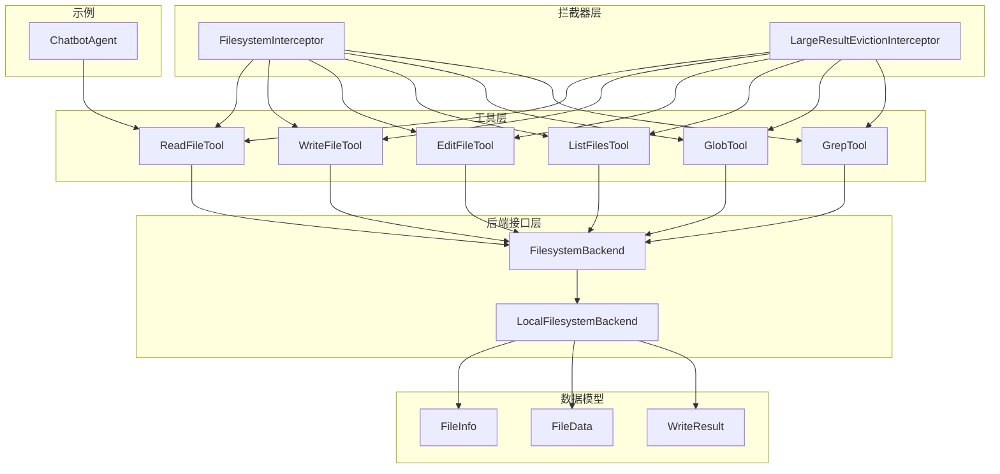
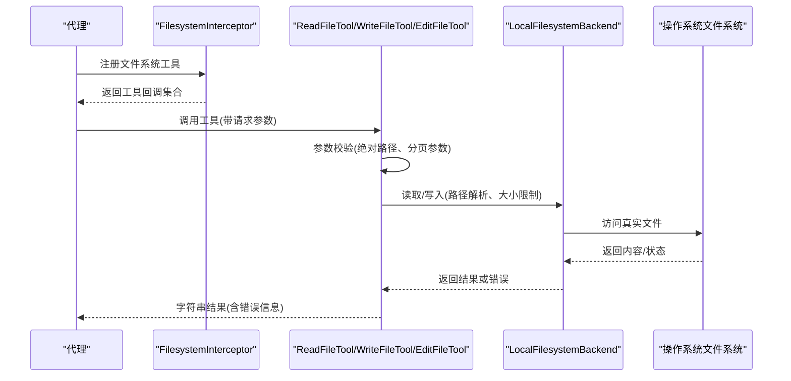
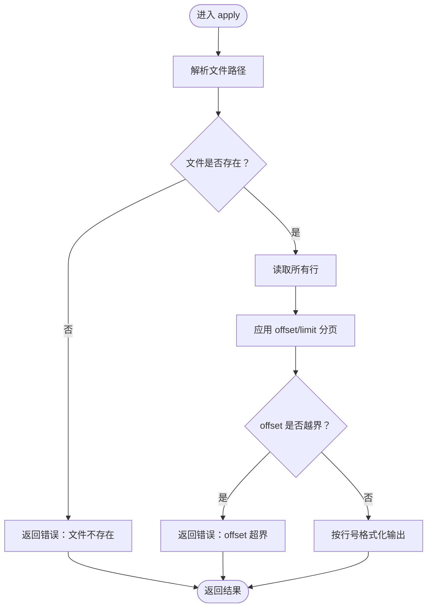
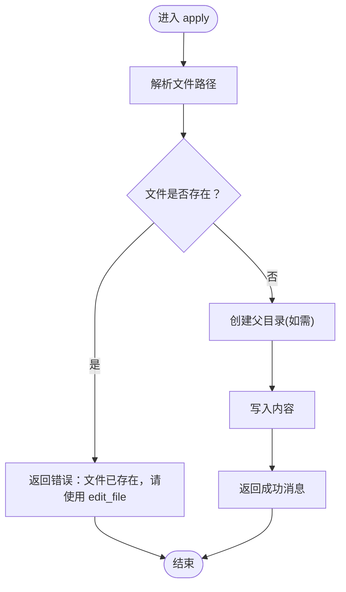
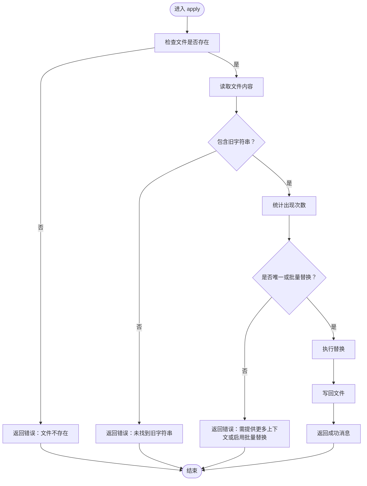
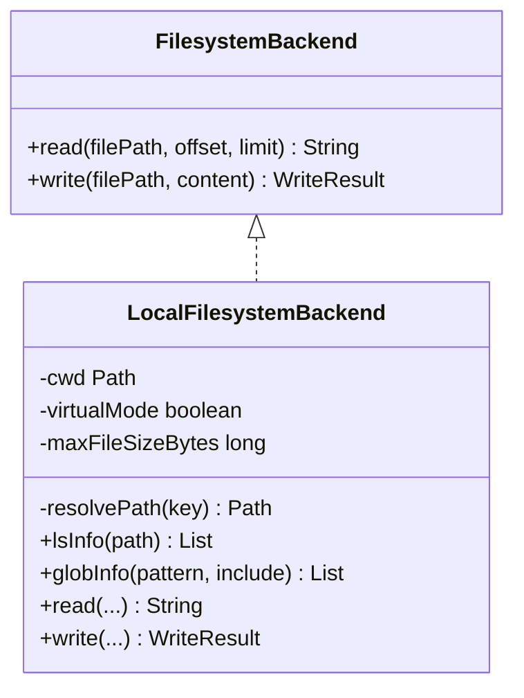
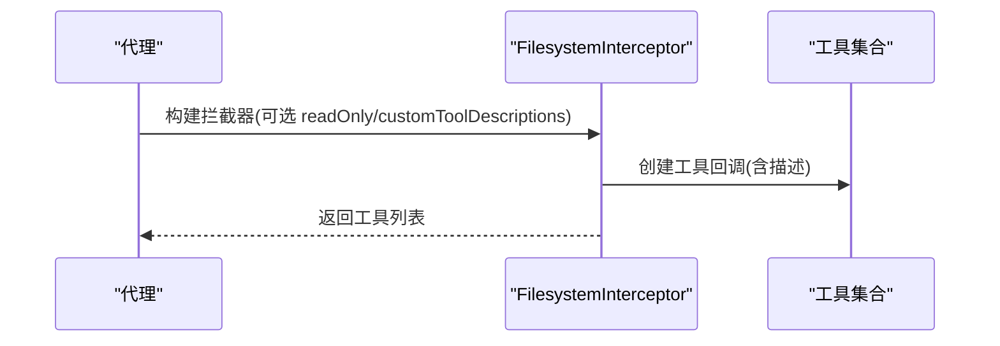
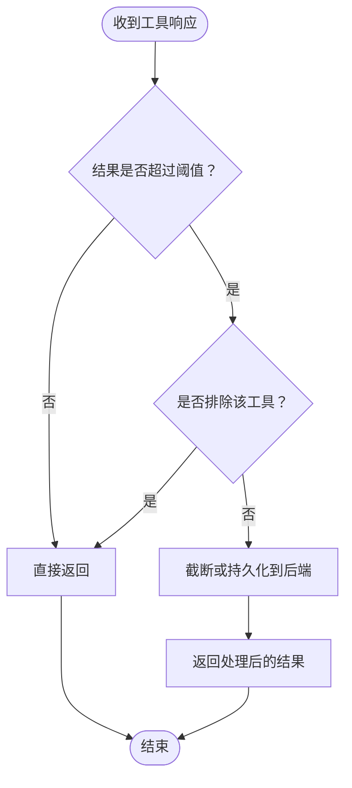
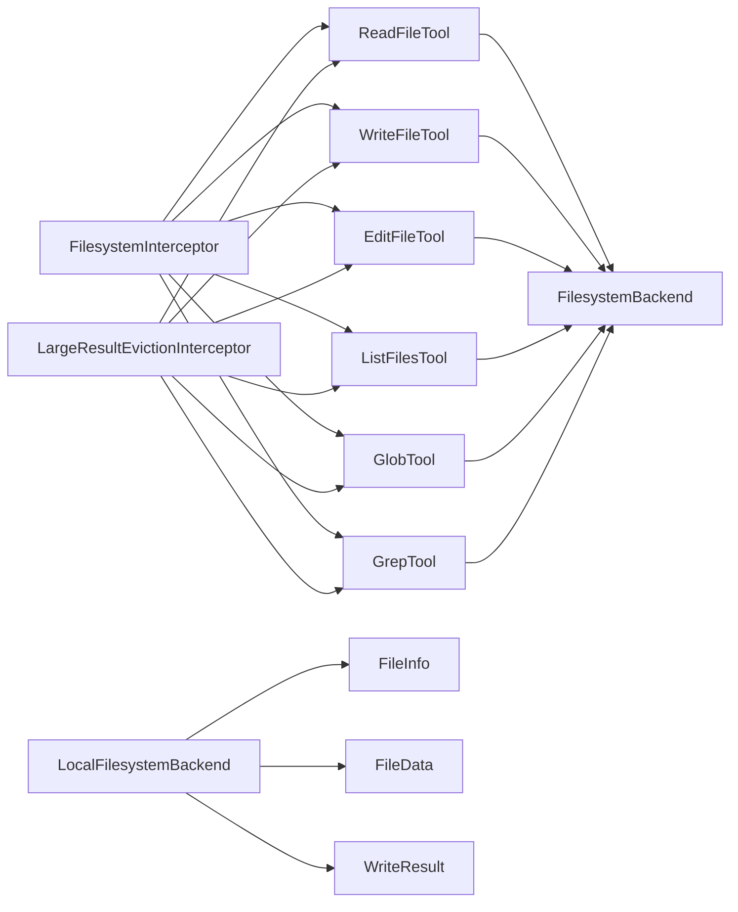

# 文件系统访问

<cite>
**本文引用的文件**
- [FilesystemBackend.java](file://spring-ai-alibaba-agent-framework/src/main/java/com/alibaba/cloud/ai/graph/agent/extension/file/FilesystemBackend.java)
- [LocalFilesystemBackend.java](file://spring-ai-alibaba-agent-framework/src/main/java/com/alibaba/cloud/ai/graph/agent/extension/file/LocalFilesystemBackend.java)
- [FilesystemInterceptor.java](file://spring-ai-alibaba-agent-framework/src/main/java/com/alibaba/cloud/ai/graph/agent/extension/interceptor/FilesystemInterceptor.java)
- [ReadFileTool.java](file://spring-ai-alibaba-agent-framework/src/main/java/com/alibaba/cloud/ai/graph/agent/extension/tools/filesystem/ReadFileTool.java)
- [WriteFileTool.java](file://spring-ai-alibaba-agent-framework/src/main/java/com/alibaba/cloud/ai/graph/agent/extension/tools/filesystem/WriteFileTool.java)
- [EditFileTool.java](file://spring-ai-alibaba-agent-framework/src/main/java/com/alibaba/cloud/ai/graph/agent/extension/tools/filesystem/EditFileTool.java)
- [ListFilesTool.java](file://spring-ai-alibaba-agent-framework/src/main/java/com/alibaba/cloud/ai/graph/agent/extension/tools/filesystem/ListFilesTool.java)
- [GlobTool.java](file://spring-ai-alibaba-agent-framework/src/main/java/com/alibaba/cloud/ai/graph/agent/extension/tools/filesystem/GlobTool.java)
- [GrepTool.java](file://spring-ai-alibaba-agent-framework/src/main/java/com/alibaba/cloud/ai/graph/agent/extension/tools/filesystem/GrepTool.java)
- [LargeResultEvictionInterceptor.java](file://spring-ai-alibaba-agent-framework/src/main/java/com/alibaba/cloud/ai/graph/agent/extension/interceptor/LargeResultEvictionInterceptor.java)
- [FileInfo.java](file://spring-ai-alibaba-agent-framework/src/main/java/com/alibaba/cloud/ai/graph/agent/extension/file/FileInfo.java)
- [FileData.java](file://spring-ai-alibaba-agent-framework/src/main/java/com/alibaba/cloud/ai/graph/agent/extension/file/FileData.java)
- [WriteResult.java](file://spring-ai-alibaba-agent-framework/src/main/java/com/alibaba/cloud/ai/graph/agent/extension/file/WriteResult.java)
- [ChatbotAgent.java](file://examples/chatbot/src/main/java/com/alibaba/cloud/ai/examples/chatbot/ChatbotAgent.java)
</cite>

## 目录
1. [简介](#简介)
2. [项目结构](#项目结构)
3. [核心组件](#核心组件)
4. [架构总览](#架构总览)
5. [详细组件分析](#详细组件分析)
6. [依赖关系分析](#依赖关系分析)
7. [性能与安全考量](#性能与安全考量)
8. [故障排查指南](#故障排查指南)
9. [结论](#结论)
10. [附录：安全配置清单](#附录安全配置清单)

## 简介
本文件系统访问模块为智能体提供安全可控的文件系统能力，包含读取、写入、编辑、目录列举、通配符搜索与文本检索等工具，并通过抽象后端接口与拦截器实现统一接入与安全控制。本文重点阐述：
- ReadFileTool 与 WriteFileTool 的实现原理与调用流程
- FilesystemBackend 抽象层与 LocalFilesystemBackend 的交互方式
- 权限控制与越权防护策略（路径校验、根目录沙箱、只读模式）
- 安全配置指南（可访问目录范围、文件大小上限、结果截断与大结果驱逐）
- 在代理中安全集成文件读写功能的方法与 IO 异常处理建议

## 项目结构
围绕文件系统访问的核心代码位于 agent 扩展模块，主要由以下层次构成：
- 工具层：ReadFileTool、WriteFileTool、EditFileTool、ListFilesTool、GlobTool、GrepTool
- 后端接口层：FilesystemBackend 及其实现 LocalFilesystemBackend
- 拦截器层：FilesystemInterceptor 提供工具注入与系统提示；LargeResultEvictionInterceptor 负责大结果驱逐
- 数据模型：FileInfo、FileData、WriteResult
- 示例：ChatbotAgent 展示如何在代理中注册自定义文件查看工具

图表来源
- [FilesystemInterceptor.java](file://spring-ai-alibaba-agent-framework/src/main/java/com/alibaba/cloud/ai/graph/agent/extension/interceptor/FilesystemInterceptor.java#L110-L136)
- [LargeResultEvictionInterceptor.java](file://spring-ai-alibaba-agent-framework/src/main/java/com/alibaba/cloud/ai/graph/agent/extension/interceptor/LargeResultEvictionInterceptor.java#L231-L318)
- [FilesystemBackend.java](file://spring-ai-alibaba-agent-framework/src/main/java/com/alibaba/cloud/ai/graph/agent/extension/file/FilesystemBackend.java#L33-L51)
- [LocalFilesystemBackend.java](file://spring-ai-alibaba-agent-framework/src/main/java/com/alibaba/cloud/ai/graph/agent/extension/file/LocalFilesystemBackend.java#L50-L119)
- [ReadFileTool.java](file://spring-ai-alibaba-agent-framework/src/main/java/com/alibaba/cloud/ai/graph/agent/extension/tools/filesystem/ReadFileTool.java#L32-L122)
- [WriteFileTool.java](file://spring-ai-alibaba-agent-framework/src/main/java/com/alibaba/cloud/ai/graph/agent/extension/tools/filesystem/WriteFileTool.java#L34-L84)
- [EditFileTool.java](file://spring-ai-alibaba-agent-framework/src/main/java/com/alibaba/cloud/ai/graph/agent/extension/tools/filesystem/EditFileTool.java#L31-L150)
- [ListFilesTool.java](file://spring-ai-alibaba-agent-framework/src/main/java/com/alibaba/cloud/ai/graph/agent/extension/tools/filesystem/ListFilesTool.java#L31-L77)
- [GlobTool.java](file://spring-ai-alibaba-agent-framework/src/main/java/com/alibaba/cloud/ai/graph/agent/extension/tools/filesystem/GlobTool.java#L32-L86)
- [GrepTool.java](file://spring-ai-alibaba-agent-framework/src/main/java/com/alibaba/cloud/ai/graph/agent/extension/tools/filesystem/GrepTool.java#L31-L139)
- [FileInfo.java](file://spring-ai-alibaba-agent-framework/src/main/java/com/alibaba/cloud/ai/graph/agent/extension/file/FileInfo.java#L16-L53)
- [FileData.java](file://spring-ai-alibaba-agent-framework/src/main/java/com/alibaba/cloud/ai/graph/agent/extension/file/FileData.java#L16-L48)
- [WriteResult.java](file://spring-ai-alibaba-agent-framework/src/main/java/com/alibaba/cloud/ai/graph/agent/extension/file/WriteResult.java#L16-L47)
- [ChatbotAgent.java](file://examples/chatbot/src/main/java/com/alibaba/cloud/ai/examples/chatbot/ChatbotAgent.java#L104-L117)

章节来源
- [FilesystemInterceptor.java](file://spring-ai-alibaba-agent-framework/src/main/java/com/alibaba/cloud/ai/graph/agent/extension/interceptor/FilesystemInterceptor.java#L32-L136)
- [LocalFilesystemBackend.java](file://spring-ai-alibaba-agent-framework/src/main/java/com/alibaba/cloud/ai/graph/agent/extension/file/LocalFilesystemBackend.java#L50-L119)
- [ReadFileTool.java](file://spring-ai-alibaba-agent-framework/src/main/java/com/alibaba/cloud/ai/graph/agent/extension/tools/filesystem/ReadFileTool.java#L32-L122)
- [WriteFileTool.java](file://spring-ai-alibaba-agent-framework/src/main/java/com/alibaba/cloud/ai/graph/agent/extension/tools/filesystem/WriteFileTool.java#L34-L84)
- [EditFileTool.java](file://spring-ai-alibaba-agent-framework/src/main/java/com/alibaba/cloud/ai/graph/agent/extension/tools/filesystem/EditFileTool.java#L31-L150)
- [ListFilesTool.java](file://spring-ai-alibaba-agent-framework/src/main/java/com/alibaba/cloud/ai/graph/agent/extension/tools/filesystem/ListFilesTool.java#L31-L77)
- [GlobTool.java](file://spring-ai-alibaba-agent-framework/src/main/java/com/alibaba/cloud/ai/graph/agent/extension/tools/filesystem/GlobTool.java#L32-L86)
- [GrepTool.java](file://spring-ai-alibaba-agent-framework/src/main/java/com/alibaba/cloud/ai/graph/agent/extension/tools/filesystem/GrepTool.java#L31-L139)
- [LargeResultEvictionInterceptor.java](file://spring-ai-alibaba-agent-framework/src/main/java/com/alibaba/cloud/ai/graph/agent/extension/interceptor/LargeResultEvictionInterceptor.java#L231-L318)
- [ChatbotAgent.java](file://examples/chatbot/src/main/java/com/alibaba/cloud/ai/examples/chatbot/ChatbotAgent.java#L104-L117)

## 核心组件
- FilesystemBackend：统一的文件系统抽象接口，定义读取与写入能力，便于替换不同存储后端（本地、状态、复合等）。
- LocalFilesystemBackend：本地文件系统实现，支持虚拟模式下的根目录沙箱、路径规范化与大小限制。
- FilesystemInterceptor：向代理注入文件系统工具集（ls、read_file、write_file、edit_file、glob、grep），并提供系统提示与路径校验。
- ReadFileTool：按行号格式化输出文件内容，支持分页读取，避免上下文溢出。
- WriteFileTool：创建新文件并写入内容，若目标已存在则拒绝覆盖。
- EditFileTool：基于精确字符串替换的安全编辑，支持唯一性检查与批量替换。
- LargeResultEvictionInterceptor：对大结果进行截断或持久化，避免上下文超限。
- 数据模型：FileInfo、FileData、WriteResult 提供统一的数据契约。

章节来源
- [FilesystemBackend.java](file://spring-ai-alibaba-agent-framework/src/main/java/com/alibaba/cloud/ai/graph/agent/extension/file/FilesystemBackend.java#L33-L51)
- [LocalFilesystemBackend.java](file://spring-ai-alibaba-agent-framework/src/main/java/com/alibaba/cloud/ai/graph/agent/extension/file/LocalFilesystemBackend.java#L50-L119)
- [FilesystemInterceptor.java](file://spring-ai-alibaba-agent-framework/src/main/java/com/alibaba/cloud/ai/graph/agent/extension/interceptor/FilesystemInterceptor.java#L110-L136)
- [ReadFileTool.java](file://spring-ai-alibaba-agent-framework/src/main/java/com/alibaba/cloud/ai/graph/agent/extension/tools/filesystem/ReadFileTool.java#L32-L122)
- [WriteFileTool.java](file://spring-ai-alibaba-agent-framework/src/main/java/com/alibaba/cloud/ai/graph/agent/extension/tools/filesystem/WriteFileTool.java#L34-L84)
- [EditFileTool.java](file://spring-ai-alibaba-agent-framework/src/main/java/com/alibaba/cloud/ai/graph/agent/extension/tools/filesystem/EditFileTool.java#L31-L150)
- [LargeResultEvictionInterceptor.java](file://spring-ai-alibaba-agent-framework/src/main/java/com/alibaba/cloud/ai/graph/agent/extension/interceptor/LargeResultEvictionInterceptor.java#L231-L318)
- [FileInfo.java](file://spring-ai-alibaba-agent-framework/src/main/java/com/alibaba/cloud/ai/graph/agent/extension/file/FileInfo.java#L16-L53)
- [FileData.java](file://spring-ai-alibaba-agent-framework/src/main/java/com/alibaba/cloud/ai/graph/agent/extension/file/FileData.java#L16-L48)
- [WriteResult.java](file://spring-ai-alibaba-agent-framework/src/main/java/com/alibaba/cloud/ai/graph/agent/extension/file/WriteResult.java#L16-L47)

## 架构总览
下图展示了从代理到工具、再到后端的调用链路与安全控制点。

图表来源
- [FilesystemInterceptor.java](file://spring-ai-alibaba-agent-framework/src/main/java/com/alibaba/cloud/ai/graph/agent/extension/interceptor/FilesystemInterceptor.java#L110-L136)
- [ReadFileTool.java](file://spring-ai-alibaba-agent-framework/src/main/java/com/alibaba/cloud/ai/graph/agent/extension/tools/filesystem/ReadFileTool.java#L59-L87)
- [WriteFileTool.java](file://spring-ai-alibaba-agent-framework/src/main/java/com/alibaba/cloud/ai/graph/agent/extension/tools/filesystem/WriteFileTool.java#L50-L73)
- [EditFileTool.java](file://spring-ai-alibaba-agent-framework/src/main/java/com/alibaba/cloud/ai/graph/agent/extension/tools/filesystem/EditFileTool.java#L50-L109)
- [LocalFilesystemBackend.java](file://spring-ai-alibaba-agent-framework/src/main/java/com/alibaba/cloud/ai/graph/agent/extension/file/LocalFilesystemBackend.java#L87-L105)

## 详细组件分析

### ReadFileTool 实现原理
- 输入参数：文件绝对路径、偏移量 offset、最大行数 limit
- 处理逻辑：
  - 解析路径并读取全部行
  - 应用分页切片，生成带行号的输出
  - 对长行进行截断，避免上下文膨胀
- 错误处理：捕获 IO 异常并返回错误信息
- 使用建议：对大文件采用分页读取，先小 limit 探索结构，再逐步扩大

图表来源
- [ReadFileTool.java](file://spring-ai-alibaba-agent-framework/src/main/java/com/alibaba/cloud/ai/graph/agent/extension/tools/filesystem/ReadFileTool.java#L59-L87)

章节来源
- [ReadFileTool.java](file://spring-ai-alibaba-agent-framework/src/main/java/com/alibaba/cloud/ai/graph/agent/extension/tools/filesystem/ReadFileTool.java#L32-L122)

### WriteFileTool 实现原理
- 输入参数：文件绝对路径、内容
- 处理逻辑：
  - 检查目标文件是否已存在（存在则拒绝新建）
  - 自动创建父级目录（如需要）
  - 写入内容并返回成功消息
- 错误处理：捕获 IO 异常并返回错误信息
- 安全要点：仅允许“新建”文件，避免覆盖已有文件；结合只读模式进一步限制

图表来源
- [WriteFileTool.java](file://spring-ai-alibaba-agent-framework/src/main/java/com/alibaba/cloud/ai/graph/agent/extension/tools/filesystem/WriteFileTool.java#L50-L73)

章节来源
- [WriteFileTool.java](file://spring-ai-alibaba-agent-framework/src/main/java/com/alibaba/cloud/ai/graph/agent/extension/tools/filesystem/WriteFileTool.java#L34-L84)

### EditFileTool 实现原理
- 输入参数：文件绝对路径、旧字符串、新字符串、是否批量替换
- 处理逻辑：
  - 校验文件存在性
  - 统计旧字符串出现次数
  - 若非批量且不唯一，拒绝编辑
  - 执行替换并回写
- 错误处理：捕获 IO 异常与未找到字符串等场景

图表来源
- [EditFileTool.java](file://spring-ai-alibaba-agent-framework/src/main/java/com/alibaba/cloud/ai/graph/agent/extension/tools/filesystem/EditFileTool.java#L50-L109)

章节来源
- [EditFileTool.java](file://spring-ai-alibaba-agent-framework/src/main/java/com/alibaba/cloud/ai/graph/agent/extension/tools/filesystem/EditFileTool.java#L31-L150)

### FilesystemBackend 抽象层与 LocalFilesystemBackend
- FilesystemBackend：定义 read(filePath, offset, limit) 与 write(filePath, content) 两个核心方法，作为统一接口。
- LocalFilesystemBackend：
  - 路径解析：支持虚拟模式（virtualMode）下的根目录沙箱，禁止 .. 与 ~，确保解析路径在 cwd 下
  - 大小限制：以字节为单位限制读取文件大小
  - 列表与搜索：提供 lsInfo、globInfo 等能力（用于工具层）

图表来源
- [FilesystemBackend.java](file://spring-ai-alibaba-agent-framework/src/main/java/com/alibaba/cloud/ai/graph/agent/extension/file/FilesystemBackend.java#L33-L51)
- [LocalFilesystemBackend.java](file://spring-ai-alibaba-agent-framework/src/main/java/com/alibaba/cloud/ai/graph/agent/extension/file/LocalFilesystemBackend.java#L50-L119)

章节来源
- [FilesystemBackend.java](file://spring-ai-alibaba-agent-framework/src/main/java/com/alibaba/cloud/ai/graph/agent/extension/file/FilesystemBackend.java#L33-L51)
- [LocalFilesystemBackend.java](file://spring-ai-alibaba-agent-framework/src/main/java/com/alibaba/cloud/ai/graph/agent/extension/file/LocalFilesystemBackend.java#L50-L119)

### FilesystemInterceptor：工具注入与系统提示
- 注入工具：ls、read_file、write_file、edit_file、glob、grep
- 系统提示：强调绝对路径要求、避免根目录、推荐先 ls 再 read/edit
- 路径校验：提供 validatePath 方法，检测目录穿越与前缀白名单
- 只读模式：通过 readOnly 控制是否注入写入类工具

图表来源
- [FilesystemInterceptor.java](file://spring-ai-alibaba-agent-framework/src/main/java/com/alibaba/cloud/ai/graph/agent/extension/interceptor/FilesystemInterceptor.java#L110-L136)
- [FilesystemInterceptor.java](file://spring-ai-alibaba-agent-framework/src/main/java/com/alibaba/cloud/ai/graph/agent/extension/interceptor/FilesystemInterceptor.java#L142-L181)

章节来源
- [FilesystemInterceptor.java](file://spring-ai-alibaba-agent-framework/src/main/java/com/alibaba/cloud/ai/graph/agent/extension/interceptor/FilesystemInterceptor.java#L32-L136)
- [FilesystemInterceptor.java](file://spring-ai-alibaba-agent-framework/src/main/java/com/alibaba/cloud/ai/graph/agent/extension/interceptor/FilesystemInterceptor.java#L142-L181)

### LargeResultEvictionInterceptor：大结果驱逐
- 功能：当工具结果过大时自动截断或持久化，避免上下文溢出
- 配置：可排除特定工具（如文件系统工具），或指定自定义后端
- 默认行为：在未显式提供后端时，自动创建 LocalFilesystemBackend 并限制大小

图表来源
- [LargeResultEvictionInterceptor.java](file://spring-ai-alibaba-agent-framework/src/main/java/com/alibaba/cloud/ai/graph/agent/extension/interceptor/LargeResultEvictionInterceptor.java#L231-L318)

章节来源
- [LargeResultEvictionInterceptor.java](file://spring-ai-alibaba-agent-framework/src/main/java/com/alibaba/cloud/ai/graph/agent/extension/interceptor/LargeResultEvictionInterceptor.java#L208-L229)
- [LargeResultEvictionInterceptor.java](file://spring-ai-alibaba-agent-framework/src/main/java/com/alibaba/cloud/ai/graph/agent/extension/interceptor/LargeResultEvictionInterceptor.java#L231-L318)

### 示例：在代理中安全集成文件读写
- ChatbotAgent 中通过 FunctionToolCallback 注册自定义工具名 view_text_file，指向 ReadFileTool
- 建议：在生产环境配合 FilesystemInterceptor 的 readOnly 或自定义 validatePath 限制路径范围

章节来源
- [ChatbotAgent.java](file://examples/chatbot/src/main/java/com/alibaba/cloud/ai/examples/chatbot/ChatbotAgent.java#L104-L117)

## 依赖关系分析
- 工具依赖 FilesystemBackend：ReadFileTool/WriteFileTool/EditFileTool 通过 LocalFilesystemBackend 访问真实文件系统
- 拦截器依赖工具：FilesystemInterceptor 统一注入工具并提供系统提示
- 大结果拦截器独立于工具：对任意工具结果进行统一处理
- 数据模型解耦：FileInfo、FileData、WriteResult 作为跨后端的数据契约

图表来源
- [ReadFileTool.java](file://spring-ai-alibaba-agent-framework/src/main/java/com/alibaba/cloud/ai/graph/agent/extension/tools/filesystem/ReadFileTool.java#L32-L122)
- [WriteFileTool.java](file://spring-ai-alibaba-agent-framework/src/main/java/com/alibaba/cloud/ai/graph/agent/extension/tools/filesystem/WriteFileTool.java#L34-L84)
- [EditFileTool.java](file://spring-ai-alibaba-agent-framework/src/main/java/com/alibaba/cloud/ai/graph/agent/extension/tools/filesystem/EditFileTool.java#L31-L150)
- [ListFilesTool.java](file://spring-ai-alibaba-agent-framework/src/main/java/com/alibaba/cloud/ai/graph/agent/extension/tools/filesystem/ListFilesTool.java#L31-L77)
- [GlobTool.java](file://spring-ai-alibaba-agent-framework/src/main/java/com/alibaba/cloud/ai/graph/agent/extension/tools/filesystem/GlobTool.java#L32-L86)
- [GrepTool.java](file://spring-ai-alibaba-agent-framework/src/main/java/com/alibaba/cloud/ai/graph/agent/extension/tools/filesystem/GrepTool.java#L31-L139)
- [FilesystemBackend.java](file://spring-ai-alibaba-agent-framework/src/main/java/com/alibaba/cloud/ai/graph/agent/extension/file/FilesystemBackend.java#L33-L51)
- [LocalFilesystemBackend.java](file://spring-ai-alibaba-agent-framework/src/main/java/com/alibaba/cloud/ai/graph/agent/extension/file/LocalFilesystemBackend.java#L50-L119)
- [FileInfo.java](file://spring-ai-alibaba-agent-framework/src/main/java/com/alibaba/cloud/ai/graph/agent/extension/file/FileInfo.java#L16-L53)
- [FileData.java](file://spring-ai-alibaba-agent-framework/src/main/java/com/alibaba/cloud/ai/graph/agent/extension/file/FileData.java#L16-L48)
- [WriteResult.java](file://spring-ai-alibaba-agent-framework/src/main/java/com/alibaba/cloud/ai/graph/agent/extension/file/WriteResult.java#L16-L47)
- [FilesystemInterceptor.java](file://spring-ai-alibaba-agent-framework/src/main/java/com/alibaba/cloud/ai/graph/agent/extension/interceptor/FilesystemInterceptor.java#L110-L136)
- [LargeResultEvictionInterceptor.java](file://spring-ai-alibaba-agent-framework/src/main/java/com/alibaba/cloud/ai/graph/agent/extension/interceptor/LargeResultEvictionInterceptor.java#L231-L318)

## 性能与安全考量
- 性能
  - 分页读取：ReadFileTool 默认 limit=500，避免一次性加载大文件导致上下文膨胀
  - 结果截断：LargeResultEvictionInterceptor 对长行与大结果进行截断
  - 路径解析：LocalFilesystemBackend 在虚拟模式下进行规范化与根目录约束，减少无效 IO
- 安全
  - 路径校验：FilesystemInterceptor.validatePath 拒绝目录穿越与非法前缀
  - 根目录沙箱：LocalFilesystemBackend 的 virtualMode 将解析路径限制在 cwd 下
  - 只读模式：FilesystemInterceptor 的 readOnly 可禁用写入类工具
  - 新建文件保护：WriteFileTool 拒绝覆盖已存在文件
  - 编辑唯一性：EditFileTool 要求旧字符串唯一（除非批量替换）

章节来源
- [ReadFileTool.java](file://spring-ai-alibaba-agent-framework/src/main/java/com/alibaba/cloud/ai/graph/agent/extension/tools/filesystem/ReadFileTool.java#L32-L122)
- [LargeResultEvictionInterceptor.java](file://spring-ai-alibaba-agent-framework/src/main/java/com/alibaba/cloud/ai/graph/agent/extension/interceptor/LargeResultEvictionInterceptor.java#L208-L229)
- [LocalFilesystemBackend.java](file://spring-ai-alibaba-agent-framework/src/main/java/com/alibaba/cloud/ai/graph/agent/extension/file/LocalFilesystemBackend.java#L87-L105)
- [FilesystemInterceptor.java](file://spring-ai-alibaba-agent-framework/src/main/java/com/alibaba/cloud/ai/graph/agent/extension/interceptor/FilesystemInterceptor.java#L142-L181)
- [WriteFileTool.java](file://spring-ai-alibaba-agent-framework/src/main/java/com/alibaba/cloud/ai/graph/agent/extension/tools/filesystem/WriteFileTool.java#L50-L73)
- [EditFileTool.java](file://spring-ai-alibaba-agent-framework/src/main/java/com/alibaba/cloud/ai/graph/agent/extension/tools/filesystem/EditFileTool.java#L50-L109)

## 故障排查指南
- 常见错误与定位
  - “文件不存在”：确认路径为绝对路径且存在；优先使用 ls/read_file 验证
  - “文件已存在”：WriteFileTool 不允许覆盖；请改用 edit_file
  - “未找到旧字符串”：EditFileTool 要求精确匹配；提供更明确的上下文或启用批量替换
  - “offset 超界”：ReadFileTool 的分页参数超出文件长度；调整 offset/limit
  - “路径越权/不在根目录内”：LocalFilesystemBackend 在虚拟模式下拒绝 ..、~ 与越界路径
- IO 异常处理
  - 工具内部捕获 IOException 并返回错误信息；可在上层统一记录日志与重试
  - 对不可读文件（权限不足、二进制等）建议跳过或降级处理
- 配置建议
  - 设置合理的 maxFileSize（MB）与 limit（行数）
  - 开启 LargeResultEvictionInterceptor 并排除文件系统工具，避免无限放大
  - 在生产环境启用 readOnly 或限定 allowedPrefixes 白名单

章节来源
- [ReadFileTool.java](file://spring-ai-alibaba-agent-framework/src/main/java/com/alibaba/cloud/ai/graph/agent/extension/tools/filesystem/ReadFileTool.java#L60-L87)
- [WriteFileTool.java](file://spring-ai-alibaba-agent-framework/src/main/java/com/alibaba/cloud/ai/graph/agent/extension/tools/filesystem/WriteFileTool.java#L50-L73)
- [EditFileTool.java](file://spring-ai-alibaba-agent-framework/src/main/java/com/alibaba/cloud/ai/graph/agent/extension/tools/filesystem/EditFileTool.java#L50-L109)
- [LocalFilesystemBackend.java](file://spring-ai-alibaba-agent-framework/src/main/java/com/alibaba/cloud/ai/graph/agent/extension/file/LocalFilesystemBackend.java#L87-L105)
- [LargeResultEvictionInterceptor.java](file://spring-ai-alibaba-agent-framework/src/main/java/com/alibaba/cloud/ai/graph/agent/extension/interceptor/LargeResultEvictionInterceptor.java#L231-L318)

## 结论
本模块通过抽象后端与拦截器实现了统一、可扩展且安全的文件系统访问能力。ReadFileTool 与 WriteFileTool 分别承担读取与新建文件职责，配合 EditFileTool 的精确替换与路径校验、根目录沙箱、只读模式与大结果驱逐等机制，能够在保障安全的前提下高效完成文件探索与修改任务。

## 附录：安全配置清单
- 限制可访问目录范围
  - 使用 FilesystemInterceptor.validatePath 并设置 allowedPrefixes 白名单
  - 在 LocalFilesystemBackend 中启用 virtualMode 并限定 rootDir
- 设置文件大小上限
  - 通过 LocalFilesystemBackend 的 maxFileSizeMb 控制读取上限
- 结果截断与大结果驱逐
  - 启用 LargeResultEvictionInterceptor，设置 toolTokenLimitBeforeEvict
  - 使用 excludeFilesystemTools 快速排除文件系统工具
- 权限控制
  - readOnly 模式禁用写入类工具
  - 编辑前强制使用 read_file 验证路径与内容
- 示例参考
  - ChatbotAgent 中自定义工具名 view_text_file，指向 ReadFileTool

章节来源
- [FilesystemInterceptor.java](file://spring-ai-alibaba-agent-framework/src/main/java/com/alibaba/cloud/ai/graph/agent/extension/interceptor/FilesystemInterceptor.java#L142-L181)
- [LocalFilesystemBackend.java](file://spring-ai-alibaba-agent-framework/src/main/java/com/alibaba/cloud/ai/graph/agent/extension/file/LocalFilesystemBackend.java#L59-L77)
- [LargeResultEvictionInterceptor.java](file://spring-ai-alibaba-agent-framework/src/main/java/com/alibaba/cloud/ai/graph/agent/extension/interceptor/LargeResultEvictionInterceptor.java#L231-L318)
- [ChatbotAgent.java](file://examples/chatbot/src/main/java/com/alibaba/cloud/ai/examples/chatbot/ChatbotAgent.java#L104-L117)