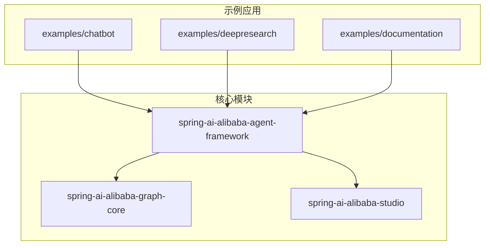
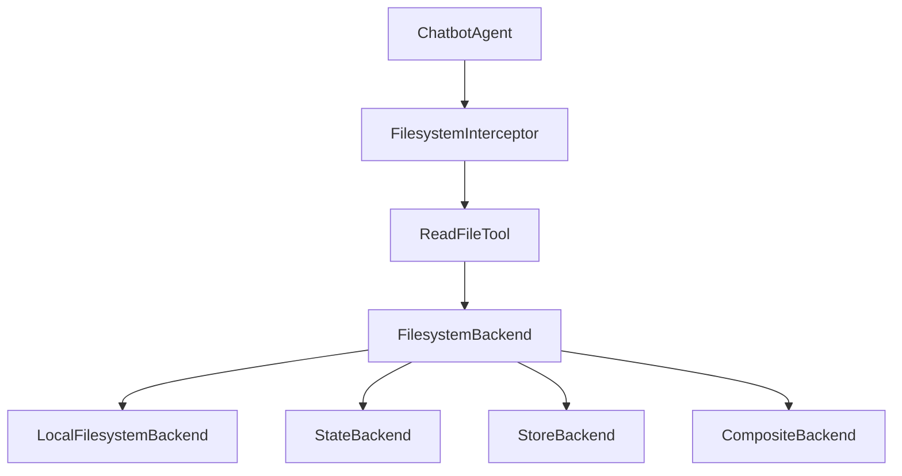
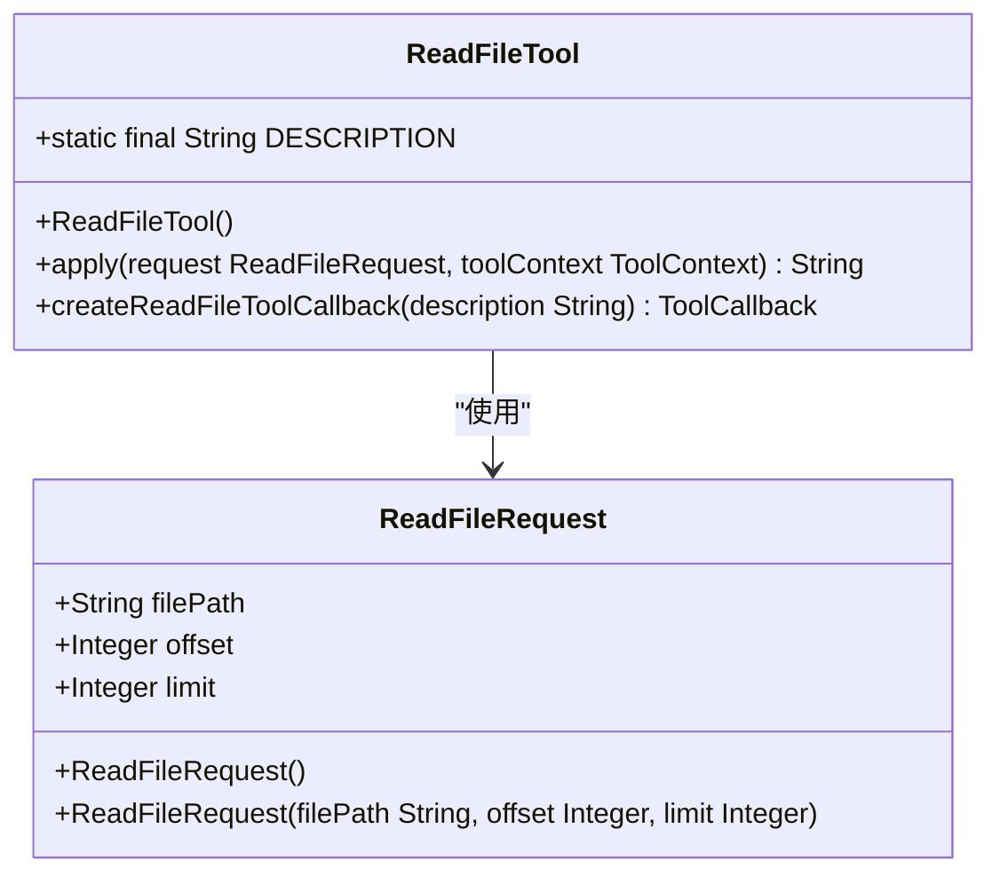
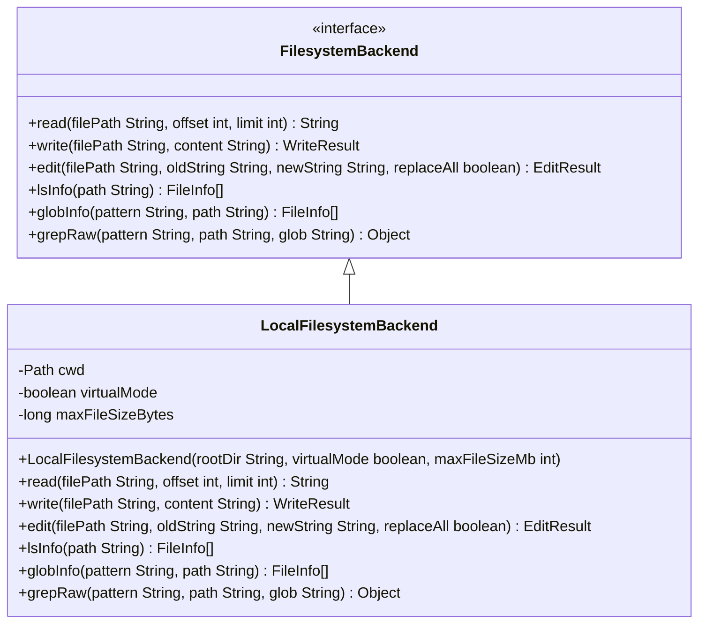
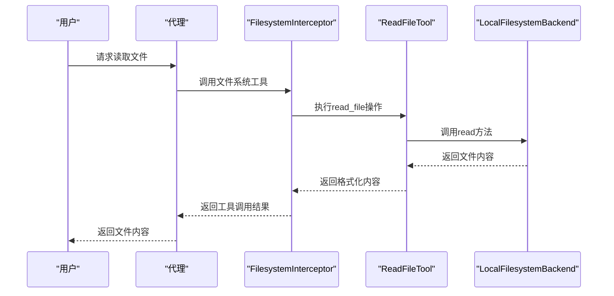
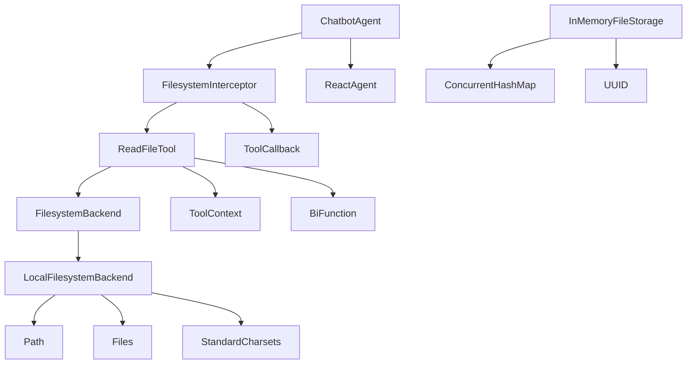

# 文件读取

<cite>
**本文档中引用的文件**   
- [ReadFileTool.java](file://spring-ai-alibaba-agent-framework/src/main/java/com/alibaba/cloud/ai/graph/agent/extension/tools/filesystem/ReadFileTool.java)
- [LocalFilesystemBackend.java](file://spring-ai-alibaba-agent-framework/src/main/java/com/alibaba/cloud/ai/graph/agent/extension/file/LocalFilesystemBackend.java)
- [FilesystemBackend.java](file://spring-ai-alibaba-agent-framework/src/main/java/com/alibaba/cloud/ai/graph/agent/extension/file/FilesystemBackend.java)
- [FilesystemInterceptor.java](file://spring-ai-alibaba-agent-framework/src/main/java/com/alibaba/cloud/ai/graph/agent/extension/interceptor/FilesystemInterceptor.java)
- [ChatbotAgent.java](file://examples/chatbot/src/main/java/com/alibaba/cloud/ai/examples/chatbot/ChatbotAgent.java)
- [InMemoryFileStorage.java](file://spring-ai-alibaba-graph-core/src/main/java/com/alibaba/cloud/ai/graph/utils/InMemoryFileStorage.java)
</cite>

## 目录
1. [简介](#简介)
2. [项目结构](#项目结构)
3. [核心组件](#核心组件)
4. [架构概述](#架构概述)
5. [详细组件分析](#详细组件分析)
6. [依赖分析](#依赖分析)
7. [性能考虑](#性能考虑)
8. [故障排除指南](#故障排除指南)
9. [结论](#结论)

## 简介
本文档详细介绍了Spring AI Alibaba框架中文件读取功能的实现机制和使用方法。重点说明了ReadFileTool的实现原理，以及如何通过FilesystemBackend抽象层安全地访问文件系统，支持本地文件系统和远程存储。文档涵盖了接口定义、参数说明、返回值结构和异常处理等内容，并提供了在代理工作流中集成文件读取功能的实际代码示例。

## 项目结构
该项目是一个基于Spring AI的阿里巴巴开源框架，提供了代理（Agent）系统的完整实现。核心功能包括文件系统操作、工具调用、状态管理等。文件读取功能主要位于`spring-ai-alibaba-agent-framework`模块中，通过工具扩展机制提供对文件系统的访问能力。

**图表来源**
- [spring-ai-alibaba-agent-framework](file://spring-ai-alibaba-agent-framework/pom.xml)
- [examples/chatbot](file://examples/chatbot/pom.xml)

**章节来源**
- [pom.xml](file://pom.xml)

## 核心组件
文件读取功能的核心组件包括ReadFileTool、FilesystemBackend接口和LocalFilesystemBackend实现类。这些组件共同构成了一个安全、可扩展的文件系统访问机制，支持分页读取、路径验证和错误处理等功能。

**章节来源**
- [ReadFileTool.java](file://spring-ai-alibaba-agent-framework/src/main/java/com/alibaba/cloud/ai/graph/agent/extension/tools/filesystem/ReadFileTool.java)
- [LocalFilesystemBackend.java](file://spring-ai-alibaba-agent-framework/src/main/java/com/alibaba/cloud/ai/graph/agent/extension/file/LocalFilesystemBackend.java)

## 架构概述
文件读取功能采用分层架构设计，上层是工具接口，中层是抽象层，底层是具体实现。这种设计使得系统既能保证安全性，又能提供灵活的扩展能力。

**图表来源**
- [ReadFileTool.java](file://spring-ai-alibaba-agent-framework/src/main/java/com/alibaba/cloud/ai/graph/agent/extension/tools/filesystem/ReadFileTool.java)
- [FilesystemBackend.java](file://spring-ai-alibaba-agent-framework/src/main/java/com/alibaba/cloud/ai/graph/agent/extension/file/FilesystemBackend.java)
- [LocalFilesystemBackend.java](file://spring-ai-alibaba-agent-framework/src/main/java/com/alibaba/cloud/ai/graph/agent/extension/file/LocalFilesystemBackend.java)

## 详细组件分析

### ReadFileTool分析
ReadFileTool是文件读取功能的主要入口，实现了BiFunction接口，可以作为工具回调被代理系统调用。它支持分页读取，能够有效避免大文件导致的上下文溢出问题。

**图表来源**
- [ReadFileTool.java](file://spring-ai-alibaba-agent-framework/src/main/java/com/alibaba/cloud/ai/graph/agent/extension/tools/filesystem/ReadFileTool.java#L35-L122)

**章节来源**
- [ReadFileTool.java](file://spring-ai-alibaba-agent-framework/src/main/java/com/alibaba/cloud/ai/graph/agent/extension/tools/filesystem/ReadFileTool.java#L1-L123)

### FilesystemBackend分析
FilesystemBackend是文件系统操作的抽象接口，定义了读取、写入等基本操作。通过这个接口，系统可以支持多种后端存储，包括本地文件系统、数据库和内存存储等。

**图表来源**
- [FilesystemBackend.java](file://spring-ai-alibaba-agent-framework/src/main/java/com/alibaba/cloud/ai/graph/agent/extension/file/FilesystemBackend.java#L33-L51)
- [LocalFilesystemBackend.java](file://spring-ai-alibaba-agent-framework/src/main/java/com/alibaba/cloud/ai/graph/agent/extension/file/LocalFilesystemBackend.java#L50-L253)

**章节来源**
- [FilesystemBackend.java](file://spring-ai-alibaba-agent-framework/src/main/java/com/alibaba/cloud/ai/graph/agent/extension/file/FilesystemBackend.java#L18-L51)
- [LocalFilesystemBackend.java](file://spring-ai-alibaba-agent-framework/src/main/java/com/alibaba/cloud/ai/graph/agent/extension/file/LocalFilesystemBackend.java#L1-L646)

### 集成示例分析
在实际应用中，文件读取功能通过FilesystemInterceptor集成到代理工作流中。以ChatbotAgent为例，展示了如何配置和使用文件读取工具。

**图表来源**
- [FilesystemInterceptor.java](file://spring-ai-alibaba-agent-framework/src/main/java/com/alibaba/cloud/ai/graph/agent/extension/interceptor/FilesystemInterceptor.java#L138-L285)
- [ReadFileTool.java](file://spring-ai-alibaba-agent-framework/src/main/java/com/alibaba/cloud/ai/graph/agent/extension/tools/filesystem/ReadFileTool.java#L59-L87)
- [LocalFilesystemBackend.java](file://spring-ai-alibaba-agent-framework/src/main/java/com/alibaba/cloud/ai/graph/agent/extension/file/LocalFilesystemBackend.java#L213-L248)
- [ChatbotAgent.java](file://examples/chatbot/src/main/java/com/alibaba/cloud/ai/examples/chatbot/ChatbotAgent.java#L104-L115)

**章节来源**
- [ChatbotAgent.java](file://examples/chatbot/src/main/java/com/alibaba/cloud/ai/examples/chatbot/ChatbotAgent.java#L1-L119)

## 依赖分析
文件读取功能依赖于多个核心组件，形成了一个完整的依赖链。这些依赖关系确保了功能的完整性和安全性。

**图表来源**
- [ReadFileTool.java](file://spring-ai-alibaba-agent-framework/src/main/java/com/alibaba/cloud/ai/graph/agent/extension/tools/filesystem/ReadFileTool.java)
- [LocalFilesystemBackend.java](file://spring-ai-alibaba-agent-framework/src/main/java/com/alibaba/cloud/ai/graph/agent/extension/file/LocalFilesystemBackend.java)
- [FilesystemInterceptor.java](file://spring-ai-alibaba-agent-framework/src/main/java/com/alibaba/cloud/ai/graph/agent/extension/interceptor/FilesystemInterceptor.java)
- [ChatbotAgent.java](file://examples/chatbot/src/main/java/com/alibaba/cloud/ai/examples/chatbot/ChatbotAgent.java)
- [InMemoryFileStorage.java](file://spring-ai-alibaba-graph-core/src/main/java/com/alibaba/cloud/ai/graph/utils/InMemoryFileStorage.java)

## 性能考虑
文件读取功能在设计时充分考虑了性能因素，特别是在处理大文件时的优化策略：

1. **分页读取**：通过offset和limit参数支持分页读取，避免一次性加载大文件导致内存溢出。
2. **缓存策略**：对于频繁访问的文件，可以结合InMemoryFileStorage实现缓存，提高访问速度。
3. **流式处理**：对于超大文件，建议使用流式处理方式，逐行读取和处理，而不是一次性加载到内存中。
4. **并发控制**：在多线程环境下，通过ConcurrentHashMap等线程安全的数据结构保证并发访问的安全性。

**章节来源**
- [ReadFileTool.java](file://spring-ai-alibaba-agent-framework/src/main/java/com/alibaba/cloud/ai/graph/agent/extension/tools/filesystem/ReadFileTool.java#L65-L69)
- [InMemoryFileStorage.java](file://spring-ai-alibaba-graph-core/src/main/java/com/alibaba/cloud/ai/graph/utils/InMemoryFileStorage.java#L27)

## 故障排除指南
在使用文件读取功能时，可能会遇到以下常见问题及其解决方案：

1. **文件不存在**：检查文件路径是否正确，建议先使用list_files工具确认文件是否存在。
2. **权限不足**：确保代理进程有读取目标文件的权限，特别是在生产环境中。
3. **路径遍历攻击**：系统通过virtualMode和路径验证机制防止路径遍历攻击，确保安全性。
4. **大文件处理**：对于大文件，使用分页读取避免上下文溢出，建议先读取前100行了解文件结构。
5. **编码问题**：默认使用UTF-8编码读取文件，如果遇到乱码问题，需要确认文件的实际编码格式。

**章节来源**
- [LocalFilesystemBackend.java](file://spring-ai-alibaba-agent-framework/src/main/java/com/alibaba/cloud/ai/graph/agent/extension/file/LocalFilesystemBackend.java#L217-L219)
- [ReadFileTool.java](file://spring-ai-alibaba-agent-framework/src/main/java/com/alibaba/cloud/ai/graph/agent/extension/tools/filesystem/ReadFileTool.java#L84-L86)

## 结论
本文档详细介绍了Spring AI Alibaba框架中文件读取功能的实现机制和使用方法。通过ReadFileTool、FilesystemBackend等组件的协同工作，系统提供了一个安全、高效、可扩展的文件系统访问方案。该方案不仅支持基本的文件读取操作，还提供了分页、缓存、安全验证等高级功能，能够满足各种应用场景的需求。