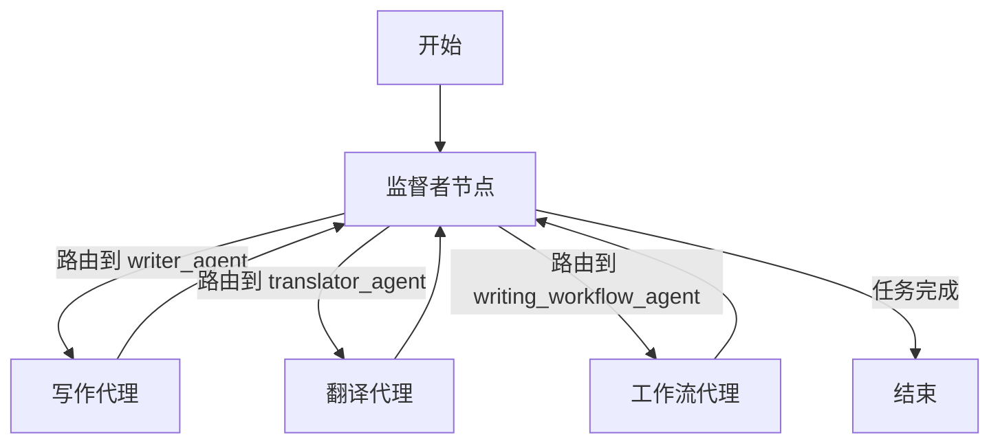
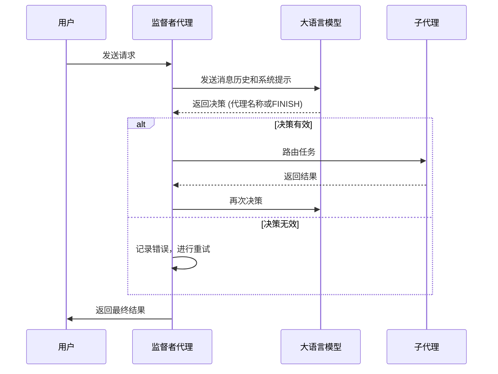
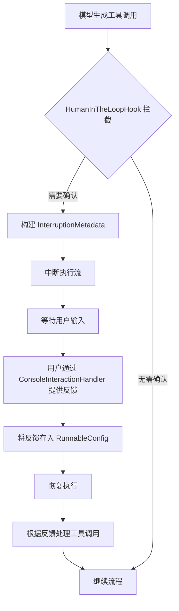
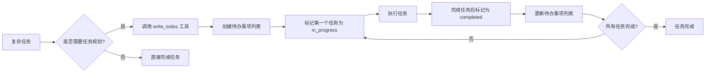
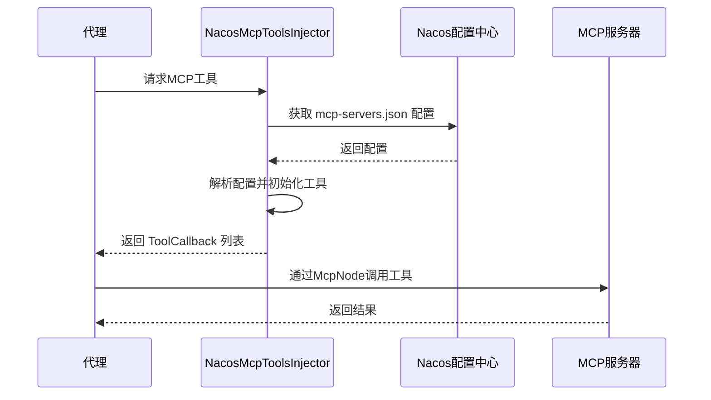

# 高级主题

<cite>
**本文档中引用的文件**  
- [SupervisorEdgeAction.java](file://spring-ai-alibaba-agent-framework/src/main/java/com/alibaba/cloud/ai/graph/agent/flow/node/SupervisorEdgeAction.java)
- [SupervisorGraphBuildingStrategy.java](file://spring-ai-alibaba-agent-framework/src/main/java/com/alibaba/cloud/ai/graph/agent/flow/strategy/SupervisorGraphBuildingStrategy.java)
- [MultiAgentExample.java](file://examples/documentation/src/main/java/com/alibaba/cloud/ai/examples/documentation/framework/advanced/MultiAgentExample.java)
- [HumanInTheLoopHook.java](file://spring-ai-alibaba-agent-framework/src/main/java/com/alibaba/cloud/ai/graph/agent/hook/hip/HumanInTheLoopHook.java)
- [ConsoleInteractionHandler.java](file://spring-ai-alibaba-agent-framework/src/main/java/com/alibaba/cloud/ai/graph/agent/hook/hip/ConsoleInteractionHandler.java)
- [WriteTodosTool.java](file://spring-ai-alibaba-agent-framework/src/main/java/com/alibaba/cloud/ai/graph/agent/tools/WriteTodosTool.java)
- [TodoListInterceptor.java](file://spring-ai-alibaba-agent-framework/src/main/java/com/alibaba/cloud/ai/graph/agent/interceptor/todolist/TodoListInterceptor.java)
- [ReadFileTool.java](file://spring-ai-alibaba-agent-framework/src/main/java/com/alibaba/cloud/ai/graph/agent/extension/tools/filesystem/ReadFileTool.java)
- [WriteFileTool.java](file://spring-ai-alibaba-agent-framework/src/main/java/com/alibaba/cloud/ai/graph/agent/extension/tools/filesystem/WriteFileTool.java)
- [FilesystemInterceptor.java](file://spring-ai-alibaba-agent-framework/src/main/java/com/alibaba/cloud/ai/graph/agent/extension/interceptor/FilesystemInterceptor.java)
- [LargeResultEvictionInterceptor.java](file://spring-ai-alibaba-agent-framework/src/main/java/com/alibaba/cloud/ai/graph/agent/extension/interceptor/LargeResultEvictionInterceptor.java)
- [ToolCallLimitHook.java](file://spring-ai-alibaba-agent-framework/src/main/java/com/alibaba/cloud/ai/graph/agent/hook/toolcalllimit/ToolCallLimitHook.java)
- [ToolSelectionInterceptor.java](file://spring-ai-alibaba-agent-framework/src/main/java/com/alibaba/cloud/ai/graph/agent/interceptor/toolselection/ToolSelectionInterceptor.java)
- [NacosMcpToolsInjector.java](file://spring-boot-starters/spring-ai-alibaba-starter-config-nacos/src/main/java/com/alibaba/cloud/ai/agent/nacos/NacosMcpToolsInjector.java)
- [McpNode.java](file://spring-boot-starters/spring-ai-alibaba-starter-builtin-nodes/src/main/java/com/alibaba/cloud/ai/graph/node/McpNode.java)
</cite>

## 目录
1. [多代理协作](#多代理协作)
2. [人机交互](#人机交互)
3. [任务规划与待办事项生成](#任务规划与待办事项生成)
4. [文件系统访问工具](#文件系统访问工具)
5. [MCP工具集成](#mcp工具集成)
6. [性能调优技巧](#性能调优技巧)

## 多代理协作

在Spring AI Alibaba框架中，多代理协作的核心是`SupervisorAgent`，它通过任务分解与协调机制，实现复杂工作流的自动化管理。`SupervisorAgent`作为一个决策中心，接收用户请求，并根据预设的系统提示（system prompt）和可用的子代理（sub-agents）列表，决定将任务路由到哪个具体的子代理。

`SupervisorAgent`的工作流程基于一个状态图（StateGraph），其构建策略由`SupervisorGraphBuildingStrategy`实现。该策略定义了监督者代理的核心行为：从开始节点（START）进入，经过监督者节点进行决策，然后根据决策结果路由到相应的子代理节点，子代理执行完毕后返回监督者节点，监督者再次决策，直到最终决定任务完成（END）。



**图源**
- [SupervisorGraphBuildingStrategy.java](file://spring-ai-alibaba-agent-framework/src/main/java/com/alibaba/cloud/ai/graph/agent/flow/strategy/SupervisorGraphBuildingStrategy.java#L43-L75)
- [SupervisorEdgeAction.java](file://spring-ai-alibaba-agent-framework/src/main/java/com/alibaba/cloud/ai/graph/agent/flow/node/SupervisorEdgeAction.java#L95-L130)

监督者的决策过程是通过调用一个大语言模型（LLM）来完成的。`SupervisorEdgeAction`类负责执行这一决策逻辑。它会将当前的对话历史（messages）和系统提示发送给LLM，LLM的响应必须是预定义的子代理名称之一或"FINISH"。框架会进行验证，确保决策的有效性。如果LLM返回了无效的代理名称，框架会进行重试，最多可重试`DEFAULT_MAX_RETRIES`次。



**图源**
- [SupervisorEdgeAction.java](file://spring-ai-alibaba-agent-framework/src/main/java/com/alibaba/cloud/ai/graph/agent/flow/node/SupervisorEdgeAction.java#L103-L124)
- [MultiAgentExample.java](file://examples/documentation/src/main/java/com/alibaba/cloud/ai/examples/documentation/framework/advanced/MultiAgentExample.java#L658-L689)

**本节源码**
- [SupervisorEdgeAction.java](file://spring-ai-alibaba-agent-framework/src/main/java/com/alibaba/cloud/ai/graph/agent/flow/node/SupervisorEdgeAction.java#L95-L130)
- [SupervisorGraphBuildingStrategy.java](file://spring-ai-alibaba-agent-framework/src/main/java/com/alibaba/cloud/ai/graph/agent/flow/strategy/SupervisorGraphBuildingStrategy.java#L43-L75)
- [MultiAgentExample.java](file://examples/documentation/src/main/java/com/alibaba/cloud/ai/examples/documentation/framework/advanced/MultiAgentExample.java#L648-L699)

## 人机交互

人机交互（Human-in-the-Loop, HITL）机制允许在代理执行流程中插入人工干预点，这对于需要人工审核、批准或提供额外信息的场景至关重要。该机制的核心是`HumanInTheLoopHook`，它是一个钩子（Hook），可以在模型调用后（AFTER_MODEL）拦截执行流。

`HumanInTheLoopHook`的实现依赖于`InterruptionMetadata`。当需要中断时，代理的`interrupt`方法会返回一个`InterruptionMetadata`对象，该对象包含了中断的原因、节点信息以及最重要的`ToolFeedback`列表。`ToolFeedback`代表了需要用户确认的工具调用，包括工具名称、参数和描述。



**图源**
- [HumanInTheLoopHook.java](file://spring-ai-alibaba-agent-framework/src/main/java/com/alibaba/cloud/ai/graph/agent/hook/hip/HumanInTheLoopHook.java#L148-L169)
- [ConsoleInteractionHandler.java](file://spring-ai-alibaba-agent-framework/src/main/java/com/alibaba/cloud/ai/graph/agent/hook/hip/ConsoleInteractionHandler.java#L26-L47)

`ConsoleInteractionHandler`是`HumanInteractionHandler`接口的一个实现，它负责在控制台与用户进行交互。当执行流被中断时，该处理器会向用户显示需要确认的工具调用列表，并提供"accept"（接受）、"edit"（编辑）或"respond"（拒绝）等选项。用户的反馈会被收集并封装回`InterruptionMetadata`中，然后通过`RunnableConfig`传递给代理，从而恢复执行。

`HumanInTheLoopHook`在`afterModel`阶段会检查`RunnableConfig`中是否存在`HUMAN_FEEDBACK_METADATA_KEY`。如果存在，说明用户已经提供了反馈，钩子会根据反馈结果（批准、编辑或拒绝）来修改`AssistantMessage`中的工具调用列表，然后继续执行。如果不存在，则返回`InterruptionMetadata`来中断流程。

**本节源码**
- [HumanInTheLoopHook.java](file://spring-ai-alibaba-agent-framework/src/main/java/com/alibaba/cloud/ai/graph/agent/hook/hip/HumanInTheLoopHook.java#L48-L306)
- [ConsoleInteractionHandler.java](file://spring-ai-alibaba-agent-framework/src/main/java/com/alibaba/cloud/ai/graph/agent/hook/hip/ConsoleInteractionHandler.java#L24-L48)

## 任务规划与待办事项生成

任务规划是管理复杂、多步骤任务的关键。`WriteTodosTool`和`TodoListInterceptor`共同提供了强大的待办事项生成功能，帮助代理将复杂目标分解为可管理的步骤。

`WriteTodosTool`是一个工具（Tool），允许代理创建和更新待办事项列表。该工具的使用有明确的指导原则：对于少于3个步骤的简单任务，应直接完成，避免使用此工具以节省token；对于复杂的多步骤任务，则应使用此工具来跟踪进度。



**图源**
- [WriteTodosTool.java](file://spring-ai-alibaba-agent-framework/src/main/java/com/alibaba/cloud/ai/graph/agent/tools/WriteTodosTool.java#L37-L97)
- [TodoListInterceptor.java](file://spring-ai-alibaba-agent-framework/src/main/java/com/alibaba/cloud/ai/graph/agent/interceptor/todolist/TodoListInterceptor.java#L55-L69)

`TodoListInterceptor`是一个模型拦截器（ModelInterceptor），它通过向系统提示（system prompt）注入指导性文本，来引导代理正确使用`WriteTodosTool`。它会自动将`write_todos`工具添加到代理可用的工具列表中，并提供详细的使用说明，例如如何标记任务状态（pending, in_progress, completed）、何时创建新任务以及何时完成任务。

待办事项的状态管理非常严格。代理必须在开始工作前将任务状态标记为`in_progress`，并在完成后立即标记为`completed`。如果遇到错误或阻塞，任务应保持在`in_progress`状态，并创建新的待办事项来描述需要解决的问题。这确保了用户始终能清晰地了解任务的实时进展。

**本节源码**
- [WriteTodosTool.java](file://spring-ai-alibaba-agent-framework/src/main/java/com/alibaba/cloud/ai/graph/agent/tools/WriteTodosTool.java#L37-L97)
- [TodoListInterceptor.java](file://spring-ai-alibaba-agent-framework/src/main/java/com/alibaba/cloud/ai/graph/agent/interceptor/todolist/TodoListInterceptor.java#L53-L226)

## 文件系统访问工具

框架提供了`ReadFileTool`、`WriteFileTool`、`EditFileTool`等工具来访问文件系统，这些工具由`FilesystemInterceptor`统一管理。`FilesystemInterceptor`不仅注入这些工具，还通过系统提示为代理提供使用指导。

**安全考量与权限控制**是文件系统访问的核心。`FilesystemInterceptor`内置了严格的安全机制：
1.  **路径规范化与验证**：`validatePath`方法会检查路径中是否包含`..`或`~`等目录遍历字符，防止路径遍历攻击。
2.  **绝对路径要求**：所有文件路径必须是绝对路径，以避免相对路径带来的不确定性。
3.  **只读模式**：通过`Builder`配置`readOnly(true)`，可以禁用`write_file`和`edit_file`工具，从而创建一个只读的文件系统环境。
4.  **权限前缀**：可以配置`allowedPrefixes`，限制代理只能访问特定目录前缀下的文件。

```mermaid
classDiagram
class FilesystemInterceptor {
+List<ToolCallback> tools
+String systemPrompt
+boolean readOnly
+Map<String, String> customToolDescriptions
+static String validatePath(path, allowedPrefixes)
+List<ToolCallback> getTools()
+String getName()
}
class ReadFileTool {
+String apply(request, toolContext)
+static ToolCallback createReadFileToolCallback(description)
}
class WriteFileTool {
+String apply(request, toolContext)
+static ToolCallback createWriteFileToolCallback(description)
}
class EditFileTool {
+String apply(request, toolContext)
+static ToolCallback createEditFileToolCallback(description)
}
FilesystemInterceptor --> ReadFileTool : "创建"
FilesystemInterceptor --> WriteFileTool : "创建"
FilesystemInterceptor --> EditFileTool : "创建"
FilesystemInterceptor --> "SystemMessage" : "注入提示"
```

**图源**
- [FilesystemInterceptor.java](file://spring-ai-alibaba-agent-framework/src/main/java/com/alibaba/cloud/ai/graph/agent/extension/interceptor/FilesystemInterceptor.java#L101-L181)
- [ReadFileTool.java](file://spring-ai-alibaba-agent-framework/src/main/java/com/alibaba/cloud/ai/graph/agent/extension/tools/filesystem/ReadFileTool.java#L37-L54)
- [WriteFileTool.java](file://spring-ai-alibaba-agent-framework/src/main/java/com/alibaba/cloud/ai/graph/agent/extension/tools/filesystem/WriteFileTool.java#L46-L47)

此外，`ReadFileTool`支持分页读取（offset和limit），这对于处理大型文件至关重要，可以避免一次性读取过多内容导致上下文溢出。`EditFileTool`则要求进行精确的字符串替换，并会检查`old_string`在文件中的唯一性，以防止意外的批量修改。

**本节源码**
- [FilesystemInterceptor.java](file://spring-ai-alibaba-agent-framework/src/main/java/com/alibaba/cloud/ai/graph/agent/extension/interceptor/FilesystemInterceptor.java#L74-L285)
- [ReadFileTool.java](file://spring-ai-alibaba-agent-framework/src/main/java/com/alibaba/cloud/ai/graph/agent/extension/tools/filesystem/ReadFileTool.java#L36-L123)
- [WriteFileTool.java](file://spring-ai-alibaba-agent-framework/src/main/java/com/alibaba/cloud/ai/graph/agent/extension/tools/filesystem/WriteFileTool.java#L36-L85)
- [EditFileTool.java](file://spring-ai-alibaba-agent-framework/src/main/java/com/alibaba/cloud/ai/graph/agent/extension/tools/filesystem/EditFileTool.java#L36-L150)

## MCP工具集成

MCP（Model Context Protocol）是一种用于集成外部工具和服务的协议。在Spring AI Alibaba框架中，可以通过`NacosMcpToolsInjector`和`McpNode`等组件来实现MCP工具的高级配置和集成。

`NacosMcpToolsInjector`是一个关键的注入器，它从Nacos配置中心动态获取MCP服务器的配置信息（如`mcp-servers.json`），并将其转换为框架可以识别的`ToolCallback`列表。这使得MCP工具的配置变得非常灵活，无需重新编译代码即可动态添加或修改工具。



**图源**
- [NacosMcpToolsInjector.java](file://spring-boot-starters/spring-ai-alibaba-starter-config-nacos/src/main/java/com/alibaba/cloud/ai/agent/nacos/NacosMcpToolsInjector.java#L35-L52)
- [McpNode.java](file://spring-boot-starters/spring-ai-alibaba-starter-builtin-nodes/src/main/java/com/alibaba/cloud/ai/graph/node/McpNode.java#L74-L122)

`McpNode`是一个专门用于调用MCP服务器的节点。它封装了与MCP服务器通信的细节，如构建HTTP客户端、处理SSE流、调用工具等。代理可以通过配置`McpNode`来调用远程的MCP服务，实现功能的扩展。

**本节源码**
- [NacosMcpToolsInjector.java](file://spring-boot-starters/spring-ai-alibaba-starter-config-nacos/src/main/java/com/alibaba/cloud/ai/agent/nacos/NacosMcpToolsInjector.java#L31-L55)
- [McpNode.java](file://spring-boot-starters/spring-ai-alibaba-starter-builtin-nodes/src/main/java/com/alibaba/cloud/ai/graph/node/McpNode.java#L42-L154)

## 性能调优技巧

为了优化代理的性能和效率，开发者可以采用以下几种高级技巧：

1.  **减少不必要的工具调用**：通过`ToolSelectionInterceptor`，可以对可用的工具进行预筛选。该拦截器会根据用户查询（user query）和工具描述，使用一个LLM来决定哪些工具是相关的，并只将这些工具暴露给主代理。这可以显著减少主代理的决策空间，避免其尝试调用无关的工具。

    **本节源码**
    - [ToolSelectionInterceptor.java](file://spring-ai-alibaba-agent-framework/src/main/java/com/alibaba/cloud/ai/graph/agent/interceptor/toolselection/ToolSelectionInterceptor.java#L127-L156)

2.  **优化提示词工程**：精心设计系统提示（system prompt）和工具描述（tool description）至关重要。清晰、具体的提示词可以引导LLM做出更准确的决策。例如，`TodoListInterceptor`和`FilesystemInterceptor`都通过注入详细的指导性文本，来规范代理的行为。

3.  **处理大型结果**：使用`LargeResultEvictionInterceptor`可以自动处理大型工具调用结果。当结果超过预设的token限制（如20000）时，该拦截器会将完整结果保存到文件系统（如`/large_tool_results/`），并在响应中返回一个包含文件路径和内容样本的提示。这可以有效防止上下文溢出。

    **本节源码**
    - [LargeResultEvictionInterceptor.java](file://spring-ai-alibaba-agent-framework/src/main/java/com/alibaba/cloud/ai/graph/agent/extension/interceptor/LargeResultEvictionInterceptor.java#L91-L138)

4.  **限制工具调用次数**：通过`ToolCallLimitHook`，可以为特定工具或所有工具设置调用次数限制。这可以防止代理陷入无限循环或进行过多的无效尝试，从而控制执行成本和时间。

    **本节源码**
    - [ToolCallLimitHook.java](file://spring-ai-alibaba-agent-framework/src/main/java/com/alibaba/cloud/ai/graph/agent/hook/toolcalllimit/ToolCallLimitHook.java#L147-L153)