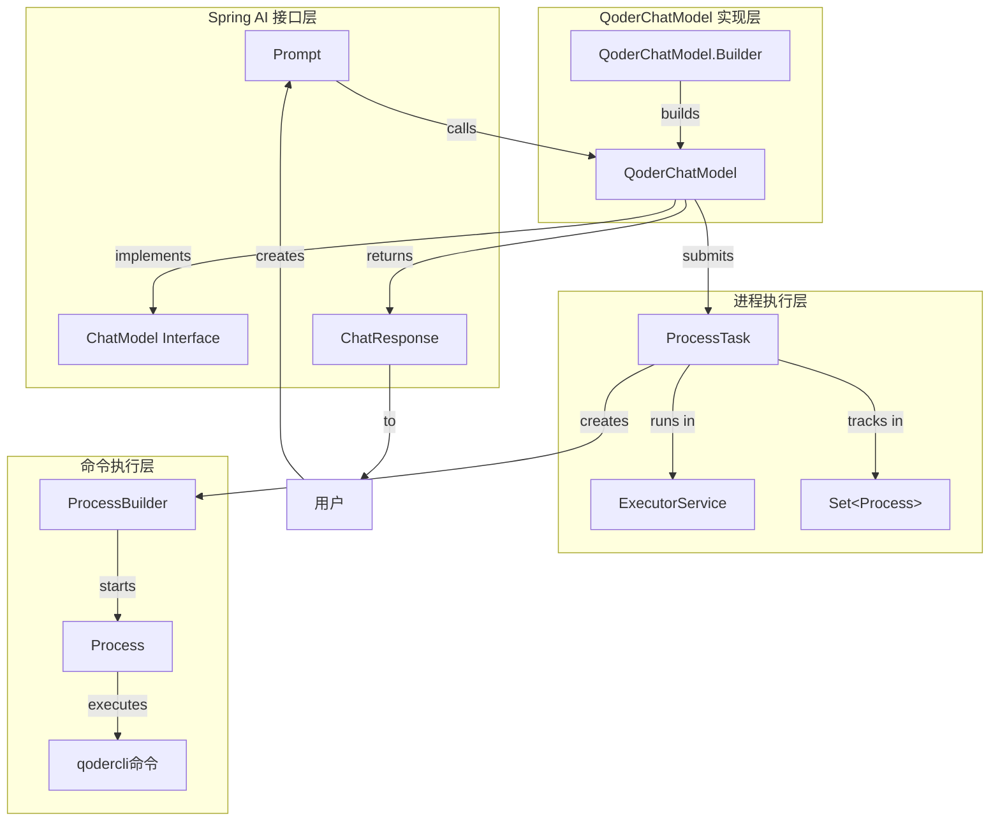
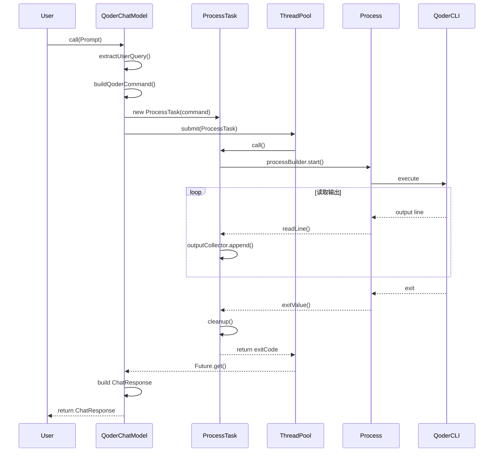

# QoderChatModel 架构设计

## 📋 概述

`QoderChatModel` 是一个将 `qodercli` 命令行工具包装为 Spring AI `ChatModel` 接口的实现类。它通过 `ProcessTask` 执行命令并收集输出,提供标准的对话式 AI 接口。

## 🏗️ 架构图



## 🔧 核心组件

### 1. **QoderChatModel**
- **职责**: 实现 Spring AI `ChatModel` 接口
- **关键方法**:
  - `call(Prompt prompt)`: 同步执行命令并返回响应
  - `extractUserQuery(Prompt)`: 从 Prompt 提取用户问题
  - `buildQoderCommand(String)`: 构建 qodercli 命令

### 2. **ProcessTask**
- **职责**: 封装进程的完整生命周期
- **关键方法**:
  - `call()`: 启动进程、读取输出、等待结束、清理资源
  - `readOutputWithTimeout()`: 流式读取输出
  - `waitForProcessCompletion()`: 等待进程结束
  - `cleanup()`: 资源清理

### 3. **StreamingShellExample**
- **职责**: 提供线程池和进程追踪基础设施
- **对外接口**:
  - `getReaderThreadPool()`: 获取线程池
  - `getActiveProcesses()`: 获取活跃进程集合

## 📊 执行流程



## 💡 使用示例

### 基本使用

```java
// 1. 创建 QoderChatModel
QoderChatModel chatModel = QoderChatModel.builder()
    .executorService(executorService)
    .activeProcesses(activeProcesses)
    .workspace(Paths.get(System.getProperty("user.dir")))
    .timeoutSeconds(300)
    .build();

// 2. 调用
ChatResponse response = chatModel.call(
    new Prompt(new UserMessage("如何在Java中创建线程池?"))
);

// 3. 获取结果
String answer = response.getResult().getOutput().getText();
System.out.println(answer);
```

### Spring 集成

```java
@Configuration
public class QoderConfig {
    
    @Bean
    public QoderChatModel qoderChatModel(StreamingShellExample shellExample) {
        return QoderChatModel.builder()
            .executorService(shellExample.getReaderThreadPool())
            .activeProcesses(shellExample.getActiveProcesses())
            .workspace(Paths.get(System.getProperty("user.dir")))
            .timeoutSeconds(300)
            .build();
    }
}
```

## 🎯 命令格式

QoderChatModel 使用固定的命令模板:

```bash
qodercli -p "<用户问题>" --max-turns 25
```

**参数说明**:
- `-p`: 指定用户问题
- `--max-turns 25`: 最大交互轮数为 25

## ⚙️ 配置参数

| 参数 | 类型 | 默认值 | 说明 |
|------|------|--------|------|
| executorService | ExecutorService | 必填 | 线程池 |
| activeProcesses | Set<Process> | 自动创建 | 活跃进程追踪 |
| workspace | Path | 当前目录 | 工作目录 |
| timeoutSeconds | long | 300 | 超时时间(秒) |

## 🔐 线程安全

- ✅ **线程池**: 使用 `ExecutorService` 管理并发
- ✅ **进程追踪**: 使用 `ConcurrentHashMap.newKeySet()` 线程安全集合
- ✅ **输出收集**: 每个任务独立的 `StringBuilder`
- ✅ **资源清理**: `finally` 块确保清理

## 🛡️ 异常处理

| 异常类型 | 触发条件 | 处理方式 |
|---------|---------|---------|
| TimeoutException | 执行超时 | 取消任务,抛出 RuntimeException |
| InterruptedException | 线程中断 | 取消任务,恢复中断状态 |
| ExecutionException | 命令执行失败 | 包装为 RuntimeException |
| IllegalArgumentException | Prompt 为空 | 直接抛出 |

## 📦 文件结构

```
examples/shelluse/src/main/java/com/alibaba/cloud/ai/examples/shelluse/
├── ProcessTask.java              # 进程任务封装
├── StreamingShellExample.java    # 基础设施提供者
├── QoderChatModel.java           # ChatModel 实现
└── QoderChatModelExample.java    # 使用示例
```

## 🚀 优势特性

1. **标准接口**: 符合 Spring AI ChatModel 接口规范
2. **进程隔离**: 每次调用独立进程,互不影响
3. **异步执行**: 基于线程池异步执行,不阻塞调用方
4. **超时控制**: 可配置超时时间,防止无限等待
5. **资源管理**: 自动追踪和清理进程资源
6. **流式输出**: 实时收集命令输出
7. **Builder 模式**: 灵活的配置方式

## 🔄 扩展可能

1. **流式响应**: 实现 `stream(Prompt)` 方法支持流式返回
2. **上下文管理**: 支持多轮对话上下文
3. **自定义命令**: 支持动态配置命令模板
4. **输出解析**: 支持结构化输出解析
5. **错误重试**: 支持失败重试机制

## 📝 最佳实践

1. **复用线程池**: 在 Spring 环境中复用 `StreamingShellExample` 的线程池
2. **设置超时**: 根据实际需求设置合理的超时时间
3. **优雅关闭**: 应用关闭时确保清理所有资源
4. **异常处理**: 捕获并妥善处理各类异常
5. **日志记录**: 添加适当的日志便于排查问题
